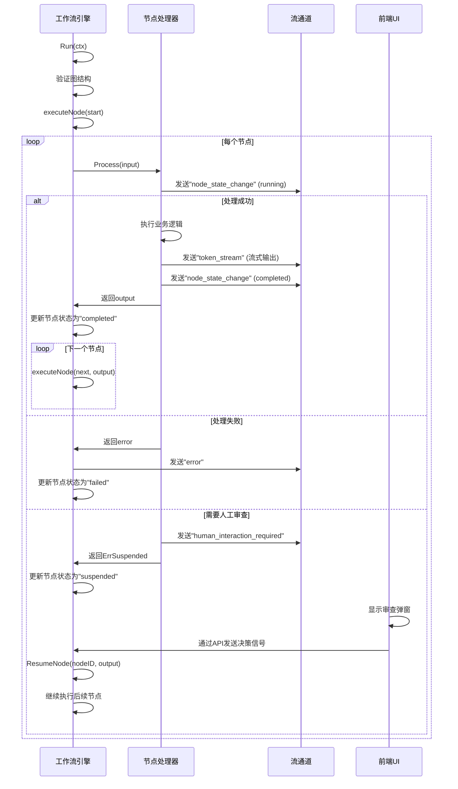
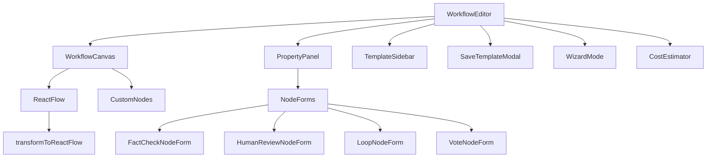

# 工作流设计

<cite>
**本文档引用的文件**  
- [engine.go](file://internal/core/workflow/engine.go)
- [factory.go](file://internal/core/workflow/nodes/factory.go)
- [start.go](file://internal/core/workflow/nodes/start.go)
- [agent.go](file://internal/core/workflow/nodes/agent.go)
- [vote.go](file://internal/core/workflow/nodes/vote.go)
- [loop.go](file://internal/core/workflow/nodes/loop.go)
- [fact_check.go](file://internal/core/workflow/nodes/fact_check.go)
- [human_review.go](file://internal/core/workflow/nodes/human_review.go)
- [end.go](file://internal/core/workflow/nodes/end.go)
- [types.go](file://internal/core/workflow/types.go)
- [WorkflowEditor.tsx](file://frontend/src/features/editor/WorkflowEditor.tsx)
- [WorkflowCanvas.tsx](file://frontend/src/components/workflow/WorkflowCanvas.tsx)
- [graphUtils.ts](file://frontend/src/utils/graphUtils.ts)
- [SPEC-401-sequence-processor.md](file://docs/specs/backend/SPEC-401-sequence-processor.md)
- [SPEC-402-vote-processor.md](file://docs/specs/backend/SPEC-402-vote-processor.md)
- [SPEC-403-loop-processor.md](file://docs/specs/backend/SPEC-403-loop-processor.md)
- [SPEC-404-factcheck-processor.md](file://docs/specs/backend/SPEC-404-factcheck-processor.md)
- [SPEC-405-human-review-processor.md](file://docs/specs/backend/SPEC-405-human-review-processor.md)
</cite>

## 目录
1. [引言](#引言)
2. [核心节点类型与执行语义](#核心节点类型与执行语义)
3. [节点工厂模式与动态实例化](#节点工厂模式与动态实例化)
4. [工作流引擎状态流转机制](#工作流引擎状态流转机制)
5. [前端可视化编排能力](#前端可视化编排能力)
6. [复杂工作流构建示例](#复杂工作流构建示例)
7. [调试与性能分析](#调试与性能分析)
8. [结论](#结论)

## 引言

本工作流引擎旨在实现一个灵活、可扩展的AI驱动决策系统，支持通过可视化方式构建复杂的多智能体协作流程。系统核心由后端工作流引擎和前端可视化编辑器构成，支持Start、Agent、Vote、Loop、FactCheck、HumanReview、End等关键节点类型，能够实现从自动化推理到人工干预的完整闭环。本文档将深入解析其设计原理、执行逻辑和可视化能力。

## 核心节点类型与执行语义

工作流由一系列具有特定功能语义的节点构成，每个节点在执行时遵循预定义的逻辑。

### Start节点
作为工作流的入口点，`StartProcessor`负责接收初始输入（如提案和附件），解析并构建上下文。它将附件内容合并为`combined_context`，并附加元数据，为后续节点提供统一的输入格式。

**节点语义**：初始化工作流，聚合输入数据。

**执行逻辑**：
1. 接收包含`proposal`和`attachments`的输入。
2. 解析附件内容，将其合并为单一上下文字符串。
3. 构造输出，包含提案、附件、合并上下文和元数据。

**节段来源**
- [start.go](file://internal/core/workflow/nodes/start.go#L11-L53)

### Agent节点
`AgentProcessor`代表一个AI智能体，它根据预设的`PersonaPrompt`和模型配置，对输入上下文进行处理并生成响应。该节点通过LLM注册表动态获取指定的LLM提供者。

**节点语义**：执行特定角色的AI推理任务。

**执行逻辑**：
1. 从`AgentRepository`获取智能体定义。
2. 构造系统提示（`PersonaPrompt`）和用户提示（输入上下文）。
3. 调用LLM进行流式响应生成。
4. 将生成的`agent_output`返回给工作流。

**节段来源**
- [agent.go](file://internal/core/workflow/nodes/agent.go#L16-L130)

### Vote节点
`VoteProcessor`用于对多个并行分支的输出进行投票表决。它根据配置的`threshold`阈值决定是否通过。

**节点语义**：实现多数决或共识决策机制。

**执行逻辑**：
1. 扫描输入中的字符串值，统计"YES"或"APPROVED"的数量。
2. 计算赞成票比例。
3. 若比例大于等于`threshold`，则决策为`approved`。
4. 输出投票结果、赞成票数、总票数和比例。

**节段来源**
- [vote.go](file://internal/core/workflow/nodes/vote.go#L10-L70)

### Loop节点
`LoopProcessor`实现循环执行逻辑，常用于多轮辩论。它根据`MaxRounds`和`ExitOnScore`决定是否退出循环。

**节点语义**：支持迭代式任务执行。

**执行逻辑**：
1. 从输入中获取当前轮次`iteration`。
2. 检查是否达到最大轮次`MaxRounds`。
3. 检查是否达到退出分数`ExitOnScore`。
4. 输出`should_exit`标志和退出原因。

**节段来源**
- [loop.go](file://internal/core/workflow/nodes/loop.go#L10-L67)

### FactCheck节点
`FactCheckProcessor`结合网络搜索和LLM分析，对输入内容进行事实核查。

**节点语义**：验证AI生成内容的真实性。

**执行逻辑**：
1. 聚合输入中的所有文本。
2. 调用`SearchClient`进行网络搜索。
3. 将原始文本和搜索结果提供给LLM，判断其准确性。
4. 输出`verified`标志、置信度和问题列表。

**节段来源**
- [fact_check.go](file://internal/core/workflow/nodes/fact_check.go#L14-L114)

### HumanReview节点
`HumanReviewProcessor`用于暂停工作流，等待人工审查和决策。

**节点语义**：引入人工干预点。

**执行逻辑**：
1. 通过`StreamChannel`发送`human_interaction_required`事件，通知前端。
2. 返回`workflow.ErrSuspended`错误，使工作流引擎暂停执行。
3. 等待通过API（如`POST /api/v1/sessions/:id/review`）接收人工决策信号后恢复。

**节段来源**
- [human_review.go](file://internal/core/workflow/nodes/human_review.go#L10-L47)

### End节点
`EndProcessor`作为工作流的终点，负责生成最终报告。

**节点语义**：汇总结果并生成最终输出。

**执行逻辑**：
1. 聚合输入中的`combined_context`和`proposal`。
2. 调用LLM，使用`Prompt`作为系统提示，生成最终摘要。
3. 通过流式响应将最终报告返回。

**节段来源**
- [end.go](file://internal/core/workflow/nodes/end.go#L13-L114)

## 节点工厂模式与动态实例化

节点工厂模式是实现工作流灵活性的核心，它允许引擎根据节点类型动态创建相应的处理器。

```mermaid
classDiagram
class NodeFactory {
+NewNodeFactory(deps NodeDependencies) func(node *Node) (NodeProcessor, error)
}
class NodeDependencies {
+Registry *llm.Registry
+AgentRepo agent.Repository
+MemoryService *memory.Service
}
class NodeProcessor {
<<interface>>
+Process(ctx context.Context, input map[string]interface{}, stream chan<- StreamEvent) (map[string]interface{}, error)
}
class StartProcessor
class AgentProcessor
class VoteProcessor
class LoopProcessor
class FactCheckProcessor
class HumanReviewProcessor
class EndProcessor
NodeFactory --> NodeDependencies : "依赖"
NodeFactory --> NodeProcessor : "创建"
NodeProcessor <|-- StartProcessor
NodeProcessor <|-- AgentProcessor
NodeProcessor <|-- VoteProcessor
NodeProcessor <|-- LoopProcessor
NodeProcessor <|-- FactCheckProcessor
NodeProcessor <|-- HumanReviewProcessor
NodeProcessor <|-- EndProcessor
```

**图示来源**
- [factory.go](file://internal/core/workflow/nodes/factory.go#L19-L106)
- [types.go](file://internal/core/workflow/types.go#L25-L41)

### 工厂实现
`NewNodeFactory`函数接收一个`NodeDependencies`结构体，该结构体包含创建处理器所需的依赖项（如LLM注册表、智能体仓库）。工厂函数返回一个闭包，该闭包根据节点的`Type`字段，使用`switch`语句实例化对应的处理器。

例如，当节点类型为`NodeTypeAgent`时，工厂会创建一个`AgentProcessor`，并注入`AgentID`、`AgentRepo`和`Registry`等依赖。

**节段来源**
- [factory.go](file://internal/core/workflow/nodes/factory.go#L19-L106)

## 工作流引擎状态流转机制

工作流引擎`Engine`负责协调所有节点的执行，其状态流转遵循严格的生命周期。



**图示来源**
- [engine.go](file://internal/core/workflow/engine.go#L41-L245)
- [human_review.go](file://internal/core/workflow/nodes/human_review.go#L15-L47)

### 执行流程
1. **启动**：`Run`方法启动工作流，首先验证图结构。
2. **执行**：`executeNode`方法被调用，锁定节点状态为`StatusRunning`。
3. **处理**：通过节点工厂获取`NodeProcessor`并调用其`Process`方法。
4. **状态更新**：根据处理结果，更新节点状态为`StatusCompleted`或`StatusFailed`。
5. **流转**：如果节点成功，其输出将作为输入传递给所有`NextIDs`指向的下一个节点，并发执行。
6. **暂停与恢复**：当遇到`HumanReview`节点时，引擎会暂停，并通过`ResumeNode`方法在收到人工决策后恢复执行。

**节段来源**
- [engine.go](file://internal/core/workflow/engine.go#L41-L245)

## 前端可视化编排能力

前端`WorkflowEditor`组件提供了拖拽式建模的完整体验。



**图示来源**
- [WorkflowEditor.tsx](file://frontend/src/features/editor/WorkflowEditor.tsx#L15-L271)
- [WorkflowCanvas.tsx](file://frontend/src/components/workflow/WorkflowCanvas.tsx#L53-L149)
- [graphUtils.ts](file://frontend/src/utils/graphUtils.ts#L20-L131)

### 核心组件
- **WorkflowCanvas**：基于`ReactFlow`库，渲染工作流图。它使用`transformToReactFlow`工具函数将后端的`BackendGraph`转换为`ReactFlow`所需的`nodes`和`edges`数据结构。
- **PropertyPanel**：当用户点击节点时，显示该节点的属性表单，允许修改`Properties`。
- **TemplateSidebar**：提供预设的工作流模板，用户可一键应用。
- **节点连接校验**：通过`onConnect`回调，确保在非只读模式下才允许创建连接。
- **实时语法检查**：虽然当前代码未直接体现，但`CostEstimator`组件实时计算成本，体现了类似的实时反馈思想。

**节段来源**
- [WorkflowEditor.tsx](file://frontend/src/features/editor/WorkflowEditor.tsx#L15-L271)
- [WorkflowCanvas.tsx](file://frontend/src/components/workflow/WorkflowCanvas.tsx#L53-L149)

## 复杂工作流构建示例

一个典型的“多轮辩论+事实核查+人工裁决”工作流可以设计如下：

1. **Start**：输入辩论主题。
2. **Parallel Branch**：
    - **Agent (Affirmative)**：正方智能体生成论点。
    - **Agent (Negative)**：反方智能体生成论点。
3. **Loop**：循环执行多轮辩论，每轮双方根据对方论点进行反驳。
4. **FactCheck**：对双方最终论点进行事实核查。
5. **Vote**：多个评审智能体对辩论结果进行投票。
6. **HumanReview**：如果投票未通过阈值，则进入人工审查环节。
7. **End**：生成最终报告。

此流程充分利用了并行、循环、条件判断和人工干预等节点，体现了工作流引擎的强大表达能力。

## 调试与性能分析

### 调试技巧
- **流式事件监控**：通过`StreamChannel`监听`token_stream`和`node_state_change`事件，可实时追踪执行进度和节点状态。
- **执行异常追踪**：当节点失败时，`emitError`会发送错误事件，包含节点ID和错误信息，便于定位问题。
- **日志记录**：`log.Printf`在关键错误点输出日志，可用于事后分析。

### 性能瓶颈识别
- **LLM调用**：`Agent`和`End`节点的LLM调用是主要耗时操作，可通过`CostEstimator`组件预估成本。
- **网络搜索**：`FactCheck`节点的搜索操作可能成为瓶颈，需监控`SearchClient`的响应时间。
- **并发控制**：`Vote`和`Loop`节点的并发执行可能导致资源竞争，需通过`sync.WaitGroup`合理控制。

## 结论

该工作流引擎通过清晰的节点划分、灵活的工厂模式和强大的状态管理，实现了复杂AI工作流的编排与执行。前端可视化编辑器极大地降低了使用门槛，使得非技术人员也能构建复杂的AI协作流程。未来可进一步优化错误处理、增加更多节点类型，并完善性能监控体系。