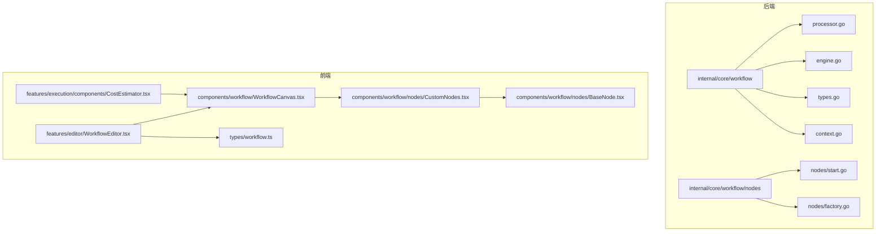
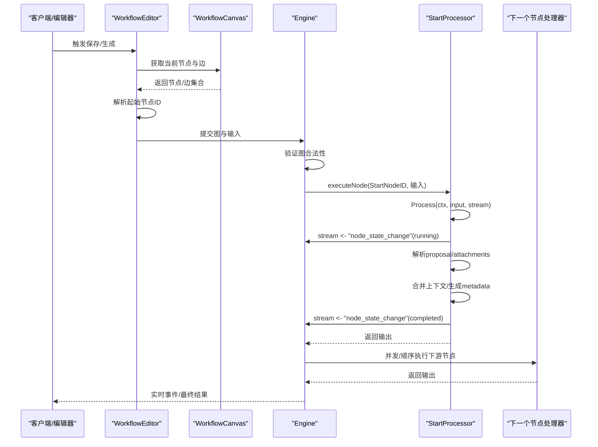
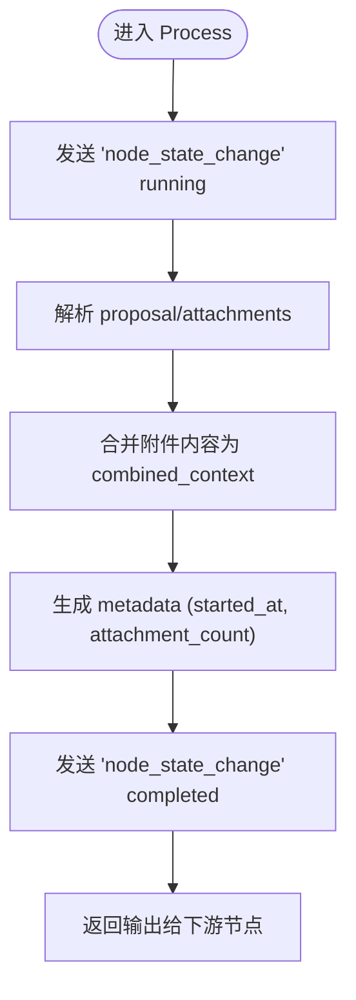
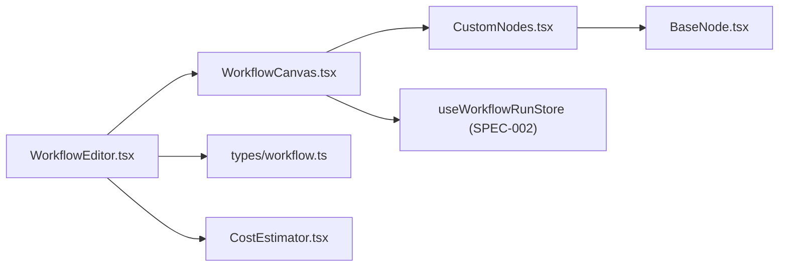
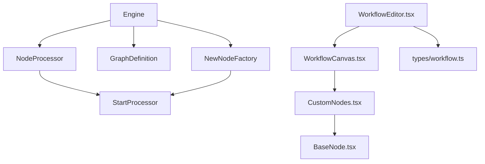

# 开始节点

<cite>
**本文引用的文件**
- [internal/core/workflow/nodes/start.go](file://internal/core/workflow/nodes/start.go)
- [internal/core/workflow/processor.go](file://internal/core/workflow/processor.go)
- [internal/core/workflow/engine.go](file://internal/core/workflow/engine.go)
- [internal/core/workflow/types.go](file://internal/core/workflow/types.go)
- [internal/core/workflow/context.go](file://internal/core/workflow/context.go)
- [internal/core/workflow/nodes/factory.go](file://internal/core/workflow/nodes/factory.go)
- [internal/core/workflow/nodes/start_test.go](file://internal/core/workflow/nodes/start_test.go)
- [frontend/src/features/editor/WorkflowEditor.tsx](file://frontend/src/features/editor/WorkflowEditor.tsx)
- [frontend/src/components/workflow/WorkflowCanvas.tsx](file://frontend/src/components/workflow/WorkflowCanvas.tsx)
- [frontend/src/components/workflow/nodes/CustomNodes.tsx](file://frontend/src/components/workflow/nodes/CustomNodes.tsx)
- [frontend/src/components/workflow/nodes/BaseNode.tsx](file://frontend/src/components/workflow/nodes/BaseNode.tsx)
- [frontend/src/types/workflow.ts](file://frontend/src/types/workflow.ts)
- [frontend/src/features/execution/components/CostEstimator.tsx](file://frontend/src/features/execution/components/CostEstimator.tsx)
- [docs/specs/sprint1/SPEC-002-workflow-run-store.md](file://docs/specs/sprint1/SPEC-002-workflow-run-store.md)
</cite>

## 目录
1. [简介](#简介)
2. [项目结构](#项目结构)
3. [核心组件](#核心组件)
4. [架构总览](#架构总览)
5. [详细组件分析](#详细组件分析)
6. [依赖关系分析](#依赖关系分析)
7. [性能考量](#性能考量)
8. [故障排查指南](#故障排查指南)
9. [结论](#结论)
10. [附录](#附录)

## 简介
本章节聚焦“开始节点”（Start Node），系统性阐述其在工作流引擎中的角色定位、初始化会话上下文与构建初始执行环境的方式、状态转换逻辑以及在前端编辑器中的可视化渲染与交互行为。同时给出配置要点、常见误用场景与排查方法，帮助开发者正确使用并避免流程中断问题。

## 项目结构
- 后端工作流引擎位于 internal/core/workflow，包含节点接口、执行引擎、类型定义、上下文与工厂等。
- 开始节点处理器位于 internal/core/workflow/nodes/start.go，实现 NodeProcessor 接口。
- 前端编辑器位于 frontend/src/features/editor/WorkflowEditor.tsx，负责图编辑、保存、模板应用与向导生成；画布组件位于 frontend/src/components/workflow/WorkflowCanvas.tsx，承载节点渲染与连接。
- 节点可视化组件位于 frontend/src/components/workflow/nodes/CustomNodes.tsx，其中 StartNode 定义了开始节点的外观与连接句柄。



图表来源
- [internal/core/workflow/engine.go](file://internal/core/workflow/engine.go#L1-L50)
- [internal/core/workflow/nodes/start.go](file://internal/core/workflow/nodes/start.go#L1-L52)
- [frontend/src/features/editor/WorkflowEditor.tsx](file://frontend/src/features/editor/WorkflowEditor.tsx#L1-L133)
- [frontend/src/components/workflow/WorkflowCanvas.tsx](file://frontend/src/components/workflow/WorkflowCanvas.tsx#L1-L120)
- [frontend/src/components/workflow/nodes/CustomNodes.tsx](file://frontend/src/components/workflow/nodes/CustomNodes.tsx#L113-L139)

章节来源
- [internal/core/workflow/engine.go](file://internal/core/workflow/engine.go#L1-L50)
- [internal/core/workflow/nodes/start.go](file://internal/core/workflow/nodes/start.go#L1-L52)
- [frontend/src/features/editor/WorkflowEditor.tsx](file://frontend/src/features/editor/WorkflowEditor.tsx#L1-L133)
- [frontend/src/components/workflow/WorkflowCanvas.tsx](file://frontend/src/components/workflow/WorkflowCanvas.tsx#L1-L120)
- [frontend/src/components/workflow/nodes/CustomNodes.tsx](file://frontend/src/components/workflow/nodes/CustomNodes.tsx#L113-L139)

## 核心组件
- 开始节点处理器：实现 NodeProcessor.Process，负责接收输入、构造输出、推送状态事件。
- 引擎：从图定义的起始节点开始执行，按边关系并发或顺序调度后续节点。
- 类型与上下文：定义节点类型枚举、节点状态、流式事件结构与会话上下文封装。
- 节点工厂：根据节点类型返回对应处理器实例。
- 前端编辑器与画布：负责图的可视化、节点渲染、连接、保存与模板应用。

章节来源
- [internal/core/workflow/nodes/start.go](file://internal/core/workflow/nodes/start.go#L1-L52)
- [internal/core/workflow/processor.go](file://internal/core/workflow/processor.go#L1-L14)
- [internal/core/workflow/engine.go](file://internal/core/workflow/engine.go#L1-L50)
- [internal/core/workflow/types.go](file://internal/core/workflow/types.go#L1-L67)
- [internal/core/workflow/context.go](file://internal/core/workflow/context.go#L1-L35)
- [internal/core/workflow/nodes/factory.go](file://internal/core/workflow/nodes/factory.go#L1-L106)

## 架构总览
开始节点作为工作流的唯一入口，承担以下职责：
- 初始化执行环境：接收初始输入（提案与附件），解析附件内容，合并为统一上下文，附加元数据。
- 发送实时事件：通过流通道上报“节点状态变更”，驱动前端运行态高亮与状态更新。
- 产出下游输入：将处理后的输出传递给后续节点，形成数据流。



图表来源
- [internal/core/workflow/engine.go](file://internal/core/workflow/engine.go#L40-L90)
- [internal/core/workflow/nodes/start.go](file://internal/core/workflow/nodes/start.go#L13-L51)
- [internal/core/workflow/context.go](file://internal/core/workflow/context.go#L8-L14)
- [frontend/src/features/editor/WorkflowEditor.tsx](file://frontend/src/features/editor/WorkflowEditor.tsx#L69-L133)
- [frontend/src/components/workflow/WorkflowCanvas.tsx](file://frontend/src/components/workflow/WorkflowCanvas.tsx#L80-L120)

## 详细组件分析

### 开始节点处理器（StartProcessor）
- 结构体：无状态结构体，仅实现 Process 方法。
- Process 执行步骤：
  1) 上报“开始运行”事件；
  2) 解析输入参数 proposal 与 attachments；
  3) 将附件内容合并为统一上下文字符串；
  4) 生成 metadata（含启动时间与附件数量）；
  5) 上报“完成”事件；
  6) 返回输出供下游节点使用。



图表来源
- [internal/core/workflow/nodes/start.go](file://internal/core/workflow/nodes/start.go#L13-L51)

章节来源
- [internal/core/workflow/nodes/start.go](file://internal/core/workflow/nodes/start.go#L1-L52)
- [internal/core/workflow/nodes/start_test.go](file://internal/core/workflow/nodes/start_test.go#L1-L54)

### 引擎调度与状态转换
- 引擎初始化：持有图定义、输入、流通道与节点工厂。
- Run：先验证图合法性，再从 StartNodeID 开始执行 executeNode。
- executeNode：执行节点处理器，推送 resume/resume events，随后并发调度所有 NextIDs 指向的节点。
- 状态枚举：pending/running/completed/failed/skipped/suspended，用于前端与运行态展示。

```mermaid
classDiagram
class Engine {
+Graph GraphDefinition
+Status map[string]NodeStatus
+NodeFactory(node) NodeProcessor
+StreamChannel chan StreamEvent
+Run(ctx)
+executeNode(ctx, nodeID, input)
}
class NodeProcessor {
<<interface>>
+Process(ctx, input, stream) (map[string]interface{}, error)
}
class StartProcessor {
+Process(ctx, input, stream) (map[string]interface{}, error)
}
Engine --> NodeProcessor : "调用"
StartProcessor ..|> NodeProcessor
```

图表来源
- [internal/core/workflow/engine.go](file://internal/core/workflow/engine.go#L1-L90)
- [internal/core/workflow/processor.go](file://internal/core/workflow/processor.go#L1-L14)
- [internal/core/workflow/nodes/start.go](file://internal/core/workflow/nodes/start.go#L1-L52)

章节来源
- [internal/core/workflow/engine.go](file://internal/core/workflow/engine.go#L1-L90)
- [internal/core/workflow/types.go](file://internal/core/workflow/types.go#L1-L67)

### 节点工厂与类型注册
- 工厂函数根据节点类型返回对应处理器实例，开始节点映射到 StartProcessor。
- 其他节点类型包括 agent、vote、loop、fact_check、human_review、memory_retrieval 等，分别由对应处理器实现。

章节来源
- [internal/core/workflow/nodes/factory.go](file://internal/core/workflow/nodes/factory.go#L1-L106)

### 前端可视化与交互
- WorkflowEditor：负责节点选择、属性面板、删除、保存；保存时从画布提取节点与边，计算起始节点（优先取 type=start 的节点，否则取第一个节点）。
- WorkflowCanvas：将后端图转换为 React Flow 图，支持只读模式下的运行态高亮；在编辑模式下允许拖拽与连接。
- CustomNodes：定义各节点的可视化组件，StartNode 使用底部 Handle 作为出边连接点，EndNode 使用顶部 Handle 作为入边连接点。
- BaseNode：通用节点容器，支持顶部/底部 Handle，选中态样式与图标。
- 运行态高亮：只读模式下，活跃节点会添加脉冲样式与边框高亮。
- 成本估算：CostEstimator 在编辑模式下收集节点与边，构造草稿图并调用后端估算接口。



图表来源
- [frontend/src/features/editor/WorkflowEditor.tsx](file://frontend/src/features/editor/WorkflowEditor.tsx#L1-L133)
- [frontend/src/components/workflow/WorkflowCanvas.tsx](file://frontend/src/components/workflow/WorkflowCanvas.tsx#L1-L120)
- [frontend/src/components/workflow/nodes/CustomNodes.tsx](file://frontend/src/components/workflow/nodes/CustomNodes.tsx#L113-L139)
- [frontend/src/components/workflow/nodes/BaseNode.tsx](file://frontend/src/components/workflow/nodes/BaseNode.tsx#L1-L47)
- [frontend/src/types/workflow.ts](file://frontend/src/types/workflow.ts#L1-L44)
- [frontend/src/features/execution/components/CostEstimator.tsx](file://frontend/src/features/execution/components/CostEstimator.tsx#L36-L76)
- [docs/specs/sprint1/SPEC-002-workflow-run-store.md](file://docs/specs/sprint1/SPEC-002-workflow-run-store.md#L297-L341)

章节来源
- [frontend/src/features/editor/WorkflowEditor.tsx](file://frontend/src/features/editor/WorkflowEditor.tsx#L69-L133)
- [frontend/src/components/workflow/WorkflowCanvas.tsx](file://frontend/src/components/workflow/WorkflowCanvas.tsx#L80-L120)
- [frontend/src/components/workflow/nodes/CustomNodes.tsx](file://frontend/src/components/workflow/nodes/CustomNodes.tsx#L113-L139)
- [frontend/src/components/workflow/nodes/BaseNode.tsx](file://frontend/src/components/workflow/nodes/BaseNode.tsx#L1-L47)
- [frontend/src/types/workflow.ts](file://frontend/src/types/workflow.ts#L1-L44)
- [frontend/src/features/execution/components/CostEstimator.tsx](file://frontend/src/features/execution/components/CostEstimator.tsx#L36-L76)
- [docs/specs/sprint1/SPEC-002-workflow-run-store.md](file://docs/specs/sprint1/SPEC-002-workflow-run-store.md#L297-L341)

## 依赖关系分析
- 后端依赖链：
  - StartProcessor 实现 NodeProcessor 接口，被 Engine.executeNode 调用。
  - Engine 依赖 GraphDefinition、NodeStatus、StreamEvent、NodeFactory。
  - 节点工厂将 NodeTypeStart 映射到 StartProcessor。
- 前端依赖链：
  - WorkflowEditor 依赖 WorkflowCanvas 与属性面板；Canvas 依赖 CustomNodes 与 BaseNode；类型定义来自 types/workflow.ts。
  - 运行态高亮依赖 useWorkflowRunStore 的节点与边状态。



图表来源
- [internal/core/workflow/processor.go](file://internal/core/workflow/processor.go#L1-L14)
- [internal/core/workflow/nodes/start.go](file://internal/core/workflow/nodes/start.go#L1-L52)
- [internal/core/workflow/engine.go](file://internal/core/workflow/engine.go#L1-L90)
- [internal/core/workflow/nodes/factory.go](file://internal/core/workflow/nodes/factory.go#L1-L106)
- [frontend/src/features/editor/WorkflowEditor.tsx](file://frontend/src/features/editor/WorkflowEditor.tsx#L1-L133)
- [frontend/src/components/workflow/WorkflowCanvas.tsx](file://frontend/src/components/workflow/WorkflowCanvas.tsx#L1-L120)
- [frontend/src/components/workflow/nodes/CustomNodes.tsx](file://frontend/src/components/workflow/nodes/CustomNodes.tsx#L113-L139)
- [frontend/src/components/workflow/nodes/BaseNode.tsx](file://frontend/src/components/workflow/nodes/BaseNode.tsx#L1-L47)
- [frontend/src/types/workflow.ts](file://frontend/src/types/workflow.ts#L1-L44)

章节来源
- [internal/core/workflow/processor.go](file://internal/core/workflow/processor.go#L1-L14)
- [internal/core/workflow/engine.go](file://internal/core/workflow/engine.go#L1-L90)
- [internal/core/workflow/nodes/factory.go](file://internal/core/workflow/nodes/factory.go#L1-L106)
- [frontend/src/features/editor/WorkflowEditor.tsx](file://frontend/src/features/editor/WorkflowEditor.tsx#L69-L133)
- [frontend/src/components/workflow/WorkflowCanvas.tsx](file://frontend/src/components/workflow/WorkflowCanvas.tsx#L80-L120)

## 性能考量
- 并发执行：引擎在 ResumeNode 中对所有 NextIDs 并发启动子节点，避免阻塞请求线程，适合长尾任务。
- 流通道缓冲：StreamChannel 设置缓冲以降低阻塞风险，保证事件及时推送。
- 输入解析：StartProcessor 对附件内容进行简单拼接，复杂场景建议在上游预处理或异步读取，避免阻塞主流程。
- 前端渲染：只读模式下对活跃节点添加脉冲样式与边框，视觉反馈轻量且可感知。

[本节为通用指导，不直接分析具体文件]

## 故障排查指南
- 上下文未正确初始化导致流程中断
  - 症状：开始节点未产生“running/completed”事件，或下游节点未触发。
  - 排查要点：
    - 确认图定义包含合法的 StartNodeID，且该节点存在于 Nodes 中。
    - 确认 WorkflowEditor 保存时已正确识别起始节点（优先 type=start，否则取第一个节点）。
    - 确认 StartProcessor 的输入包含 proposal 与 attachments 字段，且类型匹配。
    - 确认引擎已调用 executeNode 并推送 node_state_change 事件。
  - 参考路径：
    - [internal/core/workflow/engine.go](file://internal/core/workflow/engine.go#L40-L90)
    - [internal/core/workflow/nodes/start.go](file://internal/core/workflow/nodes/start.go#L13-L51)
    - [frontend/src/features/editor/WorkflowEditor.tsx](file://frontend/src/features/editor/WorkflowEditor.tsx#L69-L133)

- 连接校验与渲染异常
  - 症状：无法从开始节点拖出连接，或连接后保存失败。
  - 排查要点：
    - StartNode 仅暴露底部 Handle，EndNode 仅暴露顶部 Handle，确保连接方向正确。
    - 编辑模式下允许连接，只读模式下禁止拖拽与连接。
    - 保存时检查 edges 是否正确映射到 backendNodes.next_ids。
  - 参考路径：
    - [frontend/src/components/workflow/nodes/CustomNodes.tsx](file://frontend/src/components/workflow/nodes/CustomNodes.tsx#L113-L139)
    - [frontend/src/components/workflow/WorkflowCanvas.tsx](file://frontend/src/components/workflow/WorkflowCanvas.tsx#L80-L120)
    - [frontend/src/features/editor/WorkflowEditor.tsx](file://frontend/src/features/editor/WorkflowEditor.tsx#L69-L133)

- 图验证失败
  - 症状：保存或执行时报错，提示缺少起始节点或链接指向不存在节点。
  - 排查要点：
    - 确保 GraphDefinition.StartNodeID 存在于 Nodes 中。
    - 确保所有 NextIDs 指向存在的节点。
    - 确保图可达（从 Start 出发可访问全部节点）。
  - 参考路径：
    - [internal/core/workflow/validation.go](file://internal/core/workflow/validation.go#L1-L55)

- 运行态高亮与状态更新
  - 症状：节点状态未随事件变化而更新。
  - 排查要点：
    - 确认前端运行态 store 已加载节点与边。
    - 确认事件类型为 node_state_change，且包含 node_id/status。
  - 参考路径：
    - [docs/specs/sprint1/SPEC-002-workflow-run-store.md](file://docs/specs/sprint1/SPEC-002-workflow-run-store.md#L297-L341)
    - [internal/core/workflow/context.go](file://internal/core/workflow/context.go#L8-L14)

章节来源
- [internal/core/workflow/engine.go](file://internal/core/workflow/engine.go#L40-L90)
- [internal/core/workflow/nodes/start.go](file://internal/core/workflow/nodes/start.go#L13-L51)
- [frontend/src/features/editor/WorkflowEditor.tsx](file://frontend/src/features/editor/WorkflowEditor.tsx#L69-L133)
- [frontend/src/components/workflow/nodes/CustomNodes.tsx](file://frontend/src/components/workflow/nodes/CustomNodes.tsx#L113-L139)
- [frontend/src/components/workflow/WorkflowCanvas.tsx](file://frontend/src/components/workflow/WorkflowCanvas.tsx#L80-L120)
- [internal/core/workflow/validation.go](file://internal/core/workflow/validation.go#L1-L55)
- [docs/specs/sprint1/SPEC-002-workflow-run-store.md](file://docs/specs/sprint1/SPEC-002-workflow-run-store.md#L297-L341)
- [internal/core/workflow/context.go](file://internal/core/workflow/context.go#L8-L14)

## 结论
开始节点是工作流的唯一入口，负责将外部输入转化为统一上下文并推动后续节点执行。后端通过严格的图验证与事件流保障执行稳定性，前端通过可视化与交互提升编辑体验。遵循本文的配置要点与排查方法，可有效避免因上下文缺失或连接错误导致的流程中断问题。

[本节为总结性内容，不直接分析具体文件]

## 附录

### 配置示例与最佳实践
- 起始节点配置
  - 类型：start
  - 连接：仅允许从底部 Handle 出发，连接至后续节点
  - 输入：proposal（字符串）、attachments（数组，元素含 content 字段）
- 保存与起始节点推断
  - 若存在 type=start 的节点，则使用其 ID 作为 start_node_id
  - 否则回退到第一个节点 ID
- 运行态高亮
  - 只读模式下，活跃节点自动添加脉冲样式与边框高亮
- 成本估算
  - 编辑模式下，点击成本估算按钮会将当前图转换为草稿并调用后端估算接口

章节来源
- [frontend/src/features/editor/WorkflowEditor.tsx](file://frontend/src/features/editor/WorkflowEditor.tsx#L69-L133)
- [frontend/src/components/workflow/nodes/CustomNodes.tsx](file://frontend/src/components/workflow/nodes/CustomNodes.tsx#L113-L139)
- [frontend/src/features/execution/components/CostEstimator.tsx](file://frontend/src/features/execution/components/CostEstimator.tsx#L36-L76)
- [docs/specs/sprint1/SPEC-002-workflow-run-store.md](file://docs/specs/sprint1/SPEC-002-workflow-run-store.md#L297-L341)