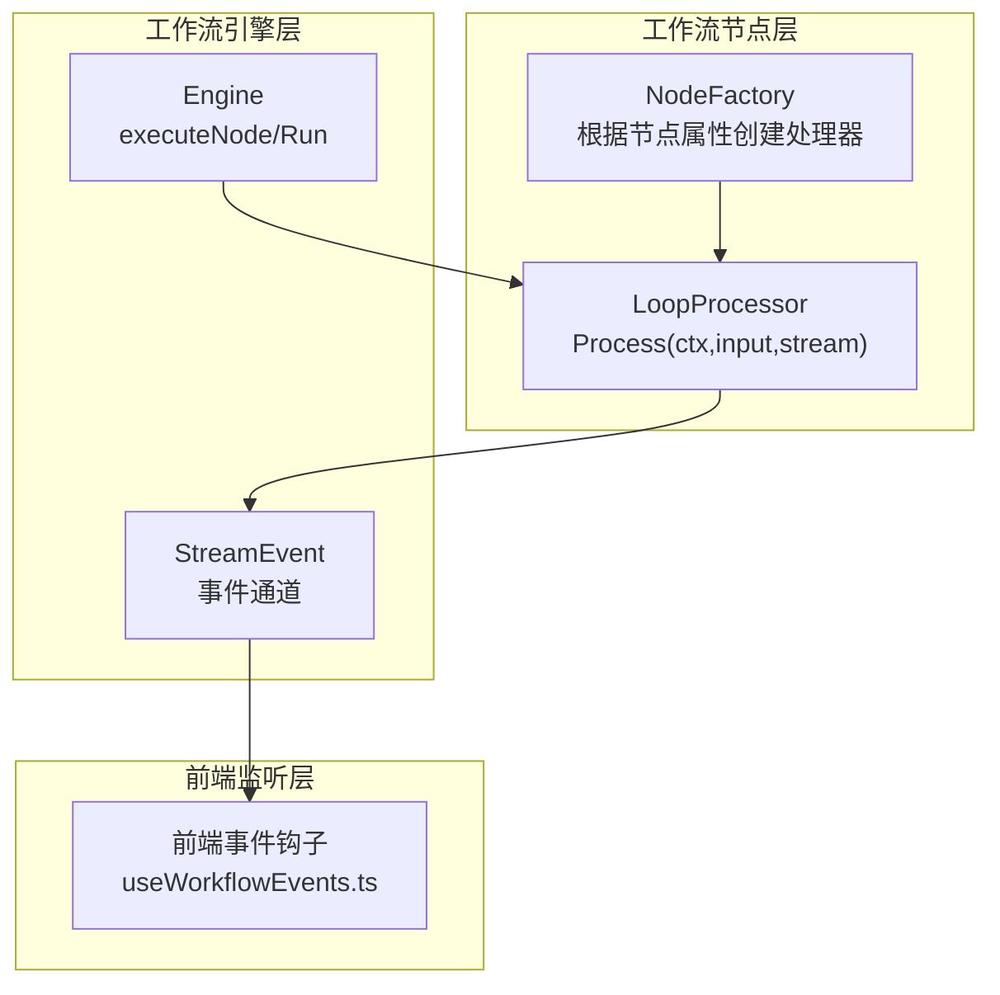
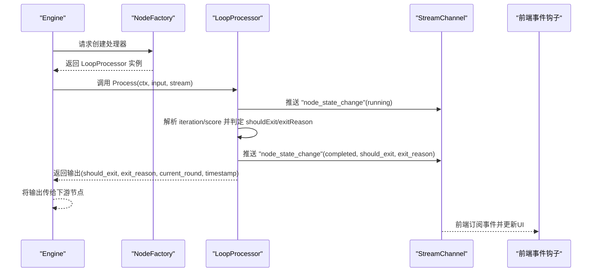
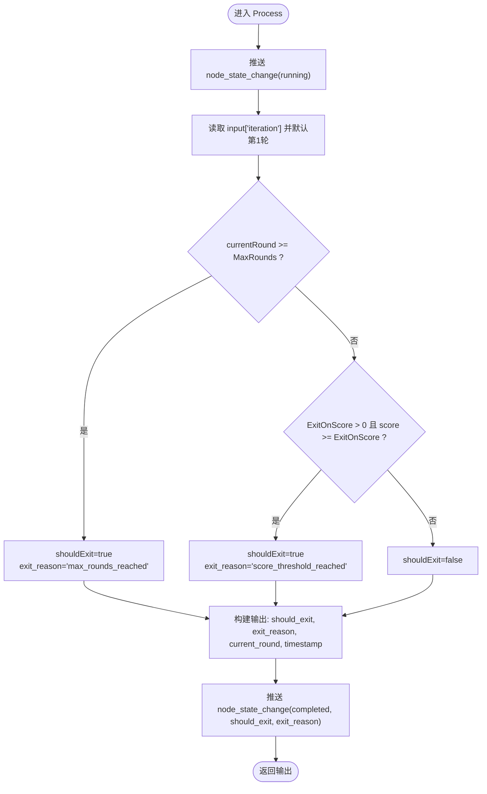

# 循环处理器实现逻辑

<cite>
**本文引用的文件列表**
- [loop.go](file://internal/core/workflow/nodes/loop.go)
- [loop_test.go](file://internal/core/workflow/nodes/loop_test.go)
- [factory.go](file://internal/core/workflow/nodes/factory.go)
- [engine.go](file://internal/core/workflow/engine.go)
- [context.go](file://internal/core/workflow/context.go)
- [types.go](file://internal/core/workflow/types.go)
- [SPEC-403-loop-processor.md](file://docs/specs/backend/SPEC-403-loop-processor.md)
- [SPEC-609-architecture-fixes.md](file://docs/specs/sprint6/SPEC-609-architecture-fixes.md)
- [useWorkflowEvents.ts](file://frontend/src/hooks/useWorkflowEvents.ts)
- [SPEC-002-workflow-run-store.md](file://docs/specs/sprint1/SPEC-002-workflow-run-store.md)
</cite>

## 目录
1. [引言](#引言)
2. [项目结构与定位](#项目结构与定位)
3. [核心组件总览](#核心组件总览)
4. [架构概览](#架构概览)
5. [详细组件分析](#详细组件分析)
6. [依赖关系分析](#依赖关系分析)
7. [性能与可扩展性](#性能与可扩展性)
8. [故障排查指南](#故障排查指南)
9. [结论](#结论)
10. [附录：真实调用场景示例](#附录真实调用场景示例)

## 引言
本文件围绕 LoopProcessor 的 Process 方法展开，系统性解析其如何基于 MaxRounds 与 ExitOnScore 两个核心参数决定循环终止条件；逐行说明输入上下文中的 iteration 与 score 的提取与判定流程；阐明 stream 事件推送在状态变更通知中的作用；解释输出映射中 should_exit、exit_reason 等字段的语义；并与 SPEC-403 设计文档对比，指出当前实现更偏向“控制流判断”，而具体辩论执行由工作流引擎协调推进。最后给出文案优化工作流中连续三轮生成直至满足质量评分 90 分的真实调用场景。

## 项目结构与定位
- LoopProcessor 属于工作流节点处理器（NodeProcessor）家族，位于 internal/core/workflow/nodes 子模块，负责在工作流中插入“循环控制”逻辑。
- 工作流引擎（Engine）负责编排节点执行、事件流转发与状态管理，LoopProcessor 仅承担“是否继续循环”的判定。
- 工厂（NodeFactory）从节点属性中读取 max_rounds 与 exit_on_score，构造 LoopProcessor 实例。



图表来源
- [loop.go](file://internal/core/workflow/nodes/loop.go#L1-L66)
- [factory.go](file://internal/core/workflow/nodes/factory.go#L70-L76)
- [engine.go](file://internal/core/workflow/engine.go#L52-L139)
- [context.go](file://internal/core/workflow/context.go#L8-L14)
- [useWorkflowEvents.ts](file://frontend/src/hooks/useWorkflowEvents.ts#L1-L35)

章节来源
- [loop.go](file://internal/core/workflow/nodes/loop.go#L1-L66)
- [factory.go](file://internal/core/workflow/nodes/factory.go#L70-L76)
- [engine.go](file://internal/core/workflow/engine.go#L52-L139)
- [context.go](file://internal/core/workflow/context.go#L8-L14)
- [useWorkflowEvents.ts](file://frontend/src/hooks/useWorkflowEvents.ts#L1-L35)

## 核心组件总览
- LoopProcessor
  - 字段：MaxRounds、ExitOnScore
  - 方法：Process(ctx, input, stream) → 输出包含 should_exit、exit_reason、current_round、timestamp
- NodeFactory
  - 从节点属性读取 max_rounds、exit_on_score，构造 LoopProcessor
- Engine
  - 调用 NodeFactory 获取处理器，执行 Process，将输出传递给下游节点
- StreamEvent
  - 事件载体，LoopProcessor 在运行前后推送 node_state_change 事件
- 前端事件钩子
  - 订阅 node_state_change，更新节点状态与活跃节点集合

章节来源
- [loop.go](file://internal/core/workflow/nodes/loop.go#L1-L66)
- [factory.go](file://internal/core/workflow/nodes/factory.go#L70-L76)
- [engine.go](file://internal/core/workflow/engine.go#L52-L139)
- [context.go](file://internal/core/workflow/context.go#L8-L14)
- [useWorkflowEvents.ts](file://frontend/src/hooks/useWorkflowEvents.ts#L1-L35)

## 架构概览
LoopProcessor 的职责边界清晰：它不执行任何“生成/推理/辩论”动作，仅根据输入与配置判断是否应退出循环，并通过事件通道向前端与上层系统发出状态变更通知。实际的循环调度由工作流引擎在节点间流转时协调推进。



图表来源
- [engine.go](file://internal/core/workflow/engine.go#L52-L139)
- [loop.go](file://internal/core/workflow/nodes/loop.go#L15-L66)
- [context.go](file://internal/core/workflow/context.go#L8-L14)
- [useWorkflowEvents.ts](file://frontend/src/hooks/useWorkflowEvents.ts#L1-L35)

## 详细组件分析

### LoopProcessor.Process 方法逐行解析
- 初始化运行状态事件
  - 在进入处理逻辑前，推送一次 node_state_change，状态为 running，用于告知前端节点开始执行。
- 输入上下文解析
  - 从 input 中读取 iteration（当前轮次），若为 0 则默认为第 1 轮。
- 终止条件判定
  - 条件 1：达到最大轮数（MaxRounds）。当 currentRound >= MaxRounds 时，shouldExit 置为 true，并设置 exit_reason 为 "max_rounds_reached"。
  - 条件 2：达到评分阈值（ExitOnScore）。当 ExitOnScore > 0 且 input["score"] 大于等于 ExitOnScore（支持 float64/int 两种类型）时，shouldExit 置为 true，并设置 exit_reason 为 "score_threshold_reached"。
- 输出映射
  - 输出包含 should_exit、exit_reason、current_round、timestamp 四个关键字段，供后续节点与前端消费。
- 完成状态事件
  - 在返回输出前，再次推送一次 node_state_change，状态为 completed，并携带 should_exit 与 exit_reason，便于前端与监控系统感知最终结果。



图表来源
- [loop.go](file://internal/core/workflow/nodes/loop.go#L15-L66)

章节来源
- [loop.go](file://internal/core/workflow/nodes/loop.go#L15-L66)

### 与 SPEC-403 设计文档的对比
- 设计文档中的 LoopProcessor 版本
  - 结构包含 MaxRounds、AgentPairs、ExitCondition（"max_rounds"|"consensus"）。
  - Process 内部执行“辩论循环”，逐轮调用不同 AgentPair，累积历史并根据 ExitCondition 判定是否提前退出。
- 当前实现差异
  - 当前 LoopProcessor 的 Process 仅做“控制流判断”，不包含具体辩论执行逻辑。
  - SPEC-609 修复明确了节点属性使用 exit_on_score，而非 exit_condition，从而支持按评分阈值自动退出。
  - 工作流引擎负责节点间的调度与推进，LoopProcessor 仅提供 should_exit 与 exit_reason 作为控制信号。

章节来源
- [SPEC-403-loop-processor.md](file://docs/specs/backend/SPEC-403-loop-processor.md#L1-L91)
- [SPEC-609-architecture-fixes.md](file://docs/specs/sprint6/SPEC-609-architecture-fixes.md#L72-L101)
- [loop.go](file://internal/core/workflow/nodes/loop.go#L1-L66)

### stream 事件推送机制与前端联动
- 事件类型
  - node_state_change：用于通知节点状态变化（running/completed），并携带 should_exit、exit_reason 等数据。
- 前端订阅
  - 前端钩子 useWorkflowEvents.ts 监听 node_state_change，根据 status 更新节点状态与活跃节点集合，实现可视化反馈。
- 事件载体
  - StreamEvent 定义了 event、timestamp、node_id、data 等字段，便于统一传输与消费。

章节来源
- [loop.go](file://internal/core/workflow/nodes/loop.go#L15-L66)
- [context.go](file://internal/core/workflow/context.go#L8-L14)
- [useWorkflowEvents.ts](file://frontend/src/hooks/useWorkflowEvents.ts#L1-L35)
- [SPEC-002-workflow-run-store.md](file://docs/specs/sprint1/SPEC-002-workflow-run-store.md#L424-L479)

### 输出映射字段语义
- should_exit：布尔值，指示是否应退出循环。
- exit_reason：字符串，说明退出原因（例如 "max_rounds_reached"、"score_threshold_reached"）。
- current_round：整数，当前轮次。
- timestamp：时间戳，记录事件发生时间。

这些字段既可用于前端展示，也可用于下游节点的路由与决策。

章节来源
- [loop.go](file://internal/core/workflow/nodes/loop.go#L52-L66)

### 节点工厂与参数注入
- NodeFactory 从节点属性中读取 max_rounds 与 exit_on_score，并转换为整型注入到 LoopProcessor。
- 这保证了工作流图中对循环行为的声明式配置能够被处理器正确识别与执行。

章节来源
- [factory.go](file://internal/core/workflow/nodes/factory.go#L70-L76)

## 依赖关系分析

```mermaid
classDiagram
class LoopProcessor {
+int MaxRounds
+int ExitOnScore
+Process(ctx, input, stream) map[string]interface{}
}
class Engine {
+Run(ctx)
+executeNode(ctx, nodeID, input)
+StreamChannel chan~StreamEvent~
}
class NodeFactory {
+NewNodeFactory(deps) func(node)*NodeProcessor
}
class StreamEvent {
+string Type
+time.Time Timestamp
+string NodeID
+map~string,any~ Data
}
Engine --> LoopProcessor : "调用 Process"
NodeFactory --> LoopProcessor : "创建实例"
LoopProcessor --> StreamEvent : "推送事件"
```

图表来源
- [loop.go](file://internal/core/workflow/nodes/loop.go#L1-L66)
- [engine.go](file://internal/core/workflow/engine.go#L52-L139)
- [factory.go](file://internal/core/workflow/nodes/factory.go#L70-L76)
- [context.go](file://internal/core/workflow/context.go#L8-L14)

章节来源
- [loop.go](file://internal/core/workflow/nodes/loop.go#L1-L66)
- [engine.go](file://internal/core/workflow/engine.go#L52-L139)
- [factory.go](file://internal/core/workflow/nodes/factory.go#L70-L76)
- [context.go](file://internal/core/workflow/context.go#L8-L14)

## 性能与可扩展性
- 时间复杂度
  - Process 为 O(1)，仅进行常量时间的数值比较与事件推送。
- 空间复杂度
  - 仅使用少量局部变量，空间开销极低。
- 可扩展性
  - 若未来需要支持“共识”等新退出条件，可在 LoopProcessor 中新增判定分支，保持接口不变。
  - 事件通道采用缓冲通道，避免阻塞；前端通过钩子异步消费事件，提升交互体验。

[本节为通用性能讨论，无需列出具体文件来源]

## 故障排查指南
- 退出条件未生效
  - 检查节点属性是否正确配置 max_rounds 与 exit_on_score。
  - 确认输入 input["score"] 类型为 float64 或 int，且数值满足阈值要求。
- 事件未到达前端
  - 确认前端已订阅 node_state_change 事件。
  - 检查 StreamEvent 的 event 字段是否与前端期望一致（SPEC-609 修复后统一为 "node_state_change"）。
- 循环未按预期推进
  - LoopProcessor 不负责推进下一轮，推进由 Engine 在节点间流转时完成。确认下游节点连接正确，且 Engine 能够正常执行后续节点。

章节来源
- [loop_test.go](file://internal/core/workflow/nodes/loop_test.go#L1-L44)
- [SPEC-609-architecture-fixes.md](file://docs/specs/sprint6/SPEC-609-architecture-fixes.md#L72-L101)
- [useWorkflowEvents.ts](file://frontend/src/hooks/useWorkflowEvents.ts#L1-L35)

## 结论
LoopProcessor 的设计体现了“控制流与执行分离”的原则：它通过 MaxRounds 与 ExitOnScore 两个参数，以 O(1) 的代价做出是否退出循环的判断，并通过标准化事件通道将状态变更实时推送给前端与上层系统。具体辩论与生成任务由工作流引擎与其它节点处理器协作完成。该设计既保证了灵活性与可扩展性，也降低了节点职责耦合，便于维护与演进。

[本节为总结性内容，无需列出具体文件来源]

## 附录：真实调用场景示例
- 场景：文案优化工作流
  - 目标：连续三轮生成直至满足质量评分 90 分。
  - 配置：在工作流图中为 Loop 节点设置 max_rounds=3、exit_on_score=90。
  - 执行过程：
    - 第 1 轮：Process 返回 should_exit=false，exit_reason=""，前端显示“运行中”。
    - 第 2 轮：Process 返回 should_exit=false，exit_reason=""，前端继续显示“运行中”。
    - 第 3 轮：Process 返回 should_exit=true，exit_reason="max_rounds_reached"，前端显示“已完成”。
  - 或者：
    - 第 1 轮：Process 返回 should_exit=false，exit_reason=""。
    - 第 2 轮：Process 返回 should_exit=true，exit_reason="score_threshold_reached"（因为评分达到 90），前端显示“已完成”。

章节来源
- [loop_test.go](file://internal/core/workflow/nodes/loop_test.go#L1-L44)
- [loop.go](file://internal/core/workflow/nodes/loop.go#L15-L66)
- [SPEC-609-architecture-fixes.md](file://docs/specs/sprint6/SPEC-609-architecture-fixes.md#L72-L101)