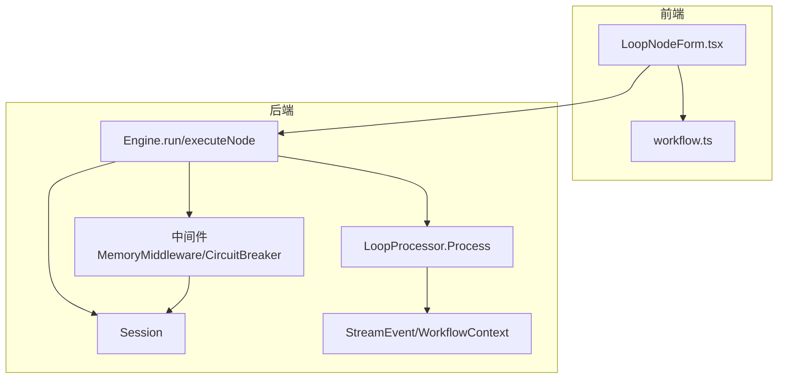
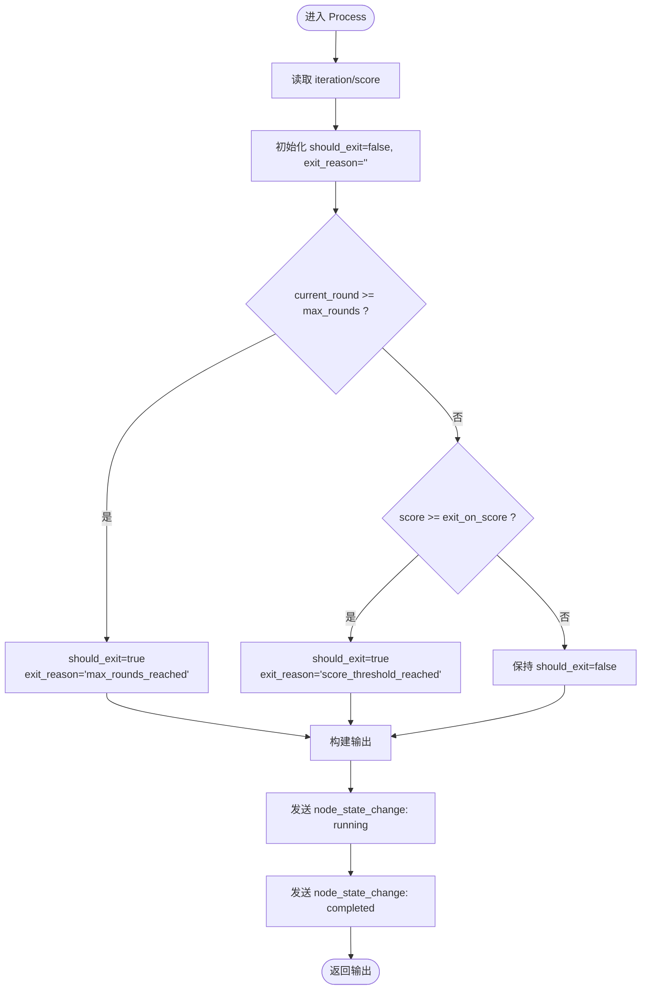
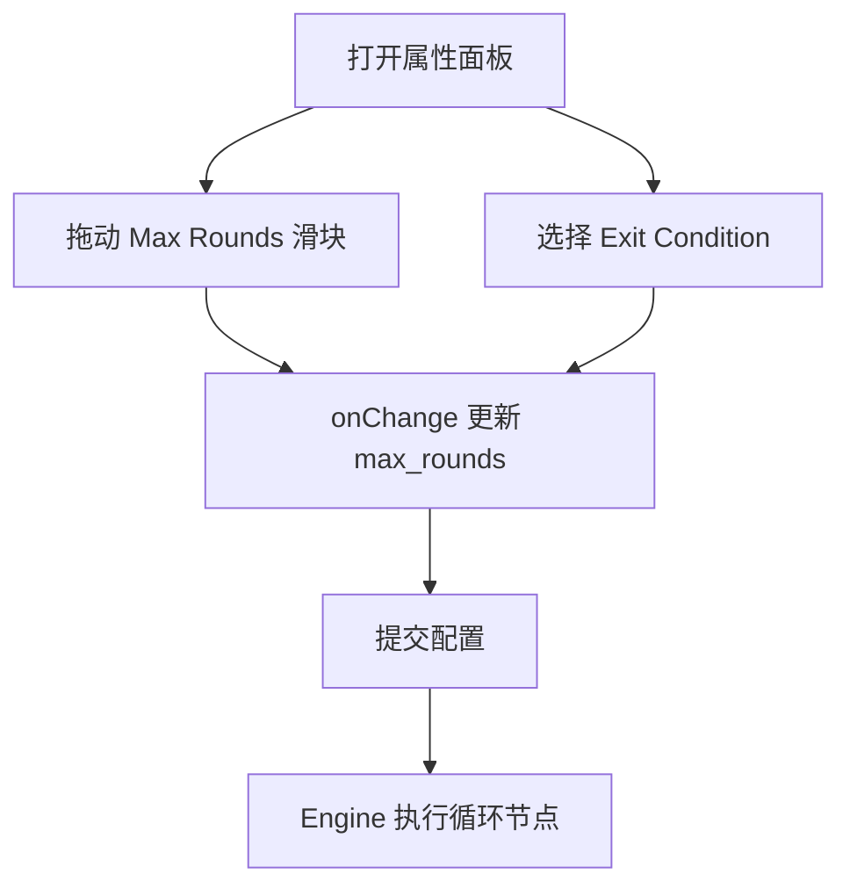
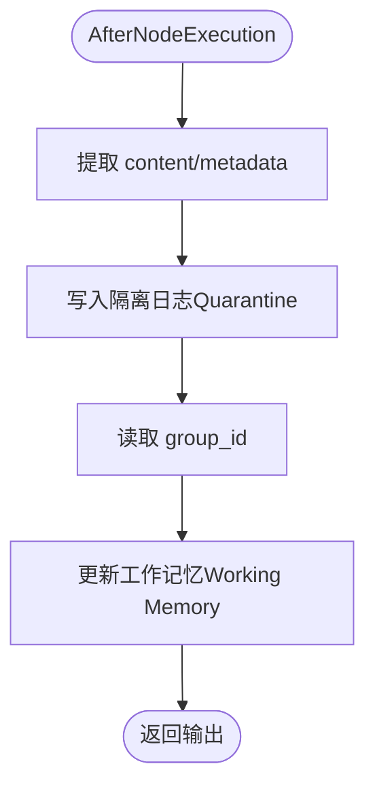
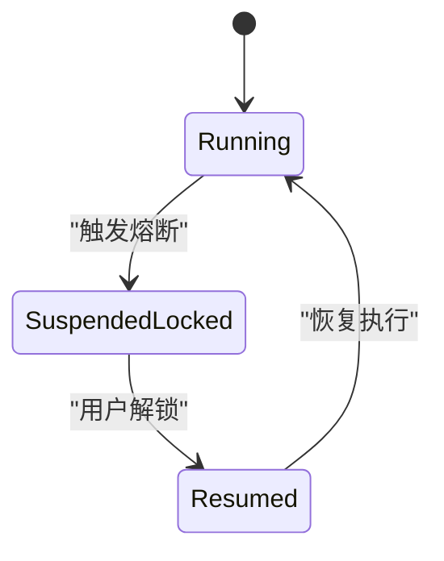
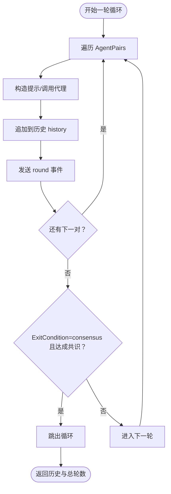
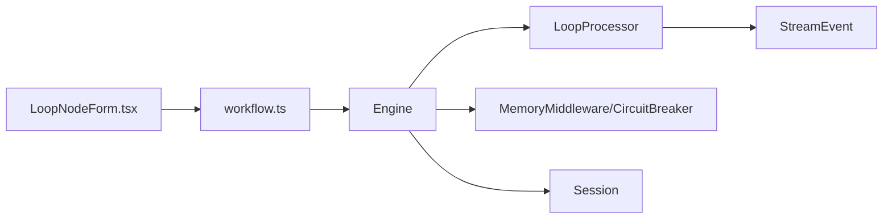

# 循环控制节点

<cite>
**本文引用的文件**
- [loop.go](file://internal/core/workflow/nodes/loop.go)
- [LoopNodeForm.tsx](file://frontend/src/features/editor/components/PropertyPanel/NodeForms/LoopNodeForm.tsx)
- [workflow.ts](file://frontend/src/types/workflow.ts)
- [engine.go](file://internal/core/workflow/engine.go)
- [session.go](file://internal/core/workflow/session.go)
- [context.go](file://internal/core/workflow/context.go)
- [SPEC-403-loop-processor.md](file://docs/specs/backend/SPEC-403-loop-processor.md)
- [SPEC-409-circuit-breaker.md](file://docs/specs/backend/SPEC-409-circuit-breaker.md)
- [circuit_breaker.go](file://internal/core/middleware/circuit_breaker.go)
- [memory.go](file://internal/core/middleware/memory.go)
- [loop_test.go](file://internal/core/workflow/nodes/loop_test.go)
- [validation.go](file://internal/core/workflow/validation.go)
</cite>

## 目录
1. [引言](#引言)
2. [项目结构](#项目结构)
3. [核心组件](#核心组件)
4. [架构总览](#架构总览)
5. [详细组件分析](#详细组件分析)
6. [依赖关系分析](#依赖关系分析)
7. [性能考量](#性能考量)
8. [故障排查指南](#故障排查指南)
9. [结论](#结论)
10. [附录](#附录)

## 引言
本文件围绕循环处理器（Loop Processor）进行系统化说明，依据SPEC-403规范，解释其在工作流中的控制流设计与终止条件管理。重点涵盖：
- 如何根据动态条件（如置信度未达标、事实核查失败）重复执行前序节点组，支持固定次数循环与条件循环两种模式；
- 在loop.go中对迭代计数、状态快照保存、内存隔离的实现细节；
- 前端LoopNodeForm.tsx提供的循环条件编辑器与调试模式开关；
- 典型应用场景示例（如多轮优化文案生成）；
- 无限循环风险的检测与熔断机制。

## 项目结构
循环控制节点位于后端工作流引擎的节点层，前端提供属性面板配置界面，配合会话状态与中间件共同实现安全与可观测性。



图表来源
- [engine.go](file://internal/core/workflow/engine.go#L41-L139)
- [session.go](file://internal/core/workflow/session.go#L24-L165)
- [loop.go](file://internal/core/workflow/nodes/loop.go#L15-L66)
- [context.go](file://internal/core/workflow/context.go#L8-L15)
- [LoopNodeForm.tsx](file://frontend/src/features/editor/components/PropertyPanel/NodeForms/LoopNodeForm.tsx#L9-L49)
- [workflow.ts](file://frontend/src/types/workflow.ts#L1-L45)

章节来源
- [engine.go](file://internal/core/workflow/engine.go#L41-L139)
- [session.go](file://internal/core/workflow/session.go#L24-L165)
- [loop.go](file://internal/core/workflow/nodes/loop.go#L15-L66)
- [context.go](file://internal/core/workflow/context.go#L8-L15)
- [LoopNodeForm.tsx](file://frontend/src/features/editor/components/PropertyPanel/NodeForms/LoopNodeForm.tsx#L9-L49)
- [workflow.ts](file://frontend/src/types/workflow.ts#L1-L45)

## 核心组件
- 后端节点处理器：LoopProcessor.Process负责判定是否应继续循环，输出should_exit、exit_reason等控制信息。
- 前端属性表单：LoopNodeForm.tsx提供“最大轮次”、“退出条件”等配置项，支撑固定次数循环与条件循环。
- 工作流引擎：Engine协调节点执行、中间件拦截与事件流，结合Session状态驱动循环控制。
- 中间件：MemoryMiddleware负责内存隔离与日志记录；CircuitBreaker提供熔断保护（死循环、Token激增、超时）。
- 规范与测试：SPEC-403定义了数据结构与流程；SPEC-409定义了熔断策略；loop_test.go验证循环终止条件。

章节来源
- [loop.go](file://internal/core/workflow/nodes/loop.go#L15-L66)
- [LoopNodeForm.tsx](file://frontend/src/features/editor/components/PropertyPanel/NodeForms/LoopNodeForm.tsx#L9-L49)
- [engine.go](file://internal/core/workflow/engine.go#L41-L139)
- [memory.go](file://internal/core/middleware/memory.go#L1-L73)
- [circuit_breaker.go](file://internal/core/middleware/circuit_breaker.go#L1-L39)
- [SPEC-403-loop-processor.md](file://docs/specs/backend/SPEC-403-loop-processor.md#L1-L91)
- [SPEC-409-circuit-breaker.md](file://docs/specs/backend/SPEC-409-circuit-breaker.md#L1-L208)
- [loop_test.go](file://internal/core/workflow/nodes/loop_test.go#L1-L45)

## 架构总览
循环控制节点在工作流中的位置与交互如下：

```mermaid
sequenceDiagram
participant FE as "前端属性面板"
participant Engine as "Engine"
participant Loop as "LoopProcessor"
participant MW as "中间件"
participant Sess as "Session"
participant Ctx as "StreamEvent"
FE->>Engine : "提交循环配置"
Engine->>Loop : "调用 Process(input)"
Loop->>Ctx : "发送 node_state_change : running"
Loop->>Loop : "读取 iteration/score/max_rounds"
Loop->>Loop : "判断 should_exit/exit_reason"
Loop-->>Engine : "返回 {should_exit, exit_reason, current_round}"
Engine->>MW : "AfterNodeExecution 钩子"
MW-->>Engine : "返回处理后的输出"
Engine->>Sess : "更新状态/传播到下游节点"
Engine->>Ctx : "发送 node_state_change : completed"
```

图表来源
- [engine.go](file://internal/core/workflow/engine.go#L92-L121)
- [loop.go](file://internal/core/workflow/nodes/loop.go#L15-L66)
- [context.go](file://internal/core/workflow/context.go#L8-L15)
- [memory.go](file://internal/core/middleware/memory.go#L28-L72)

章节来源
- [engine.go](file://internal/core/workflow/engine.go#L92-L121)
- [loop.go](file://internal/core/workflow/nodes/loop.go#L15-L66)
- [context.go](file://internal/core/workflow/context.go#L8-L15)
- [memory.go](file://internal/core/middleware/memory.go#L28-L72)

## 详细组件分析

### 后端循环处理器（LoopProcessor）
- 输入参数
  - iteration：当前轮次（从输入映射读取，若为0则默认为1）
  - score：置信度/评分（支持float64/int类型）
  - max_rounds：最大轮次阈值
  - exit_on_score：达到该分数即提前退出
- 终止条件
  - 达到最大轮次：current_round >= max_rounds
  - 达到分数阈值：score >= exit_on_score（含浮点与整型）
- 输出
  - should_exit：是否应退出循环
  - exit_reason：退出原因（max_rounds_reached 或 score_threshold_reached）
  - current_round：当前轮次
  - timestamp：时间戳
- 事件流
  - 发送“node_state_change: running”
  - 发送“node_state_change: completed”



图表来源
- [loop.go](file://internal/core/workflow/nodes/loop.go#L15-L66)

章节来源
- [loop.go](file://internal/core/workflow/nodes/loop.go#L15-L66)
- [loop_test.go](file://internal/core/workflow/nodes/loop_test.go#L10-L44)

### 前端循环条件编辑器（LoopNodeForm.tsx）
- 配置项
  - 最大轮次（Max Rounds）：滑块范围1-10，默认3
  - 退出条件（Exit Condition）：达到最大轮次 / 达成共识
- 行为
  - onChange回调更新LoopNodeData，驱动后端节点按新配置运行
  - 当前版本未暴露“共识”具体判定逻辑，保留扩展空间



图表来源
- [LoopNodeForm.tsx](file://frontend/src/features/editor/components/PropertyPanel/NodeForms/LoopNodeForm.tsx#L9-L49)
- [workflow.ts](file://frontend/src/types/workflow.ts#L21-L25)

章节来源
- [LoopNodeForm.tsx](file://frontend/src/features/editor/components/PropertyPanel/NodeForms/LoopNodeForm.tsx#L9-L49)
- [workflow.ts](file://frontend/src/types/workflow.ts#L21-L25)

### 会话与状态快照（Session）
- Session维护执行上下文、暂停/恢复、信号通道等能力
- 在循环场景下，可通过Session的Inputs传递iteration、score等状态，供LoopProcessor读取
- 事件流通过StreamEvent广播节点状态变化，便于前端与监控系统观测

```mermaid
sequenceDiagram
participant Sess as "Session"
participant Eng as "Engine"
participant Loop as "LoopProcessor"
participant Ctx as "StreamEvent"
Eng->>Sess : "Start() 创建可取消上下文"
Eng->>Loop : "传入 Sess.Inputs 作为 input"
Loop->>Ctx : "发送 node_state_change : running/completed"
Eng->>Sess : "WaitIfPaused() 支持暂停/恢复"
Eng->>Sess : "Complete()/Stop() 结束生命周期"
```

图表来源
- [session.go](file://internal/core/workflow/session.go#L51-L108)
- [engine.go](file://internal/core/workflow/engine.go#L41-L139)
- [context.go](file://internal/core/workflow/context.go#L8-L15)

章节来源
- [session.go](file://internal/core/workflow/session.go#L51-L108)
- [engine.go](file://internal/core/workflow/engine.go#L41-L139)
- [context.go](file://internal/core/workflow/context.go#L8-L15)

### 内存隔离与日志（MemoryMiddleware）
- 在AfterNodeExecution阶段，抽取输出中的content与metadata，写入隔离的“隔离日志”（Quarantine）与“工作记忆”（Working Memory）
- 通过Session.Inputs中的group_id确定所属群组，避免跨会话污染
- 即使写入失败也尽量不中断流程，保证稳定性



图表来源
- [memory.go](file://internal/core/middleware/memory.go#L28-L72)

章节来源
- [memory.go](file://internal/core/middleware/memory.go#L28-L72)

### 熔断与无限循环检测（CircuitBreaker）
- 死循环检测：基于消息熵值窗口平均低于阈值，判定无效重复对话
- Token激增：实际Token消耗超过预估阈值触发
- 执行超时：超过设定时长触发
- 状态机：RUNNING → SUSPENDED_LOCKED → RESUMED
- 前端提供解锁请求与安全自查流程



图表来源
- [SPEC-409-circuit-breaker.md](file://docs/specs/backend/SPEC-409-circuit-breaker.md#L18-L31)
- [circuit_breaker.go](file://internal/core/middleware/circuit_breaker.go#L1-L39)

章节来源
- [SPEC-409-circuit-breaker.md](file://docs/specs/backend/SPEC-409-circuit-breaker.md#L1-L208)
- [circuit_breaker.go](file://internal/core/middleware/circuit_breaker.go#L1-L39)

### 控制流与终止条件管理（依据SPEC-403）
- 数据结构
  - LoopProcessor包含MaxRounds、AgentPairs、ExitCondition
  - DebateMessage用于记录每轮对话历史
- 实现逻辑
  - 固定次数循环：按MaxRounds迭代
  - 条件循环：当ExitCondition为“consensus”时，检查历史是否达成共识
  - 历史传递：每轮将对话内容追加至history，供后续轮次使用
- 测试用例
  - 达到最大轮数退出
  - 提前共识退出
  - 历史正确传递



图表来源
- [SPEC-403-loop-processor.md](file://docs/specs/backend/SPEC-403-loop-processor.md#L25-L64)

章节来源
- [SPEC-403-loop-processor.md](file://docs/specs/backend/SPEC-403-loop-processor.md#L1-L91)

## 依赖关系分析
- 节点与引擎
  - LoopProcessor由Engine通过NodeFactory创建并执行
  - 中间件在Before/After钩子中参与执行链路
- 会话与事件
  - Session提供执行上下文与暂停/恢复能力
  - StreamEvent贯穿节点状态变更与错误上报
- 前后端耦合
  - 前端LoopNodeForm.tsx通过onChange更新LoopNodeData
  - 后端读取输入映射中的iteration/score/max_rounds等字段



图表来源
- [engine.go](file://internal/core/workflow/engine.go#L41-L139)
- [loop.go](file://internal/core/workflow/nodes/loop.go#L15-L66)
- [LoopNodeForm.tsx](file://frontend/src/features/editor/components/PropertyPanel/NodeForms/LoopNodeForm.tsx#L9-L49)
- [workflow.ts](file://frontend/src/types/workflow.ts#L1-L45)
- [memory.go](file://internal/core/middleware/memory.go#L1-L73)
- [circuit_breaker.go](file://internal/core/middleware/circuit_breaker.go#L1-L39)
- [session.go](file://internal/core/workflow/session.go#L24-L165)
- [context.go](file://internal/core/workflow/context.go#L8-L15)

章节来源
- [engine.go](file://internal/core/workflow/engine.go#L41-L139)
- [loop.go](file://internal/core/workflow/nodes/loop.go#L15-L66)
- [LoopNodeForm.tsx](file://frontend/src/features/editor/components/PropertyPanel/NodeForms/LoopNodeForm.tsx#L9-L49)
- [workflow.ts](file://frontend/src/types/workflow.ts#L1-L45)
- [memory.go](file://internal/core/middleware/memory.go#L1-L73)
- [circuit_breaker.go](file://internal/core/middleware/circuit_breaker.go#L1-L39)
- [session.go](file://internal/core/workflow/session.go#L24-L165)
- [context.go](file://internal/core/workflow/context.go#L8-L15)

## 性能考量
- 循环开销
  - 固定次数循环：时间复杂度O(R×P)，R为轮次，P为每轮代理对数量
  - 条件循环：需在每轮计算共识，增加一次判定成本
- 事件流与并发
  - Engine对分支节点采用并发执行，循环节点本身为顺序控制，避免过度并发
- 内存隔离
  - MemoryMiddleware在AfterNodeExecution阶段写入隔离日志与工作记忆，避免共享状态带来的竞争
- 熔断保护
  - CircuitBreaker通过Token激增、死循环与超时三类条件触发熔断，防止资源滥用

[本节为通用性能建议，无需特定文件来源]

## 故障排查指南
- 循环未退出
  - 检查输入映射中iteration是否正确传递，以及max_rounds是否合理
  - 若使用分数阈值，确认score字段类型（float64/int）与阈值设置
- 退出原因不符预期
  - 查看should_exit与exit_reason输出，核对循环终止条件
- 无限循环风险
  - 开启CircuitBreaker监控，关注“死循环检测”与“Token激增”告警
  - 必要时手动触发熔断并解锁
- 内存隔离问题
  - 确认group_id存在且正确，避免跨会话污染
  - 若写入失败，检查日志与中间件返回值

章节来源
- [loop_test.go](file://internal/core/workflow/nodes/loop_test.go#L10-L44)
- [SPEC-409-circuit-breaker.md](file://docs/specs/backend/SPEC-409-circuit-breaker.md#L1-L208)
- [memory.go](file://internal/core/middleware/memory.go#L28-L72)

## 结论
循环控制节点通过“固定次数循环+条件循环”的双模式设计，结合输入映射中的iteration/score/max_rounds等关键字段，实现了灵活可控的迭代执行。前端属性面板提供了直观的配置入口，后端通过事件流与中间件保障可观测性与安全性。SPEC-409的熔断机制进一步降低了无限循环与资源滥用的风险。在实际应用中，建议优先以固定次数循环为主，辅以分数阈值实现“早停”，并在需要时启用“达成共识”条件循环。

[本节为总结性内容，无需特定文件来源]

## 附录

### 典型应用场景示例
- 多轮优化文案生成
  - 固定次数循环：按max_rounds逐步提升文案质量
  - 条件循环：当共识判定达到预期时提前结束
  - 分数阈值：当置信度达到阈值时停止迭代
- 事实核查与投票
  - 使用LoopNodeForm配置退出条件为“达成共识”，结合SPEC-403的历史传递机制，实现多轮辩论与共识形成

[本节为概念性示例，无需特定文件来源]

### 与工作流图检测的关系
- 工作流图允许循环，但运行期通过MaxSteps/LoopProcessor等手段进行保护，避免死循环导致系统不可用

章节来源
- [validation.go](file://internal/core/workflow/validation.go#L54-L70)