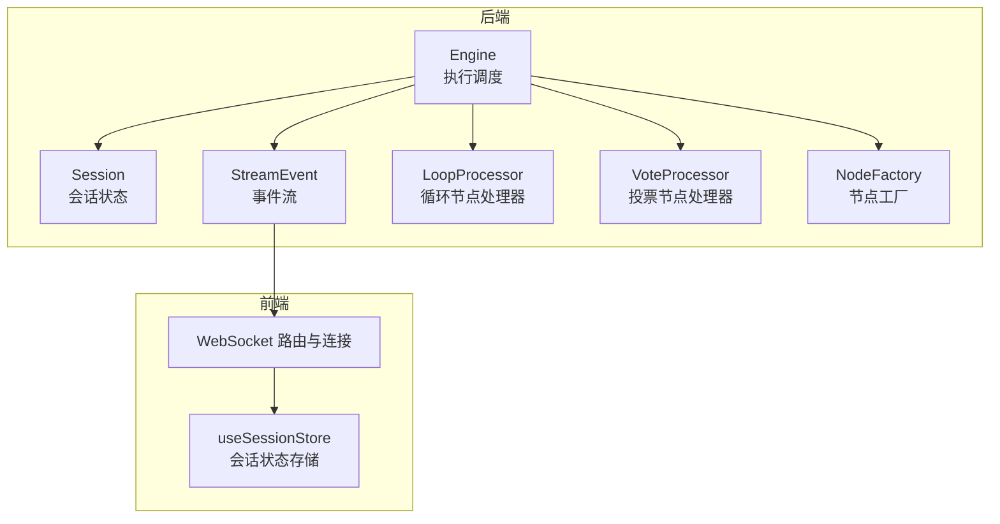
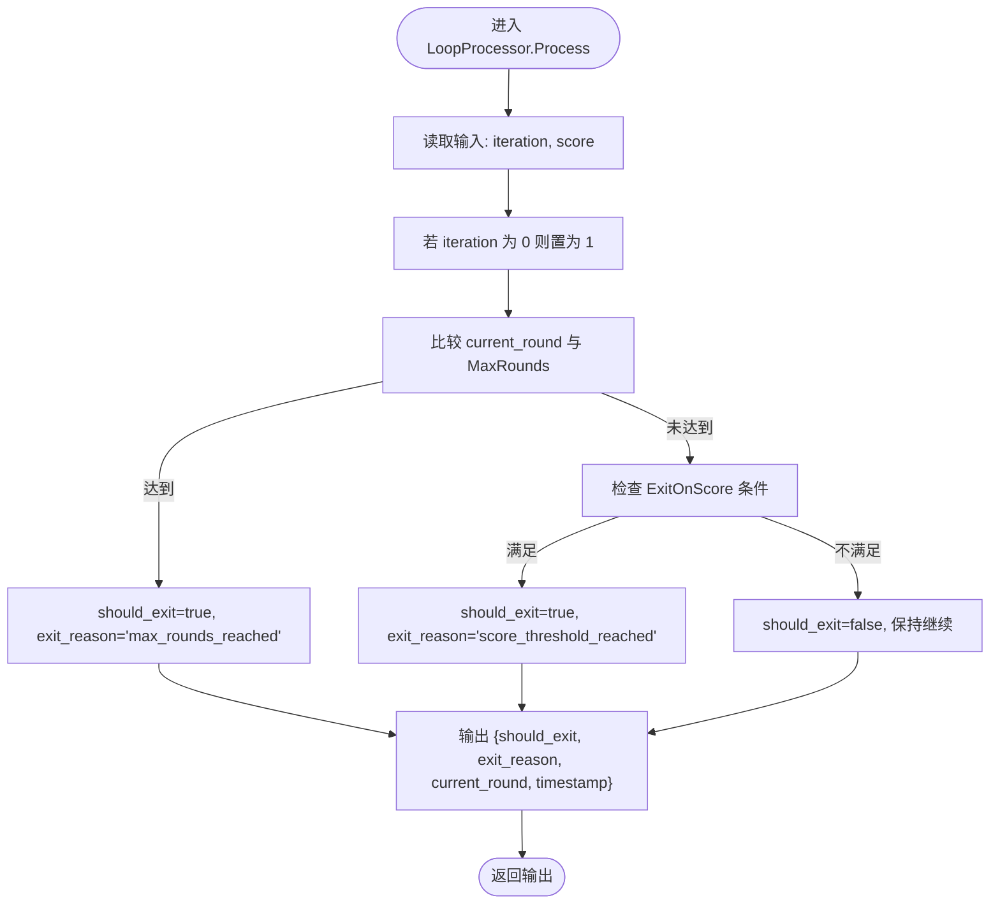
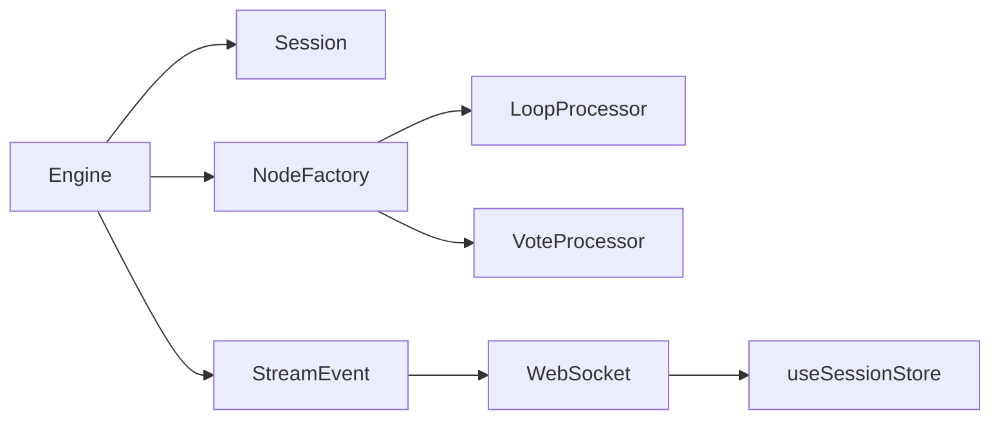

# 循环状态管理与会话上下文

<cite>
**本文引用的文件**
- [engine.go](file://internal/core/workflow/engine.go)
- [session.go](file://internal/core/workflow/session.go)
- [context.go](file://internal/core/workflow/context.go)
- [loop.go](file://internal/core/workflow/nodes/loop.go)
- [factory.go](file://internal/core/workflow/nodes/factory.go)
- [SPEC-403-loop-processor.md](file://docs/specs/backend/SPEC-403-loop-processor.md)
- [SPEC-202-vote-loop-nodes.md](file://docs/specs/sprint3/SPEC-202-vote-loop-nodes.md)
- [SPEC-402-vote-processor.md](file://docs/specs/backend/SPEC-402-vote-processor.md)
- [SPEC-001-session-store.md](file://docs/specs/sprint1/SPEC-001-session-store.md)
- [2025-12-21-websocket-debugging-report.md](file://docs/reports/debugging/2025-12-21-websocket-debugging-report.md)
- [SPEC-609-defect-3-audit.md](file://docs/reports/audits/sprint6_audit_report_v5_architecture.md)
</cite>

## 目录
1. [引言](#引言)
2. [项目结构](#项目结构)
3. [核心组件](#核心组件)
4. [架构总览](#架构总览)
5. [详细组件分析](#详细组件分析)
6. [依赖关系分析](#依赖关系分析)
7. [性能考量](#性能考量)
8. [故障排查指南](#故障排查指南)
9. [结论](#结论)
10. [附录](#附录)

## 引言
本文件围绕“循环处理器与工作流引擎在状态管理上的职责分离”展开，重点阐述：
- LoopProcessor 仅负责判断是否退出，而迭代计数（iteration）的递增与持久化由工作流引擎通过 Session 状态管理。
- input 输入流中 'iteration' 字段的来源及其在跨轮次执行中的连续性保障机制。
- 状态快照保存策略，确保每次循环前序节点的输出能正确传递至下一轮。
- 结合 SPEC-202 中关于投票与循环节点的设计要求，说明如何利用内存隔离机制避免不同轮次间上下文污染。
- 提供调试建议，如通过 WebSocket 事件流监控每轮次的 current_round 值变化，以及在异常情况下如何通过会话恢复机制重建循环状态。

## 项目结构
围绕循环与投票节点的状态管理，涉及后端工作流引擎、节点处理器、会话状态、WebSocket 事件流与前端 Store 等模块。关键文件如下：
- 后端工作流引擎与会话：engine.go、session.go、context.go
- 节点处理器与工厂：loop.go、factory.go、SPEC-403-loop-processor.md、SPEC-202-vote-loop-nodes.md、SPEC-402-vote-processor.md
- 前端会话 Store 与 WebSocket 调试：SPEC-001-session-store.md、2025-12-21-websocket-debugging-report.md
- 参数与缺陷审计：SPEC-609-defect-3-audit.md



图表来源
- [engine.go](file://internal/core/workflow/engine.go#L1-L246)
- [session.go](file://internal/core/workflow/session.go#L1-L165)
- [context.go](file://internal/core/workflow/context.go#L1-L36)
- [loop.go](file://internal/core/workflow/nodes/loop.go#L1-L66)
- [factory.go](file://internal/core/workflow/nodes/factory.go#L1-L106)
- [SPEC-403-loop-processor.md](file://docs/specs/backend/SPEC-403-loop-processor.md#L1-L91)
- [SPEC-202-vote-loop-nodes.md](file://docs/specs/sprint3/SPEC-202-vote-loop-nodes.md#L1-L146)
- [SPEC-402-vote-processor.md](file://docs/specs/backend/SPEC-402-vote-processor.md#L1-L101)
- [SPEC-001-session-store.md](file://docs/specs/sprint1/SPEC-001-session-store.md#L1-L486)
- [2025-12-21-websocket-debugging-report.md](file://docs/reports/debugging/2025-12-21-websocket-debugging-report.md#L1-L272)

章节来源
- [engine.go](file://internal/core/workflow/engine.go#L1-L246)
- [session.go](file://internal/core/workflow/session.go#L1-L165)
- [context.go](file://internal/core/workflow/context.go#L1-L36)
- [loop.go](file://internal/core/workflow/nodes/loop.go#L1-L66)
- [factory.go](file://internal/core/workflow/nodes/factory.go#L1-L106)
- [SPEC-403-loop-processor.md](file://docs/specs/backend/SPEC-403-loop-processor.md#L1-L91)
- [SPEC-202-vote-loop-nodes.md](file://docs/specs/sprint3/SPEC-202-vote-loop-nodes.md#L1-L146)
- [SPEC-402-vote-processor.md](file://docs/specs/backend/SPEC-402-vote-processor.md#L1-L101)
- [SPEC-001-session-store.md](file://docs/specs/sprint1/SPEC-001-session-store.md#L1-L486)
- [2025-12-21-websocket-debugging-report.md](file://docs/reports/debugging/2025-12-21-websocket-debugging-report.md#L1-L272)

## 核心组件
- 工作流引擎 Engine：负责图遍历、节点执行、中间件钩子、并发分支处理、错误传播与事件流广播。
- 会话 Session：承载一次工作流运行的全局状态（输入、输出、开始/结束时间、暂停/恢复信号通道等）。
- 节点处理器 LoopProcessor：根据输入中的 iteration 与 score 等条件决定是否退出，并输出 current_round 等元信息。
- 节点工厂 NodeFactory：从节点属性中解析 Loop/Vote 等处理器所需的配置。
- 事件流 StreamEvent：统一的 WebSocket 事件载体，前端据此更新 UI 与会话状态。

章节来源
- [engine.go](file://internal/core/workflow/engine.go#L1-L246)
- [session.go](file://internal/core/workflow/session.go#L1-L165)
- [loop.go](file://internal/core/workflow/nodes/loop.go#L1-L66)
- [factory.go](file://internal/core/workflow/nodes/factory.go#L1-L106)
- [context.go](file://internal/core/workflow/context.go#L1-L36)

## 架构总览
下面的序列图展示了“循环节点”的一次执行路径，强调 LoopProcessor 的职责边界与 Session 的状态管理角色。

```mermaid
sequenceDiagram
participant Client as "客户端"
participant Engine as "Engine"
participant Session as "Session"
participant Factory as "NodeFactory"
participant Loop as "LoopProcessor"
participant WS as "WebSocket 事件流"
Client->>Engine : "启动工作流"
Engine->>Session : "Start() 初始化状态"
Engine->>Factory : "解析节点属性"
Factory-->>Engine : "返回 LoopProcessor"
Engine->>Loop : "Process(input)"
Loop-->>Engine : "输出 {should_exit, exit_reason, current_round}"
Engine->>WS : "广播 node_state_change"
Engine-->>Client : "事件流推送"
Note over Engine,Loop : "LoopProcessor 仅判断是否退出；迭代计数由上层流程控制"
```

图表来源
- [engine.go](file://internal/core/workflow/engine.go#L40-L139)
- [session.go](file://internal/core/workflow/session.go#L51-L62)
- [factory.go](file://internal/core/workflow/nodes/factory.go#L70-L77)
- [loop.go](file://internal/core/workflow/nodes/loop.go#L15-L66)

## 详细组件分析

### 循环处理器（LoopProcessor）与职责分离
- LoopProcessor 的职责：
  - 仅依据输入中的 iteration 与 score 等条件判断是否退出，并输出 current_round 与时间戳等元信息。
  - 不负责迭代计数的递增与持久化，也不负责跨轮次的数据合并。
- 退出条件：
  - 达到最大轮数（MaxRounds）。
  - 满足分数阈值（ExitOnScore）。
- 输出字段：
  - should_exit、exit_reason、current_round、timestamp。



图表来源
- [loop.go](file://internal/core/workflow/nodes/loop.go#L15-L66)

章节来源
- [loop.go](file://internal/core/workflow/nodes/loop.go#L1-L66)

### 输入流中 'iteration' 字段的来源与连续性保障
- 来源：
  - 节点工厂 NodeFactory 从节点属性中读取 max_rounds 与 exit_on_score 等配置，用于构造 LoopProcessor。
  - 在循环执行过程中，'iteration' 字段通常由上层流程（例如 Engine 或上游节点）注入到 input 中，作为当前轮次的索引。
- 连续性保障：
  - 由于 LoopProcessor 仅读取 iteration 并不修改它，因此 iteration 的递增与持久化应由工作流引擎在推进下一轮之前完成。
  - 会话 Session 作为全局状态容器，可承载 iteration 的最新值，确保跨轮次的一致性。
- 规格参考：
  - SPEC-403 中 LoopProcessor 的实现逻辑描述了“历史记录与轮次推进”的思路，有助于理解 iteration 的使用方式。

章节来源
- [factory.go](file://internal/core/workflow/nodes/factory.go#L70-L77)
- [SPEC-403-loop-processor.md](file://docs/specs/backend/SPEC-403-loop-processor.md#L1-L91)

### 状态快照保存策略与前序输出传递
- 快照保存：
  - 会话 Session 本身包含 Inputs 与 Outputs 字典，可在每轮结束后将本轮输出写入 Outputs，并在下一轮开始时将其作为新的输入的一部分注入到 input 中。
  - 前端 useSessionStore 需要存储节点元数据（name、type）以便 UI 渲染，避免“Unknown Node”等问题。
- 前序输出传递：
  - Engine 在执行完一个节点后，将输出作为输入传递给下游节点；对于循环节点，应在推进下一轮前将上一轮的输出合并进 input 的 iteration 字段与历史数据中。
- 前端 Store 与事件：
  - WebSocket 事件流中的 node_state_change 等事件用于驱动前端 Store 更新节点状态；同时，前端需要在收到首个“运行中”节点事件时显式更新会话状态，避免 UI 始终显示 IDLE。

章节来源
- [session.go](file://internal/core/workflow/session.go#L1-L165)
- [SPEC-001-session-store.md](file://docs/specs/sprint1/SPEC-001-session-store.md#L1-L486)
- [2025-12-21-websocket-debugging-report.md](file://docs/reports/debugging/2025-12-21-websocket-debugging-report.md#L155-L181)

### 内存隔离与上下文污染防护
- 内存隔离：
  - 每轮次的输入 input 应为“新对象”，避免不同轮次共享同一 map 导致污染。
  - 上游节点的输出在注入到 input 时应进行浅拷贝或深拷贝，确保本轮的 iteration 与历史数据独立于其他轮次。
- 上下文污染风险点：
  - 若上游节点直接复用同一个 map 并修改其键值，再传递给多轮循环，会导致后续轮次读取到已修改的值。
  - 解决方案：在推进下一轮前，重新构建 input，仅保留本轮需要的历史片段与必要的元信息。

章节来源
- [engine.go](file://internal/core/workflow/engine.go#L120-L139)
- [loop.go](file://internal/core/workflow/nodes/loop.go#L25-L28)

### 投票与循环节点的设计要求（SPEC-202）
- 投票节点（Vote）：
  - 支持阈值与投票类型（yes/no 或 1-10 评分），并聚合多个代理人的结果。
  - 输出应包含通过与否、投票明细与摘要，供后续节点（如循环节点）使用。
- 循环节点（Loop）：
  - 支持最大轮数与退出条件（最大轮数或达成共识），并记录辩论历史。
  - 输出应包含历史与总轮数，便于前端展示与后续决策。

章节来源
- [SPEC-202-vote-loop-nodes.md](file://docs/specs/sprint3/SPEC-202-vote-loop-nodes.md#L1-L146)
- [SPEC-402-vote-processor.md](file://docs/specs/backend/SPEC-402-vote-processor.md#L1-L101)
- [SPEC-403-loop-processor.md](file://docs/specs/backend/SPEC-403-loop-processor.md#L1-L91)

### 参数名不匹配与缺陷修复（SPEC-609 Defect-3）
- 问题：节点属性中 exit_on_score 与工厂读取的 exit_condition 名称不一致，导致分数阈值参数无法生效。
- 影响：Loop 节点无法根据分数退出，影响循环状态管理的正确性。
- 修复：确保节点属性与工厂读取一致，避免参数名不匹配。

章节来源
- [SPEC-609-defect-3-audit.md](file://docs/reports/audits/sprint6_audit_report_v5_architecture.md#L73-L91)
- [factory.go](file://internal/core/workflow/nodes/factory.go#L70-L77)

## 依赖关系分析
- Engine 依赖 Session 管理全局状态，并通过 StreamEvent 广播事件。
- NodeFactory 将节点属性映射为具体处理器（Loop/Vote 等）。
- LoopProcessor 仅依赖输入中的 iteration 与 score，不直接操作 Session。
- 前端 useSessionStore 依赖 WebSocket 事件流更新节点与会话状态。



图表来源
- [engine.go](file://internal/core/workflow/engine.go#L1-L246)
- [session.go](file://internal/core/workflow/session.go#L1-L165)
- [factory.go](file://internal/core/workflow/nodes/factory.go#L1-L106)
- [loop.go](file://internal/core/workflow/nodes/loop.go#L1-L66)
- [context.go](file://internal/core/workflow/context.go#L1-L36)
- [SPEC-001-session-store.md](file://docs/specs/sprint1/SPEC-001-session-store.md#L1-L486)

章节来源
- [engine.go](file://internal/core/workflow/engine.go#L1-L246)
- [session.go](file://internal/core/workflow/session.go#L1-L165)
- [factory.go](file://internal/core/workflow/nodes/factory.go#L1-L106)
- [loop.go](file://internal/core/workflow/nodes/loop.go#L1-L66)
- [context.go](file://internal/core/workflow/context.go#L1-L36)
- [SPEC-001-session-store.md](file://docs/specs/sprint1/SPEC-001-session-store.md#L1-L486)

## 性能考量
- 并发与等待：
  - Engine 在处理并行分支时使用 WaitGroup 控制子节点生命周期，避免资源泄漏。
- 事件流缓冲：
  - StreamEvent 通道具备缓冲，减少高并发下的阻塞风险。
- 会话上下文：
  - Session 提供可取消上下文，便于在暂停/停止时快速释放资源。

章节来源
- [engine.go](file://internal/core/workflow/engine.go#L120-L139)
- [engine.go](file://internal/core/workflow/engine.go#L139-L160)
- [session.go](file://internal/core/workflow/session.go#L51-L62)

## 故障排查指南
- WebSocket 事件字段不一致：
  - 问题：后端 StreamEvent 的 JSON 字段名为 type，前端期望 event，导致消息静默丢失。
  - 修复：统一字段名为 event，确保前后端契约一致。
- 会话状态显示异常：
  - 问题：前端仅更新节点状态，未显式更新会话状态，导致 UI 始终显示 IDLE。
  - 修复：在收到首个“运行中”节点事件时，显式更新 session 状态。
- 节点名称显示异常：
  - 问题：NodeStateSnapshot 缺少 name/type 字段，导致 UI 显示 Unknown Node。
  - 修复：扩展接口并在初始化时存储完整元数据。
- 参数名不匹配：
  - 问题：节点属性 exit_on_score 与工厂读取 exit_condition 名称不一致，导致分数阈值无效。
  - 修复：修正属性名，确保 Loop 节点按分数阈值退出。

章节来源
- [2025-12-21-websocket-debugging-report.md](file://docs/reports/debugging/2025-12-21-websocket-debugging-report.md#L18-L52)
- [2025-12-21-websocket-debugging-report.md](file://docs/reports/debugging/2025-12-21-websocket-debugging-report.md#L155-L181)
- [2025-12-21-websocket-debugging-report.md](file://docs/reports/debugging/2025-12-21-websocket-debugging-report.md#L92-L125)
- [SPEC-609-defect-3-audit.md](file://docs/reports/audits/sprint6_audit_report_v5_architecture.md#L73-L91)

## 结论
- LoopProcessor 的职责边界清晰：仅判断是否退出，不负责迭代计数的递增与持久化。
- 迭代计数（iteration）与历史数据应由工作流引擎在推进下一轮前完成，Session 作为全局状态容器承担持久化职责。
- 通过内存隔离与输入对象的独立构建，避免不同轮次间的上下文污染。
- 借助 WebSocket 事件流与前端 Store 的协同，可实时监控 current_round 的变化并及时恢复会话状态。

## 附录
- 相关规格与审计文件：
  - SPEC-202：投票/循环节点 UI 与属性
  - SPEC-402：VoteProcessor 数据结构与实现
  - SPEC-403：LoopProcessor 数据结构与实现
  - SPEC-001：useSessionStore 重写规格
  - WebSocket 调试报告：事件字段与会话状态修复
  - SPEC-609：参数名不匹配缺陷与修复