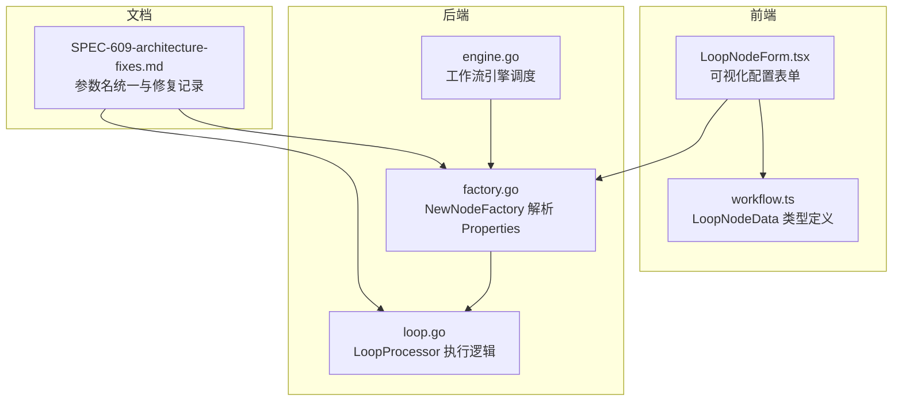
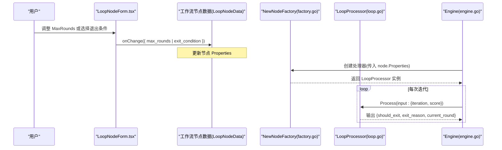
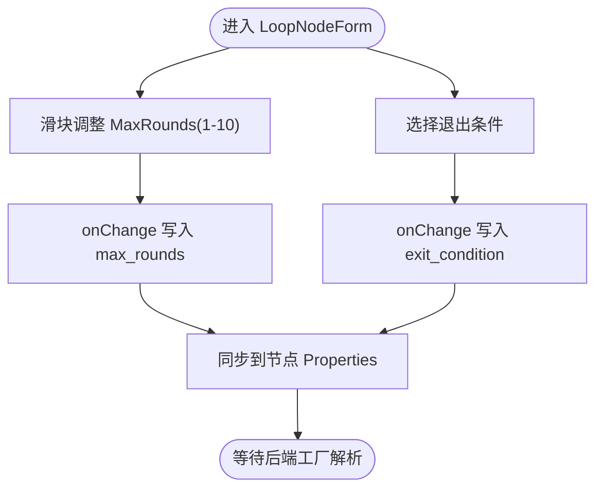
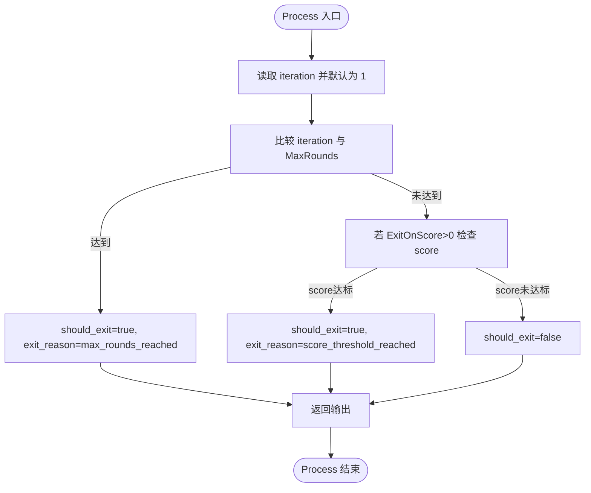
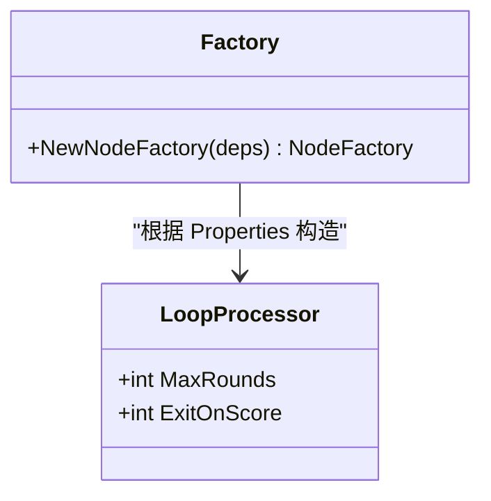
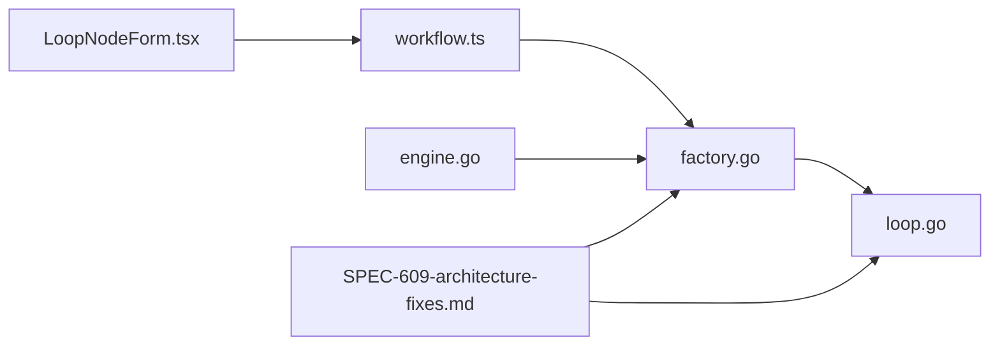

# 循环节点配置与前端交互

<cite>
**本文引用的文件**
- [LoopNodeForm.tsx](file://frontend/src/features/editor/components/PropertyPanel/NodeForms/LoopNodeForm.tsx)
- [workflow.ts](file://frontend/src/types/workflow.ts)
- [loop.go](file://internal/core/workflow/nodes/loop.go)
- [factory.go](file://internal/core/workflow/nodes/factory.go)
- [engine.go](file://internal/core/workflow/engine.go)
- [SPEC-609-architecture-fixes.md](file://docs/specs/sprint6/SPEC-609-architecture-fixes.md)
- [loop_test.go](file://internal/core/workflow/nodes/loop_test.go)
</cite>

## 目录
1. [引言](#引言)
2. [项目结构](#项目结构)
3. [核心组件](#核心组件)
4. [架构总览](#架构总览)
5. [详细组件分析](#详细组件分析)
6. [依赖关系分析](#依赖关系分析)
7. [性能考量](#性能考量)
8. [故障排查指南](#故障排查指南)
9. [结论](#结论)
10. [附录](#附录)

## 引言
本文件围绕前端 LoopNodeForm 组件如何为用户提供“循环节点”的可视化配置界面进行深入说明，重点包括：
- 通过 range 滑块控制 MaxRounds（1-10 次可调）与下拉菜单选择退出条件（最大轮数、共识达成）的交互设计；
- onChange 回调如何将用户输入同步至工作流节点的 Properties 属性；
- 结合 NewNodeFactory 对 node.Properties['max_rounds'] 和 ['exit_on_score'] 的解析逻辑，说明配置数据如何被转换为 LoopProcessor 结构体实例；
- 指出现行前端“Debate Pairs”配置项仍为占位符，多智能体配对辩论功能尚未实现；
- 提供配置最佳实践建议，帮助在不同业务场景下安全、高效地使用循环节点。

## 项目结构
本次分析涉及前后端与文档层面的关键文件如下图所示：

图表来源
- [LoopNodeForm.tsx](file://frontend/src/features/editor/components/PropertyPanel/NodeForms/LoopNodeForm.tsx#L1-L50)
- [workflow.ts](file://frontend/src/types/workflow.ts#L1-L45)
- [factory.go](file://internal/core/workflow/nodes/factory.go#L70-L77)
- [loop.go](file://internal/core/workflow/nodes/loop.go#L10-L66)
- [engine.go](file://internal/core/workflow/engine.go#L40-L120)
- [SPEC-609-architecture-fixes.md](file://docs/specs/sprint6/SPEC-609-architecture-fixes.md#L70-L94)

章节来源
- [LoopNodeForm.tsx](file://frontend/src/features/editor/components/PropertyPanel/NodeForms/LoopNodeForm.tsx#L1-L50)
- [workflow.ts](file://frontend/src/types/workflow.ts#L1-L45)
- [factory.go](file://internal/core/workflow/nodes/factory.go#L70-L77)
- [loop.go](file://internal/core/workflow/nodes/loop.go#L10-L66)
- [engine.go](file://internal/core/workflow/engine.go#L40-L120)
- [SPEC-609-architecture-fixes.md](file://docs/specs/sprint6/SPEC-609-architecture-fixes.md#L70-L94)

## 核心组件
- 前端 LoopNodeForm：提供 MaxRounds 滑块与退出条件下拉菜单，并通过 onChange 将用户输入写回 LoopNodeData。
- 类型定义 workflow.ts：定义 LoopNodeData 包含 max_rounds、exit_condition、agent_pairs 等字段。
- 后端 LoopProcessor：根据 MaxRounds 与 ExitOnScore 决定是否退出循环。
- 工厂函数 NewNodeFactory：从 node.Properties 中读取 max_rounds 与 exit_on_score，构造 LoopProcessor。
- 文档 SPEC-609：明确参数名统一为 exit_on_score，修复了参数名不一致的问题。

章节来源
- [LoopNodeForm.tsx](file://frontend/src/features/editor/components/PropertyPanel/NodeForms/LoopNodeForm.tsx#L1-L50)
- [workflow.ts](file://frontend/src/types/workflow.ts#L21-L25)
- [loop.go](file://internal/core/workflow/nodes/loop.go#L10-L66)
- [factory.go](file://internal/core/workflow/nodes/factory.go#L70-L77)
- [SPEC-609-architecture-fixes.md](file://docs/specs/sprint6/SPEC-609-architecture-fixes.md#L70-L94)

## 架构总览
前端配置通过 Property Panel 的 LoopNodeForm 与工作流节点数据绑定；工厂函数在运行时将 Properties 解析为处理器实例；处理器在每次迭代中判断是否达到退出条件。

图表来源
- [LoopNodeForm.tsx](file://frontend/src/features/editor/components/PropertyPanel/NodeForms/LoopNodeForm.tsx#L12-L38)
- [workflow.ts](file://frontend/src/types/workflow.ts#L21-L25)
- [factory.go](file://internal/core/workflow/nodes/factory.go#L70-L77)
- [loop.go](file://internal/core/workflow/nodes/loop.go#L15-L66)
- [engine.go](file://internal/core/workflow/engine.go#L100-L139)

## 详细组件分析

### 前端 LoopNodeForm 组件
- MaxRounds 滑块：范围 1-10，默认值显示与当前值联动，onChange 将整数值写回 LoopNodeData.max_rounds。
- 退出条件下拉菜单：选项包含“达到最大轮数”和“达到共识”，onChange 将字符串写回 LoopNodeData.exit_condition。
- “Debate Pairs”占位符：当前为提示性文案，表示多智能体配对辩论功能尚未实现。

图表来源
- [LoopNodeForm.tsx](file://frontend/src/features/editor/components/PropertyPanel/NodeForms/LoopNodeForm.tsx#L12-L38)
- [workflow.ts](file://frontend/src/types/workflow.ts#L21-L25)

章节来源
- [LoopNodeForm.tsx](file://frontend/src/features/editor/components/PropertyPanel/NodeForms/LoopNodeForm.tsx#L1-L50)
- [workflow.ts](file://frontend/src/types/workflow.ts#L21-L25)

### 类型定义与数据模型
- LoopNodeData：包含 max_rounds、exit_condition、agent_pairs 等字段，用于在前端与后端之间传递循环节点配置。
- agent_pairs 字段在类型中已定义，但前端表单暂未暴露该配置项，当前仅作为占位符存在。

章节来源
- [workflow.ts](file://frontend/src/types/workflow.ts#L21-L25)

### 后端 LoopProcessor 执行逻辑
- 输入：包含 iteration（当前轮次）与 score（质量评分）。
- 退出策略：
  - 达到 MaxRounds 时退出；
  - 当 ExitOnScore > 0 且 score 达到阈值时退出；
- 输出：should_exit、exit_reason、current_round、timestamp，供上层引擎决策是否继续循环。

图表来源
- [loop.go](file://internal/core/workflow/nodes/loop.go#L15-L66)

章节来源
- [loop.go](file://internal/core/workflow/nodes/loop.go#L10-L66)
- [loop_test.go](file://internal/core/workflow/nodes/loop_test.go#L1-L44)

### 工厂函数解析 Properties
- NewNodeFactory 在创建 Loop 节点处理器时，从 node.Properties 读取：
  - max_rounds：转换为 int；
  - exit_on_score：转换为 int；
- 修复记录表明，此前存在参数名不一致问题，现已统一为 exit_on_score。

图表来源
- [factory.go](file://internal/core/workflow/nodes/factory.go#L70-L77)
- [loop.go](file://internal/core/workflow/nodes/loop.go#L10-L13)

章节来源
- [factory.go](file://internal/core/workflow/nodes/factory.go#L70-L77)
- [SPEC-609-architecture-fixes.md](file://docs/specs/sprint6/SPEC-609-architecture-fixes.md#L70-L94)

### 引擎调度与循环控制
- 引擎在执行每个节点后，将输出传递给下游节点；
- 循环节点的“是否继续”由处理器输出决定；
- 当前会话状态管理与迭代计数在引擎侧负责，处理器仅负责判定退出条件。

章节来源
- [engine.go](file://internal/core/workflow/engine.go#L100-L139)

## 依赖关系分析
- 前端 LoopNodeForm 依赖 LoopNodeData 类型定义；
- 工厂函数依赖 Properties 字段命名约定（exit_on_score）；
- 处理器依赖输入数据中的 iteration 与 score；
- 文档 SPEC-609 修正了参数名不一致问题，确保前后端一致。

图表来源
- [LoopNodeForm.tsx](file://frontend/src/features/editor/components/PropertyPanel/NodeForms/LoopNodeForm.tsx#L1-L50)
- [workflow.ts](file://frontend/src/types/workflow.ts#L21-L25)
- [factory.go](file://internal/core/workflow/nodes/factory.go#L70-L77)
- [loop.go](file://internal/core/workflow/nodes/loop.go#L15-L66)
- [engine.go](file://internal/core/workflow/engine.go#L100-L139)
- [SPEC-609-architecture-fixes.md](file://docs/specs/sprint6/SPEC-609-architecture-fixes.md#L70-L94)

章节来源
- [LoopNodeForm.tsx](file://frontend/src/features/editor/components/PropertyPanel/NodeForms/LoopNodeForm.tsx#L1-L50)
- [workflow.ts](file://frontend/src/types/workflow.ts#L21-L25)
- [factory.go](file://internal/core/workflow/nodes/factory.go#L70-L77)
- [loop.go](file://internal/core/workflow/nodes/loop.go#L15-L66)
- [engine.go](file://internal/core/workflow/engine.go#L100-L139)
- [SPEC-609-architecture-fixes.md](file://docs/specs/sprint6/SPEC-609-architecture-fixes.md#L70-L94)

## 性能考量
- 滑块范围 1-10，合理设置 MaxRounds 可避免过长的迭代时间；
- ExitOnScore 的阈值应结合任务质量评估指标设定，避免频繁退出或过度迭代；
- 处理器仅做轻量判断，性能瓶颈通常来自下游节点（如 LLM 推理），应在节点层面优化并发与缓存。

## 故障排查指南
- 参数名不一致：确认 Properties 中使用 exit_on_score，而非 exit_condition；
- 退出条件无效：检查 ExitOnScore 是否大于 0，且输入数据包含 score；
- 迭代计数异常：确认输入数据包含 iteration 字段，处理器默认将 0 视为第 1 轮；
- 占位符配置：Debate Pairs 当前为占位符，不影响现有循环逻辑。

章节来源
- [SPEC-609-architecture-fixes.md](file://docs/specs/sprint6/SPEC-609-architecture-fixes.md#L70-L94)
- [loop.go](file://internal/core/workflow/nodes/loop.go#L15-L66)
- [LoopNodeForm.tsx](file://frontend/src/features/editor/components/PropertyPanel/NodeForms/LoopNodeForm.tsx#L40-L47)

## 结论
LoopNodeForm 以直观的滑块与下拉菜单实现了循环节点的可视化配置，onChange 将用户输入同步到节点 Properties。后端通过 NewNodeFactory 将 Properties 解析为 LoopProcessor，处理器依据 MaxRounds 与 ExitOnScore 决定退出时机。当前前端“Debate Pairs”仍为占位符，多智能体配对辩论功能尚未实现。建议在事实核查等场景设置较低 MaxRounds 与较高 ExitOnScore，以兼顾安全性与质量驱动的自适应迭代。

## 附录
- 最佳实践建议
  - 事实核查：较低 MaxRounds（如 3-5），较高 ExitOnScore（如 90），防止无限循环；
  - 创意生成：适中 MaxRounds（如 5-8），较低 ExitOnScore（如 70-80），鼓励探索与收敛；
  - 多智能体辩论：待“Debate Pairs”占位符实现后，结合配对策略与共识阈值动态调整。