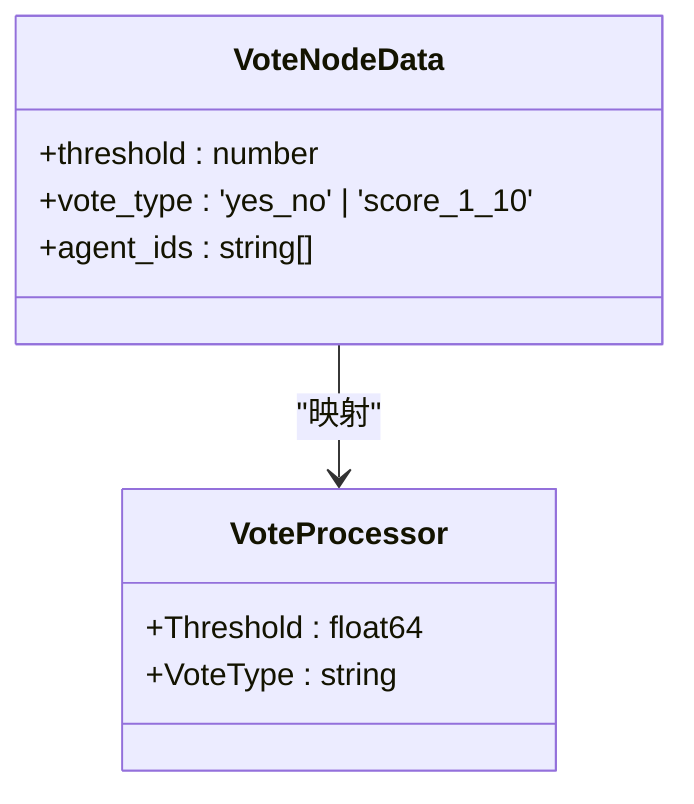
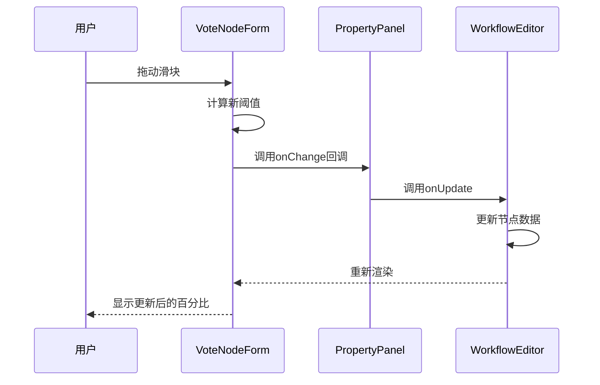
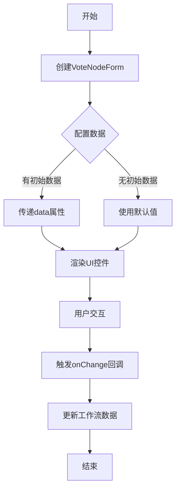

# 前端投票节点配置

<cite>
**本文档引用文件**  
- [VoteNodeForm.tsx](file://frontend/src/features/editor/components/PropertyPanel/NodeForms/VoteNodeForm.tsx)
- [workflow.ts](file://frontend/src/types/workflow.ts)
- [PropertyPanel.tsx](file://frontend/src/features/editor/components/PropertyPanel/PropertyPanel.tsx)
- [WorkflowEditor.tsx](file://frontend/src/features/editor/WorkflowEditor.tsx)
- [CustomNodes.tsx](file://frontend/src/components/workflow/nodes/CustomNodes.tsx)
- [BaseNode.tsx](file://frontend/src/components/workflow/nodes/BaseNode.tsx)
- [vote.go](file://internal/core/workflow/nodes/vote.go)
- [vote_test.go](file://internal/core/workflow/nodes/vote_test.go)
</cite>

## 目录
1. [简介](#简介)
2. [UI设计与交互逻辑](#ui设计与交互逻辑)
3. [数据结构与类型定义](#数据结构与类型定义)
4. [onChange回调机制](#onchange回调机制)
5. [样式与用户体验设计](#样式与用户体验设计)
6. [参与者选择功能](#参与者选择功能)
7. [代码示例与最佳实践](#代码示例与最佳实践)
8. [结论](#结论)

## 简介
VoteNodeForm组件是工作流编辑器中的关键配置界面，用于设置投票节点的审批阈值和投票类型。该组件提供直观的UI控件，允许用户通过滑块和按钮选择来配置投票规则，并将配置结果通过回调函数同步到工作流节点数据中。

**Section sources**
- [VoteNodeForm.tsx](file://frontend/src/features/editor/components/PropertyPanel/NodeForms/VoteNodeForm.tsx)

## UI设计与交互逻辑

### 审批阈值滑块
组件包含一个范围滑块，允许用户在50%到100%之间调节审批阈值。滑块的最小值为50，最大值为100，步长为5，确保用户只能选择预定义的百分比值。滑块上方实时显示当前选中的百分比值，采用等宽字体呈现，增强数据可读性。

滑块的视觉设计采用琥珀色主题，通过`accent-amber-500`类设置滑块的强调色，与整体UI风格保持一致。当用户拖动滑块时，组件会立即响应并更新显示的百分比值，提供即时反馈。

### 投票类型选择按钮
组件提供两个并排的按钮，用于选择投票类型：
- **Yes/No模式**：二元投票，结果为通过或不通过
- **1-10分制模式**：评分制投票，允许更细致的评估

选中状态的按钮通过琥珀色背景和边框突出显示，未选中状态则显示为中性灰色。按钮具有悬停效果，提升交互体验。点击任一按钮会触发相应的onChange回调，更新投票类型配置。

**Section sources**
- [VoteNodeForm.tsx](file://frontend/src/features/editor/components/PropertyPanel/NodeForms/VoteNodeForm.tsx)

## 数据结构与类型定义

### VoteNodeData接口
投票节点的数据结构由`VoteNodeData`接口定义，包含以下关键属性：

| 属性 | 类型 | 描述 |
|------|------|------|
| threshold | number | 审批阈值（0.5-1.0） |
| vote_type | 'yes_no' \| 'score_1_10' | 投票类型 |
| agent_ids | string[] | 参与投票的代理ID数组 |

该接口继承自`BaseNodeData`，确保所有节点类型具有统一的基础属性结构。

### 后端处理器
后端`VoteProcessor`结构体包含`Threshold`和`VoteType`字段，与前端数据结构对应。处理器根据配置的阈值和投票类型执行投票决策逻辑，计算通过率并返回审批结果。



**Diagram sources**
- [workflow.ts](file://frontend/src/types/workflow.ts)
- [vote.go](file://internal/core/workflow/nodes/vote.go)

**Section sources**
- [workflow.ts](file://frontend/src/types/workflow.ts)
- [vote.go](file://internal/core/workflow/nodes/vote.go)

## onChange回调机制

### 回调函数签名
组件通过`onChange`回调函数将用户配置同步到工作流节点数据中。回调函数接收`Partial<VoteNodeData>`类型的参数，允许只更新部分字段而无需提供完整对象。

```typescript
onChange: (data: Partial<VoteNodeData>) => void
```

### 事件处理流程
当用户与UI控件交互时，组件会触发相应的事件处理器：

1. **滑块变化事件**：`onChange={(e) => onChange({ threshold: parseInt(e.target.value) / 100 })}`
   - 将滑块的整数值转换为0-1范围的浮点数
   - 通过回调函数更新阈值配置

2. **按钮点击事件**：`onClick={() => onChange({ vote_type: 'yes_no' })}`
   - 直接传递投票类型值
   - 触发状态更新

这些事件处理器确保用户操作能够立即反映在工作流数据中，实现双向数据绑定的效果。



**Diagram sources**
- [VoteNodeForm.tsx](file://frontend/src/features/editor/components/PropertyPanel/NodeForms/VoteNodeForm.tsx)
- [PropertyPanel.tsx](file://frontend/src/features/editor/components/PropertyPanel/PropertyPanel.tsx)
- [WorkflowEditor.tsx](file://frontend/src/features/editor/WorkflowEditor.tsx)

**Section sources**
- [VoteNodeForm.tsx](file://frontend/src/features/editor/components/PropertyPanel/NodeForms/VoteNodeForm.tsx)

## 样式与用户体验设计

### 琥珀色主题
组件采用琥珀色（amber）作为主色调，通过Tailwind CSS的`bg-amber-50`、`border-amber-200`和`text-amber-700`等类实现。选中状态的按钮使用深色变体`dark:bg-amber-900/20`和`dark:border-amber-800`，确保在暗色主题下也有良好的可读性。

### 响应式布局
组件使用Flexbox布局实现响应式设计：
- `flex gap-2`确保按钮间距一致
- `flex-1`使按钮均匀分配可用空间
- `w-full`确保滑块占据容器的全部宽度

这种布局在不同屏幕尺寸下都能保持良好的视觉效果。

### 实时反馈
组件提供多种实时反馈机制：
- 滑块上方实时显示百分比值
- 按钮点击后立即更新视觉状态
- 使用`transition-colors`类实现平滑的颜色过渡动画

这些设计元素共同提升了用户体验，使用户能够直观地理解当前配置状态。

**Section sources**
- [VoteNodeForm.tsx](file://frontend/src/features/editor/components/PropertyPanel/NodeForms/VoteNodeForm.tsx)
- [tailwind.config.js](file://frontend/tailwind.config.js)

## 参与者选择功能

### 占位设计
当前版本中，参与者选择功能以占位符形式存在。组件包含一个虚线边框的容器，显示"Agent selection coming soon"的提示文本。该设计采用`border-dashed`和`text-gray-400`类，明确标识此功能尚未实现。

### 未来扩展方向
根据数据结构定义，未来实现应包含以下特性：
- 多选下拉框或标签输入组件
- 代理搜索和过滤功能
- 参与者预览和统计信息
- 权重分配选项（不同代理可能具有不同投票权重）

扩展实现应遵循与其他表单组件一致的设计模式，确保UI一致性。

**Section sources**
- [VoteNodeForm.tsx](file://frontend/src/features/editor/components/PropertyPanel/NodeForms/VoteNodeForm.tsx)
- [workflow.ts](file://frontend/src/types/workflow.ts)

## 代码示例与最佳实践

### 基本使用示例


**Diagram sources**
- [VoteNodeForm.tsx](file://frontend/src/features/editor/components/PropertyPanel/NodeForms/VoteNodeForm.tsx)

### 最佳实践
1. **数据验证**：确保阈值在0.5-1.0范围内
2. **默认值处理**：为未设置的字段提供合理的默认值
3. **性能优化**：避免不必要的重新渲染
4. **可访问性**：确保控件对键盘和屏幕阅读器友好
5. **国际化**：支持多语言界面

### 集成模式
VoteNodeForm通过PropertyPanel集成到工作流编辑器中。当用户选择投票节点时，PropertyPanel会渲染VoteNodeForm并传递节点数据和更新回调函数，形成完整的配置工作流。

**Section sources**
- [VoteNodeForm.tsx](file://frontend/src/features/editor/components/PropertyPanel/NodeForms/VoteNodeForm.tsx)
- [PropertyPanel.tsx](file://frontend/src/features/editor/components/PropertyPanel/PropertyPanel.tsx)

## 结论
VoteNodeForm组件通过直观的UI设计和高效的回调机制，实现了投票节点配置的核心功能。其琥珀色主题和响应式布局提供了良好的用户体验，而清晰的数据结构和事件处理流程确保了前后端的无缝集成。未来可通过实现参与者选择功能进一步增强组件的实用性。