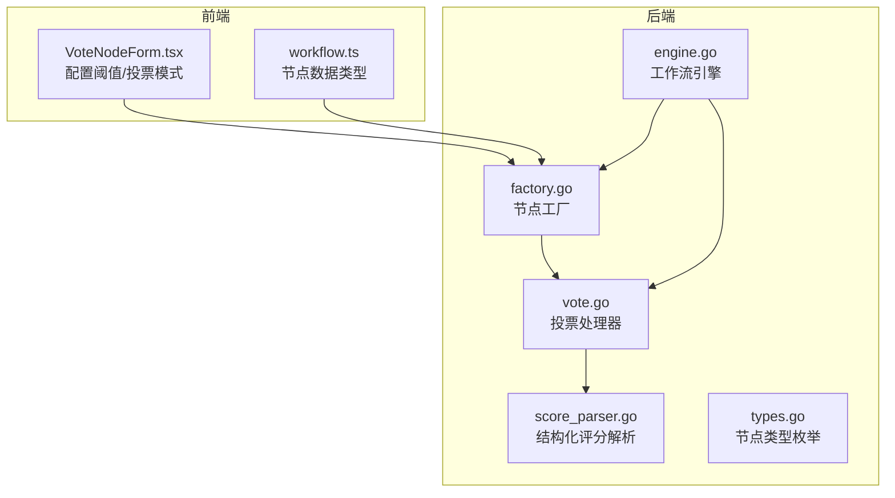
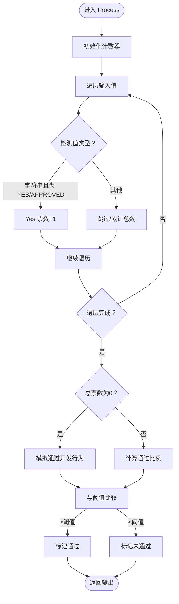
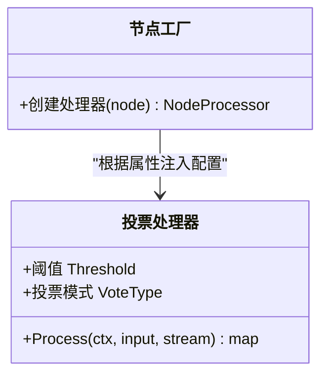
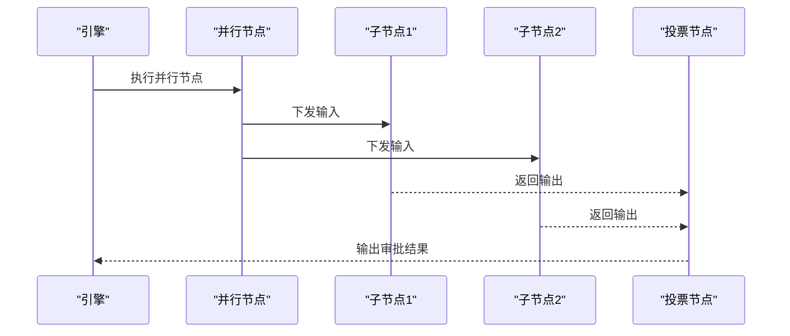
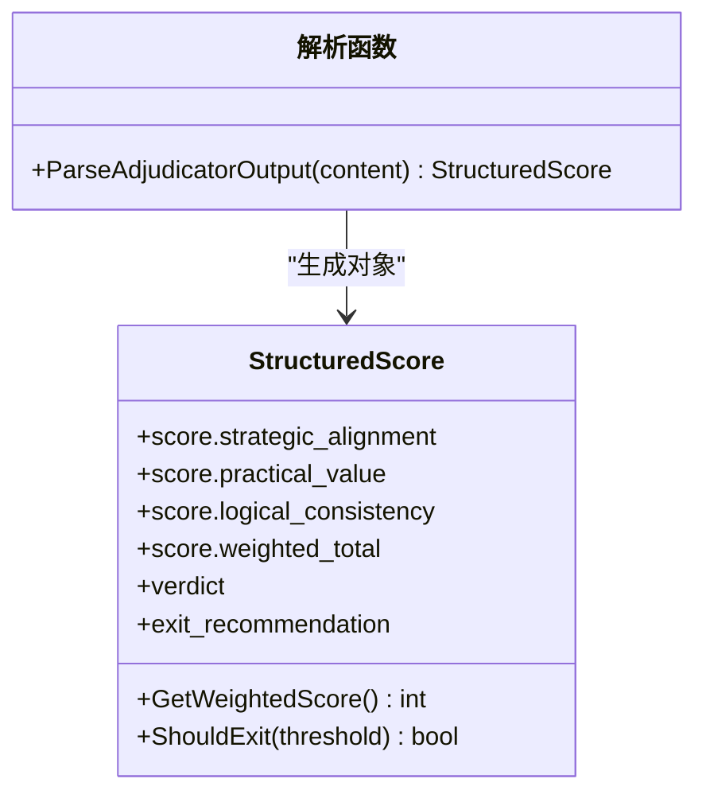
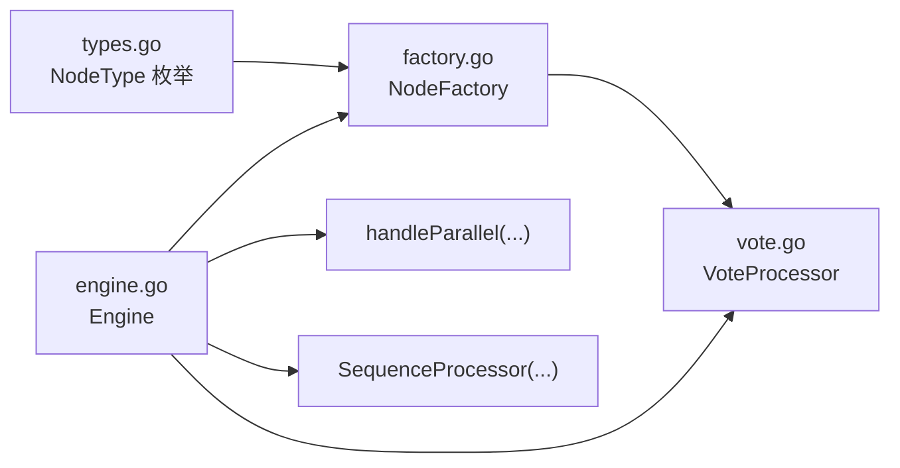

# 投票决策节点

<cite>
**本文引用的文件**
- [SPEC-402 投票处理器.md](file://docs/specs/backend/SPEC-402-vote-processor.md)
- [投票处理器实现 vote.go](file://internal/core/workflow/nodes/vote.go)
- [投票处理器测试 vote_test.go](file://internal/core/workflow/nodes/vote_test.go)
- [节点工厂 factory.go](file://internal/core/workflow/nodes/factory.go)
- [工作流引擎 engine.go](file://internal/core/workflow/engine.go)
- [工作流类型 types.go](file://internal/core/workflow/types.go)
- [前端投票节点表单 VoteNodeForm.tsx](file://frontend/src/features/editor/components/PropertyPanel/NodeForms/VoteNodeForm.tsx)
- [前端工作流类型定义 workflow.ts](file://frontend/src/types/workflow.ts)
- [序列处理器实现（用于对比）](file://docs/tdd/02_core/01_workflow_engine.md)
- [结构化评分解析 score_parser.go](file://internal/core/workflow/nodes/score_parser.go)
- [结构化评分解析测试 score_parser_test.go](file://internal/core/workflow/nodes/score_parser_test.go)
</cite>

## 目录
1. [引言](#引言)
2. [项目结构](#项目结构)
3. [核心组件](#核心组件)
4. [架构总览](#架构总览)
5. [详细组件分析](#详细组件分析)
6. [依赖关系分析](#依赖关系分析)
7. [性能考量](#性能考量)
8. [故障排查指南](#故障排查指南)
9. [结论](#结论)
10. [附录](#附录)

## 引言
本文件围绕 SPEC-402 规范，系统性讲解“投票处理器（Vote Processor）”的设计原理与表决算法实现。重点包括：
- 如何收集多个智能体对同一命题的评分输出；
- 利用结构化评分解析工具（score_parser.go）进行标准化解析；
- 通过多数决策略或加权平均策略生成最终结论；
- 在多路径分支控制中的作用（并行/串行）；
- 前端 VoteNodeForm.tsx 提供的阈值设置、投票模式（Yes/No 或 1-10 分）配置；
- 异常处理机制（评分格式不合法时的容错恢复）；
- 性能瓶颈分析（如高并发投票延迟）。

## 项目结构
投票处理器位于后端工作流引擎的节点层，由节点工厂根据工作流图动态创建；前端提供属性面板用于配置阈值与投票模式；结构化评分解析模块为后续循环/评审等节点提供统一的数据模型。



图表来源
- [节点工厂 factory.go](file://internal/core/workflow/nodes/factory.go#L62-L68)
- [投票处理器实现 vote.go](file://internal/core/workflow/nodes/vote.go#L10-L13)
- [工作流引擎 engine.go](file://internal/core/workflow/engine.go#L86-L101)
- [前端投票节点表单 VoteNodeForm.tsx](file://frontend/src/features/editor/components/PropertyPanel/NodeForms/VoteNodeForm.tsx#L1-L62)
- [前端工作流类型定义 workflow.ts](file://frontend/src/types/workflow.ts#L15-L19)
- [工作流类型 types.go](file://internal/core/workflow/types.go#L25-L41)

章节来源
- [节点工厂 factory.go](file://internal/core/workflow/nodes/factory.go#L62-L68)
- [投票处理器实现 vote.go](file://internal/core/workflow/nodes/vote.go#L10-L13)
- [工作流引擎 engine.go](file://internal/core/workflow/engine.go#L86-L101)
- [前端投票节点表单 VoteNodeForm.tsx](file://frontend/src/features/editor/components/PropertyPanel/NodeForms/VoteNodeForm.tsx#L1-L62)
- [前端工作流类型定义 workflow.ts](file://frontend/src/types/workflow.ts#L15-L19)
- [工作流类型 types.go](file://internal/core/workflow/types.go#L25-L41)

## 核心组件
- 投票处理器（VoteProcessor）
  - 负责接收上游节点输出，计算多数/阈值通过与否，并输出审批结果、统计信息。
  - 支持两种投票模式：Yes/No 与 1-10 分评分。
- 节点工厂（NodeFactory）
  - 根据节点类型与属性创建具体处理器实例（含阈值、投票模式等配置）。
- 工作流引擎（Engine）
  - 协调节点执行，支持并行分支与串行分支；在并行节点处分发相同输入到各分支。
- 结构化评分解析（StructuredScore）
  - 解析 Adjudicator 的结构化评分输出，支持加权总分与退出建议。
- 前端投票节点表单（VoteNodeForm）
  - 提供阈值滑块与投票模式选择（Yes/No / 1-10 分），并预留参与者选择占位。

章节来源
- [投票处理器实现 vote.go](file://internal/core/workflow/nodes/vote.go#L10-L13)
- [节点工厂 factory.go](file://internal/core/workflow/nodes/factory.go#L62-L68)
- [工作流引擎 engine.go](file://internal/core/workflow/engine.go#L141-L159)
- [结构化评分解析 score_parser.go](file://internal/core/workflow/nodes/score_parser.go#L9-L21)
- [前端投票节点表单 VoteNodeForm.tsx](file://frontend/src/features/editor/components/PropertyPanel/NodeForms/VoteNodeForm.tsx#L1-L62)

## 架构总览
投票处理器在工作流中通常位于并行分支汇聚之后，用于对多个智能体的输出进行聚合与判定。并行节点会将相同输入同时下发给多个下游节点；投票节点汇总这些输出，依据阈值规则给出最终结论。

```mermaid
sequenceDiagram
participant Engine as "工作流引擎"
participant Par as "并行节点"
participant A1 as "智能体A"
participant A2 as "智能体B"
participant V as "投票处理器"
Engine->>Par : 执行并行节点
Par->>A1 : 下发相同输入
Par->>A2 : 下发相同输入
A1-->>V : 返回投票/评分结果
A2-->>V : 返回投票/评分结果
V->>V : 聚合结果并计算阈值
V-->>Engine : 输出审批结果与统计
```

图表来源
- [工作流引擎 engine.go](file://internal/core/workflow/engine.go#L141-L159)
- [投票处理器实现 vote.go](file://internal/core/workflow/nodes/vote.go#L15-L69)

## 详细组件分析

### 投票处理器（VoteProcessor）
- 输入与输出
  - 输入：来自上游节点（通常是并行分支）的多条输出（字符串“YES/NO/Approved”或结构化评分）。
  - 输出：审批通过与否、Yes 票数、总票数、通过比例、时间戳等。
- 投票算法
  - Yes/No 模式：统计 Yes 票占比，与阈值比较决定是否通过。
  - 1-10 分模式：可扩展为对分数进行加权平均或阈值判定（当前实现以 Yes/No 为主）。
- 并发与流事件
  - 使用流通道推送节点状态变更事件（running/completed），便于前端与监控系统感知。
- 容错与空输入
  - 当输入为空时，模拟通过（开发阶段行为），避免阻塞流程。



图表来源
- [投票处理器实现 vote.go](file://internal/core/workflow/nodes/vote.go#L15-L69)
- [投票处理器测试 vote_test.go](file://internal/core/workflow/nodes/vote_test.go#L10-L45)

章节来源
- [投票处理器实现 vote.go](file://internal/core/workflow/nodes/vote.go#L15-L69)
- [投票处理器测试 vote_test.go](file://internal/core/workflow/nodes/vote_test.go#L10-L45)

### 节点工厂与配置注入
- 节点工厂根据节点类型创建处理器，并从节点属性读取阈值与投票模式，注入到 VoteProcessor。
- 这使得前端表单配置直接映射到运行时行为。



图表来源
- [节点工厂 factory.go](file://internal/core/workflow/nodes/factory.go#L62-L68)

章节来源
- [节点工厂 factory.go](file://internal/core/workflow/nodes/factory.go#L62-L68)

### 工作流引擎与分支控制
- 并行分支（Parallel）
  - 将相同输入同时下发给所有下游节点，适合并行收集多个智能体的输出。
- 串行分支（Sequence）
  - 按顺序依次执行子节点，适合需要前序节点输出作为后序输入的场景。
- 投票节点位置
  - 通常置于并行分支汇聚点，对多源输出进行聚合与判定。



图表来源
- [工作流引擎 engine.go](file://internal/core/workflow/engine.go#L141-L159)
- [序列处理器实现（用于对比）](file://docs/tdd/02_core/01_workflow_engine.md#L199-L233)

章节来源
- [工作流引擎 engine.go](file://internal/core/workflow/engine.go#L141-L159)
- [序列处理器实现（用于对比）](file://docs/tdd/02_core/01_workflow_engine.md#L199-L233)

### 结构化评分解析（与投票的关系）
- 评分解析模块用于从 Adjudicator 输出中提取结构化评分（含加权总分与退出建议），为循环/评审等节点提供统一数据模型。
- 投票处理器若采用 1-10 分模式，可结合该解析模块进行标准化处理与阈值判定。



图表来源
- [结构化评分解析 score_parser.go](file://internal/core/workflow/nodes/score_parser.go#L9-L21)
- [结构化评分解析 score_parser.go](file://internal/core/workflow/nodes/score_parser.go#L22-L38)
- [结构化评分解析 score_parser.go](file://internal/core/workflow/nodes/score_parser.go#L40-L57)

章节来源
- [结构化评分解析 score_parser.go](file://internal/core/workflow/nodes/score_parser.go#L9-L21)
- [结构化评分解析 score_parser.go](file://internal/core/workflow/nodes/score_parser.go#L22-L38)
- [结构化评分解析 score_parser.go](file://internal/core/workflow/nodes/score_parser.go#L40-L57)
- [结构化评分解析测试 score_parser_test.go](file://internal/core/workflow/nodes/score_parser_test.go#L1-L102)

### 前端配置：阈值与投票模式
- 阈值设置
  - 提供 50%-100% 的滑块配置，实时显示百分比。
- 投票模式
  - Yes/No 与 1-10 分两种模式切换。
- 参与者选择
  - 表单中提供占位提示，后续可接入智能体选择组件。

章节来源
- [前端投票节点表单 VoteNodeForm.tsx](file://frontend/src/features/editor/components/PropertyPanel/NodeForms/VoteNodeForm.tsx#L1-L62)
- [前端工作流类型定义 workflow.ts](file://frontend/src/types/workflow.ts#L15-L19)

## 依赖关系分析
- 节点类型与处理器映射
  - NodeTypeVote 对应 VoteProcessor，由节点工厂创建并注入阈值与投票模式。
- 引擎与处理器交互
  - 引擎通过 NodeFactory 获取处理器实例，执行 Process 并处理中间件与错误。
- 并行/串行控制
  - 引擎在执行节点时区分 NodeTypeParallel 与 NodeTypeSequence，分别采用并发与顺序策略。



图表来源
- [工作流类型 types.go](file://internal/core/workflow/types.go#L25-L41)
- [节点工厂 factory.go](file://internal/core/workflow/nodes/factory.go#L62-L68)
- [投票处理器实现 vote.go](file://internal/core/workflow/nodes/vote.go#L15-L69)
- [工作流引擎 engine.go](file://internal/core/workflow/engine.go#L141-L159)
- [序列处理器实现（用于对比）](file://docs/tdd/02_core/01_workflow_engine.md#L199-L233)

章节来源
- [工作流类型 types.go](file://internal/core/workflow/types.go#L25-L41)
- [节点工厂 factory.go](file://internal/core/workflow/nodes/factory.go#L62-L68)
- [投票处理器实现 vote.go](file://internal/core/workflow/nodes/vote.go#L15-L69)
- [工作流引擎 engine.go](file://internal/core/workflow/engine.go#L141-L159)
- [序列处理器实现（用于对比）](file://docs/tdd/02_core/01_workflow_engine.md#L199-L233)

## 性能考量
- 并发投票延迟
  - 并行分支下，投票节点需等待所有上游智能体完成后再聚合结果。当上游节点数量较多或 LLM 调用耗时较长时，整体延迟上升。
- 流事件与可观测性
  - 通过流通道推送节点状态变化，有助于前端及时反馈与监控；但大量并发节点会产生高频事件，需注意缓冲区与消费端处理能力。
- 缓冲与背压
  - 引擎默认使用带缓冲的流通道，建议在高并发场景下评估缓冲大小与消费速率，避免内存压力。
- 评分解析成本
  - 若采用结构化评分解析，正则匹配与 JSON 解析会带来额外开销；建议在批量解析时合并处理或缓存中间结果。

[本节为通用性能讨论，无需列出具体文件来源]

## 故障排查指南
- 评分格式不合法
  - 结构化评分解析在找不到 JSON 块或 JSON 解析失败时会返回错误。可在上层节点捕获并回退到默认策略或提示重试。
- 投票结果异常
  - 当输入为空时，投票处理器会模拟通过（开发阶段行为）。若生产环境出现异常，检查上游节点是否正确输出。
- 并行分支卡顿
  - 若并行分支中某个子节点阻塞，会导致投票节点迟迟不出结果。可通过中间件与超时机制定位慢节点。
- 阈值设置不当
  - 阈值过高导致无法通过，过低可能导致频繁通过。建议结合业务目标调整阈值并在前端提供可视化提示。

章节来源
- [结构化评分解析 score_parser.go](file://internal/core/workflow/nodes/score_parser.go#L22-L38)
- [投票处理器实现 vote.go](file://internal/core/workflow/nodes/vote.go#L43-L48)

## 结论
- 投票处理器通过多数决策略与阈值控制，为多智能体协同提供统一的决策入口；
- 前端表单将阈值与投票模式配置直接映射到运行时，提升可操作性；
- 结构化评分解析为后续循环/评审等节点提供一致的数据模型；
- 在高并发场景下，需关注并行延迟、流事件频率与解析成本，必要时引入中间件与限流策略。

[本节为总结性内容，无需列出具体文件来源]

## 附录
- 规范参考
  - SPEC-402：投票处理器设计与实现要点
- 相关实现参考
  - 节点类型与处理器映射
  - 并行/串行分支控制
  - 结构化评分解析与阈值判定

章节来源
- [SPEC-402 投票处理器.md](file://docs/specs/backend/SPEC-402-vote-processor.md#L1-L101)
- [工作流类型 types.go](file://internal/core/workflow/types.go#L25-L41)
- [节点工厂 factory.go](file://internal/core/workflow/nodes/factory.go#L62-L68)
- [工作流引擎 engine.go](file://internal/core/workflow/engine.go#L141-L159)
- [结构化评分解析 score_parser.go](file://internal/core/workflow/nodes/score_parser.go#L40-L57)