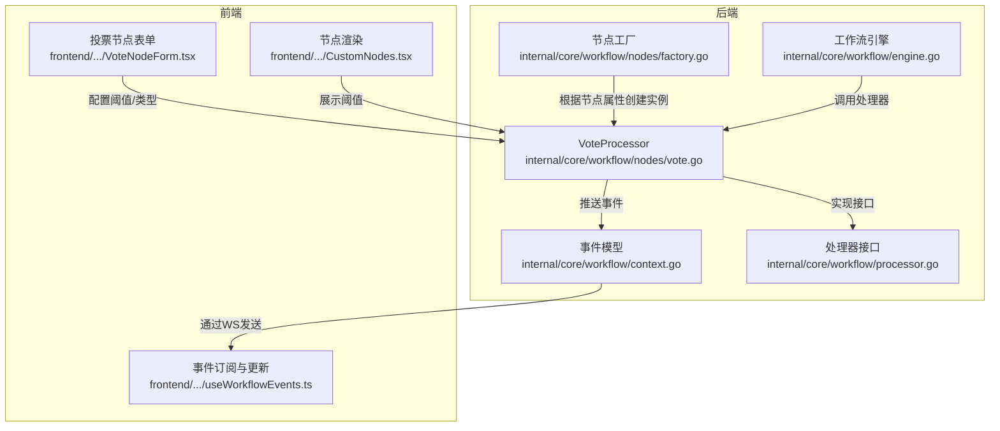
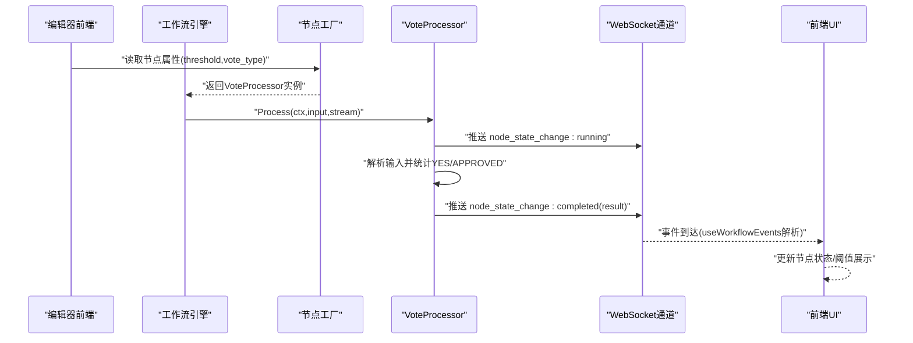
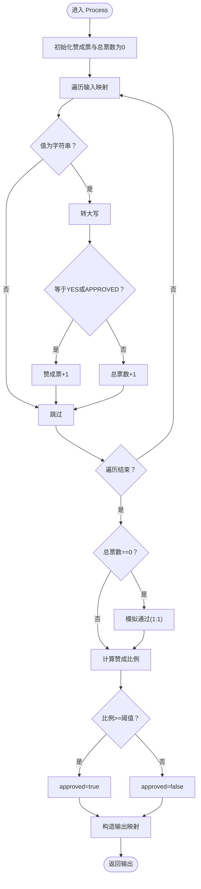
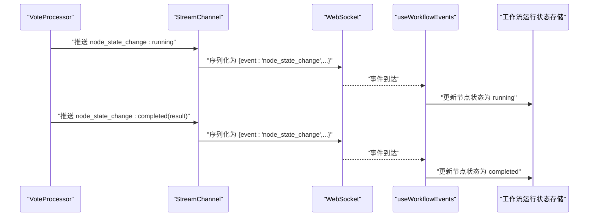
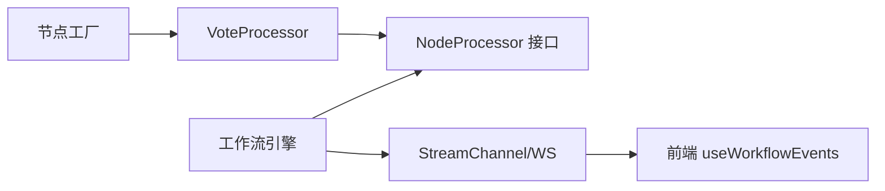

# 投票处理器实现

<cite>
**本文引用的文件**
- [internal/core/workflow/nodes/vote.go](file://internal/core/workflow/nodes/vote.go)
- [internal/core/workflow/nodes/vote_test.go](file://internal/core/workflow/nodes/vote_test.go)
- [internal/core/workflow/nodes/factory.go](file://internal/core/workflow/nodes/factory.go)
- [internal/core/workflow/engine.go](file://internal/core/workflow/engine.go)
- [internal/core/workflow/context.go](file://internal/core/workflow/context.go)
- [internal/core/workflow/processor.go](file://internal/core/workflow/processor.go)
- [frontend/src/features/editor/components/PropertyPanel/NodeForms/VoteNodeForm.tsx](file://frontend/src/features/editor/components/PropertyPanel/NodeForms/VoteNodeForm.tsx)
- [frontend/src/components/workflow/nodes/CustomNodes.tsx](file://frontend/src/components/workflow/nodes/CustomNodes.tsx)
- [frontend/src/hooks/useWorkflowEvents.ts](file://frontend/src/hooks/useWorkflowEvents.ts)
- [docs/specs/backend/SPEC-402-vote-processor.md](file://docs/specs/backend/SPEC-402-vote-processor.md)
</cite>

## 目录
1. [引言](#引言)
2. [项目结构](#项目结构)
3. [核心组件](#核心组件)
4. [架构总览](#架构总览)
5. [详细组件分析](#详细组件分析)
6. [依赖关系分析](#依赖关系分析)
7. [性能考虑](#性能考虑)
8. [故障排查指南](#故障排查指南)
9. [结论](#结论)
10. [附录](#附录)

## 引言
本文件围绕 VoteProcessor 结构体及其 Process 方法展开，系统性讲解其字段含义、输入解析策略、投票统计与通过率计算逻辑，并结合单元测试用例说明典型场景（如 2:1 通过、1:2 不通过、空输入默认通过）。同时，文档阐述该处理器如何通过 StreamEvent 向前端实时推送节点状态变化，以及在类型断言方面的注意事项。最后给出在工作流引擎中集成该处理器的实践建议与流程图示。

## 项目结构
VoteProcessor 属于工作流节点处理器的一部分，位于内部核心模块；前端编辑器与运行时 UI 通过 WebSocket 接收后端推送的节点状态事件，从而实现可视化反馈。

图表来源
- [internal/core/workflow/nodes/vote.go](file://internal/core/workflow/nodes/vote.go#L1-L70)
- [internal/core/workflow/nodes/factory.go](file://internal/core/workflow/nodes/factory.go#L62-L68)
- [internal/core/workflow/engine.go](file://internal/core/workflow/engine.go#L92-L110)
- [internal/core/workflow/context.go](file://internal/core/workflow/context.go#L8-L14)
- [frontend/src/features/editor/components/PropertyPanel/NodeForms/VoteNodeForm.tsx](file://frontend/src/features/editor/components/PropertyPanel/NodeForms/VoteNodeForm.tsx#L1-L50)
- [frontend/src/components/workflow/nodes/CustomNodes.tsx](file://frontend/src/components/workflow/nodes/CustomNodes.tsx#L44-L58)
- [frontend/src/hooks/useWorkflowEvents.ts](file://frontend/src/hooks/useWorkflowEvents.ts#L1-L83)

章节来源
- [internal/core/workflow/nodes/vote.go](file://internal/core/workflow/nodes/vote.go#L1-L70)
- [internal/core/workflow/nodes/factory.go](file://internal/core/workflow/nodes/factory.go#L62-L68)
- [internal/core/workflow/engine.go](file://internal/core/workflow/engine.go#L92-L110)
- [internal/core/workflow/context.go](file://internal/core/workflow/context.go#L8-L14)
- [frontend/src/features/editor/components/PropertyPanel/NodeForms/VoteNodeForm.tsx](file://frontend/src/features/editor/components/PropertyPanel/NodeForms/VoteNodeForm.tsx#L1-L50)
- [frontend/src/components/workflow/nodes/CustomNodes.tsx](file://frontend/src/components/workflow/nodes/CustomNodes.tsx#L44-L58)
- [frontend/src/hooks/useWorkflowEvents.ts](file://frontend/src/hooks/useWorkflowEvents.ts#L1-L83)

## 核心组件
- VoteProcessor 结构体
  - Threshold：通过阈值，用于判断投票是否通过。取值范围通常为 0.5 到 1.0。
  - VoteType：投票类型，支持 “yes_no” 或 “score_1_10”。当前实现中字段存在但尚未在 Process 中使用，实际逻辑仍以字符串 YES/APPROVED 计数。
- Process 方法
  - 发送“节点状态变更”事件，标记为 running。
  - 解析输入映射，扫描字符串值，识别 YES/APPROVED 作为赞成票，计数总票数。
  - 若无有效输入，模拟通过（1:1），便于开发流程。
  - 计算赞成比例并对比阈值，得出是否通过。
  - 发送“节点状态变更”事件，标记为 completed 并附带结果。
  - 返回包含 approved、yes_votes、total_votes、ratio、timestamp 的输出映射。

章节来源
- [internal/core/workflow/nodes/vote.go](file://internal/core/workflow/nodes/vote.go#L10-L13)
- [internal/core/workflow/nodes/vote.go](file://internal/core/workflow/nodes/vote.go#L15-L69)
- [docs/specs/backend/SPEC-402-vote-processor.md](file://docs/specs/backend/SPEC-402-vote-processor.md#L9-L23)

## 架构总览
VoteProcessor 通过工作流引擎的工厂函数被动态创建，引擎在执行节点时调用其 Process 方法，并将事件推送到全局的 StreamChannel。前端通过 WebSocket 订阅事件，使用 useWorkflowEvents 钩子解析并更新 UI 状态。

图表来源
- [internal/core/workflow/nodes/factory.go](file://internal/core/workflow/nodes/factory.go#L62-L68)
- [internal/core/workflow/engine.go](file://internal/core/workflow/engine.go#L92-L110)
- [internal/core/workflow/nodes/vote.go](file://internal/core/workflow/nodes/vote.go#L15-L69)
- [internal/core/workflow/context.go](file://internal/core/workflow/context.go#L8-L14)
- [frontend/src/hooks/useWorkflowEvents.ts](file://frontend/src/hooks/useWorkflowEvents.ts#L1-L83)

## 详细组件分析

### VoteProcessor 字段与职责
- Threshold
  - 作用：决定赞成票占比是否达到通过门槛。
  - 默认值：单元测试中使用 0.6；前端表单默认阈值为 0.67。
- VoteType
  - 作用：指示投票模式（yes_no/score_1_10）。当前实现未按该字段分支逻辑，仍以字符串 YES/APPROVED 进行计数。
  - 规范参考：规格文档定义了该字段及投票结果结构，未来可扩展为分数计分模式。

章节来源
- [internal/core/workflow/nodes/vote.go](file://internal/core/workflow/nodes/vote.go#L10-L13)
- [docs/specs/backend/SPEC-402-vote-processor.md](file://docs/specs/backend/SPEC-402-vote-processor.md#L9-L23)
- [frontend/src/features/editor/components/PropertyPanel/NodeForms/VoteNodeForm.tsx](file://frontend/src/features/editor/components/PropertyPanel/NodeForms/VoteNodeForm.tsx#L1-L50)

### Process 方法流程与算法
- 输入解析
  - 遍历输入映射的所有值，尝试进行字符串断言；若值为字符串且等于 YES 或 APPROVED，则计为赞成票。
  - 总票数按字符串值出现次数累加。
- 空输入处理
  - 当没有有效字符串输入时，模拟通过（1:1），避免节点直接失败，保证开发流程顺畅。
- 通过率与决策
  - 计算赞成比例 = 赞成票 / 总票数。
  - 若比例大于等于阈值，则 approved 为真，否则为假。
- 输出
  - 返回包含 approved、yes_votes、total_votes、ratio、timestamp 的映射，供下游节点使用。

图表来源
- [internal/core/workflow/nodes/vote.go](file://internal/core/workflow/nodes/vote.go#L15-L69)

章节来源
- [internal/core/workflow/nodes/vote.go](file://internal/core/workflow/nodes/vote.go#L15-L69)

### 单元测试场景与行为验证
- 2:1 通过（2 YES，1 NO）
  - 比例约为 0.66，大于阈值 0.6，应批准通过。
- 1:2 不通过（1 YES，2 NO）
  - 比例约为 0.33，小于阈值 0.6，不应批准通过。
- 空输入默认通过
  - 无有效字符串输入时，模拟通过（1:1），确保节点不会因空输入而失败。

章节来源
- [internal/core/workflow/nodes/vote_test.go](file://internal/core/workflow/nodes/vote_test.go#L10-L45)

### 实时事件推送与前端集成
- 事件类型
  - VoteProcessor 在开始与结束时推送 “node_state_change” 事件，携带 status 和 result。
- 事件结构
  - 事件包含 event、timestamp、node_id、data 等字段；其中 data 包含状态与结果。
- 前端解析
  - 前端钩子 useWorkflowEvents 根据 event 类型更新节点状态，例如 running/completed/failed，并维护活动节点集合。
- 类型断言注意事项
  - 前端对 lastMessage 进行类型断言或安全解析，确保 event 与 data 字段存在后再进行后续处理，避免运行时错误。

图表来源
- [internal/core/workflow/nodes/vote.go](file://internal/core/workflow/nodes/vote.go#L15-L69)
- [internal/core/workflow/context.go](file://internal/core/workflow/context.go#L8-L14)
- [frontend/src/hooks/useWorkflowEvents.ts](file://frontend/src/hooks/useWorkflowEvents.ts#L1-L83)

章节来源
- [internal/core/workflow/nodes/vote.go](file://internal/core/workflow/nodes/vote.go#L15-L69)
- [internal/core/workflow/context.go](file://internal/core/workflow/context.go#L8-L14)
- [frontend/src/hooks/useWorkflowEvents.ts](file://frontend/src/hooks/useWorkflowEvents.ts#L1-L83)

### 工作流引擎集成要点
- 节点工厂
  - 工厂根据节点类型创建 VoteProcessor，并从节点属性读取 threshold 与 vote_type。
- 引擎执行
  - 引擎调用处理器的 Process 方法，传入上下文、上游输出与事件通道；处理器负责推送事件与返回输出。
- 中间件与状态管理
  - 引擎在处理器前后执行中间件钩子，更新节点状态并在错误时发出错误事件。

章节来源
- [internal/core/workflow/nodes/factory.go](file://internal/core/workflow/nodes/factory.go#L62-L68)
- [internal/core/workflow/engine.go](file://internal/core/workflow/engine.go#L92-L110)
- [internal/core/workflow/processor.go](file://internal/core/workflow/processor.go#L7-L14)

## 依赖关系分析
- 内聚与耦合
  - VoteProcessor 与工作流引擎通过 NodeProcessor 接口解耦；与前端通过 StreamEvent 事件契约解耦。
  - 与前端的耦合体现在事件字段名约定（event、data、node_id），需保持前后端一致。
- 外部依赖
  - 事件通道依赖 WebSocket 传输；前端依赖 useWorkflowEvents 钩子解析事件。
- 循环依赖
  - 未发现循环依赖迹象。

图表来源
- [internal/core/workflow/nodes/factory.go](file://internal/core/workflow/nodes/factory.go#L62-L68)
- [internal/core/workflow/engine.go](file://internal/core/workflow/engine.go#L92-L110)
- [internal/core/workflow/processor.go](file://internal/core/workflow/processor.go#L7-L14)
- [internal/core/workflow/context.go](file://internal/core/workflow/context.go#L8-L14)
- [frontend/src/hooks/useWorkflowEvents.ts](file://frontend/src/hooks/useWorkflowEvents.ts#L1-L83)

章节来源
- [internal/core/workflow/nodes/factory.go](file://internal/core/workflow/nodes/factory.go#L62-L68)
- [internal/core/workflow/engine.go](file://internal/core/workflow/engine.go#L92-L110)
- [internal/core/workflow/processor.go](file://internal/core/workflow/processor.go#L7-L14)
- [internal/core/workflow/context.go](file://internal/core/workflow/context.go#L8-L14)
- [frontend/src/hooks/useWorkflowEvents.ts](file://frontend/src/hooks/useWorkflowEvents.ts#L1-L83)

## 性能考虑
- 时间复杂度
  - Process 对输入映射进行一次线性扫描，时间复杂度 O(N)，N 为输入键值对数量。
- 空输入优化
  - 当无有效输入时，采用 1:1 模拟通过，避免额外 IO 与复杂逻辑。
- 事件推送
  - 事件通道使用缓冲队列，减少阻塞风险；前端批量消费事件，避免 UI 卡顿。

[本节为通用性能讨论，无需列出具体文件来源]

## 故障排查指南
- 事件字段不匹配
  - 现象：前端无法识别事件。
  - 原因：事件字段名与前端期望不一致（例如 event vs type）。
  - 处理：检查事件结构定义与前端解析逻辑，确保字段名一致。
- 类型断言错误
  - 现象：前端解析 lastMessage 时报错。
  - 原因：未进行类型断言或字段缺失。
  - 处理：在前端对消息进行安全断言与字段校验，确保 event 与 data 存在且类型正确。
- 投票结果不符合预期
  - 现象：通过比例与阈值不一致。
  - 原因：输入中非字符串值未被计入；或输入键值未包含 YES/APPROVED。
  - 处理：确认上游节点输出格式，确保包含明确的 YES/APPROVED 字符串。

章节来源
- [internal/core/workflow/context.go](file://internal/core/workflow/context.go#L8-L14)
- [frontend/src/hooks/useWorkflowEvents.ts](file://frontend/src/hooks/useWorkflowEvents.ts#L1-L83)
- [internal/core/workflow/nodes/vote.go](file://internal/core/workflow/nodes/vote.go#L15-L69)

## 结论
VoteProcessor 提供了简洁高效的投票决策能力：以阈值驱动的 YES/APPROVED 计数，辅以空输入的容错模拟，满足大多数工作流场景下的快速决策需求。通过 StreamEvent 与前端事件钩子的配合，实现了节点状态的实时可视化。未来可基于 VoteType 字段扩展为分数计分模式，并完善对 abstain 的处理与更丰富的统计维度。

[本节为总结性内容，无需列出具体文件来源]

## 附录

### 前端节点配置与展示
- 投票节点表单允许设置阈值与投票类型，阈值以百分比形式呈现。
- 节点渲染组件展示当前阈值，便于用户直观感知。

章节来源
- [frontend/src/features/editor/components/PropertyPanel/NodeForms/VoteNodeForm.tsx](file://frontend/src/features/editor/components/PropertyPanel/NodeForms/VoteNodeForm.tsx#L1-L50)
- [frontend/src/components/workflow/nodes/CustomNodes.tsx](file://frontend/src/components/workflow/nodes/CustomNodes.tsx#L44-L58)

### 工作流引擎集成步骤（示例）
- 在节点属性中设置 threshold 与 vote_type。
- 引擎通过工厂创建 VoteProcessor 实例。
- 引擎调用 Process，处理器推送事件并返回输出。
- 前端 useWorkflowEvents 解析事件并更新 UI。

章节来源
- [internal/core/workflow/nodes/factory.go](file://internal/core/workflow/nodes/factory.go#L62-L68)
- [internal/core/workflow/engine.go](file://internal/core/workflow/engine.go#L92-L110)
- [internal/core/workflow/nodes/vote.go](file://internal/core/workflow/nodes/vote.go#L15-L69)
- [frontend/src/hooks/useWorkflowEvents.ts](file://frontend/src/hooks/useWorkflowEvents.ts#L1-L83)