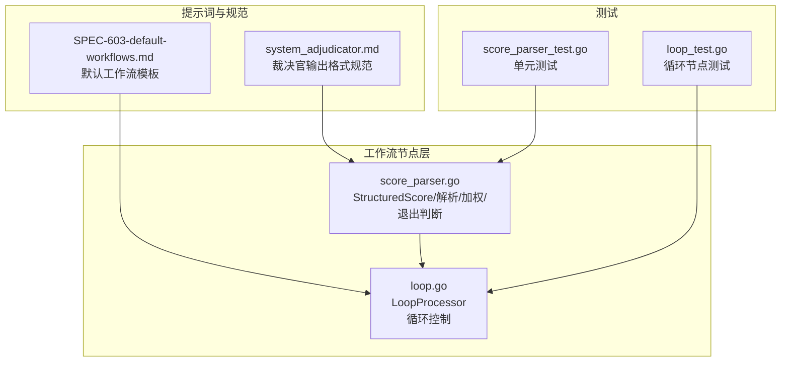
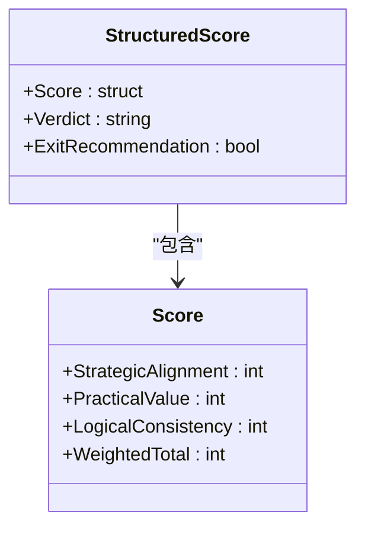
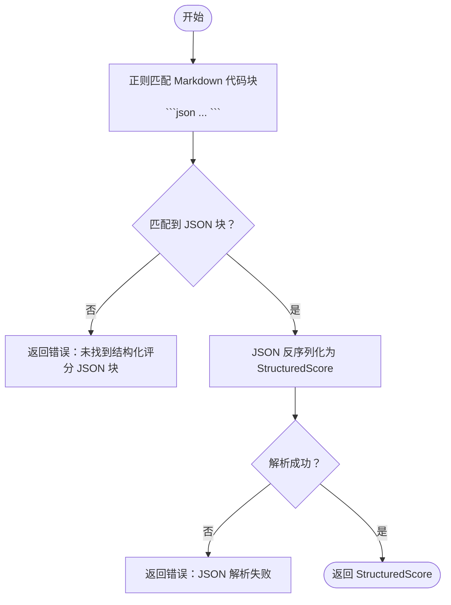
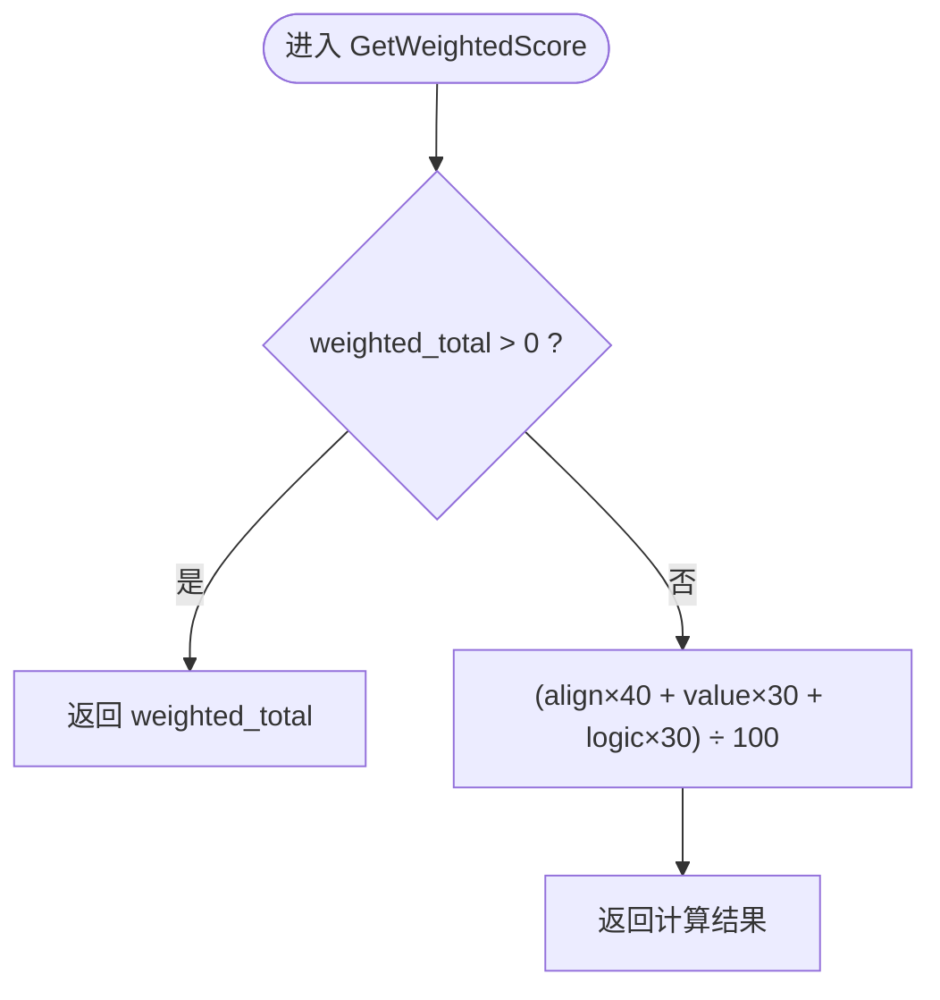
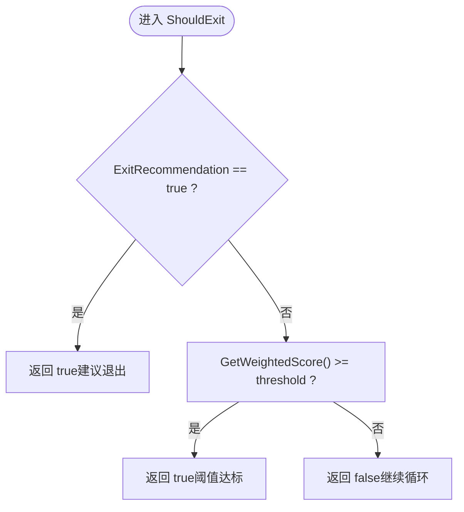
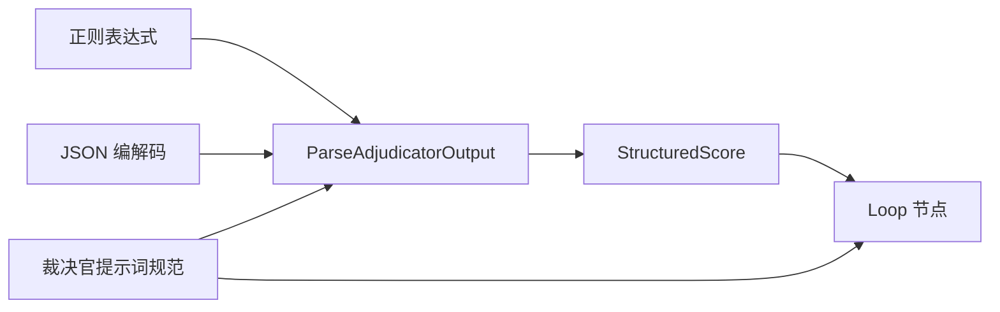

# 评分解析器

<cite>
**本文引用的文件**
- [score_parser.go](file://internal/core/workflow/nodes/score_parser.go)
- [score_parser_test.go](file://internal/core/workflow/nodes/score_parser_test.go)
- [system_adjudicator.md](file://internal/resources/prompts/system_adjudicator.md)
- [SPEC-603-default-workflows.md](file://docs/specs/sprint6/SPEC-603-default-workflows.md)
- [loop.go](file://internal/core/workflow/nodes/loop.go)
- [loop_test.go](file://internal/core/workflow/nodes/loop_test.go)
</cite>

## 目录
1. [简介](#简介)
2. [项目结构](#项目结构)
3. [核心组件](#核心组件)
4. [架构概览](#架构概览)
5. [详细组件分析](#详细组件分析)
6. [依赖关系分析](#依赖关系分析)
7. [性能考虑](#性能考虑)
8. [故障排查指南](#故障排查指南)
9. [结论](#结论)

## 简介
本文件围绕评分解析器模块，系统阐述 StructuredScore 结构体的字段语义（战略对齐、实际价值、逻辑一致性等），详解 ParseAdjudicatorOutput 函数如何利用正则表达式从 LLM 返回的 Markdown 文本中提取 JSON 格式的评分数据，并深入解析 GetWeightedScore 方法的加权计算逻辑（40%+30%+30%）与 ShouldExit 决策机制。同时，结合实际示例展示从原始 LLM 输出到结构化评分的完整解析流程，覆盖错误处理（如 JSON 块缺失）与数据验证要点，帮助读者快速理解并正确使用该模块。

## 项目结构
评分解析器位于工作流节点层，服务于“优化循环”工作流模板，负责将裁决官（Adjudicator）的结构化评分输出转换为引擎可消费的数据模型，从而驱动循环退出条件。



图表来源
- [score_parser.go](file://internal/core/workflow/nodes/score_parser.go#L1-L56)
- [system_adjudicator.md](file://internal/resources/prompts/system_adjudicator.md#L90-L105)
- [SPEC-603-default-workflows.md](file://docs/specs/sprint6/SPEC-603-default-workflows.md#L117-L126)
- [loop.go](file://internal/core/workflow/nodes/loop.go#L1-L66)
- [score_parser_test.go](file://internal/core/workflow/nodes/score_parser_test.go#L1-L102)
- [loop_test.go](file://internal/core/workflow/nodes/loop_test.go#L1-L44)

章节来源
- [score_parser.go](file://internal/core/workflow/nodes/score_parser.go#L1-L56)
- [system_adjudicator.md](file://internal/resources/prompts/system_adjudicator.md#L90-L105)
- [SPEC-603-default-workflows.md](file://docs/specs/sprint6/SPEC-603-default-workflows.md#L117-L126)

## 核心组件
- StructuredScore：承载裁决官输出的结构化评分数据，供工作流引擎驱动循环退出条件。
- ParseAdjudicatorOutput：从 LLM 的 Markdown 文本中提取 JSON 评分块并反序列化为 StructuredScore。
- GetWeightedScore：优先使用显式加权总分，否则按 40%/30%/30% 权重计算。
- ShouldExit：当 ExitRecommendation 为真时直接退出；否则比较加权分数与阈值。

章节来源
- [score_parser.go](file://internal/core/workflow/nodes/score_parser.go#L9-L20)
- [score_parser.go](file://internal/core/workflow/nodes/score_parser.go#L22-L38)
- [score_parser.go](file://internal/core/workflow/nodes/score_parser.go#L40-L48)
- [score_parser.go](file://internal/core/workflow/nodes/score_parser.go#L50-L56)

## 架构概览
评分解析器在“优化循环”工作流中扮演关键角色：裁决官节点输出结构化评分 JSON，评分解析器将其解析为 StructuredScore；随后 Loop 节点根据阈值与轮次策略决定是否退出循环。

```mermaid
sequenceDiagram
participant Adjudicator as "裁决官节点"
participant Parser as "评分解析器"
participant Loop as "循环节点"
participant Engine as "工作流引擎"
Adjudicator->>Parser : "Markdown 文本含 JSON 代码块"
Parser->>Parser : "正则匹配 JSON 块"
Parser->>Parser : "JSON 反序列化为 StructuredScore"
Parser-->>Loop : "StructuredScore"
Loop->>Loop : "GetWeightedScore()/ShouldExit()"
Loop-->>Engine : "should_exit/exit_reason"
Engine-->>Engine : "更新会话状态/推进流程"
```

图表来源
- [system_adjudicator.md](file://internal/resources/prompts/system_adjudicator.md#L90-L105)
- [score_parser.go](file://internal/core/workflow/nodes/score_parser.go#L22-L38)
- [loop.go](file://internal/core/workflow/nodes/loop.go#L33-L50)

## 详细组件分析

### StructuredScore 结构体与字段语义
- score.strategic_alignment：战略对齐（权重 40%），衡量建议是否满足“初始目标”与战略约束。
- score.practical_value：实际价值（权重 30%），衡量建议是否具备可落地性。
- score.logical_consistency：逻辑一致性（权重 30%），衡量内部推演是否存在矛盾。
- score.weighted_total：显式加权总分，作为最终参考；若为 0 则由上述三项按权重计算。
- verdict：裁决结论摘要（如“细节优化”、“直接通过”等）。
- exit_recommendation：是否建议退出（true 时优先退出）。



图表来源
- [score_parser.go](file://internal/core/workflow/nodes/score_parser.go#L9-L20)

章节来源
- [score_parser.go](file://internal/core/workflow/nodes/score_parser.go#L9-L20)
- [system_adjudicator.md](file://internal/resources/prompts/system_adjudicator.md#L52-L58)
- [system_adjudicator.md](file://internal/resources/prompts/system_adjudicator.md#L109-L116)

### ParseAdjudicatorOutput：从 Markdown 提取 JSON 评分
- 输入：LLM 返回的 Markdown 文本（包含结构化评分 JSON 块）。
- 处理：使用正则表达式匹配形如 ```json ... ``` 的代码块，提取其中的 JSON 对象。
- 输出：将 JSON 反序列化为 StructuredScore；若未找到 JSON 块或 JSON 解析失败，则返回错误。



图表来源
- [score_parser.go](file://internal/core/workflow/nodes/score_parser.go#L22-L38)
- [system_adjudicator.md](file://internal/resources/prompts/system_adjudicator.md#L90-L105)

章节来源
- [score_parser.go](file://internal/core/workflow/nodes/score_parser.go#L22-L38)
- [score_parser_test.go](file://internal/core/workflow/nodes/score_parser_test.go#L7-L48)
- [score_parser_test.go](file://internal/core/workflow/nodes/score_parser_test.go#L50-L60)

### GetWeightedScore：加权计算逻辑（40%+30%+30%）
- 优先策略：若 score.weighted_total > 0，则直接返回该值。
- 计算公式：(战略对齐×40 + 实际价值×30 + 逻辑一致性×30) ÷ 100。
- 测试覆盖：显式加权总分与按权重计算两种情形均通过测试。



图表来源
- [score_parser.go](file://internal/core/workflow/nodes/score_parser.go#L40-L48)
- [score_parser_test.go](file://internal/core/workflow/nodes/score_parser_test.go#L62-L79)

章节来源
- [score_parser.go](file://internal/core/workflow/nodes/score_parser.go#L40-L48)
- [score_parser_test.go](file://internal/core/workflow/nodes/score_parser_test.go#L62-L79)

### ShouldExit：退出决策机制
- 优先级：若 ExitRecommendation 为真，直接返回 true（建议退出）。
- 阈值检查：否则比较加权分数与阈值，达到或超过阈值则退出。
- 与循环节点联动：Loop 节点根据阈值与最大轮次共同决定退出原因。



图表来源
- [score_parser.go](file://internal/core/workflow/nodes/score_parser.go#L50-L56)
- [loop.go](file://internal/core/workflow/nodes/loop.go#L33-L50)
- [loop_test.go](file://internal/core/workflow/nodes/loop_test.go#L10-L44)

章节来源
- [score_parser.go](file://internal/core/workflow/nodes/score_parser.go#L50-L56)
- [loop.go](file://internal/core/workflow/nodes/loop.go#L10-L66)
- [loop_test.go](file://internal/core/workflow/nodes/loop_test.go#L10-L44)

### 完整解析流程示例（从原始 LLM 输出到结构化评分）
- 步骤一：裁决官输出包含 Markdown 标题与结构化评分 JSON 块。
- 步骤二：评分解析器使用正则匹配 JSON 块并反序列化为 StructuredScore。
- 步骤三：循环节点读取加权分数与阈值，结合 ExitRecommendation 决定是否退出。
- 错误处理：若未找到 JSON 块或 JSON 解析失败，返回错误；测试用例覆盖了该场景。

```mermaid
sequenceDiagram
participant LLM as "LLM 输出"
participant Parser as "ParseAdjudicatorOutput"
participant Model as "StructuredScore"
participant Loop as "Loop 节点"
LLM->>Parser : "包含结构化评分 JSON 的 Markdown 文本"
Parser->>Parser : "正则匹配 JSON 块"
Parser->>Model : "JSON 反序列化"
Model-->>Loop : "StructuredScore含加权分数/退出建议"
Loop->>Loop : "ShouldExit(threshold)"
Loop-->>LLM : "退出/继续信号"
```

图表来源
- [system_adjudicator.md](file://internal/resources/prompts/system_adjudicator.md#L90-L105)
- [score_parser.go](file://internal/core/workflow/nodes/score_parser.go#L22-L38)
- [score_parser_test.go](file://internal/core/workflow/nodes/score_parser_test.go#L7-L48)
- [loop.go](file://internal/core/workflow/nodes/loop.go#L33-L50)

章节来源
- [system_adjudicator.md](file://internal/resources/prompts/system_adjudicator.md#L90-L105)
- [score_parser_test.go](file://internal/core/workflow/nodes/score_parser_test.go#L7-L48)

## 依赖关系分析
- 评分解析器依赖：
  - 正则表达式库：用于匹配 Markdown 代码块中的 JSON。
  - JSON 编解码库：将字符串反序列化为 StructuredScore。
- 与工作流节点的耦合：
  - Loop 节点依赖 StructuredScore 的加权分数与阈值进行退出决策。
  - 裁决官提示词规范定义了 JSON 字段与权重，保证输出格式稳定。
- 测试覆盖：
  - 单元测试覆盖 JSON 块缺失、JSON 解析失败、加权计算与退出判断等关键路径。



图表来源
- [score_parser.go](file://internal/core/workflow/nodes/score_parser.go#L22-L38)
- [system_adjudicator.md](file://internal/resources/prompts/system_adjudicator.md#L90-L105)
- [loop.go](file://internal/core/workflow/nodes/loop.go#L33-L50)

章节来源
- [score_parser.go](file://internal/core/workflow/nodes/score_parser.go#L22-L38)
- [system_adjudicator.md](file://internal/resources/prompts/system_adjudicator.md#L90-L105)
- [loop.go](file://internal/core/workflow/nodes/loop.go#L33-L50)

## 性能考虑
- 正则匹配：匹配模式为非贪婪 JSON 对象，避免跨多段内容误匹配；复杂度与输入长度线性相关。
- JSON 解析：仅解析一次，开销极小。
- 加权计算：常数时间操作，几乎可忽略。
- 建议：
  - 保持裁决官输出严格遵循提示词规范，减少解析失败与重试。
  - 在大规模并发场景下，确保 JSON 块位于 Markdown 文本中固定位置，便于快速定位。

## 故障排查指南
- 现象：ParseAdjudicatorOutput 返回“未找到结构化评分 JSON 块”的错误
  - 排查要点：确认输出中包含 ```json ... ``` 代码块；检查代码块是否被意外转义或包裹在其他内容中。
  - 参考测试：[无 JSON 块用例](file://internal/core/workflow/nodes/score_parser_test.go#L50-L60)
- 现象：ParseAdjudicatorOutput 返回“JSON 解析失败”
  - 排查要点：检查 JSON 字段名与类型是否与 StructuredScore 定义一致；确认数值范围合理。
  - 参考测试：[成功解析用例](file://internal/core/workflow/nodes/score_parser_test.go#L7-L48)
- 现象：ShouldExit 未按预期退出
  - 排查要点：确认 ExitRecommendation 是否为真；否则检查加权分数与阈值设置；核对循环节点的阈值参数。
  - 参考测试：[退出判断用例](file://internal/core/workflow/nodes/score_parser_test.go#L81-L102)，[循环节点阈值用例](file://internal/core/workflow/nodes/loop_test.go#L10-L44)
- 现象：加权分数与预期不符
  - 排查要点：若 weighted_total 显式为 0，则按 40%/30%/30% 权重计算；若非零则直接采用该值。
  - 参考测试：[加权计算用例](file://internal/core/workflow/nodes/score_parser_test.go#L62-L79)

章节来源
- [score_parser_test.go](file://internal/core/workflow/nodes/score_parser_test.go#L50-L102)
- [loop_test.go](file://internal/core/workflow/nodes/loop_test.go#L10-L44)

## 结论
评分解析器通过严格的正则匹配与 JSON 解析，将裁决官的结构化评分输出标准化为 StructuredScore，并提供可靠的加权计算与退出判断能力。配合工作流模板中的循环节点阈值策略，实现了从“持续优化”到“自动退出”的闭环控制。建议在生产环境中严格遵循提示词规范，确保输出格式稳定，以获得最佳的解析与决策效果。