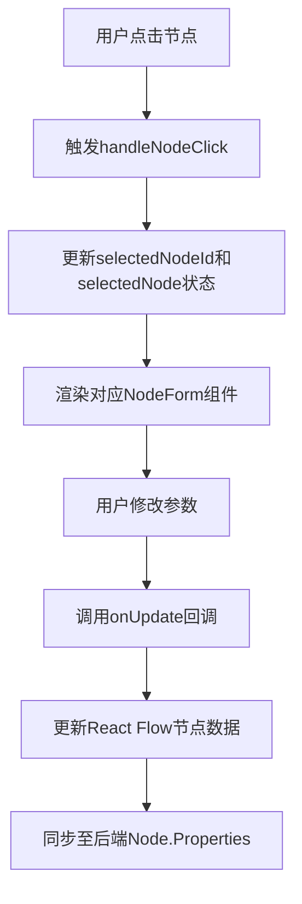
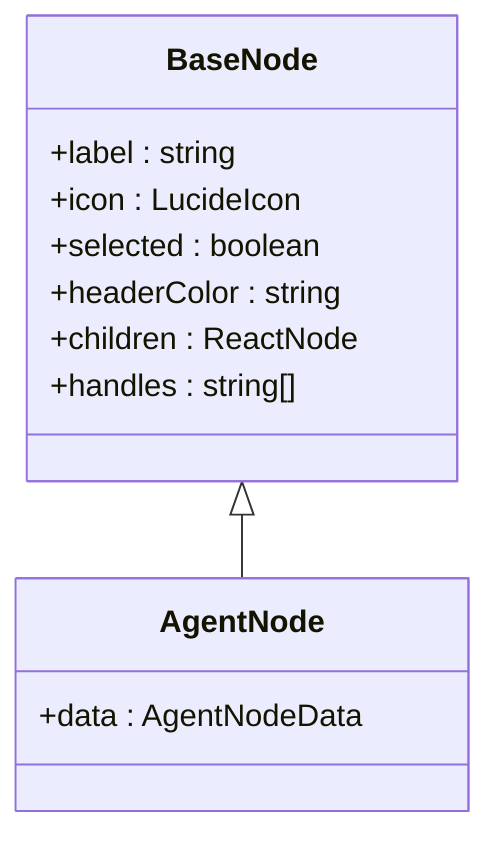
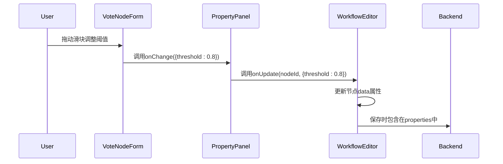
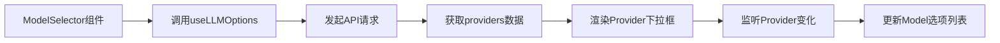

# 前端参数配置

<cite>
**本文档引用文件**  
- [WorkflowEditor.tsx](file://frontend/src/features/editor/WorkflowEditor.tsx)
- [CustomNodes.tsx](file://frontend/src/components/workflow/nodes/CustomNodes.tsx)
- [PropertyPanel.tsx](file://frontend/src/features/editor/components/PropertyPanel/PropertyPanel.tsx)
- [NodeForms/*.tsx](file://frontend/src/features/editor/components/PropertyPanel/NodeForms/)
- [ModelSelector.tsx](file://frontend/src/features/agents/components/ModelSelector.tsx)
- [AgentEditDrawer.tsx](file://frontend/src/features/agents/components/AgentEditDrawer.tsx)
- [useLLMOptions.ts](file://frontend/src/hooks/useLLMOptions.ts)
- [workflow.ts](file://frontend/src/types/workflow.ts)
- [agent.ts](file://frontend/src/types/agent.ts)
- [BaseNode.tsx](file://frontend/src/components/workflow/nodes/BaseNode.tsx)
</cite>

## 目录
1. [智能体节点可视化配置概述](#智能体节点可视化配置概述)
2. [节点编辑面板结构设计](#节点编辑面板结构设计)
3. [AgentNode组件UI渲染逻辑](#agentnode组件ui渲染逻辑)
4. [表单数据与后端属性双向绑定机制](#表单数据与后端属性双向绑定机制)
5. [自定义模型选项动态加载实现](#自定义模型选项动态加载实现)
6. [扩展新配置项的开发指导](#扩展新配置项的开发指导)
7. [常见UI问题排查指南](#常见ui问题排查指南)

## 智能体节点可视化配置概述

本系统通过可视化工作流编辑器实现智能体节点的参数配置与交互。用户可在画布上拖拽创建智能体节点，并通过右侧属性面板进行精细化配置，包括模型选择、温度调节、系统提示词等核心参数。整个配置流程基于React Flow实现节点图可视化，结合TypeScript强类型系统确保前后端数据一致性。

系统采用模块化设计，将节点UI渲染、属性编辑、数据绑定分离到不同组件中，提升可维护性与扩展性。所有智能体节点共享统一的配置范式，同时支持不同类型节点的特有参数定制。

**Section sources**
- [WorkflowEditor.tsx](file://frontend/src/features/editor/WorkflowEditor.tsx#L1-L271)
- [CustomNodes.tsx](file://frontend/src/components/workflow/nodes/CustomNodes.tsx#L1-L140)

## 节点编辑面板结构设计

节点编辑面板（PropertyPanel）是智能体配置的核心交互界面，其结构设计遵循以下原则：

1. **分层布局**：顶部为节点名称编辑区，中部为类型专属配置表单，底部为删除操作按钮
2. **动态表单渲染**：根据节点类型动态加载对应的配置组件（如VoteNodeForm、LoopNodeForm等）
3. **状态同步机制**：通过回调函数与父组件保持数据实时同步

面板通过`onUpdate`回调函数接收参数变更，该函数最终会更新React Flow实例中的节点数据，并同步到`selectedNode`状态中。当用户点击不同节点时，面板自动切换显示对应节点的配置内容。



**Diagram sources**
- [PropertyPanel.tsx](file://frontend/src/features/editor/components/PropertyPanel/PropertyPanel.tsx#L1-L86)
- [WorkflowEditor.tsx](file://frontend/src/features/editor/WorkflowEditor.tsx#L19-L53)

## AgentNode组件UI渲染逻辑

AgentNode组件基于BaseNode构建，其UI渲染逻辑包含以下关键要素：

### 状态显示
- **选中状态**：通过`selected`属性控制边框高亮（紫色描边+阴影）
- **头部颜色**：使用`headerColor`属性区分节点类型（智能体为蓝色系）
- **图标标识**：左侧显示机器人图标（Bot），增强视觉识别

### 悬停提示
虽然当前代码未直接实现悬停提示，但BaseNode已预留扩展能力。可通过在BaseNode中添加`title`属性或使用第三方Tooltip组件实现参数详情提示。

### 内容结构


AgentNode继承BaseNode并填充具体内容，包括"Agent Task"标题和"Model Execution"描述文本，形成统一的视觉风格。

**Diagram sources**
- [CustomNodes.tsx](file://frontend/src/components/workflow/nodes/CustomNodes.tsx#L25-L41)
- [BaseNode.tsx](file://frontend/src/components/workflow/nodes/BaseNode.tsx#L1-L48)

**Section sources**
- [CustomNodes.tsx](file://frontend/src/components/workflow/nodes/CustomNodes.tsx#L25-L41)
- [BaseNode.tsx](file://frontend/src/components/workflow/nodes/BaseNode.tsx#L1-L48)

## 表单数据与后端Node.Properties字段的双向绑定机制

系统实现了完整的双向数据绑定机制，确保前端配置能准确同步到后端存储。

### 数据流向
1. **前端→后端**：用户在表单中修改参数 → 触发onChange回调 → 调用onUpdate函数 → 更新React Flow节点data属性 → 保存时序列化为Node.Properties
2. **后端→前端**：加载工作流 → 反序列化Node.Properties → 初始化React Flow节点data → 渲染到属性面板

### 关键实现
- **类型安全**：通过TypeScript接口定义`AgentNodeData`、`VoteNodeData`等类型，确保数据结构一致性
- **部分更新**：`onUpdate`函数支持传入`Partial<DataType>`，允许只更新特定字段
- **自动持久化**：所有data字段都会被保存到后端的`properties`字段中

以投票节点为例，其阈值配置的绑定路径为：


**Diagram sources**
- [WorkflowEditor.tsx](file://frontend/src/features/editor/WorkflowEditor.tsx#L34-L53)
- [PropertyPanel.tsx](file://frontend/src/features/editor/components/PropertyPanel/PropertyPanel.tsx#L13-L14)
- [NodeForms/VoteNodeForm.tsx](file://frontend/src/features/editor/components/PropertyPanel/NodeForms/VoteNodeForm.tsx#L23-L24)

## 自定义模型选项动态加载实现

系统通过`useLLMOptions` Hook实现模型选项的动态加载，具体实现方案如下：

### 数据获取
- **API端点**：`/api/v1/llm/providers`
- **响应格式**：返回包含providers数组的JSON，每个provider包含id、name、icon和models列表
- **缓存策略**：使用SWR进行数据缓存，避免重复请求

### 组件集成
ModelSelector组件消费该Hook，实现：
1. **Provider选择**：下拉框显示所有可用提供商
2. **Model联动**：根据选中的provider动态更新model下拉选项
3. **参数配置**：提供温度、top_p、max_tokens等高级参数调节

### 动态特性
- **实时更新**：当后端添加新模型时，前端无需发布即可发现
- **容错处理**：若当前配置的provider不存在，自动切换到第一个可用provider
- **加载状态**：在数据获取期间显示加载动画，提升用户体验



**Diagram sources**
- [useLLMOptions.ts](file://frontend/src/hooks/useLLMOptions.ts#L1-L28)
- [ModelSelector.tsx](file://frontend/src/features/agents/components/ModelSelector.tsx#L20-L21)

## 扩展新配置项的开发指导

为智能体节点添加新配置项需遵循以下步骤：

### 1. 类型定义扩展
在`types/agent.ts`中扩展`ModelConfig`接口：
```typescript
export interface ModelConfig {
  provider: string;
  model: string;
  temperature: number;
  top_p: number;
  max_tokens: number;
  // 新增配置项
  presence_penalty?: number;
  frequency_penalty?: number;
}
```

### 2. UI组件更新
在ModelSelector中添加新控件：
```tsx
<div className="space-y-2">
  <div className="flex justify-between text-xs">
    <label>Presence Penalty</label>
    <span>{value.presence_penalty}</span>
  </div>
  <input 
    type="range" 
    min="-2" 
    max="2" 
    step="0.1"
    value={value.presence_penalty || 0}
    onChange={(e) => onChange({ ...value, presence_penalty: parseFloat(e.target.value) })}
  />
</div>
```

### 3. 后端支持
确保后端在处理LLM请求时包含新参数：
```go
req := &llm.CompletionRequest{
    // ... 其他字段
    PresencePenalty: float32(config.PresencePenalty),
    FrequencyPenalty: float32(config.FrequencyPenalty),
}
```

### 4. 默认值设置
在DEFAULT_MODEL_CONFIG中设置合理默认值：
```typescript
const DEFAULT_MODEL_CONFIG: ModelConfig = {
  // ... 其他默认值
  presence_penalty: 0,
  frequency_penalty: 0,
};
```

**Section sources**
- [ModelSelector.tsx](file://frontend/src/features/agents/components/ModelSelector.tsx#L1-L190)
- [agent.ts](file://frontend/src/types/agent.ts)
- [internal/core/workflow/nodes/agent.go](file://internal/core/workflow/nodes/agent.go#L70-L74)

## 常见UI问题排查指南

### 参数未保存问题
**现象**：修改参数后重新打开节点，配置恢复默认值  
**排查步骤**：
1. 检查`onUpdate`回调是否正确传递到NodeForm组件
2. 验证`handleNodeUpdate`中是否正确合并新数据
3. 确认`properties`字段是否包含在保存的payload中

**相关代码**：
- `WorkflowEditor.tsx`中的`handleNodeUpdate`函数
- `PropertyPanel.tsx`中的`onChange`回调传递

### 下拉框无数据问题
**现象**：模型选择下拉框为空或显示"Unknown"  
**排查步骤**：
1. 检查浏览器开发者工具，确认`/api/v1/llm/providers`请求是否成功
2. 验证返回的JSON格式是否符合预期结构
3. 检查`useLLMOptions`的错误状态，查看是否有网络或解析错误

**解决方案**：
- 确保后端`/internal/api/handler/llm.go`正确实现providers接口
- 检查数据库`llm_options`表是否已正确初始化
- 验证环境变量中LLM提供商配置是否正确

### 节点配置不显示问题
**现象**：点击智能体节点，属性面板显示"Coming Soon"占位符  
**原因**：当前实现中AgentNodeForm尚未完成开发  
**临时解决方案**：
1. 在`PropertyPanel.tsx`中找到agent类型处理逻辑
2. 替换占位div为实际的ModelSelector组件
3. 确保正确传递agent节点的model_config数据

```tsx
case 'agent':
  return <ModelSelector 
    value={node.data.model_config} 
    onChange={(config) => onUpdate(node.id, { model_config: config })}
    showAdvanced={true} 
  />;
```

**Section sources**
- [PropertyPanel.tsx](file://frontend/src/features/editor/components/PropertyPanel/PropertyPanel.tsx#L37-L38)
- [WorkflowEditor.tsx](file://frontend/src/features/editor/WorkflowEditor.tsx#L134-L164)
- [useLLMOptions.ts](file://frontend/src/hooks/useLLMOptions.ts#L17-L20)