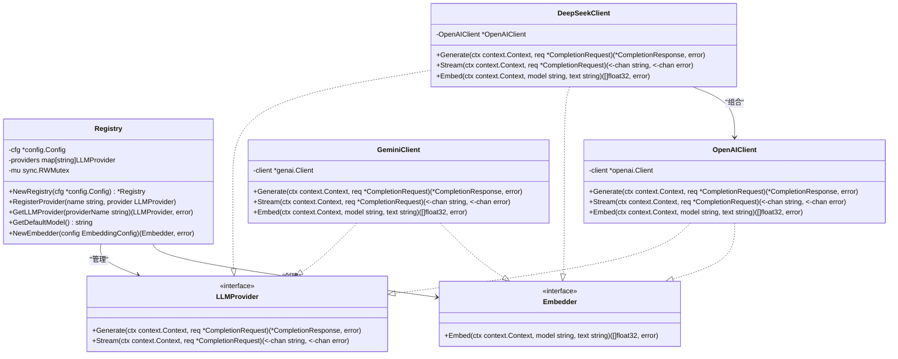
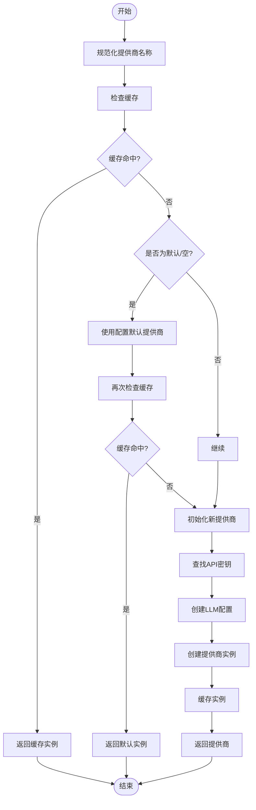
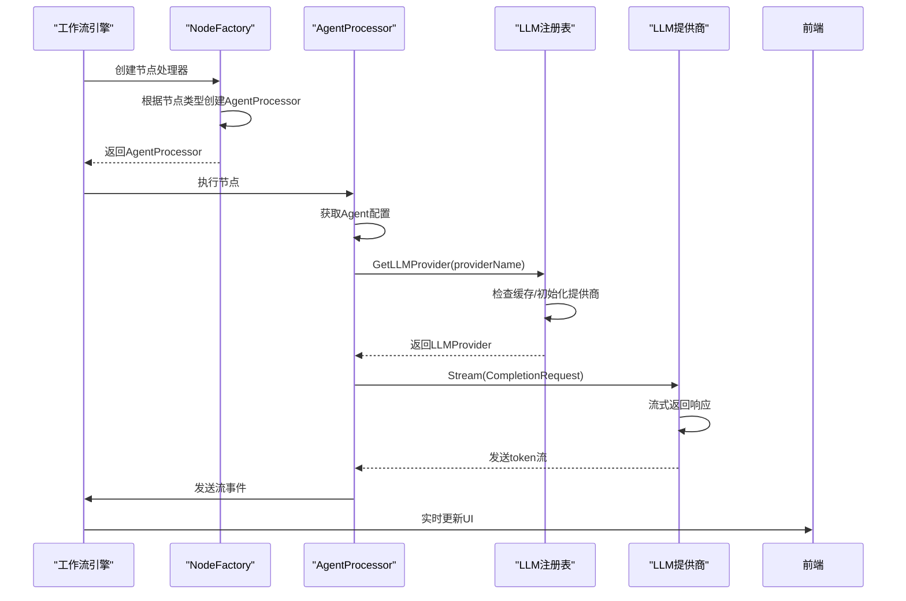
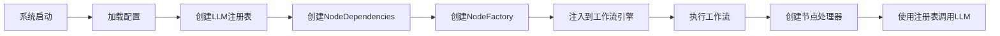

# 多LLM提供商集成

<cite>
**本文档引用的文件**  
- [router.go](file://internal/infrastructure/llm/router.go)
- [factory.go](file://internal/core/workflow/nodes/factory.go)
- [agent.go](file://internal/core/workflow/nodes/agent.go)
- [llm.go](file://internal/infrastructure/llm/llm.go)
- [config.go](file://internal/pkg/config/config.go)
- [config.json](file://example/llm/config.json)
</cite>

## 目录
1. [引言](#引言)
2. [LLM注册表与提供商集成](#llm注册表与提供商集成)
3. [模型路由策略实现](#模型路由策略实现)
4. [工作流处理器与Agent配置映射](#工作流处理器与agent配置映射)
5. [NodeFactory依赖注入流程](#nodefactory依赖注入流程)
6. [调用失败案例与错误处理](#调用失败案例与错误处理)
7. [重试策略与熔断机制配置](#重试策略与熔断机制配置)
8. [结论](#结论)

## 引言
本文档全面阐述了智能体节点如何通过LLM注册表（Registry）集成多个大模型提供商，包括OpenAI、Gemini、DeepSeek等。重点分析了`router.go`中模型路由策略的实现原理，涵盖默认提供商选择、故障转移机制和负载均衡逻辑。同时，说明了工作流处理器如何将Agent配置映射到具体的LLM客户端调用，并结合`workflow.go`中NodeFactory的依赖注入过程，展示Registry如何被传递至AgentProcessor。最后，列举了因API密钥无效或网络中断导致的调用失败案例，并提供了重试策略与熔断机制的配置指南。

## LLM注册表与提供商集成

LLM注册表（Registry）是系统集成多个大模型提供商的核心组件。它通过统一的接口管理不同提供商的客户端实例，实现了灵活的模型切换和动态配置。



**图示来源**  
- [router.go](file://internal/infrastructure/llm/router.go#L11-L177)
- [llm.go](file://internal/infrastructure/llm/llm.go#L35-L64)

**本节来源**  
- [router.go](file://internal/infrastructure/llm/router.go#L11-L177)
- [llm.go](file://internal/infrastructure/llm/llm.go#L35-L64)

## 模型路由策略实现

`router.go`中的`GetLLMProvider`方法实现了核心的模型路由策略，其逻辑包括默认提供商选择、故障转移和动态初始化。

### 默认提供商选择
当请求的提供商名称为空或为"default"时，系统会使用配置中的默认提供商：
```go
if providerName == "" || providerName == "default" {
    providerName = r.cfg.LLM.Provider
}
```

### 故障转移机制
系统通过多级查找机制实现故障转移：
1. 首先检查缓存中是否已存在请求的提供商实例
2. 若未找到，则根据提供商名称从全局配置中获取API密钥
3. 若仍无法确定，则尝试使用通用LLM配置作为后备

### 负载均衡逻辑
虽然当前实现未直接包含负载均衡算法，但通过注册表的缓存机制和并发安全的读写锁，为后续实现负载均衡提供了基础架构。



**图示来源**  
- [router.go](file://internal/infrastructure/llm/router.go#L37-L107)

**本节来源**  
- [router.go](file://internal/infrastructure/llm/router.go#L37-L107)

## 工作流处理器与Agent配置映射

工作流处理器负责将Agent配置映射到具体的LLM客户端调用。每个Agent在数据库中存储了独立的模型配置，包括提供商、模型名称、温度等参数。

### Agent配置结构
```json
{
  "id": "uuid",
  "name": "Agent名称",
  "persona_prompt": "角色提示词",
  "model_config": {
    "provider": "openai",
    "model": "gpt-4",
    "temperature": 0.7,
    "top_p": 0.9,
    "max_tokens": 8192
  }
}
```

### 配置映射流程
1. 工作流引擎执行到Agent节点时，调用NodeFactory创建AgentProcessor
2. AgentProcessor从数据库获取Agent的完整配置
3. 根据Agent配置中的提供商名称，通过Registry获取对应的LLMProvider实例
4. 使用Agent的模型配置创建CompletionRequest并发起调用



**图示来源**  
- [agent.go](file://internal/core/workflow/nodes/agent.go#L23-L130)
- [factory.go](file://internal/core/workflow/nodes/factory.go#L20-L106)

**本节来源**  
- [agent.go](file://internal/core/workflow/nodes/agent.go#L23-L130)
- [factory.go](file://internal/core/workflow/nodes/factory.go#L20-L106)

## NodeFactory依赖注入流程

NodeFactory通过依赖注入的方式将LLM注册表传递给各个处理器，确保了组件间的松耦合和可测试性。

### 依赖注入结构
```go
type NodeDependencies struct {
    Registry      *llm.Registry
    AgentRepo     agent.Repository
    MemoryService *memory.Service
}

func NewNodeFactory(deps NodeDependencies) func(node *workflow.Node) (workflow.NodeProcessor, error) {
    return func(node *workflow.Node) (workflow.NodeProcessor, error) {
        // 根据节点类型创建相应的处理器
        // 所有需要LLM的处理器都会注入Registry
    }
}
```

### 注入流程
1. 系统启动时，创建LLM注册表实例并传入配置
2. 创建NodeDependencies结构体，包含注册表和其他依赖
3. 调用NewNodeFactory创建工厂函数
4. 将工厂函数注入到工作流引擎中



**图示来源**  
- [factory.go](file://internal/core/workflow/nodes/factory.go#L13-L20)
- [agent.go](file://internal/core/workflow/nodes/agent.go#L16-L21)

**本节来源**  
- [factory.go](file://internal/core/workflow/nodes/factory.go#L13-L20)
- [agent.go](file://internal/core/workflow/nodes/agent.go#L16-L21)

## 调用失败案例与错误处理

系统在集成多个LLM提供商时可能遇到各种调用失败情况，主要包括API密钥无效和网络中断。

### API密钥无效案例
当配置的API密钥无效时，不同提供商返回的错误信息不同：
- **OpenAI**: `AuthenticationError: Incorrect API key provided`
- **Gemini**: `Failed to create Gemini client: invalid API key`
- **DeepSeek**: `openai generate error: status code: 401`

### 网络中断案例
网络问题可能导致连接超时或连接拒绝：
- **连接超时**: `context deadline exceeded`
- **连接拒绝**: `connection refused`
- **DNS解析失败**: `no such host`

### 错误处理机制
系统通过统一的错误包装和日志记录来处理这些异常：
```go
if err != nil {
    return nil, fmt.Errorf("failed to get LLM provider '%s': %w", providerName, err)
}
```

**本节来源**  
- [router.go](file://internal/infrastructure/llm/router.go#L100-L103)
- [openai.go](file://internal/infrastructure/llm/openai.go#L58-L60)
- [gemini.go](file://internal/infrastructure/llm/gemini.go#L22-L24)

## 重试策略与熔断机制配置

为了提高系统的稳定性和容错能力，建议配置适当的重试策略和熔断机制。

### 重试策略配置
```yaml
retry:
  max_attempts: 3
  backoff_factor: 2
  max_delay: 30s
  retryable_errors:
    - "connection refused"
    - "context deadline exceeded"
    - "5xx"
```

### 熔断机制配置
```go
type CircuitBreaker struct {
    MaxRecursionDepth int
}

func NewCircuitBreaker(maxDepth int) *CircuitBreaker {
    return &CircuitBreaker{MaxRecursionDepth: maxDepth}
}
```

### 配置建议
1. **重试间隔**: 采用指数退避策略，初始间隔1秒，最大30秒
2. **熔断阈值**: 连续5次失败后触发熔断，持续30秒
3. **并发限制**: 使用信号量限制同时进行的LLM调用数量
4. **超时设置**: 每个LLM调用设置独立的上下文超时

**本节来源**  
- [circuit_breaker.go](file://internal/core/middleware/circuit_breaker.go#L9-L40)
- [config.go](file://internal/pkg/config/config.go#L8-L133)

## 结论
通过LLM注册表的设计，系统实现了对多个大模型提供商的灵活集成。`router.go`中的路由策略提供了可靠的默认选择、故障转移和动态初始化机制。工作流处理器通过NodeFactory的依赖注入，将Agent配置准确映射到具体的LLM调用。面对API密钥无效或网络中断等常见问题，系统提供了完善的错误处理机制，并可通过配置重试策略和熔断机制来增强稳定性。这种架构设计既保证了系统的灵活性，又确保了生产环境下的可靠性。