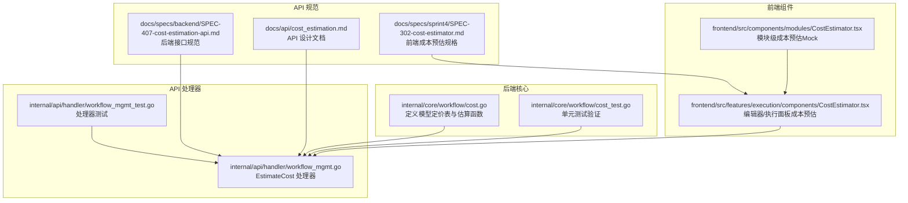
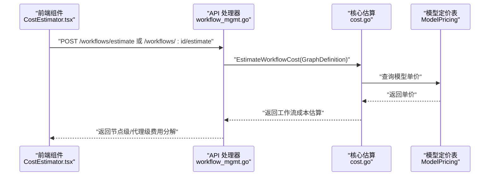
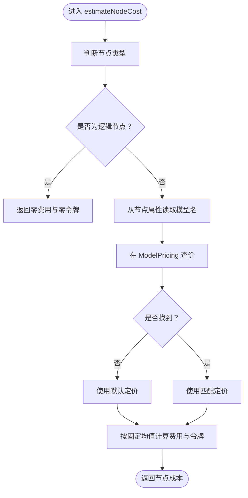
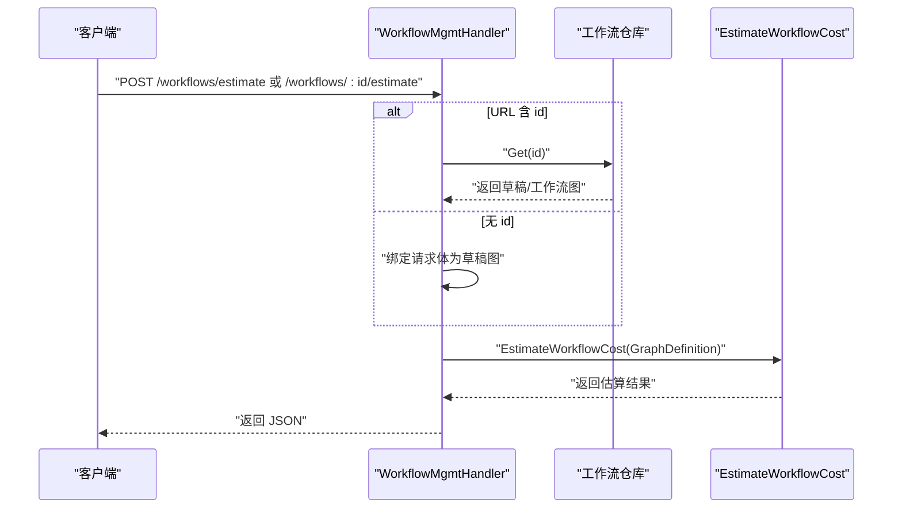
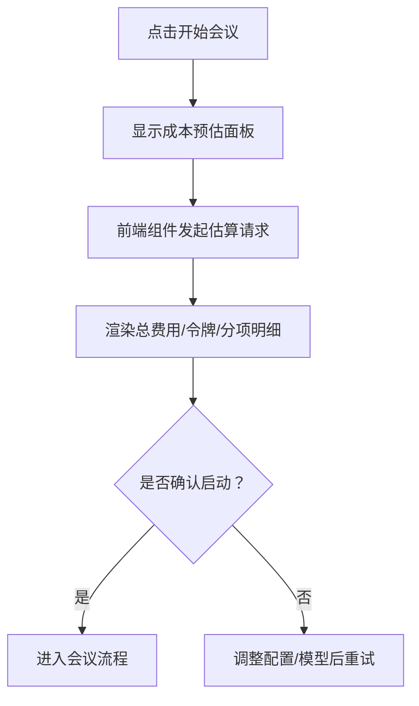
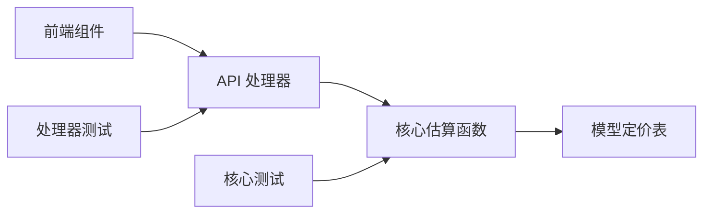

# 成本估算与计费

<cite>
**本文引用的文件**
- [cost.go](file://internal/core/workflow/cost.go)
- [cost_test.go](file://internal/core/workflow/cost_test.go)
- [SPEC-407-cost-estimation-api.md](file://docs/specs/backend/SPEC-407-cost-estimation-api.md)
- [cost_estimation.md](file://docs/api/cost_estimation.md)
- [SPEC-302-cost-estimator.md](file://docs/specs/sprint4/SPEC-302-cost-estimator.md)
- [workflow_mgmt.go](file://internal/api/handler/workflow_mgmt.go)
- [workflow_mgmt_test.go](file://internal/api/handler/workflow_mgmt_test.go)
- [CostEstimator.tsx（执行面板）](file://frontend/src/features/execution/components/CostEstimator.tsx)
- [CostEstimator.tsx（模块组件）](file://frontend/src/components/modules/CostEstimator.tsx)
</cite>

## 目录
1. [简介](#简介)
2. [项目结构](#项目结构)
3. [核心组件](#核心组件)
4. [架构总览](#架构总览)
5. [详细组件分析](#详细组件分析)
6. [依赖关系分析](#依赖关系分析)
7. [性能考量](#性能考量)
8. [故障排查指南](#故障排查指南)
9. [结论](#结论)
10. [附录](#附录)

## 简介
本文件系统化说明智能体节点在工作流中的成本估算机制，围绕后端的 cost.go 中的 estimateNodeCost 函数展开，解释如何依据模型定价表（ModelPricing）计算输入/输出令牌费用；阐明成本预估在工作流执行前的静态分析过程及其在 UI 中的展示方式；讨论估算偏差来源（如实际 token 数与预估值差异）及应对策略；结合 API 文档中的成本估算接口，指导用户如何获取节点级和工作流级的费用 breakdown；最后提供优化建议，如选择性价比更高的模型、限制输出长度以控制成本。

## 项目结构
成本估算涉及后端核心逻辑、API 规范、前端组件与测试验证，整体结构如下图所示：

图表来源
- [cost.go](file://internal/core/workflow/cost.go#L1-L87)
- [SPEC-407-cost-estimation-api.md](file://docs/specs/backend/SPEC-407-cost-estimation-api.md#L1-L101)
- [cost_estimation.md](file://docs/api/cost_estimation.md#L1-L288)
- [SPEC-302-cost-estimator.md](file://docs/specs/sprint4/SPEC-302-cost-estimator.md#L1-L125)
- [workflow_mgmt.go](file://internal/api/handler/workflow_mgmt.go#L190-L218)
- [workflow_mgmt_test.go](file://internal/api/handler/workflow_mgmt_test.go#L116-L137)
- [CostEstimator.tsx（执行面板）](file://frontend/src/features/execution/components/CostEstimator.tsx#L1-L137)
- [CostEstimator.tsx（模块组件）](file://frontend/src/components/modules/CostEstimator.tsx#L1-L20)

章节来源
- [cost.go](file://internal/core/workflow/cost.go#L1-L87)
- [SPEC-407-cost-estimation-api.md](file://docs/specs/backend/SPEC-407-cost-estimation-api.md#L1-L101)
- [cost_estimation.md](file://docs/api/cost_estimation.md#L1-L288)
- [SPEC-302-cost-estimator.md](file://docs/specs/sprint4/SPEC-302-cost-estimator.md#L1-L125)
- [workflow_mgmt.go](file://internal/api/handler/workflow_mgmt.go#L190-L218)
- [workflow_mgmt_test.go](file://internal/api/handler/workflow_mgmt_test.go#L116-L137)
- [CostEstimator.tsx（执行面板）](file://frontend/src/features/execution/components/CostEstimator.tsx#L1-L137)
- [CostEstimator.tsx（模块组件）](file://frontend/src/components/modules/CostEstimator.tsx#L1-L20)

## 核心组件
- 模型定价表（ModelPricing）
  - 后端以全局映射形式维护各模型的“每千令牌输入/输出单价”，用于快速查价。
  - 若节点未指定模型或未命中定价表，则回退到默认定价。
- 节点成本估算函数（estimateNodeCost）
  - 对逻辑节点（如开始/结束/并行/投票/循环）直接计零成本。
  - 对智能体节点：从节点属性中读取模型名，查表得到单价，按固定均值（1000 输入、500 输出）估算单节点费用与令牌数。
- 工作流成本汇总（EstimateWorkflowCost）
  - 遍历所有节点，累加总费用与总令牌，并生成节点级与代理（Agent）级的分项明细。

章节来源
- [cost.go](file://internal/core/workflow/cost.go#L1-L87)
- [cost_test.go](file://internal/core/workflow/cost_test.go#L1-L76)

## 架构总览
后端通过处理器接收请求，调用核心估算函数，返回节点级与代理级的费用分解；前端在编辑器/执行面板中发起估算请求，展示总费用、总令牌以及代理级分项。

图表来源
- [workflow_mgmt.go](file://internal/api/handler/workflow_mgmt.go#L190-L218)
- [cost.go](file://internal/core/workflow/cost.go#L1-L87)
- [SPEC-407-cost-estimation-api.md](file://docs/specs/backend/SPEC-407-cost-estimation-api.md#L1-L101)
- [cost_estimation.md](file://docs/api/cost_estimation.md#L1-L288)

## 详细组件分析

### 后端成本估算核心（cost.go）
- 模型定价表（ModelPricing）
  - 结构包含输入/输出单价字段，键为模型名称，支持默认回退。
- 节点成本估算（estimateNodeCost）
  - 逻辑节点免费。
  - 智能体节点：读取节点属性中的模型名，查表单价，按固定均值估算费用与令牌数。
- 工作流成本汇总（EstimateWorkflowCost）
  - 累加节点费用与令牌，构建节点级与代理级分项明细。

图表来源
- [cost.go](file://internal/core/workflow/cost.go#L42-L74)

章节来源
- [cost.go](file://internal/core/workflow/cost.go#L1-L87)

### API 规范与处理器（SPEC-407 与 workflow_mgmt.go）
- 接口规范
  - 支持两种调用路径：对已保存工作流（带 id）或草稿（无 id，请求体携带草稿图）。
  - 请求体可包含提案文本与附件等，便于更精细的估算（详见 API 设计文档）。
- 处理器实现
  - EstimateCost 处理器同时支持 GET/POST 两种方式，若 URL 包含 id 则从存储加载工作流；否则从请求体解析草稿图。
  - 调用核心估算函数返回结果。

图表来源
- [SPEC-407-cost-estimation-api.md](file://docs/specs/backend/SPEC-407-cost-estimation-api.md#L1-L101)
- [workflow_mgmt.go](file://internal/api/handler/workflow_mgmt.go#L190-L218)

章节来源
- [SPEC-407-cost-estimation-api.md](file://docs/specs/backend/SPEC-407-cost-estimation-api.md#L1-L101)
- [workflow_mgmt.go](file://internal/api/handler/workflow_mgmt.go#L190-L218)

### 前端展示与交互（SPEC-302 与执行面板组件）
- 展示位置
  - 在“开始会议”前弹出成本预估面板，显示总预估成本、预估耗时与分项明细。
- 组件实现要点
  - 使用查询钩子拉取估算数据，展示总费用与令牌数，以及代理级分项。
  - 编辑器/执行面板的成本预估组件会将 React Flow 的节点/边转换为后端期望的草稿图结构，再发起估算请求。
- Mock 组件
  - 模块级组件提供简单 Mock 值，便于早期联调。

图表来源
- [SPEC-302-cost-estimator.md](file://docs/specs/sprint4/SPEC-302-cost-estimator.md#L1-L125)
- [CostEstimator.tsx（执行面板）](file://frontend/src/features/execution/components/CostEstimator.tsx#L1-L137)
- [CostEstimator.tsx（模块组件）](file://frontend/src/components/modules/CostEstimator.tsx#L1-L20)

章节来源
- [SPEC-302-cost-estimator.md](file://docs/specs/sprint4/SPEC-302-cost-estimator.md#L1-L125)
- [CostEstimator.tsx（执行面板）](file://frontend/src/features/execution/components/CostEstimator.tsx#L1-L137)
- [CostEstimator.tsx（模块组件）](file://frontend/src/components/modules/CostEstimator.tsx#L1-L20)

### 测试验证（cost_test.go 与 workflow_mgmt_test.go）
- 单元测试
  - 验证逻辑节点免费、智能体节点按模型定价表计费、总令牌与总费用符合预期。
- 处理器测试
  - 验证草稿估算与带 id 的估算两种路径均返回 200。

章节来源
- [cost_test.go](file://internal/core/workflow/cost_test.go#L1-L76)
- [workflow_mgmt_test.go](file://internal/api/handler/workflow_mgmt_test.go#L116-L137)

## 依赖关系分析
- 后端核心依赖
  - 模型定价表作为外部依赖，当前以全局变量形式存在，后续可替换为配置中心或动态加载。
  - 估算函数仅依赖节点类型与属性中的模型名，耦合度低，扩展性强。
- 前后端契约
  - 前端需将 React Flow 的节点/边映射为后端期望的草稿图结构；后端返回节点级与代理级分项明细。
- API 规范与实现一致性
  - 处理器实现与接口规范一致，支持草稿与已保存工作流两种场景。

图表来源
- [cost.go](file://internal/core/workflow/cost.go#L1-L87)
- [workflow_mgmt.go](file://internal/api/handler/workflow_mgmt.go#L190-L218)
- [SPEC-407-cost-estimation-api.md](file://docs/specs/backend/SPEC-407-cost-estimation-api.md#L1-L101)
- [workflow_mgmt_test.go](file://internal/api/handler/workflow_mgmt_test.go#L116-L137)
- [cost_test.go](file://internal/core/workflow/cost_test.go#L1-L76)

章节来源
- [cost.go](file://internal/core/workflow/cost.go#L1-L87)
- [workflow_mgmt.go](file://internal/api/handler/workflow_mgmt.go#L190-L218)
- [SPEC-407-cost-estimation-api.md](file://docs/specs/backend/SPEC-407-cost-estimation-api.md#L1-L101)
- [workflow_mgmt_test.go](file://internal/api/handler/workflow_mgmt_test.go#L116-L137)
- [cost_test.go](file://internal/core/workflow/cost_test.go#L1-L76)

## 性能考量
- 估算复杂度
  - 估算函数对每个节点进行常量时间查价与加法运算，总体 O(N)，N 为节点数，开销极低。
- 前端请求频率
  - 编辑器组件对频繁变更进行去抖处理，避免在拖拽过程中频繁请求，降低网络与后端压力。
- 定价表规模
  - 当前定价表为内存映射，访问延迟低；若模型数量增长，可考虑缓存与懒加载策略。

[本节为通用性能讨论，不直接分析具体文件]

## 故障排查指南
- 常见问题
  - 模型未命中定价表：检查节点属性中的模型名是否正确，或是否需要新增定价条目。
  - 逻辑节点仍计费：确认节点类型是否被错误标记为智能体节点。
  - 前端无法获取估算：检查请求体结构是否符合后端草稿图格式，或是否传入了正确的工作流 id。
- 调试步骤
  - 后端：查看处理器日志与响应状态码，核对草稿图结构与模型名。
  - 前端：确认映射逻辑（节点/边到草稿图）是否正确，去抖参数是否合适。
- 测试辅助
  - 运行核心与处理器测试，确保关键路径通过。

章节来源
- [workflow_mgmt.go](file://internal/api/handler/workflow_mgmt.go#L190-L218)
- [workflow_mgmt_test.go](file://internal/api/handler/workflow_mgmt_test.go#L116-L137)
- [CostEstimator.tsx（执行面板）](file://frontend/src/features/execution/components/CostEstimator.tsx#L1-L137)

## 结论
- 该成本估算机制以简单、可扩展的方式实现了工作流执行前的静态分析：通过模型定价表与固定均值估算，快速给出节点级与代理级费用分解。
- 前后端通过清晰的 API 规范与契约协作，前端在编辑器/执行面板中直观展示估算结果，帮助用户在启动会议前做出成本决策。
- 随着业务发展，可在保持估算函数稳定性的前提下，引入更精确的 token 计数、动态定价与更丰富的工作流复杂度因子，持续提升估算精度与用户体验。

[本节为总结性内容，不直接分析具体文件]

## 附录

### 如何获取节点级与工作流级费用 breakdown
- 接口
  - 对于已保存工作流：POST /api/v1/workflows/:id/estimate
  - 对于草稿：POST /api/v1/workflows/estimate（请求体为草稿图）
- 返回字段
  - 工作流级：总费用、总令牌、分项明细（节点级）、代理级分项
  - 节点级：节点 ID、节点名称、代理名称（如有）、模型、预估令牌、预估费用
- 前端集成
  - 使用查询钩子拉取数据，渲染总费用、总令牌与分项明细；支持警告提示与确认启动流程。

章节来源
- [SPEC-407-cost-estimation-api.md](file://docs/specs/backend/SPEC-407-cost-estimation-api.md#L1-L101)
- [cost_estimation.md](file://docs/api/cost_estimation.md#L1-L288)
- [SPEC-302-cost-estimator.md](file://docs/specs/sprint4/SPEC-302-cost-estimator.md#L1-L125)
- [workflow_mgmt.go](file://internal/api/handler/workflow_mgmt.go#L190-L218)

### 估算偏差来源与应对策略
- 偏差来源
  - 固定均值假设：估算采用固定的平均输入/输出令牌数，实际可能因提示词长度、上下文复杂度、工具调用等因素产生差异。
  - 逻辑节点免费：若实际运行包含额外计算或 I/O，估算不会体现。
  - 模型切换：若在运行阶段更换模型，估算与实际费用可能不一致。
- 应对策略
  - 使用更接近真实提示长度的输入估算，或引入 token 计数器。
  - 在工作流中加入“工具调用/检索”等节点时，适当提高令牌系数。
  - 在 UI 中提供“模型切换”入口，允许用户在估算后微调以降低成本。

章节来源
- [cost.go](file://internal/core/workflow/cost.go#L42-L74)
- [SPEC-407-cost-estimation-api.md](file://docs/specs/backend/SPEC-407-cost-estimation-api.md#L1-L101)
- [cost_estimation.md](file://docs/api/cost_estimation.md#L1-L288)

### 优化建议
- 选择性价比更高的模型
  - 在定价表中优先选用输入/输出单价更低的模型；在草稿估算中临时覆盖代理模型以对比成本。
- 控制输出长度
  - 通过提示词约束与输出长度上限，减少输出令牌占比，从而降低费用。
- 精简工作流复杂度
  - 减少不必要的并行/循环节点，避免令牌倍增；合并相似节点，降低总节点数。

章节来源
- [SPEC-407-cost-estimation-api.md](file://docs/specs/backend/SPEC-407-cost-estimation-api.md#L1-L101)
- [cost_estimation.md](file://docs/api/cost_estimation.md#L1-L288)
- [SPEC-302-cost-estimator.md](file://docs/specs/sprint4/SPEC-302-cost-estimator.md#L1-L125)