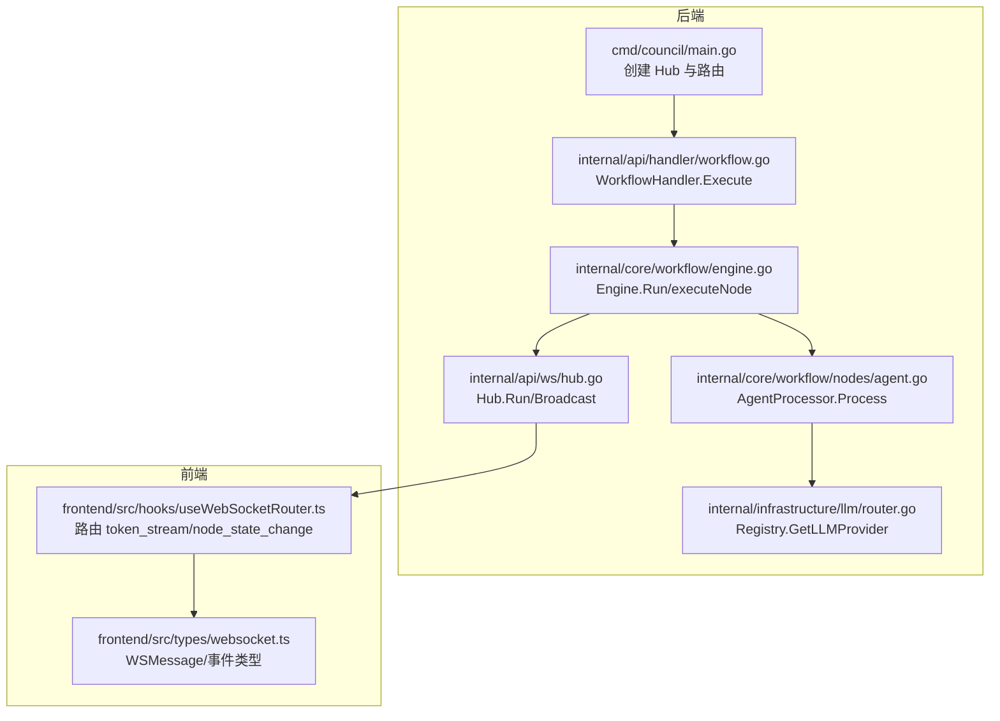
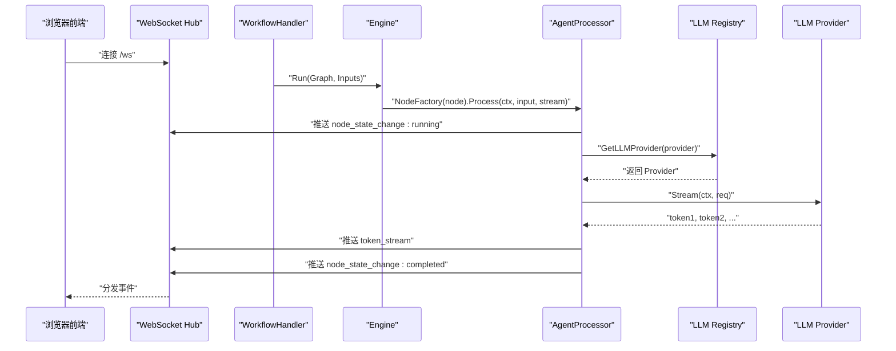
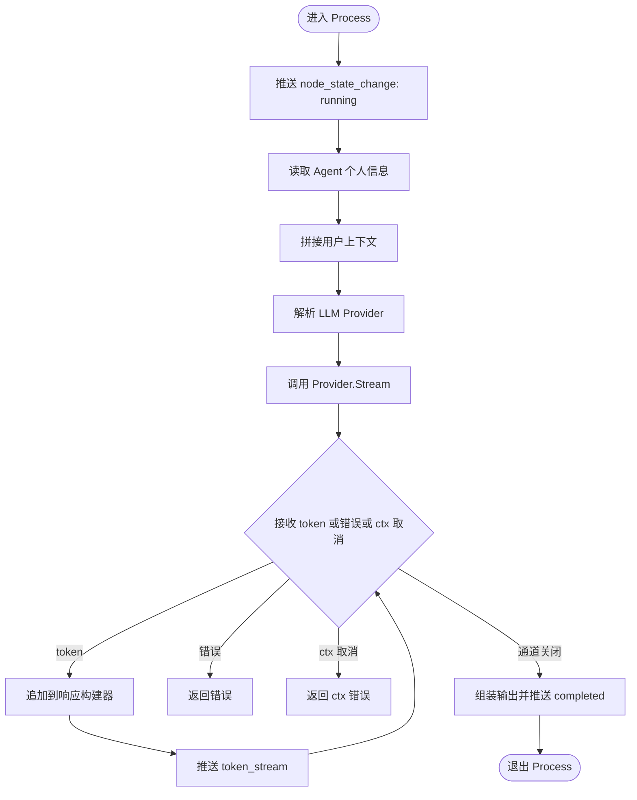
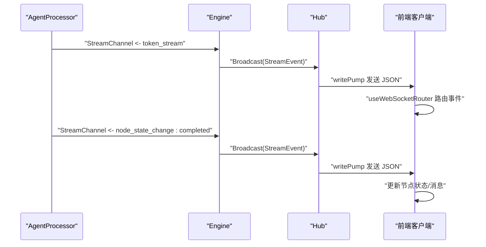
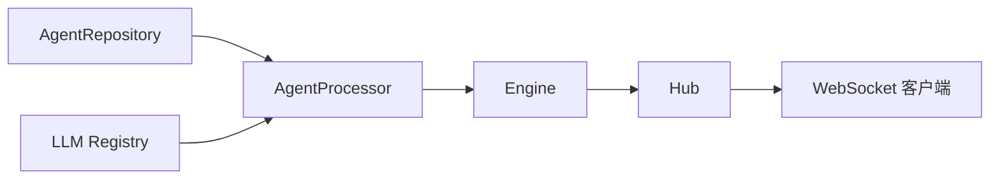

# 执行机制

<cite>
**本文引用的文件**
- [internal/core/workflow/nodes/agent.go](file://internal/core/workflow/nodes/agent.go)
- [internal/core/workflow/nodes/agent_test.go](file://internal/core/workflow/nodes/agent_test.go)
- [internal/core/workflow/nodes/factory.go](file://internal/core/workflow/nodes/factory.go)
- [internal/core/workflow/types.go](file://internal/core/workflow/types.go)
- [internal/core/workflow/engine.go](file://internal/core/workflow/engine.go)
- [internal/core/workflow/context.go](file://internal/core/workflow/context.go)
- [internal/core/workflow/session.go](file://internal/core/workflow/session.go)
- [internal/api/ws/hub.go](file://internal/api/ws/hub.go)
- [frontend/src/hooks/useWebSocketRouter.ts](file://frontend/src/hooks/useWebSocketRouter.ts)
- [frontend/src/types/websocket.ts](file://frontend/src/types/websocket.ts)
- [docs/specs/sprint1/SPEC-005-websocket-optimization.md](file://docs/specs/sprint1/SPEC-005-websocket-optimization.md)
- [docs/reports/debugging/2025-12-21-websocket-debugging-report.md](file://docs/reports/debugging/2025-12-21-websocket-debugging-report.md)
- [internal/infrastructure/llm/router.go](file://internal/infrastructure/llm/router.go)
- [internal/infrastructure/llm/llm.go](file://internal/infrastructure/llm/llm.go)
- [internal/infrastructure/llm/mock.go](file://internal/infrastructure/llm/mock.go)
- [cmd/council/main.go](file://cmd/council/main.go)
- [internal/api/handler/workflow.go](file://internal/api/handler/workflow.go)
</cite>

## 目录
1. [简介](#简介)
2. [项目结构](#项目结构)
3. [核心组件](#核心组件)
4. [架构总览](#架构总览)
5. [详细组件分析](#详细组件分析)
6. [依赖关系分析](#依赖关系分析)
7. [性能考量](#性能考量)
8. [故障排查指南](#故障排查指南)
9. [结论](#结论)

## 简介
本文聚焦“智能体节点”的执行机制，系统性解析 AgentProcessor.Process 的输入上下文构建、LLM 服务调用与流式响应、WebSocket 事件（node_state_change 与 token_stream）的推送与前端消费、以及 NodeTypeAgent 在工作流引擎中的注册与调度。同时结合单元测试 agent_test.go 展示正常执行路径与错误处理场景，并给出性能优化建议与高并发下的 goroutine 泄漏风险防范策略。

## 项目结构
围绕智能体节点执行的关键代码分布在以下模块：
- 工作流引擎与节点：engine、types、context、session、nodes（含 AgentProcessor）
- WebSocket Hub：服务升级、广播与客户端写通道
- LLM 注册与路由：Registry、Provider 接口与实现
- 前端 WebSocket 路由与事件类型定义
- 后端入口与工作流执行入口



图表来源
- [cmd/council/main.go](file://cmd/council/main.go#L52-L100)
- [internal/api/handler/workflow.go](file://internal/api/handler/workflow.go#L58-L81)
- [internal/core/workflow/engine.go](file://internal/core/workflow/engine.go#L40-L139)
- [internal/core/workflow/nodes/agent.go](file://internal/core/workflow/nodes/agent.go#L23-L124)
- [internal/api/ws/hub.go](file://internal/api/ws/hub.go#L39-L125)
- [internal/infrastructure/llm/router.go](file://internal/infrastructure/llm/router.go#L34-L108)
- [frontend/src/hooks/useWebSocketRouter.ts](file://frontend/src/hooks/useWebSocketRouter.ts#L1-L35)
- [frontend/src/types/websocket.ts](file://frontend/src/types/websocket.ts#L1-L51)

章节来源
- [cmd/council/main.go](file://cmd/council/main.go#L52-L100)
- [internal/api/handler/workflow.go](file://internal/api/handler/workflow.go#L58-L81)

## 核心组件
- AgentProcessor：负责节点状态变更事件推送、上下文拼接、LLM Provider 解析与调用、流式响应分发、输出组装与最终状态变更。
- Engine：工作流编排器，负责图校验、节点工厂解析、中间件拦截、并发执行下一节点、暂停/恢复与错误广播。
- Hub：WebSocket Hub，维护客户端集合、广播通道与写泵协程。
- Registry：LLM Provider 注册与解析，支持默认模型回退。
- StreamEvent：统一的实时事件载体，包含事件类型、时间戳、节点标识与数据载荷。
- Session：会话生命周期管理，提供取消、暂停/恢复、信号通道与上下文。

章节来源
- [internal/core/workflow/nodes/agent.go](file://internal/core/workflow/nodes/agent.go#L16-L124)
- [internal/core/workflow/engine.go](file://internal/core/workflow/engine.go#L1-L139)
- [internal/api/ws/hub.go](file://internal/api/ws/hub.go#L1-L125)
- [internal/infrastructure/llm/router.go](file://internal/infrastructure/llm/router.go#L34-L108)
- [internal/core/workflow/context.go](file://internal/core/workflow/context.go#L8-L14)
- [internal/core/workflow/session.go](file://internal/core/workflow/session.go#L1-L165)

## 架构总览
智能体节点执行链路如下：
- 后端入口创建 Hub 并挂载 WebSocket 路由
- 执行入口创建 Session 与 Engine，注入 NodeFactory（含 Agent 节点）
- Engine 从起始节点开始，按拓扑并发执行各节点
- Agent 节点拉取 Agent 个人信息、构造用户上下文、解析 LLM Provider、发起流式请求
- 流式响应通过 Hub 广播至前端；节点状态变更亦通过 Hub 推送
- 前端根据事件类型更新 UI 状态与消息流



图表来源
- [cmd/council/main.go](file://cmd/council/main.go#L52-L100)
- [internal/api/handler/workflow.go](file://internal/api/handler/workflow.go#L58-L81)
- [internal/core/workflow/engine.go](file://internal/core/workflow/engine.go#L40-L139)
- [internal/core/workflow/nodes/agent.go](file://internal/core/workflow/nodes/agent.go#L23-L124)
- [internal/infrastructure/llm/router.go](file://internal/infrastructure/llm/router.go#L34-L108)
- [internal/api/ws/hub.go](file://internal/api/ws/hub.go#L39-L125)

## 详细组件分析

### AgentProcessor.Process 执行流程
- 节点状态变更：在 Process 开始时推送一次 node_state_change，状态为 running；完成后推送一次 completed。
- 上下文构建：对输入 map 的键进行排序后拼接为用户内容，若为空则使用默认提示词。
- LLM Provider 解析：依据 Agent 的模型配置选择 Provider；若未指定模型，则回退到 Registry 默认模型。
- 流式调用：调用 Provider.Stream 返回 token 流与错误通道；在循环中将每个 token 作为 token_stream 事件推送。
- 错误处理：当 errChan 返回非空错误时立即返回；当 ctx.Done() 触发时返回上下文错误。
- 输出组装：将最终响应文本、AgentID、时间戳等放入输出 map。



图表来源
- [internal/core/workflow/nodes/agent.go](file://internal/core/workflow/nodes/agent.go#L23-L124)

章节来源
- [internal/core/workflow/nodes/agent.go](file://internal/core/workflow/nodes/agent.go#L23-L124)

### 节点状态变更事件与令牌流在 WebSocket 中的作用
- 事件类型与数据结构：
  - token_stream：包含 node_id、agent_id、chunk 等字段，前端用于增量渲染消息。
  - node_state_change：包含 node_id、status（pending/running/completed/failed），前端用于更新节点 UI 状态。
- Hub 广播：Engine/Processor 将 StreamEvent 写入 Engine 的 StreamChannel，Hub.Run 从广播通道取出并推送给所有客户端。
- 前端路由：useWebSocketRouter 根据事件类型更新会话消息与节点状态；去重处理避免重复渲染。



图表来源
- [internal/core/workflow/nodes/agent.go](file://internal/core/workflow/nodes/agent.go#L23-L124)
- [internal/core/workflow/engine.go](file://internal/core/workflow/engine.go#L173-L182)
- [internal/api/ws/hub.go](file://internal/api/ws/hub.go#L39-L125)
- [frontend/src/hooks/useWebSocketRouter.ts](file://frontend/src/hooks/useWebSocketRouter.ts#L1-L35)
- [frontend/src/types/websocket.ts](file://frontend/src/types/websocket.ts#L1-L51)
- [docs/specs/sprint1/SPEC-005-websocket-optimization.md](file://docs/specs/sprint1/SPEC-005-websocket-optimization.md#L47-L103)

章节来源
- [internal/core/workflow/context.go](file://internal/core/workflow/context.go#L8-L14)
- [internal/api/ws/hub.go](file://internal/api/ws/hub.go#L39-L125)
- [frontend/src/hooks/useWebSocketRouter.ts](file://frontend/src/hooks/useWebSocketRouter.ts#L1-L35)
- [frontend/src/types/websocket.ts](file://frontend/src/types/websocket.ts#L1-L51)
- [docs/specs/sprint1/SPEC-005-websocket-optimization.md](file://docs/specs/sprint1/SPEC-005-websocket-optimization.md#L47-L103)

### 节点类型 NodeTypeAgent 的注册与调度
- 类型枚举：NodeTypeAgent 在 workflow/types.go 中定义，作为工作流图节点类型之一。
- 工厂注册：nodes/factory.go 的 NewNodeFactory 针对 NodeTypeAgent 返回 AgentProcessor 实例，并注入 NodeID、AgentID、AgentRepo、Registry。
- 调度执行：WorkflowHandler.Execute 创建 Session 与 Engine，并设置 NodeFactory；Engine.Run 从起始节点开始，executeNode 通过 NodeFactory 解析节点处理器并执行。

```mermaid
classDiagram
class NodeType {
<<enum>>
"agent"
}
class Node {
+string id
+NodeType type
+map~string,any~ properties
}
class NodeDependencies {
+Registry
+AgentRepo
}
class AgentProcessor {
+string NodeID
+string AgentID
+AgentRepo
+Registry
+Process(ctx,input,stream) map
}
class Engine {
+NodeFactory(node) NodeProcessor
+Run(ctx)
+executeNode(ctx,nodeID,input)
}
NodeType <.. Node : "type 字段"
Node --> AgentProcessor : "factory 生成"
NodeDependencies --> AgentProcessor : "注入依赖"
Engine --> AgentProcessor : "通过工厂解析"
```

图表来源
- [internal/core/workflow/types.go](file://internal/core/workflow/types.go#L25-L41)
- [internal/core/workflow/nodes/factory.go](file://internal/core/workflow/nodes/factory.go#L50-L60)
- [internal/core/workflow/nodes/agent.go](file://internal/core/workflow/nodes/agent.go#L16-L22)
- [internal/core/workflow/engine.go](file://internal/core/workflow/engine.go#L40-L139)
- [internal/api/handler/workflow.go](file://internal/api/handler/workflow.go#L58-L81)

章节来源
- [internal/core/workflow/types.go](file://internal/core/workflow/types.go#L25-L41)
- [internal/core/workflow/nodes/factory.go](file://internal/core/workflow/nodes/factory.go#L50-L60)
- [internal/api/handler/workflow.go](file://internal/api/handler/workflow.go#L58-L81)

### 单元测试：正常执行路径与错误处理
- 正常路径：创建 Mock Agent 与 Mock Provider，注册到 Registry；构造 AgentProcessor 并执行 Process，断言输出包含期望文本。
- 错误路径：Mock Provider 设置 StreamError，执行 Process 应返回错误；或 AgentRepo 查询失败应返回错误。

章节来源
- [internal/core/workflow/nodes/agent_test.go](file://internal/core/workflow/nodes/agent_test.go#L16-L56)
- [internal/infrastructure/llm/mock.go](file://internal/infrastructure/llm/mock.go#L48-L65)

## 依赖关系分析
- AgentProcessor 依赖：
  - AgentRepo：读取 Agent 个人信息与模型配置
  - Registry：解析 LLM Provider
  - Engine.StreamChannel：推送事件
- Engine 依赖：
  - NodeFactory：按节点类型创建处理器
  - Session：控制暂停/恢复与上下文
  - Middlewares：前置/后置拦截
- Hub 依赖：
  - StreamEvent：统一事件格式
  - Gorilla WebSocket：连接升级与写泵



图表来源
- [internal/core/workflow/nodes/agent.go](file://internal/core/workflow/nodes/agent.go#L16-L22)
- [internal/core/workflow/engine.go](file://internal/core/workflow/engine.go#L1-L38)
- [internal/api/ws/hub.go](file://internal/api/ws/hub.go#L1-L38)

章节来源
- [internal/core/workflow/nodes/agent.go](file://internal/core/workflow/nodes/agent.go#L16-L22)
- [internal/core/workflow/engine.go](file://internal/core/workflow/engine.go#L1-L38)
- [internal/api/ws/hub.go](file://internal/api/ws/hub.go#L1-L38)

## 性能考量
- 减少序列化开销
  - 使用 Hub.writePump 中的单次 NextWriter 写入，避免多次编码与关闭；保持 send 缓冲队列适中，避免阻塞。
  - StreamEvent 字段尽量精简，仅包含必要字段（event、timestamp、node_id、data）。
- 合理设置超时阈值
  - LLM Provider 层面：为 Stream 请求设置合理的超时，避免长尾阻塞；Registry 支持按 Provider 配置 BaseURL/APIKey，便于隔离超时策略。
  - Engine 层面：Session 提供可取消上下文，确保在取消时快速回收资源。
- 并发与背压
  - Engine 对下一节点采用并发执行，但需注意下游节点的资源占用；可引入信号量限制并发 Agent 数（参考设计文档中的并发执行配置思路）。
  - Hub 的客户端写通道容量应与前端消费能力匹配，避免阻塞写泵。
- 日志与可观测性
  - 在 Engine.emitError 中记录节点错误，便于定位瓶颈；在前端 useWebSocketRouter 中增加去重与错误提示，提升用户体验。

章节来源
- [internal/api/ws/hub.go](file://internal/api/ws/hub.go#L82-L107)
- [internal/core/workflow/engine.go](file://internal/core/workflow/engine.go#L1-L38)
- [internal/infrastructure/llm/router.go](file://internal/infrastructure/llm/router.go#L132-L150)
- [docs/tdd/02_core/11_parallel_execution.md](file://docs/tdd/02_core/11_parallel_execution.md#L1-L28)

## 故障排查指南
- WebSocket 消息格式不一致
  - 后端事件字段名为 event，前端类型定义为 event；需确保前后端字段一致，避免消息解析失败。
  - 修复记录：node_id 使用 Graph Node ID 而非 Agent UUID，避免前端节点映射错误。
- 节点状态异常
  - 若 Engine 在执行中遇到错误，会通过 emitError 推送 error 事件；前端 useWebSocketRouter 收到后更新节点状态为 failed。
- LLM Provider 未找到或初始化失败
  - Registry.GetLLMProvider 会根据配置解析 Provider，若未配置或名称不匹配，将返回错误；AgentProcessor 在解析 Provider 失败时直接返回错误。
- 上下文取消
  - 当 ctx.Done() 触发时，AgentProcessor 返回 ctx.Err()；Engine 在 WaitIfPaused 与执行过程中均尊重上下文取消，避免资源泄漏。

章节来源
- [docs/reports/debugging/2025-12-21-websocket-debugging-report.md](file://docs/reports/debugging/2025-12-21-websocket-debugging-report.md#L41-L70)
- [internal/core/workflow/engine.go](file://internal/core/workflow/engine.go#L173-L182)
- [internal/core/workflow/nodes/agent.go](file://internal/core/workflow/nodes/agent.go#L56-L61)
- [internal/core/workflow/session.go](file://internal/core/workflow/session.go#L92-L108)

## 结论
智能体节点的执行流程以 AgentProcessor 为核心，串联上下文构建、Provider 解析、流式调用与事件推送；Engine 负责编排与并发控制，Hub 负责实时广播；前端通过 useWebSocketRouter 路由事件并更新 UI。通过规范事件格式、合理设置超时与并发、完善错误处理与可观测性，可在高并发场景下降低 goroutine 泄漏风险并提升整体稳定性。