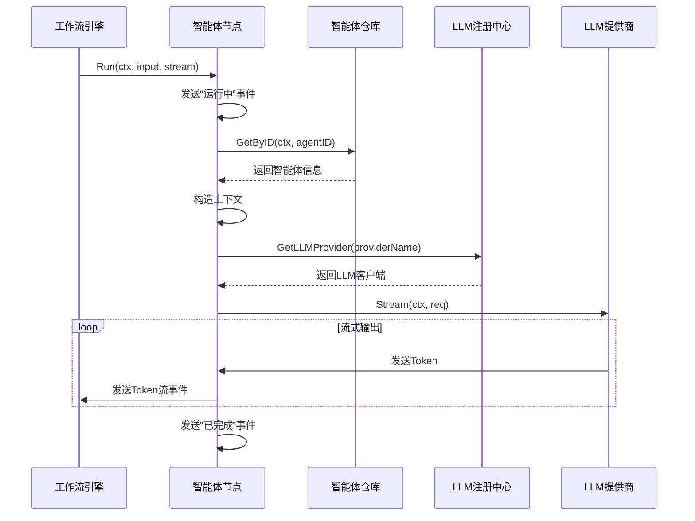
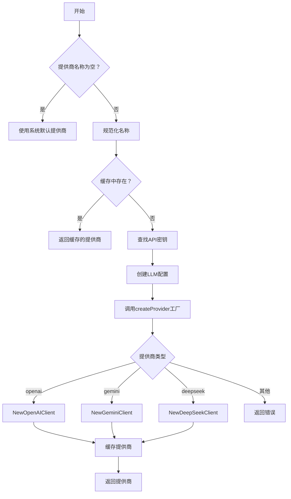

# 智能体节点

<cite>
**本文档引用文件**   
- [agent.go](file://internal/core/workflow/nodes/agent.go)
- [router.go](file://internal/infrastructure/llm/router.go)
- [WorkflowEditor.tsx](file://frontend/src/features/editor/WorkflowEditor.tsx)
- [entity.go](file://internal/core/agent/entity.go)
- [config.go](file://internal/pkg/config/config.go)
- [ModelSelector.tsx](file://frontend/src/features/agents/components/ModelSelector.tsx)
- [openai.go](file://internal/infrastructure/llm/openai.go)
- [gemini.go](file://internal/infrastructure/llm/gemini.go)
- [engine.go](file://internal/core/workflow/engine.go)
</cite>

## 目录
1. [引言](#引言)
2. [执行机制与集成架构](#执行机制与集成架构)
3. [LLM调用逻辑与提供商路由](#llm调用逻辑与提供商路由)
4. [流式输出、Token计费与超时控制](#流式输出token计费与超时控制)
5. [前端参数配置面板](#前端参数配置面板)
6. [性能优化建议](#性能优化建议)
7. [异常处理与重试失败案例](#异常处理与重试失败案例)
8. [结论](#结论)

## 引言

智能体节点（Agent Node）是本系统工作流引擎中的核心执行单元，负责封装大语言模型（LLM）的调用逻辑。该节点通过灵活的路由机制选择指定的LLM提供商（如OpenAI、Gemini等），并执行提示词注入、上下文填充和响应解析等关键任务。本文档将深入解析其执行机制与集成架构，涵盖从后端处理策略到前端配置绑定的完整流程，并提供性能优化建议与异常处理方案。

## 执行机制与集成架构

智能体节点的执行由工作流引擎驱动，其核心逻辑位于 `internal/core/workflow/nodes/agent.go` 文件中。`AgentProcessor` 结构体实现了 `NodeProcessor` 接口，其 `Process` 方法定义了节点的执行流程。

执行流程始于向流式通道（`stream`）发送“运行中”状态事件。随后，处理器通过 `AgentRepo` 从数据库获取指定智能体（Agent）的详细信息，包括其人格提示词（`PersonaPrompt`）和模型配置（`ModelConfig`）。输入数据（`input`）被构造成上下文字符串，作为用户消息传递给LLM。通过 `Registry.GetLLMProvider` 方法，系统根据智能体配置的提供商名称解析并获取对应的LLM客户端。最终，系统发起流式调用，并将生成的Token逐个通过流式通道返回，直至完成。



**图表来源**
- [agent.go](file://internal/core/workflow/nodes/agent.go#L23-L124)
- [engine.go](file://internal/core/workflow/engine.go#L101)

**本节来源**
- [agent.go](file://internal/core/workflow/nodes/agent.go#L16-L129)

## LLM调用逻辑与提供商路由

智能体节点通过 `internal/infrastructure/llm/router.go` 中的 `Registry` 结构体实现LLM提供商的动态路由。`Registry` 作为一个注册中心，管理着所有可用的LLM提供商实例。

当 `AgentProcessor` 需要调用LLM时，它会调用 `Registry.GetLLMProvider(providerName)` 方法。该方法首先检查内部缓存，若未命中，则根据 `providerName` 从全局配置（`config.Config`）中查找对应的API密钥和基础URL。系统支持多种提供商，包括 "openai"、"gemini"、"deepseek" 等。根据提供商名称，系统会初始化相应的客户端（如 `NewOpenAIClient` 或 `NewGeminiClient`），并将其缓存以供后续复用。如果智能体未指定模型，系统会使用 `GetDefaultModel()` 方法提供的默认模型作为后备。



**图表来源**
- [router.go](file://internal/infrastructure/llm/router.go#L37-L108)
- [config.go](file://internal/pkg/config/config.go#L8-L132)

**本节来源**
- [router.go](file://internal/infrastructure/llm/router.go#L11-L150)
- [config.go](file://internal/pkg/config/config.go#L8-L132)

## 流式输出、Token计费与超时控制

智能体节点支持流式输出，以提供更佳的用户体验。在 `agent.go` 的 `Process` 方法中，`provider.Stream(ctx, req)` 返回两个通道：`tokenStream` 和 `errChan`。系统通过一个 `select` 循环同时监听这两个通道以及上下文（`ctx`）的取消信号。

当从 `tokenStream` 通道接收到Token时，系统会立即将其写入 `responseBuilder` 并通过 `stream` 通道向客户端发送一个 `token_stream` 事件。任何来自 `errChan` 的错误都会导致整个处理过程失败并返回。此外，`ctx.Done()` 的监听确保了当请求超时或被取消时，节点能够优雅地终止执行。关于Token计费，虽然核心处理逻辑中未直接计算费用，但 `CompletionResponse` 结构体包含了 `Usage` 信息（`PromptTokens`, `CompletionTokens`, `TotalTokens`），这些数据可由工作流引擎或中间件捕获并用于后续的成本估算。

**本节来源**
- [agent.go](file://internal/core/workflow/nodes/agent.go#L80-L108)
- [openai.go](file://internal/infrastructure/llm/openai.go#L76-L129)
- [gemini.go](file://internal/infrastructure/llm/gemini.go#L116-L178)

## 前端参数配置面板

前端的智能体节点参数配置面板由 `WorkflowEditor` 组件驱动，其UI逻辑主要位于 `frontend/src/features/agents/components/ModelSelector.tsx`。该组件为用户提供了一个直观的界面来配置智能体的模型参数。

面板的核心是 `ModelSelector` 组件，它通过 `useLLMOptions` Hook 从 `/api/v1/llm/providers` 接口动态获取可用的提供商和模型列表。用户首先选择提供商，然后从该提供商支持的模型列表中选择具体模型。高级参数（如温度、Top P、最大Token数）默认隐藏，但可通过“高级参数”按钮展开。这些参数以滑块和输入框的形式呈现，允许用户精确调节。当用户调整任一参数时，`onChange` 回调函数会被触发，将新的 `ModelConfig` 对象传递给父组件，最终通过API保存到后端。

```mermaid
flowchart LR
A[ModelSelector组件] --> B[useLLMOptions Hook]
B --> C[/api/v1/llm/providers]
C --> D[获取提供商和模型列表]
D --> E[渲染下拉菜单]
E --> F[用户选择提供商和模型]
F --> G[用户调整温度/TopP/MaxTokens]
G --> H[触发onChange回调]
H --> I[更新智能体配置]
I --> J[保存到后端]
```

**图表来源**
- [ModelSelector.tsx](file://frontend/src/features/agents/components/ModelSelector.tsx#L1-L190)
- [useLLMOptions.ts](file://frontend/src/hooks/useLLMOptions.ts#L1-L27)

**本节来源**
- [ModelSelector.tsx](file://frontend/src/features/agents/components/ModelSelector.tsx#L1-L190)
- [WorkflowEditor.tsx](file://frontend/src/features/editor/WorkflowEditor.tsx#L1-L271)

## 性能优化建议

为了提升智能体节点的性能和效率，可以考虑以下优化策略：

1.  **批量请求合并**：对于需要并行执行多个智能体节点的场景（如 `NodeTypeParallel`），可以设计一个批量处理接口。该接口允许将多个请求合并为一个批次发送给LLM提供商，从而减少网络往返次数和API调用开销。这需要在 `Registry` 或 `LLMProvider` 接口中增加对批量请求的支持。

2.  **缓存命中策略**：实现一个基于输入上下文和模型配置的响应缓存。当一个智能体节点接收到与之前完全相同的输入和配置时，可以直接从缓存（如Redis）中返回结果，而无需再次调用LLM。这能显著降低延迟和成本，尤其适用于重复性任务。缓存键可以是 `sha256(input + model_config)`。

3.  **连接池与客户端复用**：确保 `Registry` 对每个提供商的客户端实例进行复用，避免为每次调用都创建新的HTTP客户端。对于支持长连接的提供商，应启用连接池以维持活跃的连接，减少握手延迟。

4.  **预热与懒加载**：对于不常用的提供商，可以采用懒加载策略，在首次请求时才初始化其客户端，以减少启动时的资源消耗。对于常用提供商，可以在系统启动时进行预热。

## 异常处理与重试失败案例

系统通过多层机制处理LLM响应异常。首先，`AgentProcessor` 的 `Process` 方法通过 `errChan` 监听流式调用中的错误，一旦发生错误（如网络中断、API限流），便会立即终止并返回。其次，`engine.go` 中的 `executeNode` 方法捕获所有错误，并通过 `emitError` 将其发送到流式通道，同时更新节点状态为“失败”。

然而，存在重试失败的案例。例如，当 `CircuitBreaker` 中间件因检测到“TOKEN_SURGE”（Token消耗激增）或“TIMEOUT”（执行超时）而触发时，它会将整个会话状态置为“SUSPENDED_LOCKED”（暂停锁定）。此时，即使底层LLM调用恢复正常，工作流也无法自动恢复执行。解锁需要通过特定的 `UnlockRequest`，提供风险陈述和安全自查，这增加了操作复杂性。另一个案例是当 `Registry` 初始化提供商失败时（如API密钥无效），该错误会被缓存，导致后续所有使用该提供商的请求都失败，即使密钥已更正，除非重启服务或手动清除缓存。

**本节来源**
- [agent.go](file://internal/core/workflow/nodes/agent.go#L98-L103)
- [engine.go](file://internal/core/workflow/engine.go#L173-L182)
- [SPEC-409-circuit-breaker.md](file://docs/specs/backend/SPEC-409-circuit-breaker.md#L36-L106)

## 结论

智能体节点通过一个清晰的架构实现了LLM调用的封装与集成。其核心在于 `AgentProcessor` 对执行流程的控制、`Registry` 对提供商的动态路由以及前端 `ModelSelector` 对用户配置的友好支持。系统已具备流式输出、上下文管理、错误处理等关键能力。未来可通过引入批量请求、智能缓存等优化策略来进一步提升性能。同时，针对 `CircuitBreaker` 导致的锁定状态等重试失败场景，需要设计更灵活的恢复机制，以增强系统的健壮性和可用性。