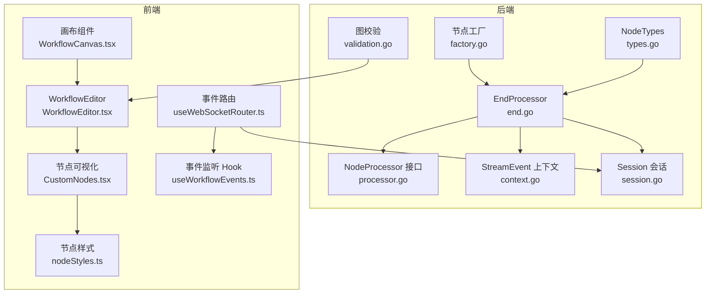
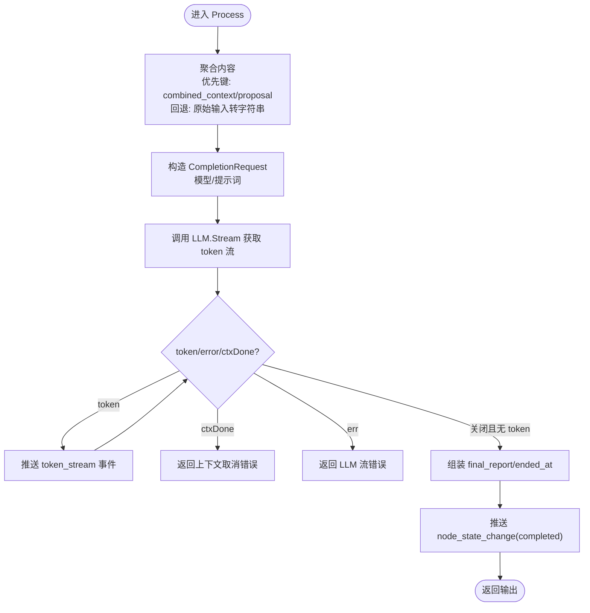
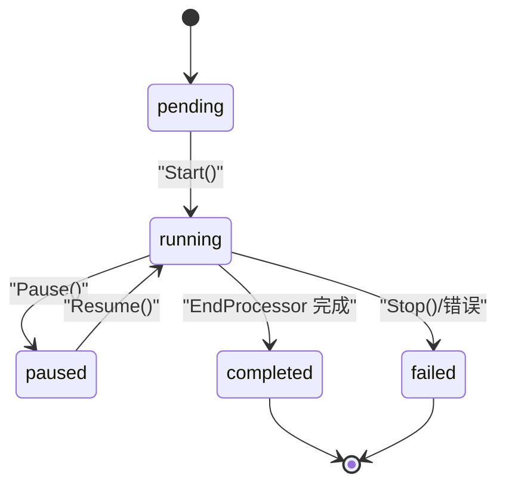
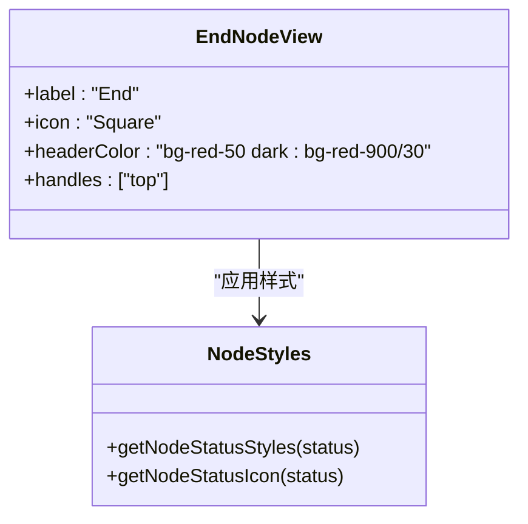
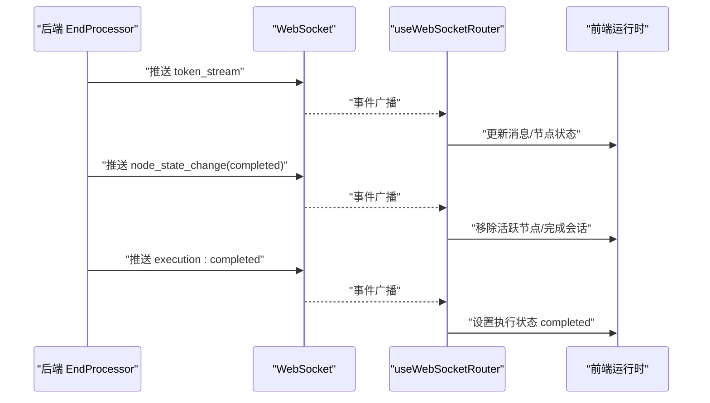
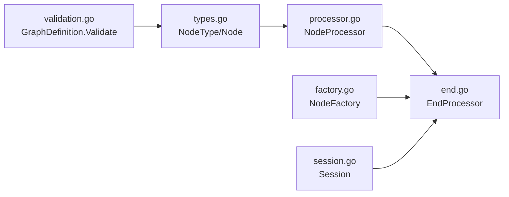

# 结束节点

<cite>
**本文引用的文件**
- [end.go](file://internal/core/workflow/nodes/end.go)
- [types.go](file://internal/core/workflow/types.go)
- [processor.go](file://internal/core/workflow/processor.go)
- [context.go](file://internal/core/workflow/context.go)
- [session.go](file://internal/core/workflow/session.go)
- [validation.go](file://internal/core/workflow/validation.go)
- [factory.go](file://internal/core/workflow/nodes/factory.go)
- [end_test.go](file://internal/core/workflow/nodes/end_test.go)
- [WorkflowEditor.tsx](file://frontend/src/features/editor/WorkflowEditor.tsx)
- [CustomNodes.tsx](file://frontend/src/components/workflow/nodes/CustomNodes.tsx)
- [nodeStyles.ts](file://frontend/src/utils/nodeStyles.ts)
- [WorkflowCanvas.tsx](file://frontend/src/components/workflow/WorkflowCanvas.tsx)
- [useWorkflowEvents.ts](file://frontend/src/hooks/useWorkflowEvents.ts)
- [useWebSocketRouter.ts](file://frontend/src/hooks/useWebSocketRouter.ts)
- [SPEC-002-workflow-run-store.md](file://docs/specs/sprint1/SPEC-002-workflow-run-store.md)
- [SPEC-005-websocket-optimization.md](file://docs/specs/sprint1/SPEC-005-websocket-optimization.md)
</cite>

## 目录
1. [简介](#简介)
2. [项目结构](#项目结构)
3. [核心组件](#核心组件)
4. [架构总览](#架构总览)
5. [详细组件分析](#详细组件分析)
6. [依赖关系分析](#依赖关系分析)
7. [性能考量](#性能考量)
8. [故障排查指南](#故障排查指南)
9. [结论](#结论)

## 简介
本文件聚焦“结束节点”在工作流生命周期中的终止语义与结果聚合功能，系统性说明：
- 结束节点如何接收上游节点的最终输出，进行内容聚合与归一化处理；
- 如何通过流式事件通知前端节点状态变化，并在完成后标记会话状态为已完成；
- 在后端对多种上游输出格式的兼容策略（如 JSON、文本、结构化对象）；
- 与会话存储系统的交互逻辑（会话状态流转、资源清理）；
- 前端 WorkflowEditor 中对该节点的视觉标识（红色终止符）与连接限制（仅允许单输入）；
- 因循环未退出导致无法到达结束节点的典型故障排查路径。

## 项目结构
围绕结束节点的关键代码分布在后端工作流引擎与前端编辑器两部分：
- 后端：节点实现、类型定义、会话管理、工厂注入、验证与上下文事件；
- 前端：编辑器画布、节点可视化、节点样式、事件路由与运行时状态管理。



图表来源
- [end.go](file://internal/core/workflow/nodes/end.go#L1-L114)
- [types.go](file://internal/core/workflow/types.go#L1-L67)
- [processor.go](file://internal/core/workflow/processor.go#L1-L14)
- [context.go](file://internal/core/workflow/context.go#L1-L35)
- [session.go](file://internal/core/workflow/session.go#L1-L165)
- [validation.go](file://internal/core/workflow/validation.go#L1-L70)
- [factory.go](file://internal/core/workflow/nodes/factory.go#L34-L76)
- [WorkflowEditor.tsx](file://frontend/src/features/editor/WorkflowEditor.tsx#L1-L271)
- [CustomNodes.tsx](file://frontend/src/components/workflow/nodes/CustomNodes.tsx#L113-L139)
- [nodeStyles.ts](file://frontend/src/utils/nodeStyles.ts#L1-L38)
- [WorkflowCanvas.tsx](file://frontend/src/components/workflow/WorkflowCanvas.tsx#L96-L120)
- [useWorkflowEvents.ts](file://frontend/src/hooks/useWorkflowEvents.ts#L1-L35)
- [useWebSocketRouter.ts](file://frontend/src/hooks/useWebSocketRouter.ts#L37-L101)

章节来源
- [end.go](file://internal/core/workflow/nodes/end.go#L1-L114)
- [WorkflowEditor.tsx](file://frontend/src/features/editor/WorkflowEditor.tsx#L1-L271)

## 核心组件
- 结束节点处理器（EndProcessor）：负责接收上游输出、聚合内容、调用 LLM 生成摘要、推送流式事件、返回最终报告并标记完成。
- 节点接口（NodeProcessor）：统一各节点的执行契约，定义 Process 方法签名。
- 会话（Session）：承载一次工作流执行的全局状态与生命周期控制。
- 图定义与校验（GraphDefinition/Validation）：确保图结构合法，包含起始节点、边连通、可达性等约束。
- 节点工厂（NodeFactory）：根据节点类型解析配置并注入 LLM 提供商。
- 前端节点可视化（CustomNodes/Styles）：为结束节点提供红色终止符样式与单输入限制的视觉提示。

章节来源
- [processor.go](file://internal/core/workflow/processor.go#L1-L14)
- [session.go](file://internal/core/workflow/session.go#L1-L165)
- [validation.go](file://internal/core/workflow/validation.go#L1-L70)
- [factory.go](file://internal/core/workflow/nodes/factory.go#L34-L76)
- [CustomNodes.tsx](file://frontend/src/components/workflow/nodes/CustomNodes.tsx#L113-L139)
- [nodeStyles.ts](file://frontend/src/utils/nodeStyles.ts#L1-L38)

## 架构总览
结束节点在工作流中的职责是作为终止点，汇总上游输出并产出最终报告。其执行流程如下：
- 接收上游节点输出（通常来自 Start/Agent/Vote/Loop 等节点）；
- 聚合内容（优先尝试特定键，否则回退到原始输入）；
- 调用 LLM 提供商生成摘要，同时通过流通道推送 token 片段；
- 输出最终报告并标记节点完成；
- 引擎侧会话状态更新为完成，触发前端事件路由与 UI 状态变更。

```mermaid
sequenceDiagram
participant Up as "上游节点"
participant End as "EndProcessor"
participant LLM as "LLM 提供商"
participant WS as "WebSocket 事件"
participant FE as "前端运行时"
Up->>End : "Process(input)"
End->>End : "聚合内容/归一化"
End->>LLM : "Stream(CompletionRequest)"
LLM-->>End : "token 流"
End->>WS : "推送 token_stream"
WS-->>FE : "事件路由/状态更新"
End->>WS : "推送 node_state_change(completed)"
WS-->>FE : "更新节点状态/完成"
End-->>Up : "返回 final_report"
```

图表来源
- [end.go](file://internal/core/workflow/nodes/end.go#L19-L113)
- [context.go](file://internal/core/workflow/context.go#L1-L35)
- [useWebSocketRouter.ts](file://frontend/src/hooks/useWebSocketRouter.ts#L37-L101)

## 详细组件分析

### 结束节点处理器（EndProcessor）
- 输入聚合与归一化
  - 优先尝试读取特定键（如 combined_context、proposal），拼接为统一内容；
  - 若无特定键，则回退到将原始输入转为字符串形式；
  - 该策略保证对多种上游输出格式的兼容（JSON、文本、结构化对象）。
- LLM 调用与流式输出
  - 使用配置的模型与提示词构建 CompletionRequest；
  - 通过 LLM.Stream 获取 token 流与错误通道；
  - 将每个 token 通过流通道推送，前端据此实时渲染。
- 输出与状态标记
  - 输出包含 final_report 与 ended_at 时间戳；
  - 推送节点完成事件，前端据此更新 UI 状态；
  - 引擎侧会话状态在上层流程中标记为完成（见会话管理章节）。



图表来源
- [end.go](file://internal/core/workflow/nodes/end.go#L19-L113)

章节来源
- [end.go](file://internal/core/workflow/nodes/end.go#L19-L113)
- [end_test.go](file://internal/core/workflow/nodes/end_test.go#L1-L52)

### 会话存储系统交互
- 会话状态管理
  - 会话包含状态枚举（pending/running/paused/completed/failed/cancelled）；
  - 启动时置为 running 并记录开始时间；
  - 完成时置为 completed 并记录结束时间，同时取消上下文以释放资源。
- 与结束节点的关系
  - 结束节点不直接操作会话状态，但其完成事件会被前端路由捕获并更新会话状态；
  - 引擎侧在工作流执行完成后统一将会话置为 completed。



图表来源
- [session.go](file://internal/core/workflow/session.go#L1-L165)

章节来源
- [session.go](file://internal/core/workflow/session.go#L1-L165)

### 前端 WorkflowEditor 中的视觉标识与连接限制
- 视觉标识
  - 结束节点使用红色主题与方形图标，标签为“End”，强调终止语义；
  - 节点样式提供状态高亮（运行中脉冲、完成绿色边框、失败红色边框）。
- 连接限制
  - 结束节点仅允许单个上游输入（即仅允许一个入边），避免多源汇聚导致歧义；
  - 编辑器画布在连接时可基于节点类型与 handles 属性进行约束（例如 Start/End 的 handles 限制）。



图表来源
- [CustomNodes.tsx](file://frontend/src/components/workflow/nodes/CustomNodes.tsx#L113-L139)
- [nodeStyles.ts](file://frontend/src/utils/nodeStyles.ts#L1-L38)

章节来源
- [CustomNodes.tsx](file://frontend/src/components/workflow/nodes/CustomNodes.tsx#L113-L139)
- [nodeStyles.ts](file://frontend/src/utils/nodeStyles.ts#L1-L38)
- [WorkflowCanvas.tsx](file://frontend/src/components/workflow/WorkflowCanvas.tsx#L96-L120)

### 事件流与前端状态同步
- 事件类型
  - token_stream：用于流式渲染 LLM 输出；
  - node_state_change：用于节点状态切换（running/completed/failed）；
  - execution:completed：用于会话整体完成。
- 前端路由
  - useWebSocketRouter 将事件分发至会话与运行时状态管理；
  - useWorkflowEvents 监听并更新节点状态与活跃节点集合；
  - 运行时状态（useWorkflowRunStore）维护执行状态、统计与控制态。



图表来源
- [end.go](file://internal/core/workflow/nodes/end.go#L19-L113)
- [useWebSocketRouter.ts](file://frontend/src/hooks/useWebSocketRouter.ts#L37-L101)
- [SPEC-005-websocket-optimization.md](file://docs/specs/sprint1/SPEC-005-websocket-optimization.md#L210-L319)
- [SPEC-002-workflow-run-store.md](file://docs/specs/sprint1/SPEC-002-workflow-run-store.md#L411-L476)

章节来源
- [useWorkflowEvents.ts](file://frontend/src/hooks/useWorkflowEvents.ts#L1-L35)
- [useWebSocketRouter.ts](file://frontend/src/hooks/useWebSocketRouter.ts#L37-L101)
- [SPEC-002-workflow-run-store.md](file://docs/specs/sprint1/SPEC-002-workflow-run-store.md#L411-L476)
- [SPEC-005-websocket-optimization.md](file://docs/specs/sprint1/SPEC-005-websocket-optimization.md#L210-L319)

## 依赖关系分析
- 节点类型与接口
  - NodeType 包含 end；NodeProcessor 定义 Process 签名；
  - EndProcessor 实现 NodeProcessor，依赖 LLM 提供商与工作流上下文事件。
- 工厂注入
  - 节点工厂根据节点类型解析属性（如模型、提示词），并注入默认 LLM 提供商给 EndProcessor。
- 图校验
  - GraphDefinition.Validate 确保起始节点存在、边连通、可达性满足要求；
  - 循环检测允许存在循环（由 Loop 节点与运行时保护机制处理），但需保证工作流最终能收敛到结束节点。



图表来源
- [types.go](file://internal/core/workflow/types.go#L1-L67)
- [processor.go](file://internal/core/workflow/processor.go#L1-L14)
- [end.go](file://internal/core/workflow/nodes/end.go#L1-L114)
- [factory.go](file://internal/core/workflow/nodes/factory.go#L34-L76)
- [validation.go](file://internal/core/workflow/validation.go#L1-L70)
- [session.go](file://internal/core/workflow/session.go#L1-L165)

章节来源
- [types.go](file://internal/core/workflow/types.go#L1-L67)
- [processor.go](file://internal/core/workflow/processor.go#L1-L14)
- [factory.go](file://internal/core/workflow/nodes/factory.go#L34-L76)
- [validation.go](file://internal/core/workflow/validation.go#L1-L70)

## 性能考量
- 流式渲染
  - EndProcessor 采用流式 token 推送，前端可即时展示，降低首屏等待时间；
  - 注意控制流通道缓冲大小与错误处理，避免阻塞或丢失事件。
- 内容聚合
  - 优先键聚合减少不必要的数据转换；
  - 对大体量输入建议在上游节点做裁剪或摘要，避免 EndProcessor 聚合成本过高。
- 会话清理
  - 会话完成后及时取消上下文，释放资源；
  - 前端路由应避免重复处理已处理事件，提高稳定性。

[本节为通用指导，无需列出具体文件来源]

## 故障排查指南
- 症状：工作流长时间卡在中间节点，无法到达结束节点
  - 可能原因：循环未退出（Loop 节点未达到退出条件）或上游节点未产生下游所需的键值；
  - 排查步骤：
    - 检查 Loop 节点的 MaxRounds 与 ExitOnScore 配置是否合理；
    - 确认上游节点是否正确输出 combined_context/proposal 等关键键；
    - 使用 GraphDefinition.Validate 校验图结构，确保无不可达节点与无效边；
    - 查看前端 node_state_change 事件是否持续推送，确认 EndProcessor 是否被触发。
- 症状：结束节点未渲染或状态未更新
  - 可能原因：前端事件路由未正确处理 node_state_change 或 execution:completed；
  - 排查步骤：
    - 检查 useWebSocketRouter 与 useWorkflowEvents 的事件映射；
    - 确认前端运行时状态（useWorkflowRunStore）是否正确更新执行状态；
    - 检查节点样式与画布组件是否正确应用 activeNodeIds。
- 症状：结束节点出现多个入边
  - 可能原因：编辑器未启用连接限制或手动修改了图结构；
  - 排查步骤：
    - 确认结束节点的 handles 限制为单输入；
    - 重新设计图结构，确保仅有一个上游节点指向 End。

章节来源
- [validation.go](file://internal/core/workflow/validation.go#L1-L70)
- [useWebSocketRouter.ts](file://frontend/src/hooks/useWebSocketRouter.ts#L37-L101)
- [SPEC-002-workflow-run-store.md](file://docs/specs/sprint1/SPEC-002-workflow-run-store.md#L411-L476)
- [CustomNodes.tsx](file://frontend/src/components/workflow/nodes/CustomNodes.tsx#L113-L139)

## 结论
结束节点在工作流生命周期中承担终止语义与结果聚合职责：它通过统一的内容归一化策略兼容多种上游输出格式，借助 LLM 生成最终报告并通过流事件驱动前端实时渲染；在完成后向会话与前端发出完成信号，推动整体执行状态的收敛。前端以红色终止符与单输入限制强化了用户对结束节点的直观认知。若工作流无法到达结束节点，应重点检查循环退出条件、上游输出键值与图结构可达性，并结合前端事件路由进行定位。