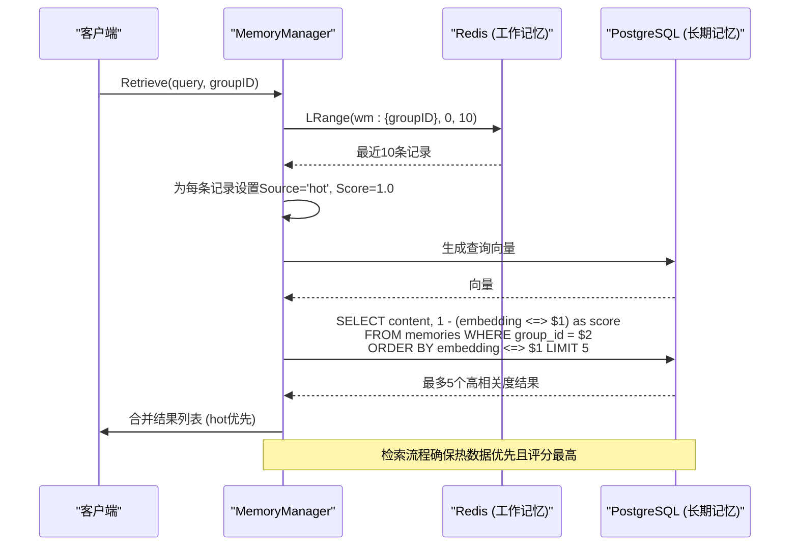
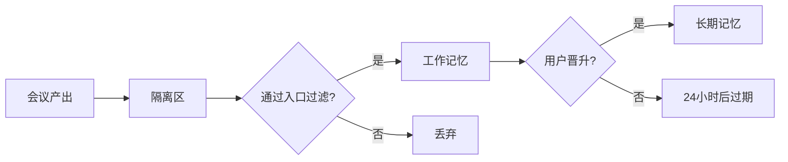

# 三层记忆集成

<cite>
**本文档引用文件**  
- [SPEC-408-memory-protocol.md](file://docs/specs/backend/SPEC-408-memory-protocol.md)
- [memory.go](file://internal/core/memory/service.go)
- [types.go](file://internal/core/memory/types.go)
- [memory_test.go](file://internal/core/memory/service_test.go)
- [redis.go](file://internal/infrastructure/cache/redis.go)
- [postgres.go](file://internal/infrastructure/db/postgres.go)
- [001_init_schema.up.sql](file://internal/infrastructure/db/migrations/001_init_schema.up.sql)
- [002_add_quarantine_logs.up.sql](file://internal/infrastructure/db/migrations/002_add_quarantine_logs.up.sql)
- [memory_handler.go](file://internal/api/handler/memory.go)
- [memory_mock.go](file://internal/infrastructure/mocks/memory_mock.go)
- [memory.md](file://docs/tdd/02_core/03_rag.md)
- [design_draft.md](file://docs/plans/design_draft.md)
- [PRD.md](file://docs/references/PRD.md)
</cite>

## 目录
1. [引言](#引言)
2. [三层记忆系统架构](#三层记忆系统架构)
3. [检索流程详解](#检索流程详解)
4. [存储介质与数据流向](#存储介质与数据流向)
5. [隔离区设计原理](#隔离区设计原理)
6. [工作记忆与长期记忆集成](#工作记忆与长期记忆集成)
7. [TTL策略与生命周期管理](#ttl策略与生命周期管理)
8. [SPEC-408协议设计意图](#spec-408协议设计意图)
9. [结论](#结论)

## 引言
本文档深入解析系统中三层记忆系统（隔离区、工作记忆、长期记忆）在检索过程中的集成机制。基于SPEC-408记忆净化协议，系统通过分层架构解决传统RAG（检索增强生成）中的“记忆污染”与“归档时滞”问题。文档将详细说明Retrieve函数如何优先从Redis中读取工作记忆的最近10条记录，并赋予最高相关度评分；随后通过pgvector执行向量相似度搜索从长期记忆中获取最多5个高相关度结果。同时，解释为何隔离区内容不直接参与RAG检索，仅作为晋升源，确保知识质量控制。

**Section sources**
- [PRD.md](file://docs/references/PRD.md#L140-L168)
- [memory.md](file://docs/tdd/02_core/03_rag.md#L1-L18)
- [design_draft.md](file://docs/plans/design_draft.md#L102-L123)

## 三层记忆系统架构
系统采用严格的三层数据流转架构，每一层具有明确的职责、存储介质和生命周期策略。

```mermaid
graph TD
A[用户交互层] --> B[隔离区 (Quarantine)]
B --> C[工作记忆 (Working Memory)]
C --> D[长期记忆 (Long-Term Memory)]
subgraph "隔离区"
B["- 会议原始产出，物理隔离<br/>- TTL: 永久 (直至晋升或删除)<br/>- 存储: PostgreSQL (quarantine_logs)"]
end
subgraph "工作记忆"
C["- 热缓存，入口过滤<br/>- TTL: 24小时<br/>- Scope: Project ID 隔离<br/>- 存储: Redis (wm:{project_id})"]
end
subgraph "长期记忆"
D["- 经验证的高价值知识<br/>- 向量化存储<br/>- TTL: 永久<br/>- 存储: pgvector (memories)"]
end
```

**Diagram sources**
- [SPEC-408-memory-protocol.md](file://docs/specs/backend/SPEC-408-memory-protocol.md#L10-L36)
- [PRD.md](file://docs/references/PRD.md#L142-L154)

## 检索流程详解
`Retrieve`函数是三层记忆系统集成的核心，它实现了混合检索策略，优先从热缓存中获取最新上下文，再从长期记忆中补充高相关度知识。



**Diagram sources**
- [memory.go](file://internal/core/memory/service.go#L159-L208)
- [memory_test.go](file://internal/core/memory/service_test.go#L96-L122)

**Section sources**
- [memory.go](file://internal/core/memory/service.go#L159-L208)
- [memory_test.go](file://internal/core/memory/service_test.go#L96-L122)

## 存储介质与数据流向
三层记忆系统采用不同的存储介质，以优化性能、成本和可靠性。

| 层级 | 名称 | 存储介质 | 数据库表 | 关键操作 |
| :--- | :--- | :--- | :--- | :--- |
| **Tier 1** | **记忆隔离区** | PostgreSQL | `quarantine_logs` | 插入原始会议产出 |
| **Tier 2** | **工作记忆** | Redis | `wm:{project_id}` (List) | LPUSH, LRange, Expire |
| **Tier 3** | **长期记忆** | pgvector (PostgreSQL) | `memories` | 向量插入, 相似度搜索 |

数据流向遵循严格的单向晋升路径：会议产出首先写入隔离区，通过入口过滤后进入工作记忆，最终由用户确认后晋升至长期记忆。



**Diagram sources**
- [001_init_schema.up.sql](file://internal/infrastructure/db/migrations/001_init_schema.up.sql#L80-L95)
- [002_add_quarantine_logs.up.sql](file://internal/infrastructure/db/migrations/002_add_quarantine_logs.up.sql#L1-L10)
- [redis.go](file://internal/infrastructure/cache/redis.go#L1-L51)
- [postgres.go](file://internal/infrastructure/db/postgres.go#L1-L66)

**Section sources**
- [001_init_schema.up.sql](file://internal/infrastructure/db/migrations/001_init_schema.up.sql#L80-L95)
- [002_add_quarantine_logs.up.sql](file://internal/infrastructure/db/migrations/002_add_quarantine_logs.up.sql#L1-L10)

## 隔离区设计原理
隔离区是三层记忆系统的第一道防线，其设计核心在于“物理隔离”和“不参与检索”。

### 核心功能
- **物理隔离**：所有会议产生的原始知识点和结论默认进入`quarantine_logs`表，与核心向量库完全隔离。
- **防污染**：防止低质量、未经验证或包含幻觉的内容直接污染长期记忆库。
- **审计与简报**：为后台审计和生成“知识晋升简报”提供原始数据源。

### 为何不参与RAG检索
隔离区内容不参与RAG检索是SPEC-408协议的关键设计。其原因如下：
1. **质量控制**：隔离区内容未经验证，可能包含幻觉、矛盾或低价值信息，直接检索会降低系统可靠性。
2. **晋升机制**：隔离区是“晋升源”，而非“知识源”。只有经过用户确认的高价值洞察才能晋升，确保长期记忆库的纯净。
3. **风险隔离**：将未经验证的知识与已验证知识分离，形成有效的风险控制层。

**Section sources**
- [SPEC-408-memory-protocol.md](file://docs/specs/backend/SPEC-408-memory-protocol.md#L59-L82)
- [PRD.md](file://docs/references/PRD.md#L142-L145)
- [memory.md](file://docs/tdd/02_core/03_rag.md#L7-L12)

## 工作记忆与长期记忆集成
工作记忆与长期记忆的集成是检索性能和上下文连贯性的关键。

### 工作记忆 (Working Memory)
- **存储**：Redis List，键名为`wm:{project_id}`。
- **读取**：`Retrieve`函数使用`LRange`命令获取最近10条记录。
- **评分**：所有工作记忆条目在检索结果中被赋予`Score: 1.0`，表示最高相关度和时效性。
- **入口过滤**：写入时进行双重过滤：
  - **置信度过滤**：`metadata["confidence"] >= 0.8`。
  - **内容长度过滤**：`len(content) >= 50`字符，避免噪声。

### 长期记忆 (Long-Term Memory)
- **存储**：PostgreSQL的`memories`表，`embedding`字段为`VECTOR(1536)`类型。
- **检索**：使用`<=>`操作符（余弦距离）进行向量相似度搜索。
- **查询**：`SELECT content, 1 - (embedding <=> $1) as score ... LIMIT 5`，返回最多5个最相关的结果。
- **评分**：相关度评分在0.0到1.0之间动态计算。

集成策略确保了检索结果既包含最新的会话上下文（来自工作记忆），又包含经过验证的历史知识（来自长期记忆）。

**Section sources**
- [memory.go](file://internal/core/memory/service.go#L60-L97)
- [memory.go](file://internal/core/memory/service.go#L162-L208)
- [SPEC-408-memory-protocol.md](file://docs/specs/backend/SPEC-408-memory-protocol.md#L85-L128)

## TTL策略与生命周期管理
各层记忆的生命周期由明确的TTL策略管理，确保数据的新鲜度和存储效率。

| 层级 | TTL策略 | 管理方式 |
| :--- | :--- | :--- |
| **隔离区** | 永久 | 手动处理（晋升或删除） |
| **工作记忆** | 24小时 | Redis `Expire`命令自动过期 |
| **长期记忆** | 永久 | 除非手动删除，否则永久保留 |

工作记忆的TTL通过`cache.Expire(ctx, key, 24*time.Hour)`在写入时设置。Redis会自动清理过期的键，无需额外的清理任务。

**Section sources**
- [memory.go](file://internal/core/memory/service.go#L91)
- [SPEC-408-memory-protocol.md](file://docs/specs/backend/SPEC-408-memory-protocol.md#L19-L27)

## SPEC-408协议设计意图
SPEC-408记忆净化协议的设计意图是构建一个可靠、高效且安全的知识管理系统。

### 核心目标
1. **解决记忆污染**：通过隔离区和入口过滤，防止低质量内容进入核心知识库。
2. **消除归档时滞**：通过工作记忆层，填补“产生”到“晋升”之间的知识真空期，确保短期上下文可用。
3. **保障知识质量**：强制“人机回环”，用户必须主动确认才能将知识晋升，避免自动化带来的风险。

### 设计哲学
该协议体现了“延迟决策”和“风险分层”的设计哲学。它不追求完全自动化的知识管理，而是通过分层和人工干预，确保系统在追求效率的同时，不牺牲可靠性和安全性。这与PRD中“防集体幻觉传播”的根本目标完全一致。

**Section sources**
- [SPEC-408-memory-protocol.md](file://docs/specs/backend/SPEC-408-memory-protocol.md#L1-L207)
- [PRD.md](file://docs/references/PRD.md#L140-L168)
- [design_draft.md](file://docs/plans/design_draft.md#L102-L123)

## 结论
三层记忆系统通过隔离区、工作记忆和长期记忆的协同工作，实现了高效、可靠的知识检索。`Retrieve`函数优先从Redis工作记忆中获取最近10条记录并赋予最高评分，确保了上下文的时效性；随后从pgvector长期记忆中获取最多5个高相关度结果，保证了知识的深度。隔离区作为晋升源而非检索源，有效控制了知识质量。不同的存储介质（PostgreSQL vs Redis）和TTL策略体现了SPEC-408协议在性能、成本和可靠性之间的精妙平衡。这一设计成功解决了传统RAG系统的两大痛点，为构建可信的AI决策系统奠定了坚实基础。