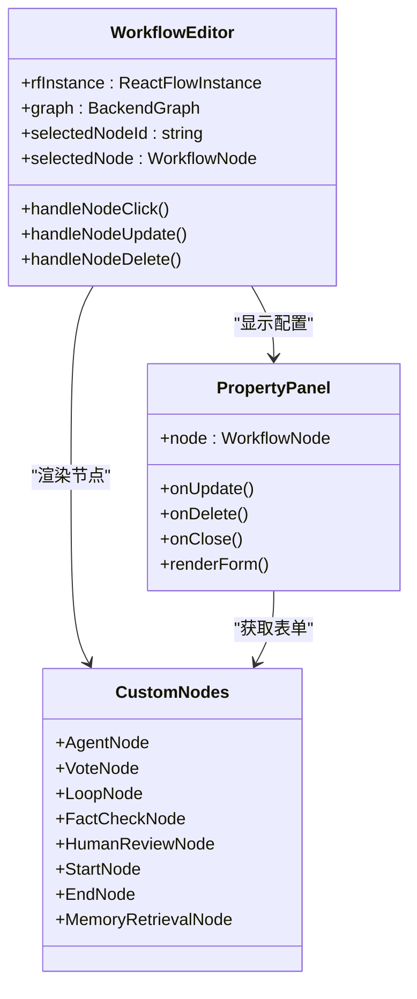
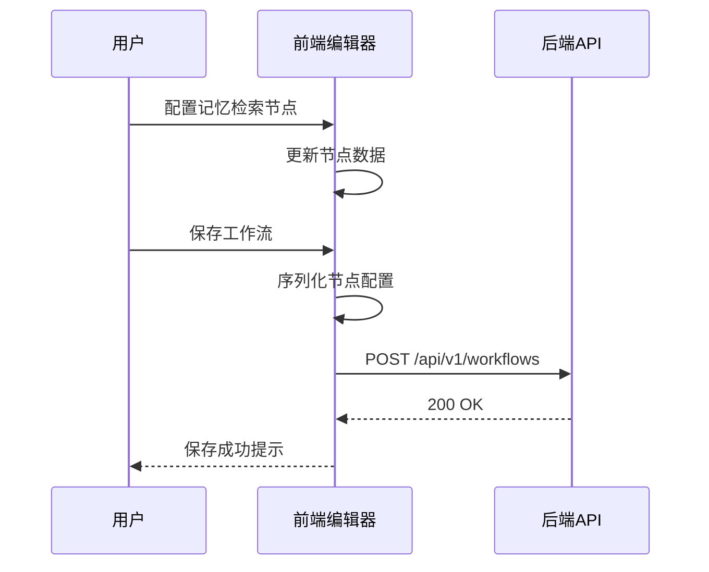
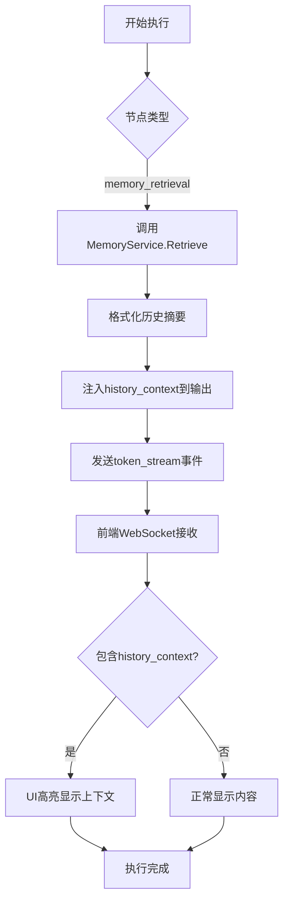

# 前端工作流编辑器集成

<cite>
**本文档引用的文件**  
- [WorkflowEditor.tsx](file://frontend/src/features/editor/WorkflowEditor.tsx)
- [PropertyPanel.tsx](file://frontend/src/features/editor/components/PropertyPanel/PropertyPanel.tsx)
- [CustomNodes.tsx](file://frontend/src/components/workflow/nodes/CustomNodes.tsx)
- [memory_retrieval.go](file://internal/core/workflow/nodes/memory_retrieval.go)
- [SPEC-607-memory-retrieval-node.md](file://docs/specs/sprint6/SPEC-607-memory-retrieval-node.md)
- [useWebSocketRouter.ts](file://frontend/src/hooks/useWebSocketRouter.ts)
- [websocket.ts](file://frontend/src/types/websocket.ts)
- [useWorkflowRunStore.ts](file://frontend/src/stores/useWorkflowRunStore.ts)
</cite>

## 目录
1. [简介](#简介)
2. [记忆检索节点配置](#记忆检索节点配置)
3. [节点注册与渲染机制](#节点注册与渲染机制)
4. [配置序列化与后端通信](#配置序列化与后端通信)
5. [执行时上下文注入与UI反馈](#执行时上下文注入与ui反馈)
6. [结论](#结论)

## 简介
本文档详细描述了记忆检索节点在前端工作流编辑器中的集成方式。该节点允许用户在工作流中自动检索历史上下文，并将其注入到后续处理流程中。文档涵盖了从用户界面配置、节点注册机制到后端通信和执行反馈的完整流程。

## 记忆检索节点配置
用户通过属性面板配置记忆检索节点的各项参数。当用户在工作流画布中选中`memory_retrieval`类型的节点时，右侧的属性面板会显示相应的配置选项。

配置面板包含以下可配置字段：
- **最大结果数**：指定检索返回的最大历史条目数量
- **时间范围（天）**：设置检索的时间窗口范围
- **相关性阈值**：定义检索结果的相关性分数阈值
- **包含裁决结果**：布尔选项，决定是否包含系统之前的决策结果

面板还提供实时预览功能，显示根据当前配置将执行的检索操作描述，帮助用户理解配置效果。

**Section sources**
- [PropertyPanel.tsx](file://frontend/src/features/editor/components/PropertyPanel/PropertyPanel.tsx#L21-L41)
- [SPEC-607-memory-retrieval-node.md](file://docs/specs/sprint6/SPEC-607-memory-retrieval-node.md#L214-L234)

## 节点注册与渲染机制
前端工作流编辑器通过`WorkflowEditor.tsx`组件管理节点的注册和渲染。自定义节点的渲染逻辑在`CustomNodes.tsx`文件中定义。

**Diagram sources**
- [WorkflowEditor.tsx](file://frontend/src/features/editor/WorkflowEditor.tsx#L15-L269)
- [CustomNodes.tsx](file://frontend/src/components/workflow/nodes/CustomNodes.tsx#L1-L28)
- [PropertyPanel.tsx](file://frontend/src/features/editor/components/PropertyPanel/PropertyPanel.tsx#L1-L85)

## 配置序列化与后端通信
当用户配置完记忆检索节点并保存工作流时，前端会将节点配置序列化为后端可识别的格式。`WorkflowEditor.tsx`组件中的`handleSave`函数负责将React Flow节点和边转换为后端图结构。

节点的配置数据通过`properties`字段持久化，包含用户在属性面板中设置的所有参数。序列化后的数据通过HTTP API提交到后端，存储为工作流定义的一部分。

**Diagram sources**
- [WorkflowEditor.tsx](file://frontend/src/features/editor/WorkflowEditor.tsx#L69-L133)
- [memory_retrieval.go](file://internal/core/workflow/nodes/memory_retrieval.go#L58-L114)

## 执行时上下文注入与UI反馈
工作流执行时，后端的`MemoryRetrievalProcessor`会根据节点配置从记忆系统检索相关历史。检索到的上下文内容会被注入到输出`Context`中，以`history_context`字段的形式传递给后续节点。

前端通过WebSocket接收执行结果。`useWebSocketRouter.ts`中的消息路由器会处理`token_stream`事件，当检测到包含`history_context`的内容时，在UI中进行特殊高亮显示。

**Diagram sources**
- [memory_retrieval.go](file://internal/core/workflow/nodes/memory_retrieval.go#L82-L105)
- [useWebSocketRouter.ts](file://frontend/src/hooks/useWebSocketRouter.ts#L17-L34)
- [websocket.ts](file://frontend/src/types/websocket.ts#L1-L52)

## 结论
记忆检索节点的集成实现了从用户配置到执行反馈的完整闭环。前端工作流编辑器通过灵活的节点注册机制和属性面板系统，为用户提供直观的配置界面。配置数据被正确序列化并提交到后端，在执行时通过WebSocket实时反馈上下文注入结果，实现了高效的工作流自动化能力。