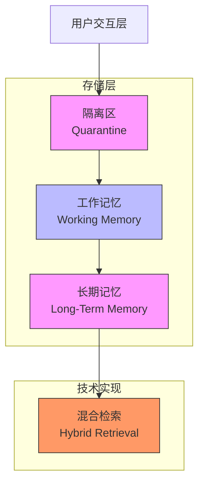

# 检索性能优化

<cite>
**本文档引用的文件**  
- [service.go](file://internal/core/memory/service.go)
- [memory_retrieval.go](file://internal/core/workflow/nodes/memory_retrieval.go)
- [redis.go](file://internal/infrastructure/cache/redis.go)
- [postgres.go](file://internal/infrastructure/db/postgres.go)
- [001_init_schema.up.sql](file://internal/infrastructure/db/migrations/001_init_schema.up.sql)
- [config.go](file://internal/pkg/config/config.go)
- [memory.go](file://internal/core/middleware/memory.go)
- [memory.go](file://internal/api/handler/memory.go)
</cite>

## 目录
1. [引言](#引言)
2. [系统架构概述](#系统架构概述)
3. [核心组件分析](#核心组件分析)
4. [缓存策略优化](#缓存策略优化)
5. [数据库索引与查询优化](#数据库索引与查询优化)
6. [嵌入式请求优化](#嵌入式请求优化)
7. [节流与调用频率控制](#节流与调用频率控制)
8. [结论](#结论)

## 引言
本文档旨在为“Council”系统提供关于记忆检索性能优化的实用指南。该系统采用三层记忆协议（隔离区、工作记忆、长期记忆），结合Redis与PostgreSQL/pgvector实现高效的数据存储与检索。本文将深入分析现有架构，并提出一系列性能优化建议，涵盖缓存策略、数据库索引、批量嵌入请求及调用节流机制，以确保系统在高并发场景下的响应速度与稳定性。

## 系统架构概述

该系统采用分层记忆架构，数据流从用户交互层经由三层存储，最终实现高效的混合检索。



**图示来源**  
- [SPEC-408-memory-protocol.md](file://docs/specs/backend/SPEC-408-memory-protocol.md)

## 核心组件分析

系统的核心记忆服务由`memory.Service`实现，它协调嵌入模型、PostgreSQL数据库和Redis缓存。

### 记忆服务（Memory Service）
`memory.Service`是整个记忆系统的核心，负责管理三层记忆的写入与检索。

**组件来源**  
- [service.go](file://internal/core/memory/service.go#L14-L25)

### 检索处理器（Memory Retrieval Processor）
`MemoryRetrievalProcessor`是工作流中的一个节点处理器，它在执行时调用`memory.Service.Retrieve`方法，从记忆系统中获取与当前话题相关的上下文，并将其注入到工作流的输出中。

**组件来源**  
- [memory_retrieval.go](file://internal/core/workflow/nodes/memory_retrieval.go#L13-L23)

## 缓存策略优化

Redis被用作工作记忆（Working Memory）的存储，提供低延迟的热点数据访问。

### Redis工作记忆实现
系统通过`UpdateWorkingMemory`方法将数据写入Redis的List结构中。其关键优化点包括：
- **入口过滤（Ingress Filter）**：在写入前检查内容的置信度分数（`confidence`），低于0.8的将被拒绝。
- **TTL（生存时间）**：通过`Expire`命令为每个`wm:{groupID}`键设置24小时的过期时间，确保数据不会无限增长。
- **最大条目数（LTrim）**：通过`LTrim`命令将List的长度限制在50个条目以内，保留最新的数据，防止内存溢出。

```go
// 伪代码表示关键逻辑
s.cache.LPush(ctx, key, content) // 写入列表头部
s.cache.Expire(ctx, key, 24*time.Hour) // 设置TTL
s.cache.LTrim(ctx, key, 0, 49) // 保留前50个元素
```

**组件来源**  
- [service.go](file://internal/core/memory/service.go#L60-L94)
- [redis.go](file://internal/infrastructure/cache/redis.go#L16-L38)

### 检索优化建议
在检索时，系统优先从Redis获取最新的10条记录（`LRange(ctx, key, 0, 10)`），这些数据被视为“热”数据，具有最高的相关性。这种设计极大地减少了对数据库的查询压力，提升了响应速度。

## 数据库索引与查询优化

PostgreSQL的`pgvector`扩展被用于存储和检索长期记忆（Long-Term Memory）的向量数据。

### pgvector索引现状
根据数据库迁移脚本，系统已为`memories`表的`embedding`字段创建了IVFFlat索引：
```sql
CREATE INDEX idx_memories_embedding ON memories USING ivfflat (embedding vector_cosine_ops) WITH (lists = 100);
```
此索引使用余弦相似度操作符，并配置了100个列表（lists），适用于中等规模的数据集。

**组件来源**  
- [001_init_schema.up.sql](file://internal/infrastructure/db/migrations/001_init_schema.up.sql#L95)

### 性能优化建议
尽管IVFFlat索引已被创建，但为了获得更优的检索性能，特别是当数据量增长时，建议将索引类型升级为HNSW（Hierarchical Navigable Small World）。

- **HNSW vs IVFFlat**：HNSW索引在查询精度和速度上通常优于IVFFlat，尤其是在高维向量空间中。它通过构建分层图结构来实现更高效的最近邻搜索。
- **实施建议**：可以执行以下SQL命令来创建HNSW索引，并在验证性能提升后删除旧的IVFFlat索引。
```sql
-- 创建HNSW索引
CREATE INDEX idx_memories_embedding_hnsw ON memories 
USING hnsw (embedding vector_cosine_ops) 
WITH (m = 16, ef_construction = 64);

-- （可选）删除旧的IVFFlat索引以节省空间
-- DROP INDEX idx_memories_embedding;
```

## 嵌入式请求优化

向量嵌入的生成是检索流程中的关键步骤，其性能直接影响整体延迟。

### 批量嵌入请求
当前的`Promote`方法在将内容存入长期记忆时，会对每个文本块（chunk）**逐一**调用嵌入模型（`s.Embedder.Embed`）。这是一个显著的性能瓶颈。

**组件来源**  
- [service.go](file://internal/core/memory/service.go#L130-L134)

### 优化建议
应利用LLM提供商的**批量嵌入（Batch Embedding）** API。大多数嵌入模型（如OpenAI, SiliconFlow）都支持在一次API调用中处理多个文本，这可以显著减少网络往返延迟和API调用次数。

- **实施路径**：修改`Promote`方法，收集所有需要嵌入的文本块，然后通过`Embedder`的批量接口一次性发送。这需要`llm.Embedder`接口增加一个`EmbedBatch`方法。

### 结果缓存
对于高频查询，可以实施结果缓存策略。例如，可以将`Retrieve`方法的查询结果（或其哈希值）缓存在Redis中，设置一个较短的TTL（如5分钟）。当下次收到相同或高度相似的查询时，可直接返回缓存结果，避免重复的向量计算和数据库查询。

## 节流与调用频率控制

为防止系统因过度频繁的检索操作而过载，必须实施节流机制。

### 风险分析
`MemoryRetrievalProcessor`在每次工作流节点执行后都可能被触发，如果工作流设计不当或用户频繁操作，可能导致短时间内产生大量检索请求，对数据库和嵌入模型造成巨大压力。

### 优化建议
应在`memory.Service.Retrieve`方法或其调用者（如`MemoryRetrievalProcessor`）中引入节流（Throttling）或速率限制（Rate Limiting）机制。

- **实现方式**：可以使用令牌桶（Token Bucket）或漏桶（Leaky Bucket）算法。例如，限制每个`groupID`每分钟最多执行10次检索操作。
- **技术实现**：可以利用Redis的`INCR`和`EXPIRE`命令来实现一个简单的分布式计数器，或使用专门的库如`golang.org/x/time/rate`（需确保在分布式环境中的一致性）。

## 结论
通过对“Council”系统的分析，我们确认其已具备一个结构良好的三层记忆架构。为了进一步提升检索性能，建议采取以下综合措施：
1.  **数据库索引**：将`pgvector`的索引从IVFFlat升级为HNSW，以获得更优的向量搜索性能。
2.  **缓存策略**：充分利用Redis作为工作记忆的优势，其24小时TTL和50条目的LTrim策略已为平衡内存与命中率提供了良好基础。
3.  **嵌入优化**：重构代码以支持批量嵌入请求，并对高频查询结果进行缓存，从而大幅降低LLM调用延迟。
4.  **调用控制**：实施节流机制，防止因过度频繁的检索操作而导致系统过载。

通过实施这些优化，系统将能够在保证数据准确性和一致性的前提下，显著提升响应速度和用户体验。