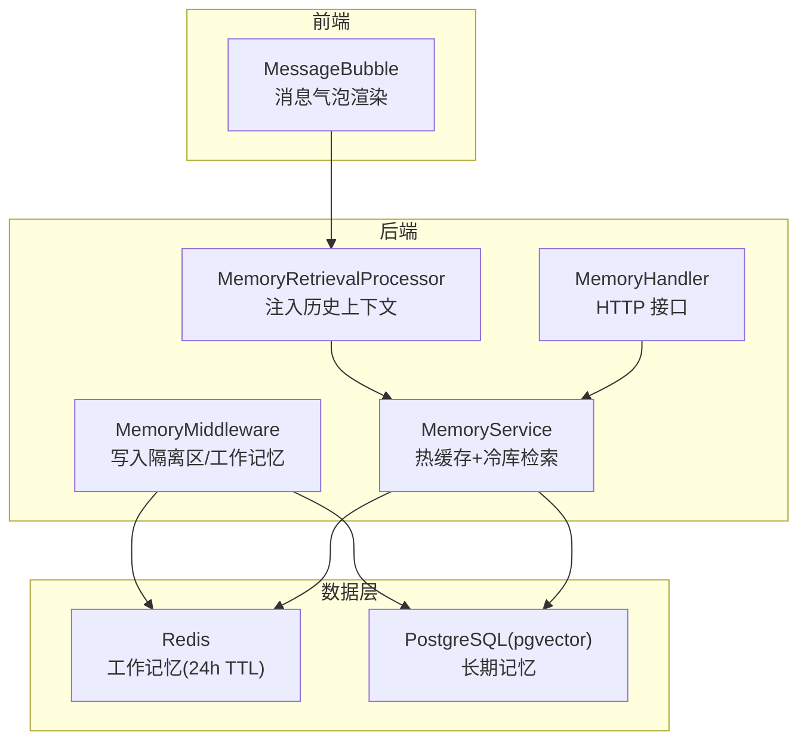
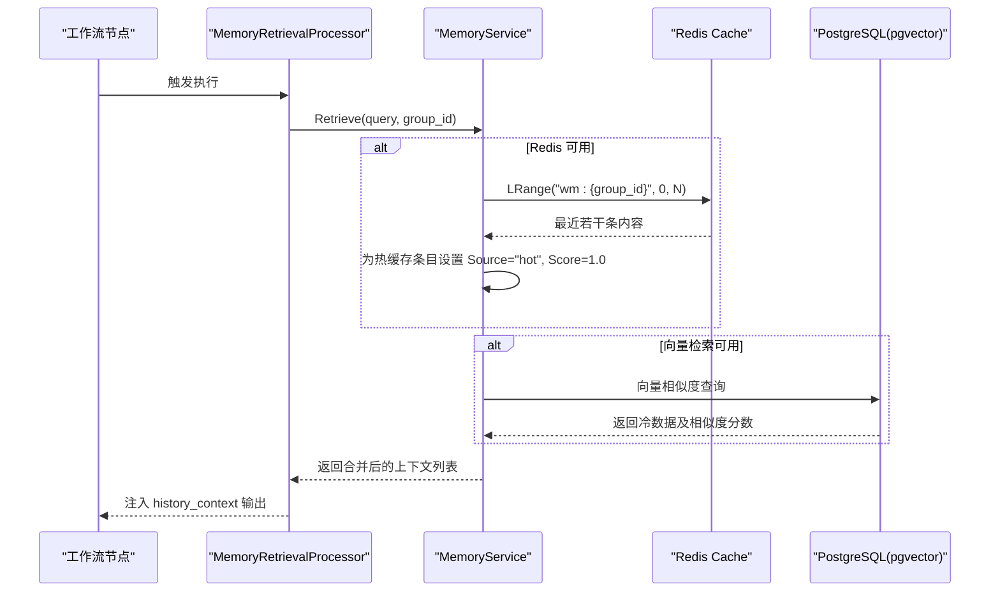
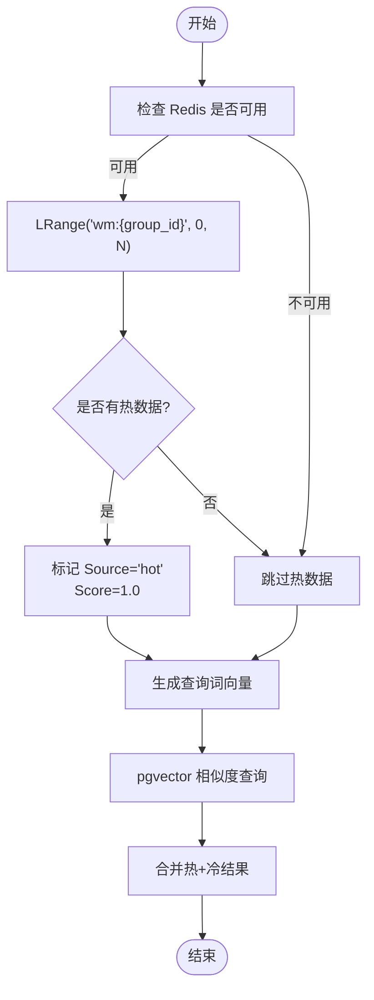
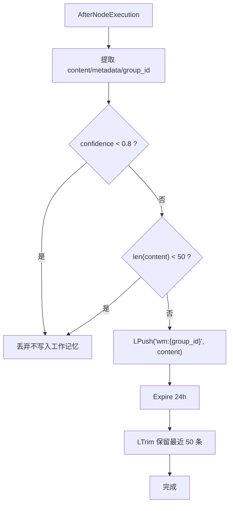
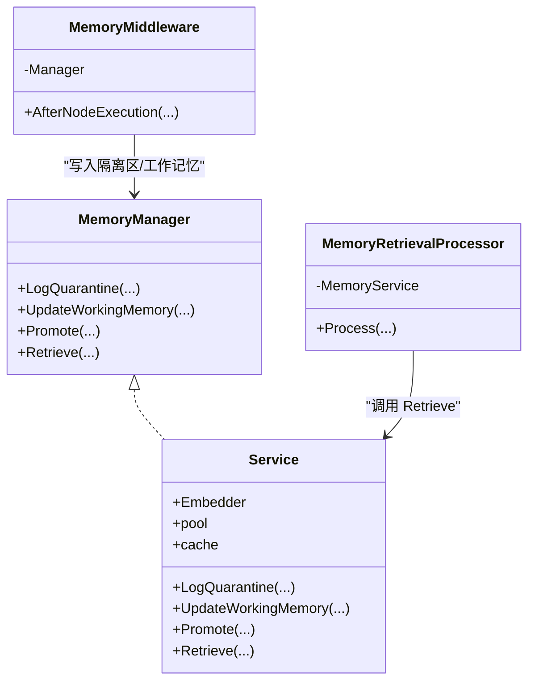

# 工作记忆检索行为

<cite>
**本文引用的文件**
- [service.go](file://internal/core/memory/service.go)
- [types.go](file://internal/core/memory/types.go)
- [redis.go](file://internal/infrastructure/cache/redis.go)
- [memory.go](file://internal/core/middleware/memory.go)
- [memory_retrieval.go](file://internal/core/workflow/nodes/memory_retrieval.go)
- [SPEC-607-memory-retrieval-node.md](file://docs/specs/sprint6/SPEC-607-memory-retrieval-node.md)
- [SPEC-408-memory-protocol.md](file://docs/specs/backend/SPEC-408-memory-protocol.md)
- [SPEC-003-chat-panel-grouped.md](file://docs/specs/sprint1/SPEC-003-chat-panel-grouped.md)
- [MessageBubble.tsx](file://frontend/src/components/chat/MessageBubble.tsx)
- [memory.go](file://internal/api/handler/memory.go)
</cite>

## 目录
1. [简介](#简介)
2. [项目结构](#项目结构)
3. [核心组件](#核心组件)
4. [架构总览](#架构总览)
5. [详细组件分析](#详细组件分析)
6. [依赖关系分析](#依赖关系分析)
7. [性能考量](#性能考量)
8. [故障排查指南](#故障排查指南)
9. [结论](#结论)

## 简介
本文聚焦工作记忆（Working Memory）的检索实现，围绕 MemoryService.Retrieve 方法如何从 Redis 中按 group_id 查询最近若干条记录，并赋予“热缓存”来源的最高相关度评分（Score: 1.0）进行深入解析。同时阐明其作为热缓存的角色定位、24 小时 TTL 与最多保留 50 条的策略如何在保证数据时效性的同时兼顾性能；结合入口过滤机制（Ingress Filter），解释低置信度内容如何被拦截，从而确保注入上下文的质量；最后说明该层数据在前端展示时的“临时上下文”标识逻辑。

## 项目结构
工作记忆检索涉及后端三层记忆协议与前端消息展示两个层面：
- 后端
  - 内核层：MemoryService 提供三层记忆协议与混合检索能力
  - 中间件层：MemoryMiddleware 在节点执行后自动写入隔离区与工作记忆
  - 工作流节点：MemoryRetrievalProcessor 将检索结果注入到工作流输出
  - API 层：MemoryHandler 提供检索接口
- 前端
  - ChatPanel/MessageBubble 渲染消息，支持临时上下文的视觉提示

图表来源
- [memory.go](file://internal/core/middleware/memory.go#L1-L73)
- [service.go](file://internal/core/memory/service.go#L1-L209)
- [memory_retrieval.go](file://internal/core/workflow/nodes/memory_retrieval.go#L1-L103)
- [memory.go](file://internal/api/handler/memory.go#L1-L67)
- [redis.go](file://internal/infrastructure/cache/redis.go#L1-L51)

章节来源
- [service.go](file://internal/core/memory/service.go#L1-L209)
- [memory.go](file://internal/core/middleware/memory.go#L1-L73)
- [memory_retrieval.go](file://internal/core/workflow/nodes/memory_retrieval.go#L1-L103)
- [memory.go](file://internal/api/handler/memory.go#L1-L67)
- [redis.go](file://internal/infrastructure/cache/redis.go#L1-L51)

## 核心组件
- MemoryService：实现三层记忆协议与混合检索
  - 热缓存（Redis）：按 group_id 查询最近若干条，Score 固定为 1.0
  - 冷库（pgvector）：基于查询词向量相似度检索
- MemoryMiddleware：在节点执行后自动写入隔离区与工作记忆
- MemoryRetrievalProcessor：从 MemoryService 拉取历史上下文并注入到工作流输出
- MemoryHandler：对外暴露检索接口
- Redis 缓存：提供 LPush/LRange/LTrim/Expire 等操作

章节来源
- [service.go](file://internal/core/memory/service.go#L1-L209)
- [types.go](file://internal/core/memory/types.go#L1-L27)
- [memory.go](file://internal/core/middleware/memory.go#L1-L73)
- [memory_retrieval.go](file://internal/core/workflow/nodes/memory_retrieval.go#L1-L103)
- [memory.go](file://internal/api/handler/memory.go#L1-L67)
- [redis.go](file://internal/infrastructure/cache/redis.go#L1-L51)

## 架构总览
三层记忆协议与检索流程如下：
- Tier 1（隔离区）：所有会议产出默认进入隔离区，不参与检索
- Tier 2（工作记忆）：通过入口过滤后写入 Redis，24h TTL，最多保留 50 条
- Tier 3（长期记忆）：用户一键晋升后进入 pgvector，用于后续向量检索

图表来源
- [memory_retrieval.go](file://internal/core/workflow/nodes/memory_retrieval.go#L1-L103)
- [service.go](file://internal/core/memory/service.go#L159-L208)
- [redis.go](file://internal/infrastructure/cache/redis.go#L1-L51)

章节来源
- [SPEC-408-memory-protocol.md](file://docs/specs/backend/SPEC-408-memory-protocol.md#L59-L207)
- [service.go](file://internal/core/memory/service.go#L159-L208)
- [memory_retrieval.go](file://internal/core/workflow/nodes/memory_retrieval.go#L1-L103)

## 详细组件分析

### MemoryService.Retrieve：从 Redis 按 group_id 查询最近若干条并赋予最高相关度评分
- 热缓存（Redis）读取
  - 键名格式：wm:{group_id}
  - 读取最近若干条（实现中为最近 10 条，Score 固定为 1.0）
  - Source 标记为 "hot"
- 冷库（pgvector）回退
  - 生成查询词向量
  - 基于向量相似度检索，返回若干条（实现中为若干条，Score 为相似度）
- 结果合并
  - 热缓存优先，随后是冷数据

图表来源
- [service.go](file://internal/core/memory/service.go#L159-L208)

章节来源
- [service.go](file://internal/core/memory/service.go#L159-L208)

### 入口过滤机制（Ingress Filter）：拦截低置信度内容
- 写入工作记忆前的过滤规则
  - 置信度阈值：metadata.confidence < 0.8 则拒绝写入
  - 长度阈值：内容长度小于 50 字符则拒绝写入（短文本多噪声）
- 生效位置
  - MemoryMiddleware.AfterNodeExecution 在节点执行后调用 Manager.UpdateWorkingMemory
  - UpdateWorkingMemory 执行上述过滤后再写入 Redis

图表来源
- [memory.go](file://internal/core/middleware/memory.go#L1-L73)
- [service.go](file://internal/core/memory/service.go#L60-L97)

章节来源
- [memory.go](file://internal/core/middleware/memory.go#L1-L73)
- [service.go](file://internal/core/memory/service.go#L60-L97)

### 24 小时 TTL 与最多保留 50 条策略
- TTL：写入 Redis 后设置 24 小时过期，保障数据时效性
- 容量控制：通过 LTrim 限制列表长度为 50 条，避免无限增长
- 效果
  - 降低内存占用
  - 保证最近最相关的内容优先出现在检索结果中

章节来源
- [service.go](file://internal/core/memory/service.go#L83-L97)
- [SPEC-408-memory-protocol.md](file://docs/specs/backend/SPEC-408-memory-protocol.md#L85-L125)

### 前端展示：临时上下文标识逻辑
- 后端注入
  - MemoryRetrievalProcessor 将检索结果格式化为 Markdown 片段，注入到输出字段 history_context
- 前端渲染
  - MessageBubble 渲染消息内容，支持 Markdown 与数学公式等
  - “临时上下文”的语义由后端在历史上下文片段中标注来源（hot/cold）体现
  - 若希望在 UI 上进一步强调“临时”，可在前端根据 Source 或 Score 做样式区分（例如为 hot 条目添加淡色背景或“临时”标签）

章节来源
- [memory_retrieval.go](file://internal/core/workflow/nodes/memory_retrieval.go#L66-L103)
- [SPEC-003-chat-panel-grouped.md](file://docs/specs/sprint1/SPEC-003-chat-panel-grouped.md#L253-L291)
- [MessageBubble.tsx](file://frontend/src/components/chat/MessageBubble.tsx#L1-L76)

## 依赖关系分析
- 组件耦合
  - MemoryRetrievalProcessor 依赖 MemoryService
  - MemoryMiddleware 依赖 MemoryManager（由 MemoryService 实现）
  - MemoryService 依赖 Redis Cache 与数据库（pgvector）
- 外部依赖
  - Redis 提供高性能列表操作
  - PostgreSQL + pgvector 提供向量检索能力

图表来源
- [types.go](file://internal/core/memory/types.go#L1-L27)
- [service.go](file://internal/core/memory/service.go#L1-L209)
- [memory_retrieval.go](file://internal/core/workflow/nodes/memory_retrieval.go#L1-L103)
- [memory.go](file://internal/core/middleware/memory.go#L1-L73)

章节来源
- [types.go](file://internal/core/memory/types.go#L1-L27)
- [service.go](file://internal/core/memory/service.go#L1-L209)
- [memory_retrieval.go](file://internal/core/workflow/nodes/memory_retrieval.go#L1-L103)
- [memory.go](file://internal/core/middleware/memory.go#L1-L73)

## 性能考量
- 热缓存命中优先：Redis 列表读取 O(N)（N 为返回条数），默认最近 10 条，开销极小
- 冷库回退：向量相似度查询受返回条数与向量维度影响，建议限制返回数量
- TTL 与容量控制：24h 过期 + 最多 50 条，避免热点数据长期堆积
- 并发与连接：Redis 单例客户端，注意连接池与超时设置

[本节为通用性能讨论，无需特定文件引用]

## 故障排查指南
- Redis 连接失败
  - 现象：UpdateWorkingMemory 报错
  - 排查：确认 Redis 初始化与连通性
- 写入被过滤
  - 现象：工作记忆未更新
  - 排查：检查 metadata.confidence 与内容长度是否低于阈值
- 检索为空
  - 现象：Retrieve 返回空或仅冷数据
  - 排查：确认 group_id 是否正确；Redis 中是否存在 wm:{group_id}；向量模型是否可用
- 前端上下文未显示
  - 现象：聊天窗口未出现历史上下文
  - 排查：确认 MemoryRetrievalProcessor 是否成功注入 history_context；前端是否渲染该字段

章节来源
- [redis.go](file://internal/infrastructure/cache/redis.go#L1-L51)
- [service.go](file://internal/core/memory/service.go#L60-L97)
- [service.go](file://internal/core/memory/service.go#L159-L208)
- [memory_retrieval.go](file://internal/core/workflow/nodes/memory_retrieval.go#L66-L103)

## 结论
- MemoryService.Retrieve 通过 Redis 热缓存与 pgvector 冷库的组合，实现了高效且可控的历史上下文检索；热缓存条目统一赋予最高相关度评分，确保其在工作流中的优先地位。
- 入口过滤机制有效拦截低置信度与噪声内容，保障工作记忆质量；24h TTL 与最多 50 条的策略在时效性与性能之间取得平衡。
- 前端通过历史上下文片段与消息渲染组件，能够直观呈现“临时上下文”的来源与相关度；如需更明确的视觉提示，可在前端依据 Source 或 Score 做差异化样式。