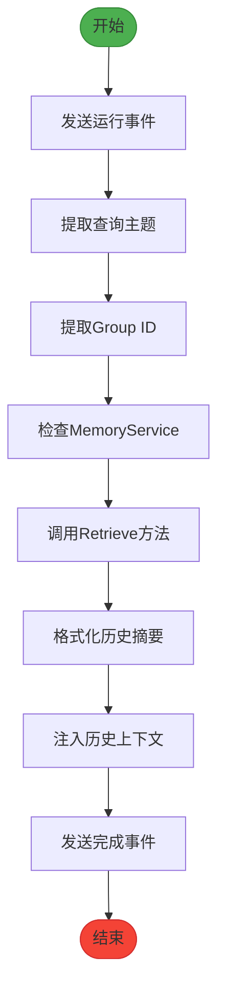
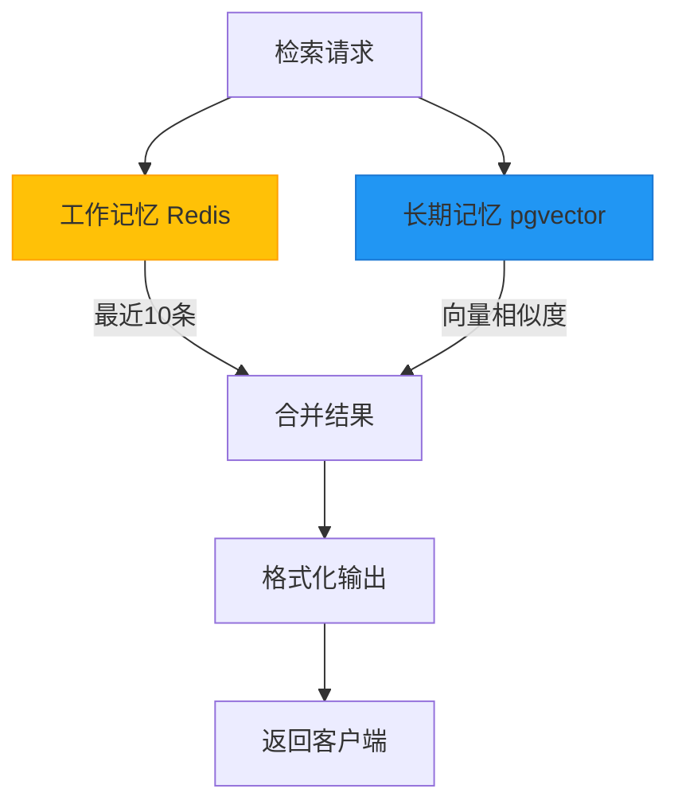
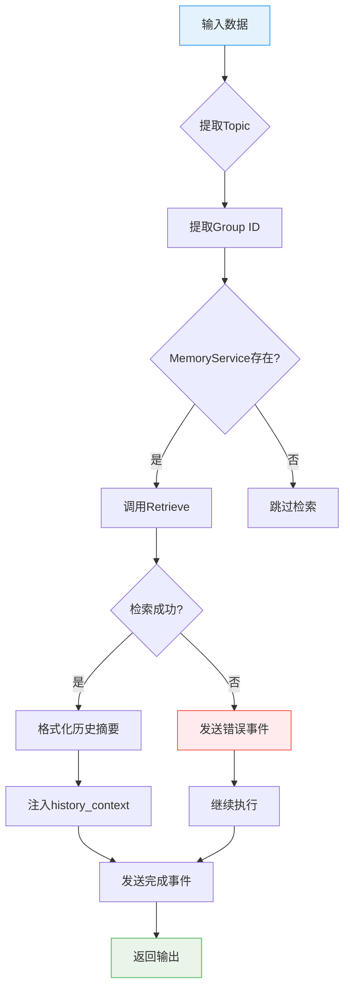

# 记忆检索机制

<cite>
**本文档引用文件**  
- [memory_retrieval.go](file://internal/core/workflow/nodes/memory_retrieval.go)
- [service.go](file://internal/core/memory/service.go)
- [types.go](file://internal/core/memory/types.go)
- [SPEC-408-memory-protocol.md](file://docs/specs/backend/SPEC-408-memory-protocol.md)
- [SPEC-607-memory-retrieval-node.md](file://docs/specs/sprint6/SPEC-607-memory-retrieval-node.md)
- [factory.go](file://internal/core/workflow/nodes/factory.go)
- [engine.go](file://internal/core/workflow/engine.go)
- [context.go](file://internal/core/workflow/context.go)
</cite>

## 目录
1. [核心检索机制](#核心检索机制)  
2. [三层记忆协议与访问路径](#三层记忆协议与访问路径)  
3. [Process方法执行流程](#process方法执行流程)  
4. [容错处理策略](#容错处理策略)  
5. [历史上下文注入实现](#历史上下文注入实现)  
6. [节点状态实时通信](#节点状态实时通信)  
7. [检索请求优先级与路径](#检索请求优先级与路径)  
8. [架构流程图](#架构流程图)

## 核心检索机制

记忆检索节点（MemoryRetrievalProcessor）是工作流中的关键逻辑节点，负责在执行过程中动态提取查询主题并定位对应上下文空间。该机制通过`Process`方法协调调用`MemoryService.Retrieve`进行跨层级数据获取。

检索机制首先从输入参数中提取`topic`作为查询主题。若`topic`为空，则依次尝试从`content`或`document`字段中提取内容作为备选查询词，确保检索请求具备有效语义基础。

节点通过`group_id`参数定位特定上下文空间，实现项目级或会话级的记忆隔离。该设计支持多租户场景下的上下文独立管理，避免不同业务流之间的记忆混淆。

**本节来源**  
- [memory_retrieval.go](file://internal/core/workflow/nodes/memory_retrieval.go#L36-L45)
- [SPEC-607-memory-retrieval-node.md](file://docs/specs/sprint6/SPEC-607-memory-retrieval-node.md#L24-L25)

## 三层记忆协议与访问路径

系统采用三层记忆架构（Three-Tier Memory Protocol），遵循SPEC-408协议定义的隔离区、工作记忆与长期记忆分层模型。各层级具有不同生命周期与访问特性：

- **隔离区（Quarantine）**：存储原始会议产出，物理隔离且不参与RAG检索，防止低质量内容污染核心库
- **工作记忆（Working Memory）**：热缓存层，具备入口过滤机制，TTL为24小时，按Project ID隔离
- **长期记忆（Long-Term DB）**：经验证的高价值知识，以向量化形式存储于pgvector数据库

检索请求优先访问工作记忆（Redis）获取实时上下文，再查询长期记忆（PostgreSQL）获取历史知识。两层数据源结果合并后返回，实现时效性与深度的平衡。

**本节来源**  
- [SPEC-408-memory-protocol.md](file://docs/specs/backend/SPEC-408-memory-protocol.md#L8-L35)
- [service.go](file://internal/core/memory/service.go#L162-L207)

## Process方法执行流程

`Process`方法是记忆检索节点的核心执行逻辑，其流程如下：

1. 发送`node_state_change`事件，标记节点状态为"running"
2. 从输入中提取`topic`查询主题，支持多字段回退机制
3. 提取`group_id`用于定位上下文空间
4. 调用`MemoryService.Retrieve`进行跨层级数据获取
5. 格式化检索结果为Markdown摘要
6. 将历史上下文注入输出流
7. 发送完成事件，包含上下文长度等元数据

该方法通过依赖注入获取`MemoryService`实例，确保与底层存储系统的松耦合。执行过程中保持输入参数的完整性，仅新增`history_context`字段。



**本节来源**  
- [memory_retrieval.go](file://internal/core/workflow/nodes/memory_retrieval.go#L24-L83)
- [engine.go](file://internal/core/workflow/engine.go#L101-L102)

## 容错处理策略

系统采用"记录错误但不中断流程"的容错策略，确保记忆检索失败不会影响主工作流执行。当`MemoryService.Retrieve`调用失败时：

1. 捕获异常并记录错误日志
2. 通过流通道发送`memory_retrieval_error`事件
3. 继续执行后续逻辑，`history_context`为空字符串
4. 正常返回输出结果

该策略体现了非阻塞设计原则，将记忆检索视为增强功能而非核心依赖。即使在缓存或数据库临时不可用的情况下，系统仍能降级运行，保证基本功能可用性。

```mermaid
sequenceDiagram
participant Node as 记忆检索节点
participant Service as MemoryService
participant Stream as 流通道
Node->>Stream : 发送运行事件
Node->>Service : 调用Retrieve(topic, group_id)
alt 检索成功
Service-->>Node : 返回上下文项列表
Node->>Node : 格式化摘要
else 检索失败
Service--x Node : 返回错误
Node->>Stream : 发送错误事件
Note over Node,Stream : 记录错误但继续执行
end
Node->>Stream : 发送完成事件
Node-->> : 返回输出结果
```

**本节来源**  
- [memory_retrieval.go](file://internal/core/workflow/nodes/memory_retrieval.go#L54-L61)
- [service.go](file://internal/core/memory/service.go#L159-L207)

## 历史上下文注入实现

历史上下文通过`history_context`字段注入输出流，采用Markdown格式化摘要。`formatHistorySummary`函数将检索到的`ContextItem`列表转换为结构化文本：

- 添加"## 历史上下文"主标题
- 为每个条目生成"### 记录X (相关度: Y)"子标题
- 包含原始内容与相关度评分
- 使用StringBuilder优化字符串拼接性能

注入后的上下文可直接用于后续Agent节点的提示词工程，实现对话历史的自动压缩与引用。前端可通过解析Markdown渲染富文本展示。

**本节来源**  
- [memory_retrieval.go](file://internal/core/workflow/nodes/memory_retrieval.go#L86-L102)
- [types.go](file://internal/core/memory/types.go#L22-L26)

## 节点状态实时通信

系统通过`StreamEvent`实现节点状态的实时通信，采用事件驱动架构：

- `node_state_change`：报告节点运行状态（running/completed）
- `memory_retrieval_error`：传递检索错误信息
- 事件包含时间戳与结构化数据
- 通过`chan<- StreamEvent`异步发送

客户端可监听这些事件实现UI状态更新、进度显示与错误提示。事件机制解耦了执行引擎与展示层，支持多客户端实时同步。

**本节来源**  
- [context.go](file://internal/core/workflow/context.go#L8-L14)
- [memory_retrieval.go](file://internal/core/workflow/nodes/memory_retrieval.go#L30-L34)

## 检索请求优先级与路径

根据SPEC-408协议，检索请求遵循特定优先级与访问路径：

1. **优先级顺序**：工作记忆（热数据） > 长期记忆（冷数据）
2. **访问路径**：
   - 首先查询Redis工作记忆（`wm:{group_id}`键）
   - 获取最近10条记录，相关度评分固定为1.0
   - 同时生成查询向量，搜索pgvector数据库
   - 合并结果集，按相关度排序返回

该设计确保高频访问的近期上下文优先获取，同时保留对历史知识的深度检索能力。入口过滤机制（Ingress Filter）保障了工作记忆的数据质量。



**本节来源**  
- [SPEC-408-memory-protocol.md](file://docs/specs/backend/SPEC-408-memory-protocol.md#L162-L207)
- [service.go](file://internal/core/memory/service.go#L162-L207)

## 架构流程图



**图表来源**  
- [memory_retrieval.go](file://internal/core/workflow/nodes/memory_retrieval.go#L24-L83)
- [service.go](file://internal/core/memory/service.go#L159-L207)

**本节来源**  
- [memory_retrieval.go](file://internal/core/workflow/nodes/memory_retrieval.go#L24-L83)
- [service.go](file://internal/core/memory/service.go#L159-L207)