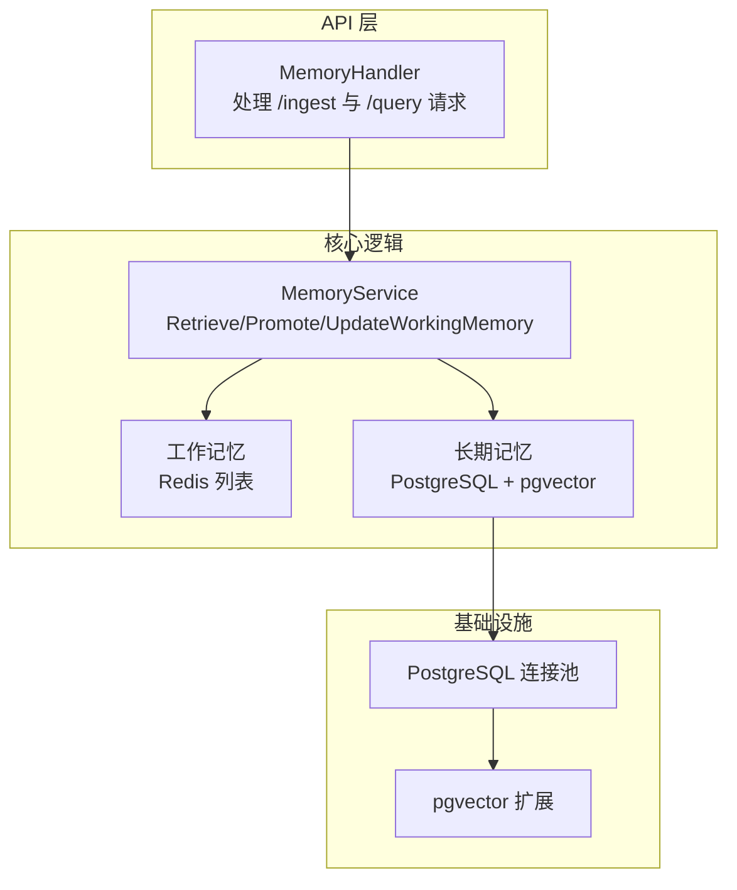
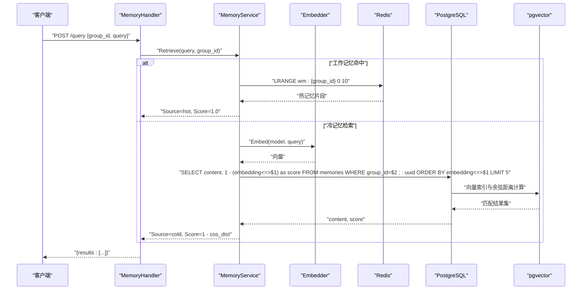
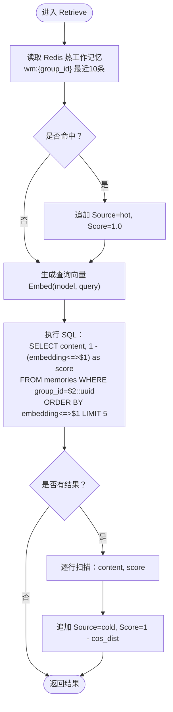
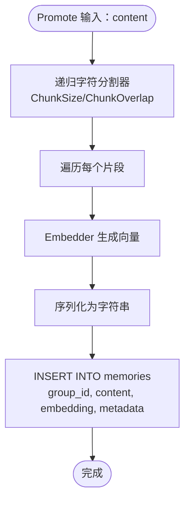
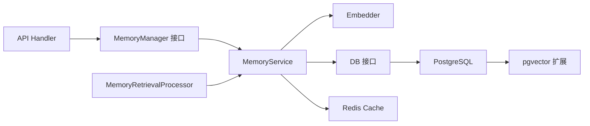

# 长期记忆检索行为

<cite>
**本文引用的文件**
- [internal/core/memory/service.go](file://internal/core/memory/service.go)
- [internal/core/memory/types.go](file://internal/core/memory/types.go)
- [internal/core/memory/splitter.go](file://internal/core/memory/splitter.go)
- [internal/api/handler/memory.go](file://internal/api/handler/memory.go)
- [internal/core/workflow/nodes/memory_retrieval.go](file://internal/core/workflow/nodes/memory_retrieval.go)
- [internal/infrastructure/db/migrations/001_init_schema.up.sql](file://internal/infrastructure/db/migrations/001_init_schema.up.sql)
- [internal/infrastructure/db/postgres.go](file://internal/infrastructure/db/postgres.go)
- [docker-compose.yml](file://docker-compose.yml)
- [internal/core/memory/service_test.go](file://internal/core/memory/service_test.go)
- [internal/infrastructure/llm/llm.go](file://internal/infrastructure/llm/llm.go)
</cite>

## 目录
1. [简介](#简介)
2. [项目结构](#项目结构)
3. [核心组件](#核心组件)
4. [架构总览](#架构总览)
5. [详细组件分析](#详细组件分析)
6. [依赖分析](#依赖分析)
7. [性能考量](#性能考量)
8. [故障排查指南](#故障排查指南)
9. [结论](#结论)

## 简介
本文围绕长期记忆（Long-Term Memory, LTM）的向量检索机制展开，重点说明 MemoryService.Retrieve 如何借助 pgvector 扩展，基于余弦相似度（Cosine Similarity）进行语义搜索。检索流程涵盖：输入主题生成嵌入向量（Embedding）、执行带 ORDER BY embedding <=> $1 的 SQL 查询、返回最多 5 条高相关度结果；并解释检索结果中 Score 字段“1 - Cosine Distance”的含义与意义。结合数据库表结构（memories 表），阐明 group_id 隔离、向量化存储与元数据设计如何支撑高效的知识复用。

## 项目结构
- 后端服务通过 API 处理器接收请求，调用 MemoryManager 接口实现（MemoryService）完成检索。
- MemoryService 聚合三层记忆：隔离区（Quarantine）、工作记忆（Working Memory，Redis）、长期记忆（LTM，PostgreSQL + pgvector）。
- 数据持久化使用迁移脚本创建 memories 表，并启用 pgvector 扩展以支持向量索引与相似度检索。

图表来源
- [internal/api/handler/memory.go](file://internal/api/handler/memory.go#L1-L68)
- [internal/core/memory/service.go](file://internal/core/memory/service.go#L1-L209)
- [internal/infrastructure/db/postgres.go](file://internal/infrastructure/db/postgres.go#L1-L66)
- [internal/infrastructure/db/migrations/001_init_schema.up.sql](file://internal/infrastructure/db/migrations/001_init_schema.up.sql#L80-L95)

章节来源
- [internal/api/handler/memory.go](file://internal/api/handler/memory.go#L1-L68)
- [internal/core/memory/service.go](file://internal/core/memory/service.go#L1-L209)
- [internal/infrastructure/db/postgres.go](file://internal/infrastructure/db/postgres.go#L1-L66)
- [internal/infrastructure/db/migrations/001_init_schema.up.sql](file://internal/infrastructure/db/migrations/001_init_schema.up.sql#L80-L95)

## 核心组件
- MemoryManager 接口：定义三层记忆协议与检索能力，包含 LogQuarantine、UpdateWorkingMemory、Promote、Retrieve。
- MemoryService：具体实现三层记忆协议，负责将内容写入工作记忆（Redis）、将分块后的文本与向量写入长期记忆（PostgreSQL），以及检索时先查热工作记忆再查冷 LTM。
- ContextItem：检索结果项，包含 Content、Source（hot/cold）、Score。
- MemoryRetrievalProcessor：工作流节点处理器，从 MemoryService 获取历史上下文并注入到输出。
- API Handler：对外暴露 /ingest（触发 Promote）与 /query（触发 Retrieve）接口。

章节来源
- [internal/core/memory/types.go](file://internal/core/memory/types.go#L1-L27)
- [internal/core/memory/service.go](file://internal/core/memory/service.go#L1-L209)
- [internal/core/workflow/nodes/memory_retrieval.go](file://internal/core/workflow/nodes/memory_retrieval.go#L1-L103)
- [internal/api/handler/memory.go](file://internal/api/handler/memory.go#L1-L68)

## 架构总览
以下序列图展示从输入主题到返回检索结果的完整流程，包括嵌入生成、向量存储、向量检索与结果组装。

图表来源
- [internal/api/handler/memory.go](file://internal/api/handler/memory.go#L50-L67)
- [internal/core/memory/service.go](file://internal/core/memory/service.go#L159-L208)
- [internal/infrastructure/llm/llm.go](file://internal/infrastructure/llm/llm.go#L43-L64)
- [internal/infrastructure/db/migrations/001_init_schema.up.sql](file://internal/infrastructure/db/migrations/001_init_schema.up.sql#L80-L95)

## 详细组件分析

### MemoryService.Retrieve：向量检索与评分
- 热工作记忆（Redis）：按 group_id 命名键，取最近若干条（示例取 10 条），Source 标记为 hot，Score 固定为 1.0。
- 冷 LTM（PostgreSQL + pgvector）：
  - 生成嵌入向量：使用 Embedder 生成查询向量。
  - 构造向量字符串：将 []float32 序列序列化为字符串传入 SQL。
  - 执行查询：使用余弦距离操作符 <=>，按 embedding <=> $1 升序排序，LIMIT 5 返回最高相关度的片段。
  - 结果评分：Score = 1 - (embedding <=> $1)，即 1 减去余弦距离。由于余弦距离 = 1 - 余弦相似度，因此 Score 实质上是“余弦相似度”。
- 结果合并：先追加 hot，再追加 cold，形成最终上下文列表。

图表来源
- [internal/core/memory/service.go](file://internal/core/memory/service.go#L159-L208)

章节来源
- [internal/core/memory/service.go](file://internal/core/memory/service.go#L159-L208)

### 嵌入生成与向量存储
- 文本分块：Promote 阶段使用递归字符分割器将长文本切分为若干片段，控制分块大小与重叠，便于后续向量化与检索。
- 向量生成与入库：对每个片段调用 Embedder 生成向量，序列化为字符串后插入 memories 表，字段包括 group_id、content、embedding、metadata。
- 元数据设计：metadata 可记录来源（如 promotion）、时间戳等，便于后续筛选与审计。

图表来源
- [internal/core/memory/splitter.go](file://internal/core/memory/splitter.go#L1-L101)
- [internal/core/memory/service.go](file://internal/core/memory/service.go#L115-L157)

章节来源
- [internal/core/memory/splitter.go](file://internal/core/memory/splitter.go#L1-L101)
- [internal/core/memory/service.go](file://internal/core/memory/service.go#L115-L157)

### 数据库表结构与隔离策略
- memories 表关键字段：
  - id、group_id（外键至 groups）、agent_id、session_id、content、embedding（VECTOR 定义维度）、metadata、created_at。
  - 索引：按 group_id 建立普通索引；embedding 建立 IVFFlat 索引，使用 vector_cosine_ops 以支持余弦相似度检索。
- group_id 隔离：检索条件限定 group_id，确保不同群组的记忆相互隔离，避免跨组泄露。
- 向量化存储：embedding 字段保存向量，支持快速相似度检索。
- 元数据设计：metadata JSONB 存储来源、时间戳等信息，便于后续扩展（如按来源或时间范围过滤）。

章节来源
- [internal/infrastructure/db/migrations/001_init_schema.up.sql](file://internal/infrastructure/db/migrations/001_init_schema.up.sql#L80-L95)

### API 与工作流集成
- API 层：
  - /ingest：接收 group_id 与 content，调用 Manager.Promote 触发长期记忆入库。
  - /query：接收 group_id 与 query，调用 Manager.Retrieve 返回检索结果。
- 工作流节点：
  - MemoryRetrievalProcessor 从输入提取 topic 或 fallback 到 content/document，结合 group_id 调用 MemoryService.Retrieve，并将结果格式化为历史摘要注入输出。

章节来源
- [internal/api/handler/memory.go](file://internal/api/handler/memory.go#L1-L68)
- [internal/core/workflow/nodes/memory_retrieval.go](file://internal/core/workflow/nodes/memory_retrieval.go#L1-L103)

## 依赖分析
- 组件耦合与职责：
  - MemoryService 依赖 Embedder（生成向量）、DB（执行 SQL）、Cache（Redis）。
  - API Handler 依赖 MemoryManager 接口，便于替换实现。
  - 工作流节点依赖 MemoryService，实现运行时上下文注入。
- 外部依赖：
  - PostgreSQL + pgvector：提供向量索引与余弦距离计算。
  - Redis：提供热工作记忆的高性能读写。
  - Docker Compose：本地开发环境包含 db（pgvector）与 redis 服务。

图表来源
- [internal/api/handler/memory.go](file://internal/api/handler/memory.go#L1-L68)
- [internal/core/memory/service.go](file://internal/core/memory/service.go#L1-L209)
- [internal/core/workflow/nodes/memory_retrieval.go](file://internal/core/workflow/nodes/memory_retrieval.go#L1-L103)
- [docker-compose.yml](file://docker-compose.yml#L1-L23)

章节来源
- [internal/api/handler/memory.go](file://internal/api/handler/memory.go#L1-L68)
- [internal/core/memory/service.go](file://internal/core/memory/service.go#L1-L209)
- [internal/core/workflow/nodes/memory_retrieval.go](file://internal/core/workflow/nodes/memory_retrieval.go#L1-L103)
- [docker-compose.yml](file://docker-compose.yml#L1-L23)

## 性能考量
- 索引选择：memories.embedding 使用 IVFFlat + vector_cosine_ops，适合大规模向量检索；HNSW 在某些场景下可能更优，但当前迁移脚本采用 IVFFlat。
- 查询限制：Retrieve 默认 LIMIT 5，兼顾召回质量与响应延迟。
- 热工作记忆：优先从 Redis 命中，减少数据库压力，提升实时性。
- 向量维度：迁移脚本指定 embedding 为 1536 维（与 text-embedding-ada-002 对应），确保与 Embedder 输出一致。
- 连接池：PostgreSQL 使用连接池，初始化时执行迁移，确保扩展与表结构就绪。

章节来源
- [internal/infrastructure/db/migrations/001_init_schema.up.sql](file://internal/infrastructure/db/migrations/001_init_schema.up.sql#L80-L95)
- [internal/infrastructure/db/postgres.go](file://internal/infrastructure/db/postgres.go#L1-L66)
- [internal/core/memory/service.go](file://internal/core/memory/service.go#L159-L208)

## 故障排查指南
- 嵌入失败：检查 Embedder 是否可用、模型名称是否正确、网络连通性。
- 数据库连接失败：确认 DATABASE_URL、PostgreSQL 服务健康、pgvector 扩展已启用。
- Redis 连接失败：确认 Redis 服务可用、键命名规则（wm:{group_id}）与 TTL 设置。
- 检索结果为空：
  - 确认 memories 表中是否存在对应 group_id 的记录。
  - 确认 embedding 字段非空且与向量维度一致。
  - 检查 SQL 中 embedding<=>$1 的参数传递是否正确（向量字符串格式）。
- 单元测试参考：测试覆盖了 Retrieve 的热冷路径与 SQL 查询预期，可据此定位问题。

章节来源
- [internal/core/memory/service_test.go](file://internal/core/memory/service_test.go#L88-L122)
- [internal/infrastructure/db/postgres.go](file://internal/infrastructure/db/postgres.go#L1-L66)
- [docker-compose.yml](file://docker-compose.yml#L1-L23)

## 结论
本系统通过三层记忆协议实现高效的知识复用：热工作记忆（Redis）提供即时上下文，冷 LTM（PostgreSQL + pgvector）提供语义检索能力。MemoryService.Retrieve 以“1 - Cosine Distance”作为 Score，直观反映与查询的相似程度；通过 group_id 隔离与向量化存储，既保证了检索的准确性，也确保了数据安全与可扩展性。结合工作流节点与 API 层，系统实现了从输入主题到上下文注入的完整闭环。