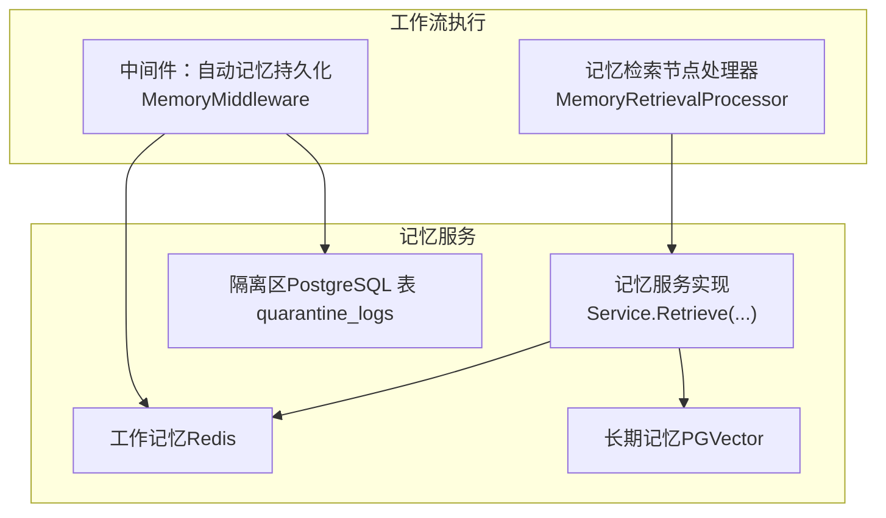
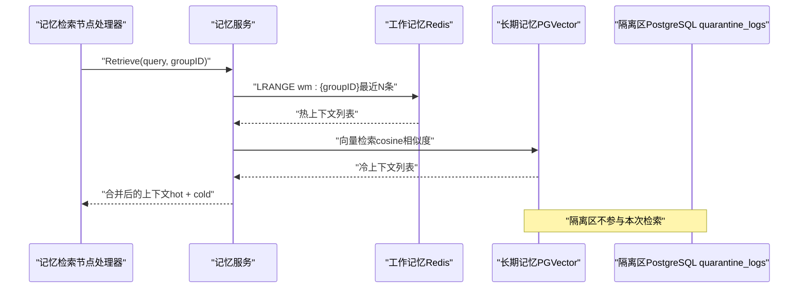
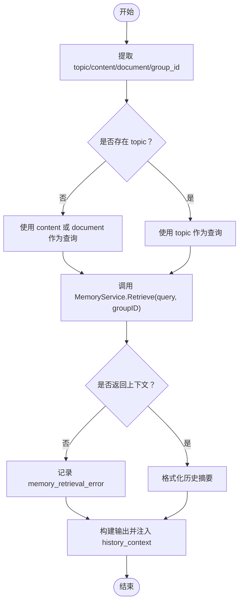
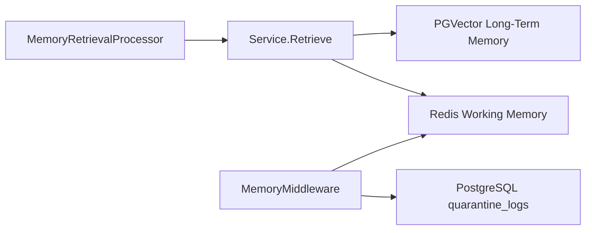

# 隔离区检索行为

<cite>
**本文引用的文件**
- [SPEC-408：三层记忆协议](file://docs/specs/backend/SPEC-408-memory-protocol.md)
- [记忆服务接口与类型定义](file://internal/core/memory/types.go)
- [记忆服务实现（含检索）](file://internal/core/memory/service.go)
- [记忆检索节点处理器](file://internal/core/workflow/nodes/memory_retrieval.go)
- [中间件：自动记忆持久化（隔离区与工作记忆）](file://internal/core/middleware/memory.go)
- [隔离日志表结构迁移脚本](file://internal/infrastructure/db/migrations/002_add_quarantine_logs.up.sql)
- [PRD 关键目标与安全要求](file://docs/references/PRD.md)
- [TDD：三层记忆协议与RAG](file://docs/tdd/02_core/03_rag.md)
- [设计草案：记忆净化协议](file://docs/plans/design_draft.md)
- [记忆服务单元测试（含检索）](file://internal/core/memory/service_test.go)
</cite>

## 目录
1. [简介](#简介)
2. [项目结构与定位](#项目结构与定位)
3. [核心组件](#核心组件)
4. [架构总览](#架构总览)
5. [详细组件分析](#详细组件分析)
6. [依赖关系分析](#依赖关系分析)
7. [性能与容量考量](#性能与容量考量)
8. [故障排查指南](#故障排查指南)
9. [结论](#结论)
10. [附录：扩展与权限化检索建议](#附录扩展与权限化检索建议)

## 简介
本文件围绕“隔离区（Quarantine）”在记忆检索中的访问策略展开，结合SPEC-408协议，解释隔离区作为原始产出的物理隔离特性与永久TTL设计目的，并说明当前实现中隔离区内容不直接参与常规RAG检索的技术依据与安全考量。同时，给出未来可能的扩展点，如通过特定权限或标记实现隔离内容的有条件检索。

## 项目结构与定位
- 记忆协议由三层构成：隔离区（Tier 1）、工作记忆（Tier 2）、长期记忆（Tier 3）。隔离区默认接收所有会议产出，不参与RAG检索；工作记忆承担短期热上下文；长期记忆承载经验证的知识。
- 记忆检索节点处理器负责从记忆系统中拉取历史上下文并注入到工作流输出，当前实现仅从工作记忆与长期记忆中检索，不涉及隔离区。

图表来源
- [记忆检索节点处理器](file://internal/core/workflow/nodes/memory_retrieval.go#L1-L103)
- [中间件：自动记忆持久化（隔离区与工作记忆）](file://internal/core/middleware/memory.go#L1-L73)
- [记忆服务实现（含检索）](file://internal/core/memory/service.go#L159-L209)

章节来源
- [SPEC-408：三层记忆协议](file://docs/specs/backend/SPEC-408-memory-protocol.md#L1-L207)
- [TDD：三层记忆协议与RAG](file://docs/tdd/02_core/03_rag.md#L1-L18)

## 核心组件
- 隔离区（Quarantine）
  - 物理隔离：会议原始产出默认写入隔离区，不进入长期记忆库。
  - 永久TTL：除非人工晋升或删除，否则长期保留，避免污染核心知识库。
- 工作记忆（Working Memory）
  - 短时热缓存，入口过滤（自洽性检查、置信度阈值等），TTL 24小时。
- 长期记忆（Long-Term Memory）
  - 经验证的高价值知识，向量化存储，支持RAG检索。
- 记忆检索节点处理器
  - 从记忆服务获取历史上下文并注入输出，当前实现不检索隔离区。
- 中间件
  - 在节点执行后自动记录隔离区日志，并尝试写入工作记忆（若满足过滤条件）。

章节来源
- [SPEC-408：三层记忆协议](file://docs/specs/backend/SPEC-408-memory-protocol.md#L1-L207)
- [记忆检索节点处理器](file://internal/core/workflow/nodes/memory_retrieval.go#L1-L103)
- [中间件：自动记忆持久化（隔离区与工作记忆）](file://internal/core/middleware/memory.go#L1-L73)

## 架构总览
下图展示隔离区、工作记忆与长期记忆之间的数据流向，以及检索节点如何消费这些数据。

图表来源
- [记忆检索节点处理器](file://internal/core/workflow/nodes/memory_retrieval.go#L1-L103)
- [记忆服务实现（含检索）](file://internal/core/memory/service.go#L159-L209)

## 详细组件分析

### 隔离区（Quarantine）访问策略与不参与RAG检索的原因
- 物理隔离与永久TTL
  - 隔离区作为会议原始产出的“物理隔离区”，默认永久保留，直至人工晋升或删除。该设计的根本目的是防止低质量、未经验证的内容污染核心知识库。
  - 参考：隔离区“TTL：永久（直至晋升或删除）”，且明确“不参与RAG检索”。
- 当前实现不检索隔离区的技术依据
  - 记忆检索节点处理器的输入提取与调用路径仅依赖记忆服务的Retrieve方法，而该方法当前仅查询工作记忆与长期记忆，不涉及隔离区。
  - 中间件在节点执行后自动记录隔离区日志，但检索阶段并不读取隔离区。
- 安全与风控考量
  - PRD强调“防幻觉传播”，隔离区的永久TTL与不参与RAG检索，是为避免未经验证的幻觉内容在推理链路中传播。
  - TDD进一步指出：隔离区“不可见”（仅供后台审计/简报），工作记忆可见但带“临时上下文”标识，长期记忆可见且标注“已验证”。

章节来源
- [SPEC-408：三层记忆协议](file://docs/specs/backend/SPEC-408-memory-protocol.md#L1-L207)
- [记忆检索节点处理器](file://internal/core/workflow/nodes/memory_retrieval.go#L1-L103)
- [记忆服务实现（含检索）](file://internal/core/memory/service.go#L159-L209)
- [PRD 关键目标与安全要求](file://docs/references/PRD.md#L140-L168)
- [TDD：三层记忆协议与RAG](file://docs/tdd/02_core/03_rag.md#L1-L18)

### 记忆检索节点处理器（MemoryRetrievalProcessor）
- 输入提取：从输入中提取topic、content、document、group_id等字段。
- 调用记忆服务：当存在topic且group_id可用时，调用Retrieve获取历史上下文。
- 输出注入：将历史上下文注入到输出的history_context字段。
- 错误处理：检索异常仅记录日志，不影响节点整体执行。

图表来源
- [记忆检索节点处理器](file://internal/core/workflow/nodes/memory_retrieval.go#L1-L103)

章节来源
- [记忆检索节点处理器](file://internal/core/workflow/nodes/memory_retrieval.go#L1-L103)

### 记忆服务（Service）与检索逻辑
- Retrieve方法的检索范围
  - 先从工作记忆（Redis）读取最近若干条热上下文。
  - 再对查询进行向量嵌入，从长期记忆（PGVector）中按相似度检索。
  - 返回合并后的上下文列表，Source字段区分hot与cold。
- 隔离区不参与检索
  - 代码中未出现针对隔离区（quarantine_logs表）的查询逻辑。

章节来源
- [记忆服务实现（含检索）](file://internal/core/memory/service.go#L159-L209)

### 中间件：自动记忆持久化（隔离区与工作记忆）
- AfterNodeExecution阶段：
  - 总是记录隔离区日志（LogQuarantine），保证所有会议产出均被隔离保存。
  - 尝试写入工作记忆（UpdateWorkingMemory），但受入口过滤与TTL约束。
- 与检索的关系：
  - 中间件不负责检索，仅负责写入隔离区与工作记忆；检索由记忆服务统一处理。

章节来源
- [中间件：自动记忆持久化（隔离区与工作记忆）](file://internal/core/middleware/memory.go#L1-L73)

### 隔离日志表结构与物理隔离
- quarantine_logs表用于持久化隔离区日志，包含session_id、content、raw_metadata、created_at等字段。
- 该表的存在确保隔离区内容可审计、可生成智能简报、可人工晋升至长期记忆。

章节来源
- [隔离日志表结构迁移脚本](file://internal/infrastructure/db/migrations/002_add_quarantine_logs.up.sql#L1-L10)

## 依赖关系分析
- 记忆检索节点处理器依赖记忆服务的Retrieve接口，后者内部依赖Redis与PostgreSQL/PGVector。
- 中间件在节点执行后写入隔离区与工作记忆，但不参与检索。
- 隔离区与长期记忆之间无直接检索耦合，体现了“物理隔离”的设计意图。

图表来源
- [记忆检索节点处理器](file://internal/core/workflow/nodes/memory_retrieval.go#L1-L103)
- [记忆服务实现（含检索）](file://internal/core/memory/service.go#L159-L209)
- [中间件：自动记忆持久化（隔离区与工作记忆）](file://internal/core/middleware/memory.go#L1-L73)

章节来源
- [记忆检索节点处理器](file://internal/core/workflow/nodes/memory_retrieval.go#L1-L103)
- [记忆服务实现（含检索）](file://internal/core/memory/service.go#L159-L209)
- [中间件：自动记忆持久化（隔离区与工作记忆）](file://internal/core/middleware/memory.go#L1-L73)

## 性能与容量考量
- 隔离区永久TTL意味着数据量可能持续增长，需配合定期审计与清理策略（例如：基于会话或项目维度的批量删除）。
- 工作记忆采用Redis列表并设置TTL，容量与过期策略有助于控制短期内存占用。
- 长期记忆检索依赖向量相似度计算，需关注嵌入模型性能与数据库索引效率。

章节来源
- [SPEC-408：三层记忆协议](file://docs/specs/backend/SPEC-408-memory-protocol.md#L1-L207)
- [记忆服务实现（含检索）](file://internal/core/memory/service.go#L159-L209)

## 故障排查指南
- 检索不到历史上下文
  - 确认输入中存在有效的topic或content/document字段，且group_id有效。
  - 检查记忆服务的Retrieve调用是否成功，关注错误日志。
- 工作记忆为空
  - 检查中间件是否成功写入工作记忆（入口过滤条件、TTL设置、Redis连接）。
- 隔离区日志缺失
  - 确认中间件AfterNodeExecution阶段是否正常执行，数据库连接是否可用。

章节来源
- [记忆检索节点处理器](file://internal/core/workflow/nodes/memory_retrieval.go#L1-L103)
- [记忆服务实现（含检索）](file://internal/core/memory/service.go#L159-L209)
- [记忆服务单元测试（含检索）](file://internal/core/memory/service_test.go#L88-L123)

## 结论
隔离区作为会议原始产出的“物理隔离区”，其永久TTL与不参与RAG检索的设计，旨在防止低质量内容污染核心知识库，并通过“入口过滤+人工晋升”双保险确保知识质量。当前实现中，记忆检索节点处理器与记忆服务均未检索隔离区，体现了严格的分层隔离原则。未来若需在特定场景下有条件地利用隔离区内容，应在保持安全基线的前提下，引入权限或标记机制，确保变更不影响现有安全策略。

## 附录：扩展与权限化检索建议
- 条件检索思路
  - 引入“隔离区检索开关”或“隔离区标记”，仅在具备相应权限或满足特定条件时，允许检索隔离区。
  - 对隔离区内容进行二次校验（如基于LLM的自洽性检查）后再注入到检索结果中。
- 审计与追踪
  - 为隔离区检索操作增加审计日志，记录操作者、时间、内容范围与审批信息。
- 渐进式落地
  - 先在小范围灰度启用，结合监控与告警，逐步扩大范围并完善配套流程。

章节来源
- [SPEC-408：三层记忆协议](file://docs/specs/backend/SPEC-408-memory-protocol.md#L1-L207)
- [PRD 关键目标与安全要求](file://docs/references/PRD.md#L140-L168)
- [TDD：三层记忆协议与RAG](file://docs/tdd/02_core/03_rag.md#L1-L18)