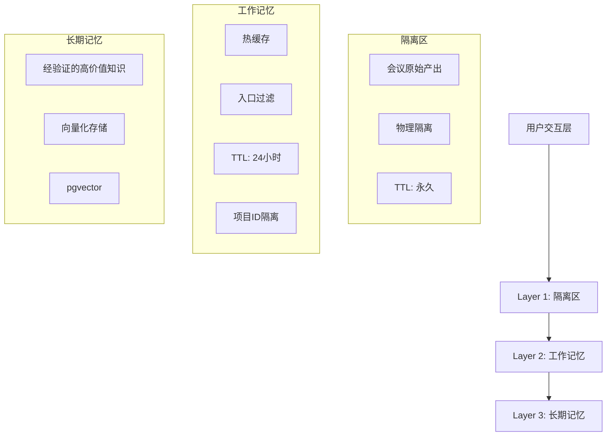
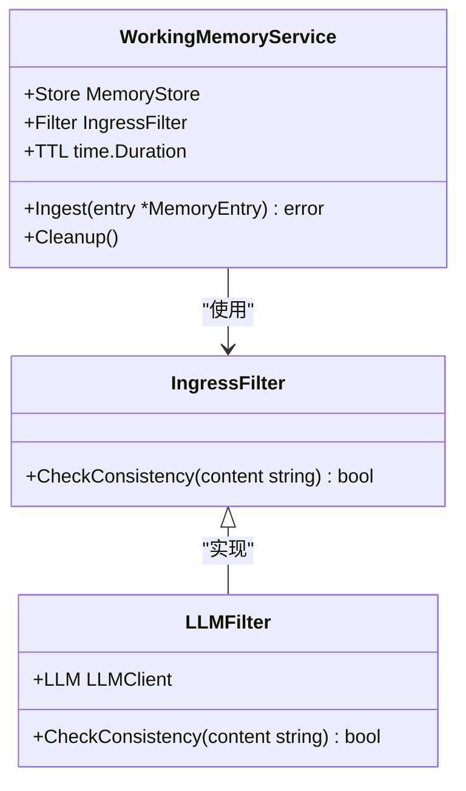
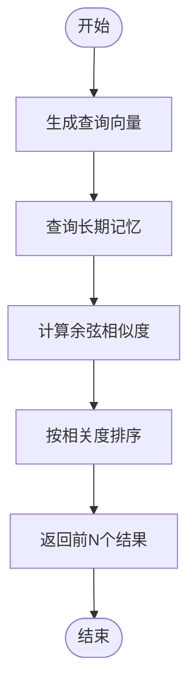
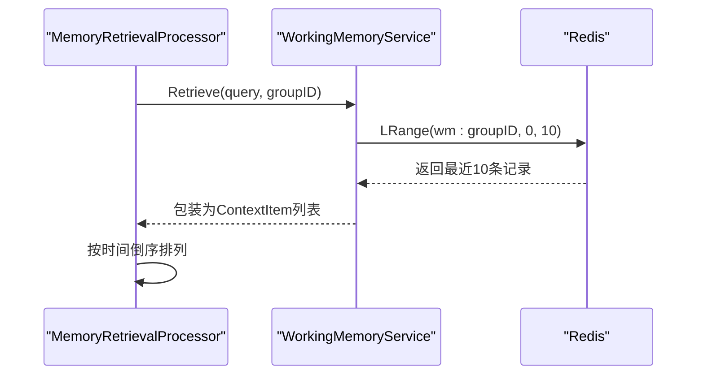
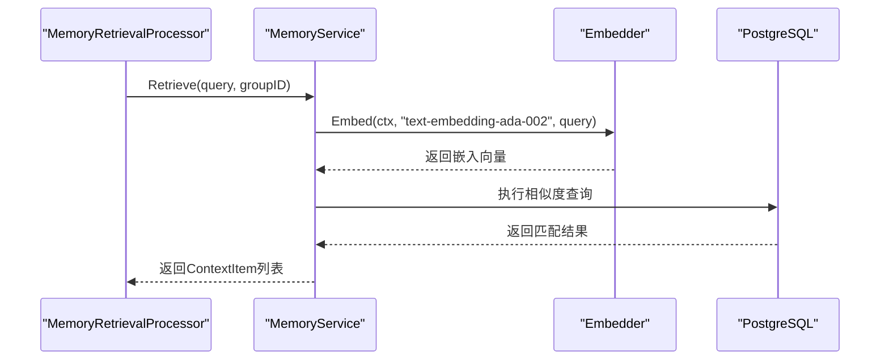
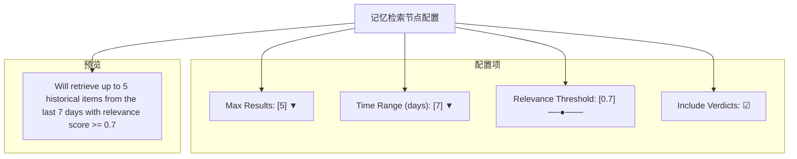
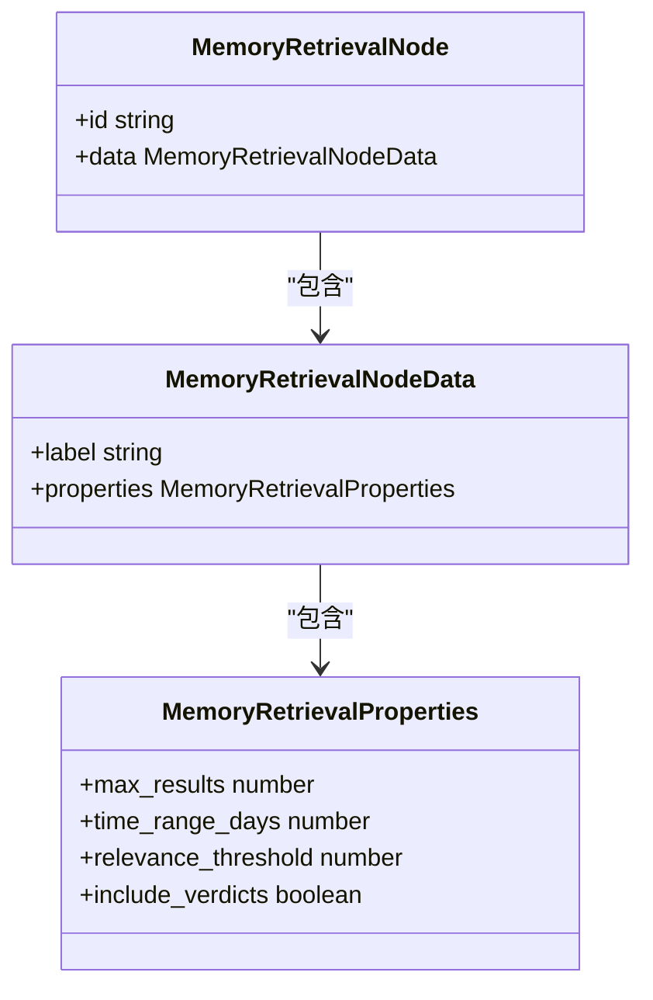
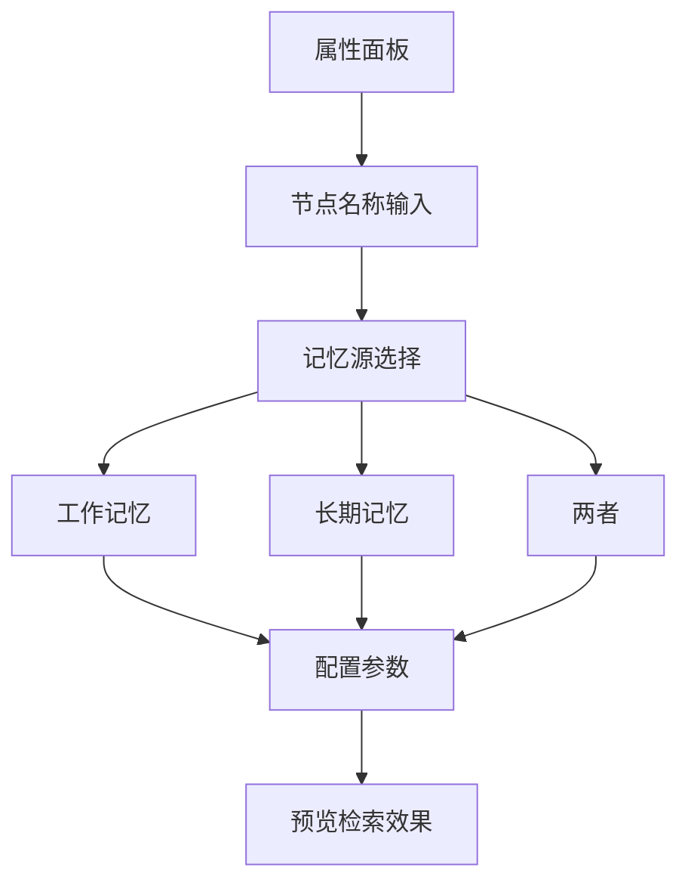

# 记忆检索节点

<cite>
**本文档引用文件**  
- [memory_retrieval.go](file://internal/core/workflow/nodes/memory_retrieval.go)
- [service.go](file://internal/core/memory/service.go)
- [types.go](file://internal/core/memory/types.go)
- [SPEC-408-memory-protocol.md](file://docs/specs/backend/SPEC-408-memory-protocol.md)
- [SPEC-607-memory-retrieval-node.md](file://docs/specs/sprint6/SPEC-607-memory-retrieval-node.md)
- [WorkflowEditor.tsx](file://frontend/src/features/editor/WorkflowEditor.tsx)
- [CustomNodes.tsx](file://frontend/src/components/workflow/nodes/CustomNodes.tsx)
- [PropertyPanel.tsx](file://frontend/src/features/editor/components/PropertyPanel/PropertyPanel.tsx)
</cite>

## 目录
1. [引言](#引言)
2. [三层次记忆访问机制](#三层次记忆访问机制)
3. [语义搜索与关键词匹配](#语义搜索与关键词匹配)
4. [核心组件调用关系](#核心组件调用关系)
5. [前端集成与用户界面](#前端集成与用户界面)
6. [性能优化策略](#性能优化策略)
7. [结论](#结论)

## 引言

记忆检索节点是基于SPEC-408协议实现的关键组件，负责在工作流执行过程中自动检索相关历史上下文。该节点通过三层次记忆架构（隔离区、工作记忆、长期记忆）提取信息，支持语义搜索与关键词匹配两种模式，为后续AI处理提供压缩后的上下文摘要。本节点主要服务于`skill.md`中的"Compress History Context"功能，确保智能体在决策时能访问到最相关的过往信息。

**Section sources**
- [SPEC-607-memory-retrieval-node.md](file://docs/specs/sprint6/SPEC-607-memory-retrieval-node.md#L7-L16)

## 三层次记忆访问机制

记忆检索节点遵循SPEC-408协议定义的三层记忆净化架构，从不同层级提取历史上下文：



**Diagram sources**
- [SPEC-408-memory-protocol.md](file://docs/specs/backend/SPEC-408-memory-protocol.md#L10-L36)

### 隔离区（Quarantine）

隔离区作为第一层，存储所有会议的原始产出，具有以下特点：
- 所有会议产出默认进入此层
- 不参与RAG检索，防止低质量内容污染核心知识库
- 永久存储，直到被晋升或删除

尽管记忆检索节点不直接访问隔离区，但该层为整个记忆系统提供了原始数据源。

**Section sources**
- [SPEC-408-memory-protocol.md](file://docs/specs/backend/SPEC-408-memory-protocol.md#L59-L83)

### 工作记忆（Working Memory）

工作记忆作为第二层，是记忆检索的主要数据源，具有以下特性：
- 热缓存，提供快速访问
- 24小时TTL，确保信息时效性
- 基于项目ID进行隔离
- 入口过滤机制，确保数据质量



**Diagram sources**
- [SPEC-408-memory-protocol.md](file://docs/specs/backend/SPEC-408-memory-protocol.md#L85-L109)
- [service.go](file://internal/core/memory/service.go#L60-L97)

### 长期记忆（Long-Term Memory）

长期记忆作为第三层，存储经验证的高价值知识，具有以下特点：
- 向量化存储，支持语义搜索
- 基于pgvector扩展的PostgreSQL数据库
- 用户标记的重要知识
- 永久存储

长期记忆通过知识晋升机制从工作记忆中获取高质量内容，为记忆检索提供深度历史上下文。

**Section sources**
- [SPEC-408-memory-protocol.md](file://docs/specs/backend/SPEC-408-memory-protocol.md#L31-L35)

## 语义搜索与关键词匹配

记忆检索节点支持两种检索模式：语义搜索和关键词匹配，以满足不同场景的需求。

### 语义搜索

语义搜索基于向量相似度计算，通过以下流程实现：



**Diagram sources**
- [service.go](file://internal/core/memory/service.go#L174-L208)

语义搜索使用`text-embedding-ada-002`或兼容模型生成查询向量，并通过PGVector的余弦距离运算符`<=>`计算相似度。相关度得分通过`1 - (embedding <=> $1)`公式计算，确保得分越高表示相关度越高。

### 关键词匹配

关键词匹配主要用于工作记忆的快速检索：



**Diagram sources**
- [service.go](file://internal/core/memory/service.go#L162-L172)

工作记忆存储在Redis中，使用List数据结构按时间顺序存储。检索时获取最近10条记录，这些记录具有最高时效性，相关度得分为1.0。

**Section sources**
- [service.go](file://internal/core/memory/service.go#L162-L172)

## 核心组件调用关系

记忆检索节点涉及多个核心组件的协同工作，其调用关系如下：

```mermaid
classDiagram
class MemoryRetrievalProcessor {
+MemoryService *memory.Service
+Process(ctx, input, stream) (map[string]interface{}, error)
}
class MemoryService {
+Embedder llm.Embedder
+pool db.DB
+cache cache.Cache
+Retrieve(ctx, query, groupID) ([]ContextItem, error)
}
class ContextItem {
+Content string
+Source string
+Score float64
}
MemoryRetrievalProcessor --> MemoryService : "依赖"
MemoryService --> ContextItem : "返回"
MemoryService --> llm.Embedder : "使用"
MemoryService --> db.DB : "使用"
MemoryService --> cache.Cache : "使用"
```

**Diagram sources**
- [memory_retrieval.go](file://internal/core/workflow/nodes/memory_retrieval.go#L14-L21)
- [service.go](file://internal/core/memory/service.go#L14-L18)

### 向量相似度计算

向量相似度计算是语义搜索的核心，其实现细节如下：



**Diagram sources**
- [service.go](file://internal/core/memory/service.go#L174-L208)

在长期记忆检索过程中，系统首先使用嵌入模型将查询文本转换为向量，然后在PostgreSQL中执行相似度搜索。查询使用余弦距离运算符`<=>`，并按相关度排序返回前5个结果。

**Section sources**
- [service.go](file://internal/core/memory/service.go#L174-L208)

### 上下文窗口裁剪

记忆检索节点通过以下机制实现上下文窗口裁剪：

1. **数量限制**：通过`max_results`参数限制返回结果数量
2. **时间范围**：通过`time_range_days`参数限制检索时间范围
3. **相关度阈值**：通过`relevance_threshold`参数过滤低相关度结果

```go
// 伪代码示例
results := service.Retrieve(ctx, query, groupID)
filtered := filterByRelevance(results, threshold)
limited := limitResults(filtered, maxResults)
```

**Section sources**
- [SPEC-607-memory-retrieval-node.md](file://docs/specs/sprint6/SPEC-607-memory-retrieval-node.md#L26-L27)

### 隐私过滤策略

隐私过滤策略在记忆写入阶段实施，确保敏感信息不被检索：

1. **入口过滤**：在工作记忆写入时检查内容一致性
2. **信心分数**：过滤信心分数低于0.8的内容
3. **内容长度**：过滤过短（<50字符）的噪声内容

```go
// service.go中的入口过滤实现
if confidence, ok := metadata["confidence"].(float64); ok && confidence < 0.8 {
    return nil // 拒绝低信心内容
}
```

**Section sources**
- [service.go](file://internal/core/memory/service.go#L66-L71)

## 前端集成与用户界面

记忆检索节点在前端WorkflowEditor中有完整的集成，包括查询语句编辑器和记忆源选择控件。

### 节点配置面板

当用户在工作流画布中选中记忆检索节点时，右侧属性面板显示配置选项：



**Diagram sources**
- [SPEC-607-memory-retrieval-node.md](file://docs/specs/sprint6/SPEC-607-memory-retrieval-node.md#L218-L234)

### 查询语句编辑器

查询语句编辑器允许用户配置检索参数，其UI组件结构如下：



**Diagram sources**
- [SPEC-607-memory-retrieval-node.md](file://docs/specs/sprint6/SPEC-607-memory-retrieval-node.md#L239-L251)

### 记忆源选择控件

记忆源选择控件集成在属性面板中，允许用户选择检索范围：



**Diagram sources**
- [PropertyPanel.tsx](file://frontend/src/features/editor/components/PropertyPanel/PropertyPanel.tsx#L58-L67)
- [WorkflowEditor.tsx](file://frontend/src/features/editor/WorkflowEditor.tsx#L242-L251)

**Section sources**
- [WorkflowEditor.tsx](file://frontend/src/features/editor/WorkflowEditor.tsx#L19-L31)
- [PropertyPanel.tsx](file://frontend/src/features/editor/components/PropertyPanel/PropertyPanel.tsx#L44-L85)

## 性能优化策略

为提升记忆检索节点的性能，建议采用以下优化技巧：

### 索引策略调整

1. **向量索引**：在PostgreSQL中为embedding字段创建HNSW或IVFFlat索引
2. **项目ID索引**：为group_id字段创建B-tree索引，加速项目隔离查询
3. **时间索引**：为创建时间字段创建索引，支持时间范围查询

```sql
-- 推荐的索引创建语句
CREATE INDEX ON memories USING hnsw (embedding vector_cosine_ops);
CREATE INDEX ON memories (group_id);
CREATE INDEX ON memories (created_at);
```

**Section sources**
- [service.go](file://internal/core/memory/service.go#L139-L142)

### 缓存命中率提升

1. **Redis缓存**：工作记忆使用Redis作为热缓存，确保高频访问数据的快速响应
2. **结果缓存**：对频繁查询的结果进行缓存，减少重复计算
3. **连接池**：使用数据库连接池减少连接开销

```go
// service.go中的缓存使用
if s.cache != nil {
    vals, err := s.cache.LRange(ctx, key, 0, 10).Result()
    // ...
}
```

**Section sources**
- [service.go](file://internal/core/memory/service.go#L163-L172)

### 批量处理优化

1. **批量嵌入**：当需要嵌入多个文本时，使用批量API减少网络开销
2. **批量查询**：合并多个小查询为批量查询，减少数据库交互次数
3. **异步处理**：对非关键路径的操作使用异步处理

### 内存管理

1. **列表修剪**：定期修剪Redis列表，保持工作记忆大小在合理范围
2. **TTL设置**：为工作记忆设置24小时TTL，自动清理过期数据
3. **容量限制**：限制工作记忆最多存储50条记录

```go
// service.go中的列表修剪
s.cache.LTrim(ctx, key, 0, 49) // 保留最后50条
```

**Section sources**
- [service.go](file://internal/core/memory/service.go#L94-L95)

## 结论

记忆检索节点通过三层次记忆架构实现了高效的历史上下文提取，支持语义搜索与关键词匹配两种模式。该节点与memory/service.go的调用关系清晰，通过向量相似度计算、上下文窗口裁剪和隐私过滤策略确保了检索质量和系统安全。前端WorkflowEditor提供了完整的查询语句编辑器和记忆源选择控件，使用户能够灵活配置检索参数。通过合理的索引策略和缓存优化，可以显著提升检索性能和用户体验。

**Section sources**
- [SPEC-408-memory-protocol.md](file://docs/specs/backend/SPEC-408-memory-protocol.md)
- [SPEC-607-memory-retrieval-node.md](file://docs/specs/sprint6/SPEC-607-memory-retrieval-node.md)