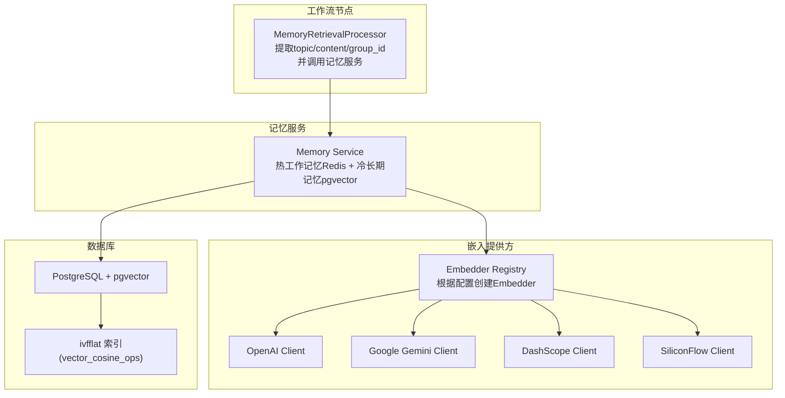
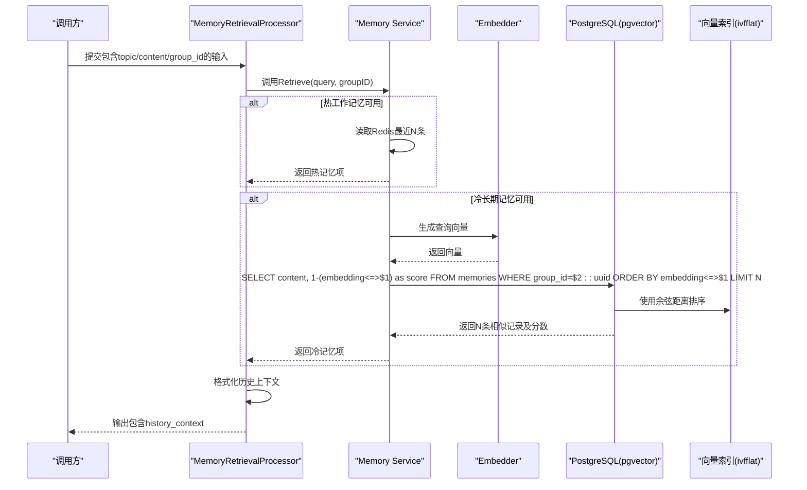
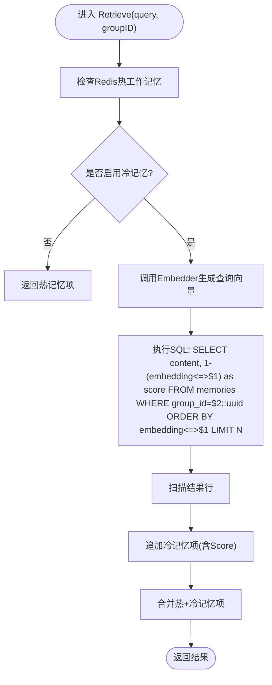
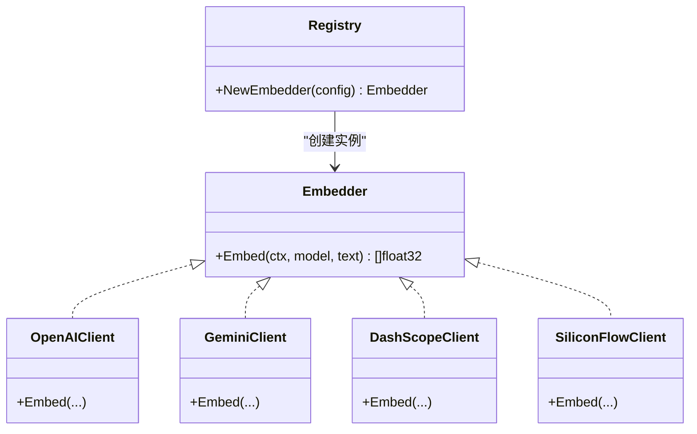
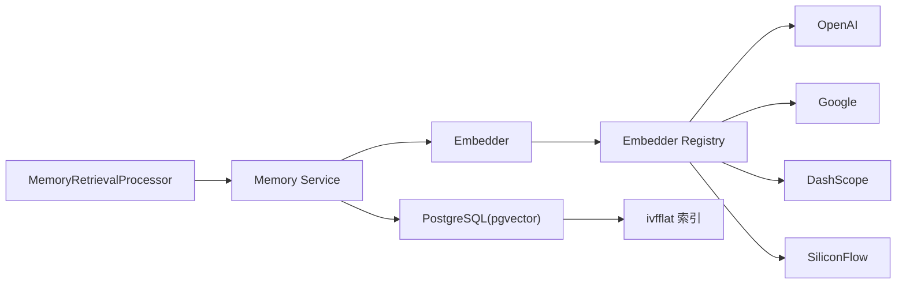

# 语义搜索实现

<cite>
**本文引用的文件**
- [internal/core/workflow/nodes/memory_retrieval.go](file://internal/core/workflow/nodes/memory_retrieval.go)
- [internal/core/memory/service.go](file://internal/core/memory/service.go)
- [internal/core/memory/types.go](file://internal/core/memory/types.go)
- [internal/infrastructure/llm/llm.go](file://internal/infrastructure/llm/llm.go)
- [internal/infrastructure/llm/openai.go](file://internal/infrastructure/llm/openai.go)
- [internal/infrastructure/llm/router.go](file://internal/infrastructure/llm/router.go)
- [internal/infrastructure/db/migrations/001_init_schema.up.sql](file://internal/infrastructure/db/migrations/001_init_schema.up.sql)
- [internal/pkg/config/config.go](file://internal/pkg/config/config.go)
- [docker-compose.yml](file://docker-compose.yml)
- [internal/core/memory/service_test.go](file://internal/core/memory/service_test.go)
- [docs/tdd/07_nfr.md](file://docs/tdd/07_nfr.md)
</cite>

## 目录
1. [简介](#简介)
2. [项目结构](#项目结构)
3. [核心组件](#核心组件)
4. [架构总览](#架构总览)
5. [详细组件分析](#详细组件分析)
6. [依赖关系分析](#依赖关系分析)
7. [性能考量](#性能考量)
8. [故障排查指南](#故障排查指南)
9. [结论](#结论)

## 简介
本文件围绕“记忆检索节点”的语义搜索实现展开，系统在收到查询请求后，通过 Embedder 接口将自然语言查询转换为向量表示，随后在 pgvector 向量数据库中使用余弦距离进行相似度排序，最终将检索结果注入工作流上下文中。文档重点解释以下内容：
- 查询请求如何触发嵌入生成与向量检索
- pgvector 中余弦距离与相关度分数的映射关系
- 嵌入模型选择对检索质量的影响
- 可行的优化建议（返回条数、相似度阈值等）

## 项目结构
与语义搜索直接相关的模块分布如下：
- 工作流节点层：负责从输入提取主题/查询、调用记忆服务并格式化输出
- 记忆服务层：实现三层记忆协议（热工作记忆、冷长期记忆），并在冷记忆中执行向量检索
- LLM 嵌入层：抽象出 Embedder 接口，支持多种提供商（OpenAI、Google、Ollama、DashScope、SiliconFlow）
- 数据库层：使用 PostgreSQL + pgvector 存储向量，提供索引与查询
- 配置层：集中管理嵌入模型维度与提供商配置

图表来源
- [internal/core/workflow/nodes/memory_retrieval.go](file://internal/core/workflow/nodes/memory_retrieval.go#L1-L103)
- [internal/core/memory/service.go](file://internal/core/memory/service.go#L1-L209)
- [internal/infrastructure/llm/router.go](file://internal/infrastructure/llm/router.go#L152-L176)
- [internal/infrastructure/llm/openai.go](file://internal/infrastructure/llm/openai.go#L1-L154)
- [internal/infrastructure/db/migrations/001_init_schema.up.sql](file://internal/infrastructure/db/migrations/001_init_schema.up.sql#L80-L96)
- [internal/pkg/config/config.go](file://internal/pkg/config/config.go#L1-L133)

章节来源
- [internal/core/workflow/nodes/memory_retrieval.go](file://internal/core/workflow/nodes/memory_retrieval.go#L1-L103)
- [internal/core/memory/service.go](file://internal/core/memory/service.go#L1-L209)
- [internal/infrastructure/llm/router.go](file://internal/infrastructure/llm/router.go#L152-L176)
- [internal/infrastructure/db/migrations/001_init_schema.up.sql](file://internal/infrastructure/db/migrations/001_init_schema.up.sql#L80-L96)
- [internal/pkg/config/config.go](file://internal/pkg/config/config.go#L1-L133)

## 核心组件
- 记忆检索节点处理器：从输入提取查询与分组标识，调用记忆服务并格式化历史上下文
- 记忆服务：实现三层记忆协议；冷记忆检索使用 pgvector 的余弦距离
- 嵌入提供方注册器：按配置创建 Embedder，支持 OpenAI、Google、Ollama、DashScope、SiliconFlow
- 数据库迁移：启用 pgvector 扩展、创建 memories 表与向量索引
- 配置：集中管理嵌入提供商、模型与维度

章节来源
- [internal/core/workflow/nodes/memory_retrieval.go](file://internal/core/workflow/nodes/memory_retrieval.go#L1-L103)
- [internal/core/memory/service.go](file://internal/core/memory/service.go#L1-L209)
- [internal/infrastructure/llm/router.go](file://internal/infrastructure/llm/router.go#L152-L176)
- [internal/infrastructure/db/migrations/001_init_schema.up.sql](file://internal/infrastructure/db/migrations/001_init_schema.up.sql#L80-L96)
- [internal/pkg/config/config.go](file://internal/pkg/config/config.go#L1-L133)

## 架构总览
下图展示从查询请求到检索结果注入的端到端流程。

图表来源
- [internal/core/workflow/nodes/memory_retrieval.go](file://internal/core/workflow/nodes/memory_retrieval.go#L23-L103)
- [internal/core/memory/service.go](file://internal/core/memory/service.go#L159-L208)
- [internal/infrastructure/llm/router.go](file://internal/infrastructure/llm/router.go#L152-L176)
- [internal/infrastructure/db/migrations/001_init_schema.up.sql](file://internal/infrastructure/db/migrations/001_init_schema.up.sql#L80-L96)

## 详细组件分析

### 记忆检索节点处理器
- 输入解析：优先使用 topic，否则回退到 content 或 document
- 分组标识：要求输入包含 group_id
- 调用记忆服务：若可用则执行检索，失败仅记录日志不中断
- 输出构建：将历史上下文注入到输出字段

章节来源
- [internal/core/workflow/nodes/memory_retrieval.go](file://internal/core/workflow/nodes/memory_retrieval.go#L23-L103)

### 记忆服务（三层记忆与向量检索）
- 热工作记忆（Redis）：返回最近若干条，作为高置信度上下文
- 冷长期记忆（pgvector）：生成查询向量，使用余弦距离排序并限制返回条数
- 相关度分数：通过 SQL 将余弦距离映射到 0~1 区间

图表来源
- [internal/core/memory/service.go](file://internal/core/memory/service.go#L159-L208)

章节来源
- [internal/core/memory/service.go](file://internal/core/memory/service.go#L159-L208)

### 嵌入提供方与模型选择
- 接口抽象：Embedder 定义 Embed(ctx, model, text) -> []float32
- 注册器：根据配置 Type 创建具体客户端（OpenAI、Google、Ollama、DashScope、SiliconFlow）
- 模型维度：数据库表定义了固定维度（例如 1536），配置层提供推荐模型与默认值

图表来源
- [internal/infrastructure/llm/llm.go](file://internal/infrastructure/llm/llm.go#L43-L64)
- [internal/infrastructure/llm/router.go](file://internal/infrastructure/llm/router.go#L152-L176)
- [internal/infrastructure/llm/openai.go](file://internal/infrastructure/llm/openai.go#L1-L154)

章节来源
- [internal/infrastructure/llm/llm.go](file://internal/infrastructure/llm/llm.go#L43-L64)
- [internal/infrastructure/llm/router.go](file://internal/infrastructure/llm/router.go#L152-L176)
- [internal/infrastructure/llm/openai.go](file://internal/infrastructure/llm/openai.go#L1-L154)
- [internal/pkg/config/config.go](file://internal/pkg/config/config.go#L61-L91)

### 数据库与索引
- 表结构：memories 表包含 content、embedding（VECTOR）、metadata、group_id 等字段
- 索引：创建 ivfflat 索引，使用向量余弦操作符，lists 参数用于控制索引质量
- 运行环境：docker-compose 使用 pgvector 镜像启动数据库

章节来源
- [internal/infrastructure/db/migrations/001_init_schema.up.sql](file://internal/infrastructure/db/migrations/001_init_schema.up.sql#L80-L96)
- [docker-compose.yml](file://docker-compose.yml#L1-L23)

## 依赖关系分析
- 记忆检索节点依赖记忆服务
- 记忆服务依赖嵌入提供方与数据库
- 嵌入提供方由注册器按配置创建
- 数据库迁移确保 pgvector 扩展与索引存在

图表来源
- [internal/core/workflow/nodes/memory_retrieval.go](file://internal/core/workflow/nodes/memory_retrieval.go#L1-L103)
- [internal/core/memory/service.go](file://internal/core/memory/service.go#L1-L209)
- [internal/infrastructure/llm/router.go](file://internal/infrastructure/llm/router.go#L152-L176)
- [internal/infrastructure/db/migrations/001_init_schema.up.sql](file://internal/infrastructure/db/migrations/001_init_schema.up.sql#L80-L96)

章节来源
- [internal/core/workflow/nodes/memory_retrieval.go](file://internal/core/workflow/nodes/memory_retrieval.go#L1-L103)
- [internal/core/memory/service.go](file://internal/core/memory/service.go#L1-L209)
- [internal/infrastructure/llm/router.go](file://internal/infrastructure/llm/router.go#L152-L176)
- [internal/infrastructure/db/migrations/001_init_schema.up.sql](file://internal/infrastructure/db/migrations/001_init_schema.up.sql#L80-L96)

## 性能考量
- 向量检索延迟目标：在 TDD 中明确“向量检索 < 100ms”，可通过合理设置索引参数与硬件资源达成
- 索引策略：使用 ivfflat 索引并配置 lists 参数；更优场景可考虑 HNSW（schema 中已有注释说明）
- 返回条数：SQL 中使用 LIMIT 控制召回规模，影响检索速度与上下文长度
- 缓存：热工作记忆采用 Redis，优先返回最近上下文，减少向量检索频率

章节来源
- [docs/tdd/07_nfr.md](file://docs/tdd/07_nfr.md#L52-L60)
- [internal/infrastructure/db/migrations/001_init_schema.up.sql](file://internal/infrastructure/db/migrations/001_init_schema.up.sql#L92-L96)
- [internal/core/memory/service.go](file://internal/core/memory/service.go#L159-L208)

## 故障排查指南
- 嵌入模型维度不匹配：数据库 VECTOR 列定义了固定维度，配置层提供了推荐模型与默认值，需确保 Embedder 返回的向量维度与数据库一致
- pgvector 扩展缺失：确认迁移脚本已启用 vector 扩展
- 索引未生效：检查 ivfflat 索引创建语句与 lists 参数；空表可能影响索引创建
- Redis 可用性：热工作记忆依赖 Redis，需确认连接与键命名规则
- SQL 查询验证：单元测试中对 SELECT content, 1-(embedding<=>$1) as score 的查询进行了断言，可据此核对实际查询

章节来源
- [internal/pkg/config/config.go](file://internal/pkg/config/config.go#L61-L91)
- [internal/infrastructure/db/migrations/001_init_schema.up.sql](file://internal/infrastructure/db/migrations/001_init_schema.up.sql#L1-L2)
- [internal/core/memory/service_test.go](file://internal/core/memory/service_test.go#L106-L110)

## 结论
本系统通过“热工作记忆 + 冷长期记忆”的混合策略，结合 pgvector 的余弦距离实现高效语义检索。查询请求经由记忆检索节点进入记忆服务，先从 Redis 获取近期上下文，再在 pgvector 中基于余弦距离排序并限制返回条数，最终将检索结果注入工作流输出。嵌入模型的选择直接影响向量维度与检索质量，应与数据库配置保持一致，并结合业务需求调整返回条数与相似度阈值以平衡召回与精度。