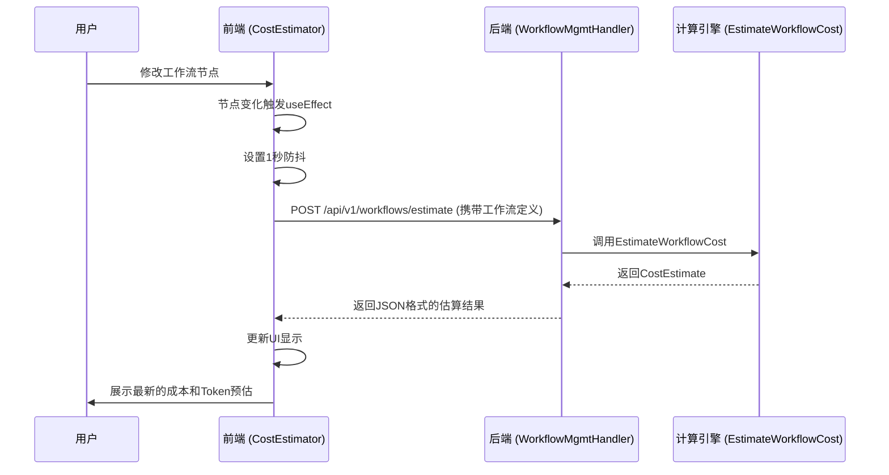
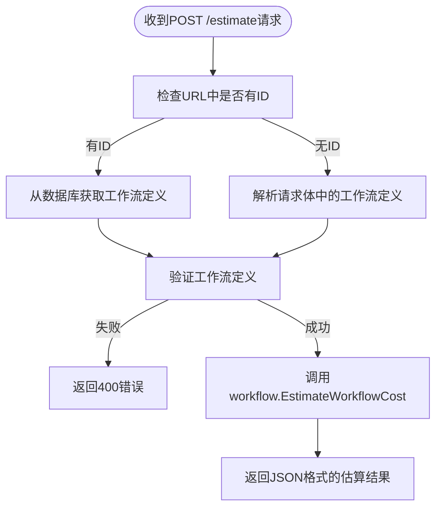
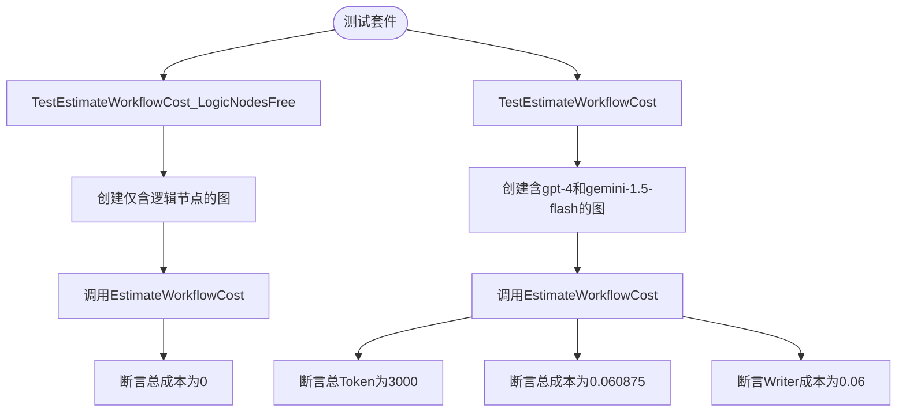

# 成本预估

<cite>
**本文档引用的文件**  
- [cost.go](file://internal/core/workflow/cost.go)
- [cost_test.go](file://internal/core/workflow/cost_test.go)
- [CostEstimator.tsx](file://frontend/src/features/execution/components/CostEstimator.tsx)
- [SPEC-302-cost-estimator.md](file://docs/specs/sprint4/SPEC-302-cost-estimator.md)
- [SPEC-407-cost-estimation-api.md](file://docs/specs/backend/SPEC-407-cost-estimation-api.md)
- [cost_estimation.md](file://docs/api/cost_estimation.md)
- [workflow_mgmt.go](file://internal/api/handler/workflow_mgmt.go)
</cite>

## 目录
1. [引言](#引言)
2. [计算模型解析](#计算模型解析)
3. [前端实时展示机制](#前端实时展示机制)
4. [API接口与数据流](#api接口与数据流)
5. [估算精度与误差范围](#估算精度与误差范围)
6. [高成本流程优化建议](#高成本流程优化建议)
7. [边界情况处理](#边界情况处理)
8. [测试与验证](#测试与验证)
9. [结论](#结论)

## 引言

成本预估系统是本项目中用于在工作流执行前预测整体开销的核心功能模块。该系统通过分析工作流中各节点的配置，特别是LLM调用次数、上下文长度和所选模型的单价，来估算执行成本。本文档将深入解析`cost.go`中的计算模型，前端`CostEstimator`组件的实时更新机制，并结合SPEC-407和API文档说明估算精度、刷新频率和误差范围，同时提供优化建议和边界情况处理方案。

## 计算模型解析

成本预估系统的计算模型主要在`internal/core/workflow/cost.go`文件中实现。该模型基于一个全局的定价表`ModelPricing`，该表定义了不同LLM模型的输入和输出每千Token的价格。

```mermaid
classDiagram
class CostEstimate {
+TotalCostUSD : float64
+TotalTokens : int
+NodeBreakdown : map[string]NodeCostEstimate
+AgentBreakdown : map[string]float64
}
class NodeCostEstimate {
+CostUSD : float64
+Tokens : int
}
class ModelPricing {
+InputCostPer1K : float64
+OutputCostPer1K : float64
}
class GraphDefinition {
+Nodes : map[string]*Node
}
class Node {
+ID : string
+Type : string
+Properties : map[string]interface{}
}
CostEstimate --> NodeCostEstimate : "包含"
CostEstimate --> AgentBreakdown : "包含"
GraphDefinition --> Node : "包含"
```

**Diagram sources**
- [cost.go](file://internal/core/workflow/cost.go#L76-L87)

**Section sources**
- [cost.go](file://internal/core/workflow/cost.go#L5-L16)
- [cost.go](file://internal/core/workflow/cost.go#L20-L40)

### 估算逻辑

`EstimateWorkflowCost`函数是计算的核心，它遍历工作流图中的所有节点，对每个节点调用`estimateNodeCost`函数进行成本估算。

- **逻辑节点**：如开始、结束、并行、投票、循环等节点，其成本为0。
- **Agent节点**：根据节点属性中配置的模型名称，从`ModelPricing`表中查找对应的价格。如果未指定模型或模型不存在，则使用默认价格。
- **Token估算**：目前采用一个固定的假设，即每次LLM交互平均输入1000个Token，输出500个Token。这是一个简化的估算，未来可优化为根据实际提示词内容进行计算。

成本计算公式为：
`成本 = (输入Token数 / 1000) * 输入单价 + (输出Token数 / 1000) * 输出单价`

**Section sources**
- [cost.go](file://internal/core/workflow/cost.go#L42-L73)

## 前端实时展示机制

前端的`CostEstimator`组件位于`frontend/src/features/execution/components/CostEstimator.tsx`，负责在工作流设计阶段动态展示预估结果。



**Diagram sources**
- [CostEstimator.tsx](file://frontend/src/features/execution/components/CostEstimator.tsx#L21-L76)
- [workflow_mgmt.go](file://internal/api/handler/workflow_mgmt.go#L190-L218)

**Section sources**
- [CostEstimator.tsx](file://frontend/src/features/execution/components/CostEstimator.tsx#L1-L137)

### 实现细节

1.  **数据绑定**：组件接收`nodes`和`edges`作为props，这些数据来自React Flow画布。
2.  **防抖机制**：使用`useEffect`和`setTimeout`实现1秒的防抖，避免在用户拖拽节点时频繁调用API。
3.  **数据转换**：在发送请求前，将React Flow的节点和边数据转换为后端`GraphDefinition`结构所期望的格式。
4.  **API调用**：向`/api/v1/workflows/estimate`端点发送POST请求，请求体包含当前工作流的定义。
5.  **结果展示**：成功响应后，将返回的`CostEstimate`数据显示在UI上，包括总成本、总Token数和按Agent的分项明细。

## API接口与数据流

成本预估功能通过RESTful API进行交互，主要端点定义在`docs/specs/backend/SPEC-407-cost-estimation-api.md`和`docs/api/cost_estimation.md`中。

### 主要端点

- **POST /api/v1/workflows/:id/estimate**
    - **用途**：为指定ID的工作流或临时工作流定义估算成本。
    - **请求体**：包含提案内容、附件信息和Agent模型覆盖等可选参数。
    - **响应**：返回`CostEstimate`对象，包含总成本、Token数、分项明细和警告信息。

- **GET /api/v1/models/pricing**
    - **用途**：获取所有支持的LLM模型的实时定价信息。
    - **响应**：返回包含提供商、模型名称、输入/输出每百万Token价格和上下文窗口大小的列表。

**Section sources**
- [SPEC-407-cost-estimation-api.md](file://docs/specs/backend/SPEC-407-cost-estimation-api.md#L7-L11)
- [cost_estimation.md](file://docs/api/cost_estimation.md#L63-L192)

### 处理器实现

`internal/api/handler/workflow_mgmt.go`文件中的`EstimateCost`方法是API的处理函数。



**Diagram sources**
- [workflow_mgmt.go](file://internal/api/handler/workflow_mgmt.go#L190-L218)

**Section sources**
- [workflow_mgmt.go](file://internal/api/handler/workflow_mgmt.go#L190-L218)

## 估算精度与误差范围

根据SPEC-407和API文档，当前的估算精度存在一定的误差范围，主要源于以下简化假设：

1.  **Token估算不精确**：目前对每个Agent节点的输入/输出Token数采用固定值（1000/500），未考虑实际提示词、上下文和生成内容的长度。这可能导致估算偏差，尤其是在处理长文档或复杂任务时。
2.  **忽略非Agent节点开销**：虽然逻辑节点本身不产生LLM费用，但其执行（如循环、分支判断）可能涉及计算资源，这部分成本未被计入。
3.  **静态定价**：定价表是硬编码在代码中的，虽然有计划从配置中读取，但目前无法实时反映云服务商的价格变动。

**刷新频率**：前端组件在工作流节点发生变化时，经过1秒防抖后自动触发一次估算请求，实现了近乎实时的预估更新。

**Section sources**
- [cost.go](file://internal/core/workflow/cost.go#L43-L49)
- [SPEC-407-cost-estimation-api.md](file://docs/specs/backend/SPEC-407-cost-estimation-api.md#L39-L55)

## 高成本流程优化建议

基于成本预估系统的分析，可以为用户提供以下优化建议：

1.  **减少冗余节点**：通过`AgentBreakdown`可以清晰地看到哪个Agent消耗成本最高。建议用户审查高成本Agent的必要性，合并功能相似的节点，或简化其任务。
2.  **选择性价比更高的模型**：
    -   **高性价比模型**：如`gemini-1.5-flash`（输入$0.00035/1K，输出$0.00105/1K）和`gpt-4o-mini`（输入$0.15/1M，输出$0.60/1M）是成本极低的选择，适用于对推理能力要求不高的任务。
    -   **平衡选择**：`claude-3-5-sonnet`（输入$3.00/1M，输出$15.00/1M）在性能和成本之间提供了良好的平衡。
    -   **避免昂贵模型**：除非必要，应避免使用`gpt-4`（输入$30.00/1M）和`claude-3-opus`（输入$15.00/1M）等昂贵模型。
3.  **利用模型覆盖**：API支持在请求中通过`agent_overrides`临时覆盖Agent的模型配置，用户可以在预估阶段尝试不同的模型组合，找到最优解。

**Section sources**
- [cost.go](file://internal/core/workflow/cost.go#L5-L16)
- [cost_estimation.md](file://docs/api/cost_estimation.md#L80-L84)
- [cost_estimation.md](file://docs/api/cost_estimation.md#L154-L189)

## 边界情况处理

系统设计时考虑了以下边界情况：

1.  **流式响应计费**：虽然当前估算模型未区分流式和非流式响应，但LLM提供商通常按Token计费，与响应模式无关。因此，估算结果对流式响应同样适用。
2.  **突发流量预警**：系统通过`CostEstimate`中的`warnings`字段实现预警。当预估成本超过阈值（如$0.30）时，会生成一条警告信息，并提供优化建议（如切换到更经济的模型），帮助用户在启动前控制成本。
3.  **未知模型处理**：在`estimateNodeCost`函数中，如果节点配置的模型在`ModelPricing`表中找不到，会自动回退到`default`模型的价格进行计算，保证了估算的健壮性。

**Section sources**
- [cost.go](file://internal/core/workflow/cost.go#L63-L66)
- [cost_estimation.md](file://docs/api/cost_estimation.md#L133-L137)
- [SPEC-302-cost-estimator.md](file://docs/specs/sprint4/SPEC-302-cost-estimator.md#L36-L38)

## 测试与验证

系统的正确性通过单元测试和集成测试进行验证。



**Diagram sources**
- [cost_test.go](file://internal/core/workflow/cost_test.go#L63-L75)
- [cost_test.go](file://internal/core/workflow/cost_test.go#L7-L61)

**Section sources**
- [cost_test.go](file://internal/core/workflow/cost_test.go#L7-L75)

-   `TestEstimateWorkflowCost_LogicNodesFree`：验证逻辑节点（如循环、投票）的成本为0。
-   `TestEstimateWorkflowCost`：验证包含Agent节点的工作流成本计算正确，包括Token总数和各Agent的成本。

## 结论

成本预估系统通过一个简洁而有效的计算模型，为用户在执行前提供了关键的开销洞察。后端`cost.go`实现了基于模型单价和节点类型的成本估算，前端`CostEstimator`组件通过防抖和实时API调用，实现了流畅的用户体验。尽管当前估算因固定Token假设而存在误差，但其提供的分项明细和成本预警功能，已能有效支持用户进行模型选择和流程优化。未来可通过集成更精确的Token计数器和动态定价服务来进一步提升估算精度。