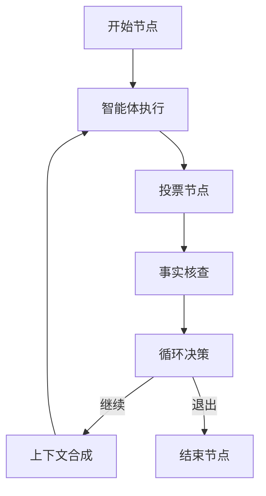
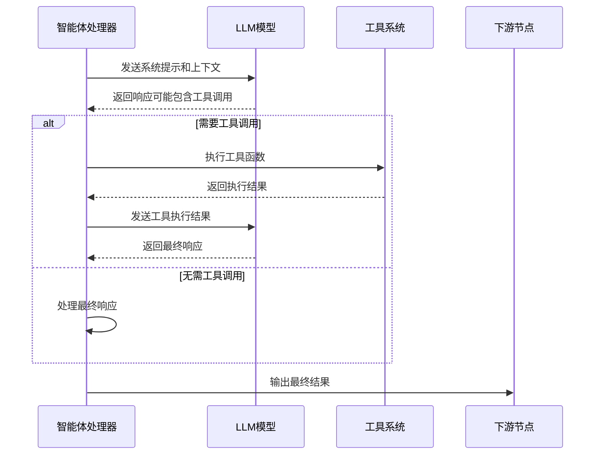
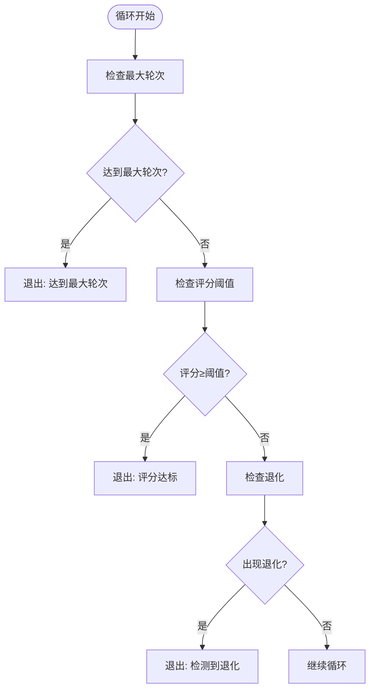
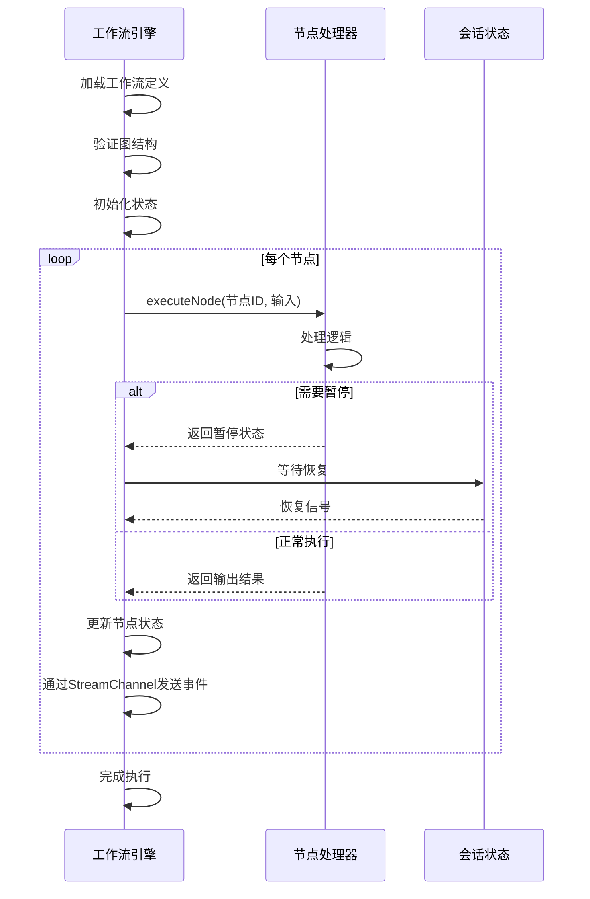
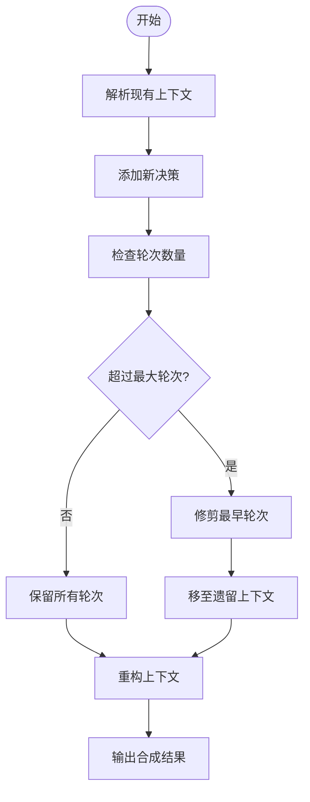

# 智能体ReAct循环

<cite>
**本文档引用文件**  
- [engine.go](file://internal/core/workflow/engine.go)
- [loop.go](file://internal/core/workflow/nodes/loop.go)
- [agent.go](file://internal/core/workflow/nodes/agent.go)
- [context_synth.go](file://internal/core/workflow/nodes/context_synth.go)
- [factory.go](file://internal/core/workflow/nodes/factory.go)
- [types.go](file://internal/core/workflow/types.go)
- [passthrough.go](file://internal/core/workflow/passthrough.go)
- [workflow.md](file://example/workflow.md)
- [engine_test.go](file://internal/core/workflow/engine_test.go)
- [loop_test.go](file://internal/core/workflow/nodes/loop_test.go)
</cite>

## 目录
1. [引言](#引言)
2. [ReAct循环架构概述](#react循环架构概述)
3. [核心组件分析](#核心组件分析)
4. [ReAct循环执行流程](#react循环执行流程)
5. [状态管理与上下文传递](#状态管理与上下文传递)
6. [循环控制机制](#循环控制机制)
7. [上下文合成与历史管理](#上下文合成与历史管理)
8. [测试与验证](#测试与验证)
9. [结论](#结论)

## 引言

智能体ReAct循环是本系统中实现迭代式AI决策与优化的核心机制。该循环通过"思考-行动-观察"（Reason-Act-Observe）的闭环结构，使AI智能体能够在复杂任务中持续改进输出质量。系统通过工作流引擎协调多个智能体的协作，结合投票、事实核查、人工审查等环节，形成一个具备自我修正能力的智能决策系统。

## ReAct循环架构概述

系统采用基于有向无环图（DAG）的工作流引擎来实现ReAct循环。每个循环迭代由多个逻辑节点组成，包括智能体执行、投票、循环控制、上下文合成等组件。工作流引擎负责协调节点间的执行顺序、状态管理和数据流动。



**图源**  
- [engine.go](file://internal/core/workflow/engine.go#L1-L355)
- [types.go](file://internal/core/workflow/types.go#L8-L68)

## 核心组件分析

### 智能体处理器

智能体处理器是ReAct循环中的核心执行单元，负责调用LLM模型完成具体任务。处理器实现了ReAct模式，通过多轮交互完成思考与行动的循环。



**图源**  
- [agent.go](file://internal/core/workflow/nodes/agent.go#L1-L329)

**节源**  
- [agent.go](file://internal/core/workflow/nodes/agent.go#L1-L329)

### 循环处理器

循环处理器负责管理ReAct循环的迭代逻辑，根据预设条件决定是否继续循环或退出。



**图源**  
- [loop.go](file://internal/core/workflow/nodes/loop.go#L1-L108)

**节源**  
- [loop.go](file://internal/core/workflow/nodes/loop.go#L1-L108)

## ReAct循环执行流程

ReAct循环的执行流程遵循严格的顺序和条件判断。工作流引擎从起始节点开始，按照图结构依次执行各节点，并根据节点输出决定后续执行路径。

### 执行流程详解

1. **初始化阶段**：工作流引擎加载图定义，验证结构完整性，初始化状态管理器
2. **执行阶段**：从起始节点开始，逐个执行节点处理器
3. **循环决策阶段**：循环节点根据评分、轮次等条件决定是否继续
4. **上下文更新阶段**：上下文合成节点整合历史信息，为下一轮迭代准备上下文
5. **终止阶段**：当满足退出条件时，执行结束节点，完成整个循环



**节源**  
- [engine.go](file://internal/core/workflow/engine.go#L49-L355)

## 状态管理与上下文传递

系统通过完善的状态管理和上下文传递机制确保ReAct循环的连续性和一致性。

### 状态管理

工作流引擎维护每个节点的执行状态，包括：
- 待处理（Pending）
- 运行中（Running）
- 已完成（Completed）
- 失败（Failed）
- 暂停（Suspended）

状态变更通过线程安全的互斥锁保护，确保并发环境下的数据一致性。

### 上下文传递

系统采用透传配置机制在节点间传递上下文数据。通过`PassthroughConfig`结构定义需要传递的字段列表，`ApplyPassthrough`函数实现字段复制。

```go
type PassthroughConfig struct {
    Keys []string // 需要透传的字段名列表
}

func ApplyPassthrough(input, output map[string]interface{}, config PassthroughConfig) {
    for _, key := range config.Keys {
        if val, ok := input[key]; ok {
            output[key] = val
        }
    }
}
```

**图源**  
- [passthrough.go](file://internal/core/workflow/passthrough.go#L1-L29)

**节源**  
- [passthrough.go](file://internal/core/workflow/passthrough.go#L1-L29)

## 循环控制机制

循环控制机制是ReAct循环的核心，决定了迭代的终止条件和执行策略。

### 终止条件

系统支持多种循环终止条件：
- **最大轮次限制**：防止无限循环，确保系统稳定性
- **评分阈值**：当输出质量达到预设标准时提前退出
- **退化检测**：当连续迭代质量下降时停止，避免进一步恶化
- **人工干预**：支持人工审查环节，允许用户介入决策

### 条件路由

循环处理器实现`ConditionalRouter`接口，根据执行结果动态决定后续节点：

```go
func (l *LoopProcessor) GetNextNodes(ctx context.Context, output map[string]interface{}, defaultNextIDs []string) ([]string, error) {
    shouldExit, _ := output["should_exit"].(bool)
    if shouldExit {
        return []string{defaultNextIDs[1]}, nil // 退出路径
    }
    return []string{defaultNextIDs[0]}, nil     // 继续路径
}
```

**节源**  
- [loop.go](file://internal/core/workflow/nodes/loop.go#L18-L32)

## 上下文合成与历史管理

上下文合成节点负责管理迭代过程中的历史信息，确保后续迭代能够基于完整的上下文进行决策。

### 历史压缩策略

为避免上下文过长导致性能下降，系统采用滚动修剪策略：
- 保留最近N轮的完整细节
- 将较早的迭代压缩为"历史上下文摘要"
- 使用特殊标记存储每轮的简要摘要

### 上下文合成流程

1. 解析现有上下文，分离遗留内容和轮次记录
2. 添加新的决策结果
3. 根据最大保留轮次进行修剪
4. 重构完整的上下文字符串



**节源**  
- [context_synth.go](file://internal/core/workflow/nodes/context_synth.go#L1-L178)

## 测试与验证

系统提供了完善的测试用例，确保ReAct循环的正确性和稳定性。

### 循环处理器测试

测试用例覆盖了各种循环场景：
- 正常迭代：验证在未达到终止条件时继续循环
- 最大轮次：验证达到最大轮次时正确退出
- 评分阈值：验证评分达标时提前退出
- 数据类型：验证支持浮点数和整数评分

```go
func TestLoopProcessor_Process(t *testing.T) {
    p := &LoopProcessor{MaxRounds: 3, ExitOnScore: 90}
    
    // 测试轮次1，评分低于阈值
    input1 := map[string]interface{}{"iteration": 1, "score": 75.0}
    output1, _ := p.Process(context.Background(), input1, stream)
    if output1["should_exit"].(bool) {
        t.Error("预期不应退出")
    }
    
    // 测试达到最大轮次
    input2 := map[string]interface{}{"iteration": 3, "score": 80.0}
    output2, _ := p.Process(context.Background(), input2, stream)
    if !output2["should_exit"].(bool) {
        t.Error("预期应因达到最大轮次而退出")
    }
}
```

**节源**  
- [loop_test.go](file://internal/core/workflow/nodes/loop_test.go#L1-L69)
- [engine_test.go](file://internal/core/workflow/engine_test.go#L1-L254)

## 结论

智能体ReAct循环通过精心设计的架构和组件，实现了高效、稳定的迭代式AI决策系统。系统结合了工作流引擎的精确控制和LLM模型的创造性能力，通过循环迭代持续优化输出质量。关键特性包括：
- 基于DAG的工作流控制，确保执行顺序的准确性
- 灵活的终止条件，平衡质量与效率
- 完善的状态管理，支持暂停和恢复
- 高效的上下文管理，避免信息过载
- 全面的测试覆盖，确保系统可靠性

该设计为复杂AI任务的自动化处理提供了坚实的基础，能够适应各种需要持续优化的场景。