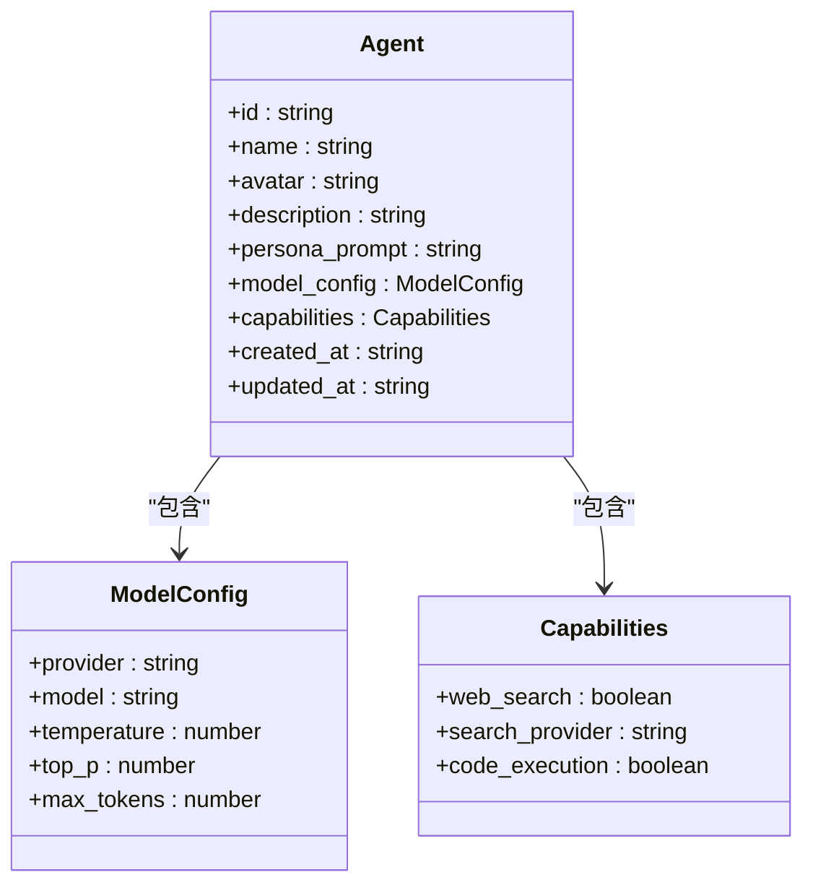
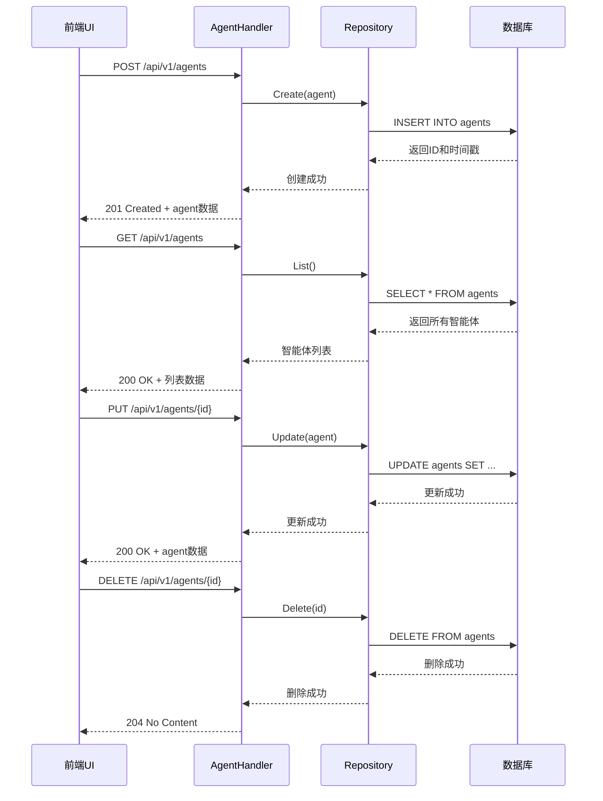
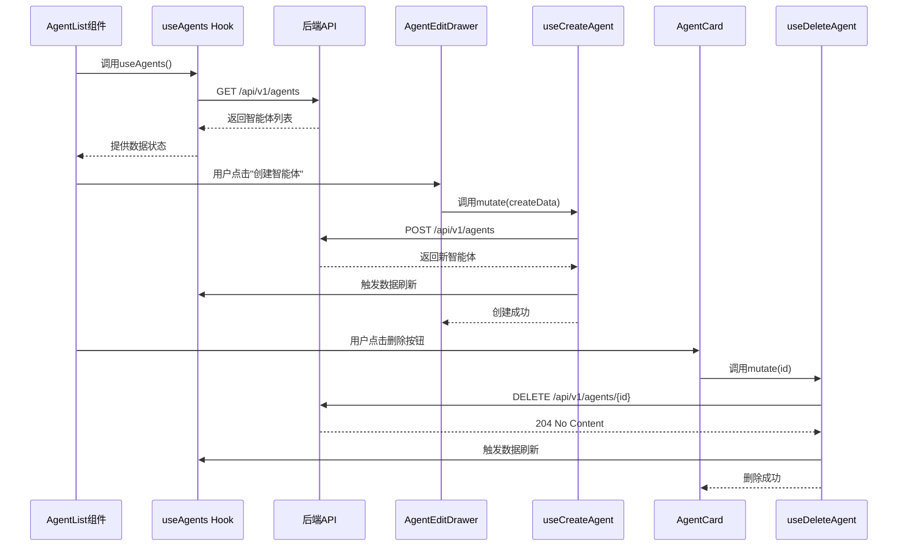
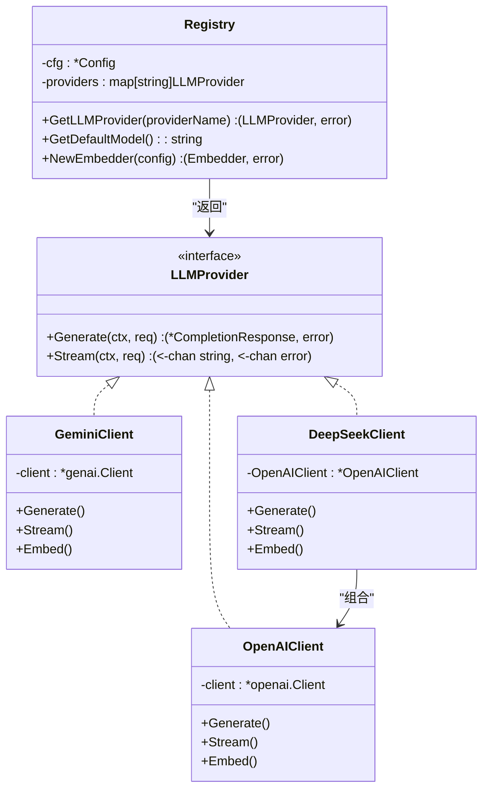
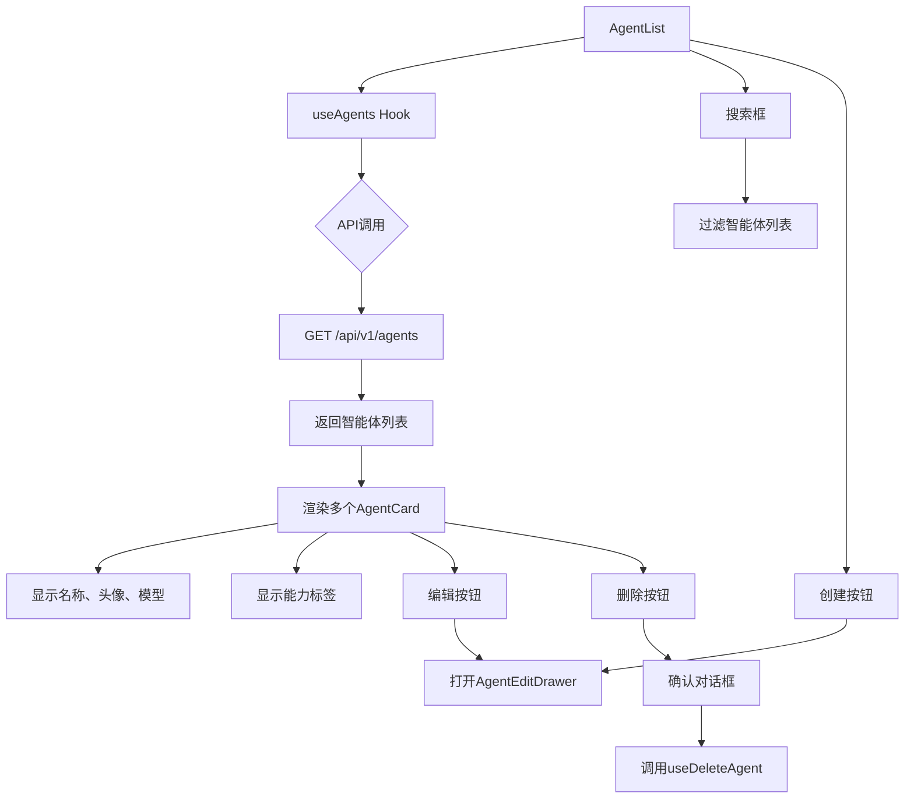
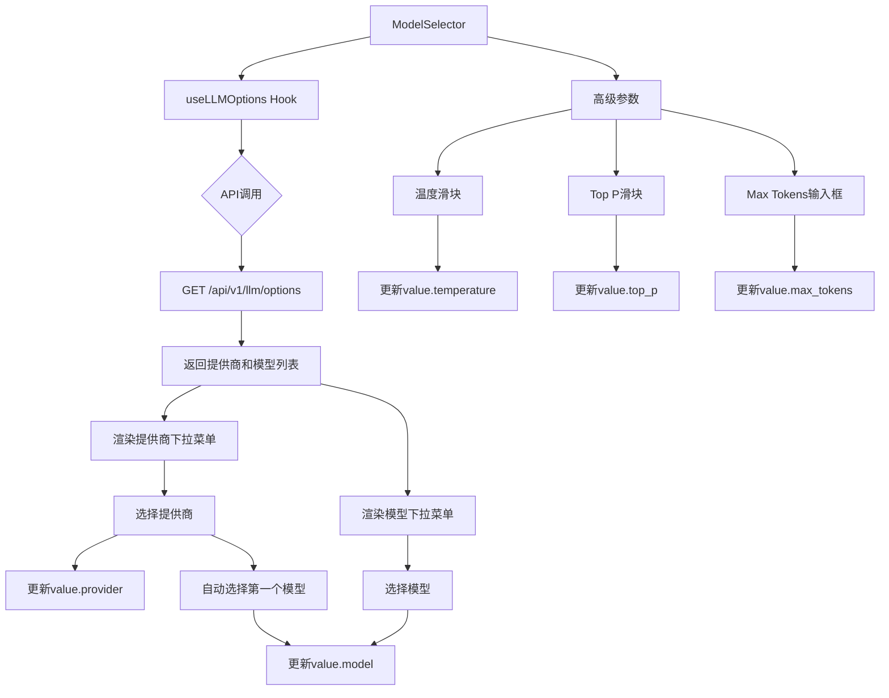
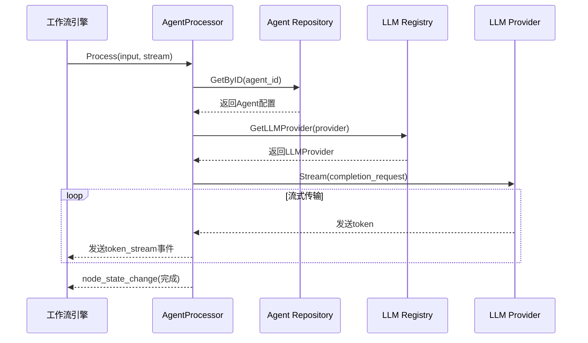

# 智能体管理

<cite>
**本文档引用文件**  
- [entity.go](file://internal/core/agent/entity.go)
- [repository.go](file://internal/core/agent/repository.go)
- [agent.go](file://internal/api/handler/agent.go)
- [agent_repository.go](file://internal/infrastructure/persistence/agent_repository.go)
- [router.go](file://internal/infrastructure/llm/router.go)
- [openai.go](file://internal/infrastructure/llm/openai.go)
- [gemini.go](file://internal/infrastructure/llm/gemini.go)
- [deepseek.go](file://internal/infrastructure/llm/deepseek.go)
- [agent.go](file://internal/core/workflow/nodes/agent.go)
- [model_selection_strategy.md](file://example/prompts/model_selection_strategy.md)
- [AgentCard.tsx](file://frontend/src/features/agents/components/AgentCard.tsx)
- [AgentList.tsx](file://frontend/src/features/agents/components/AgentList.tsx)
- [useAgents.ts](file://frontend/src/hooks/useAgents.ts)
- [agent.ts](file://frontend/src/types/agent.ts)
- [ModelSelector.tsx](file://frontend/src/features/agents/components/ModelSelector.tsx)
</cite>

## 目录
1. [简介](#简介)
2. [智能体数据结构](#智能体数据结构)
3. [核心管理流程](#核心管理流程)
4. [LLM提供商与模型选择策略](#llm提供商与模型选择策略)
5. [前端组件交互](#前端组件交互)
6. [工作流集成](#工作流集成)
7. [常见问题排查](#常见问题排查)
8. [性能优化建议](#性能优化建议)

## 简介
智能体管理功能是本系统的核心组成部分，提供了一套完整的AI智能体生命周期管理机制。系统支持创建、配置、编辑和删除智能体，并允许将这些智能体集成到复杂的工作流中。每个智能体都具备独特的个性特征、模型配置和能力集，能够与群组和会话进行关联，形成一个协同工作的"理事会"。本文档详细阐述了智能体的内部结构、管理流程、与前端的交互方式以及在系统中的角色。

## 智能体数据结构

智能体实体是系统中的核心数据模型，定义了AI角色的全部属性和配置。其结构设计旨在提供最大的灵活性和可扩展性。

**图示来源**
- [entity.go](file://internal/core/agent/entity.go#L9-L37)
- [agent.ts](file://frontend/src/types/agent.ts#L15-L35)

**智能体（Agent）字段说明：**

- **ID**: 智能体的唯一标识符，使用UUID生成。
- **Name**: 智能体的名称，用于在UI中显示。
- **Avatar**: 智能体的头像，可以是URL或表情符号。
- **Description**: 智能体的描述信息。
- **Persona Prompt**: 定义智能体个性和行为的核心系统提示词。
- **Model Config**: 包含LLM提供商、具体模型和生成参数的配置。
- **Capabilities**: 定义智能体的功能权限，如网络搜索和代码执行。
- **Created At / Updated At**: 记录智能体的创建和更新时间。

**模型配置（ModelConfig）字段说明：**

- **Provider**: LLM提供商，如`openai`、`google`、`deepseek`等。
- **Model**: 具体的模型名称，如`gpt-4`、`gemini-1.5-flash`。
- **Temperature**: 控制输出的随机性，值越高越有创造性。
- **Top P**: 核采样参数，控制词汇选择的多样性。
- **Max Tokens**: 生成响应的最大令牌数。

**能力（Capabilities）字段说明：**

- **Web Search**: 是否启用网络搜索功能。
- **Search Provider**: 网络搜索服务提供商，如`tavily`。
- **Code Execution**: 是否启用代码执行沙箱。

**节来源**
- [entity.go](file://internal/core/agent/entity.go#L9-L37)
- [agent.ts](file://frontend/src/types/agent.ts#L1-L35)

## 核心管理流程

智能体的管理通过一套标准的CRUD（创建、读取、更新、删除）API实现，从前端UI到后端服务再到数据库，形成了一个完整的闭环。

### 后端API流程

后端通过Gin框架暴露RESTful API，处理来自前端的所有请求。`AgentHandler`是主要的控制器，它依赖于`agent.Repository`接口来实现数据持久化。

**图示来源**
- [agent.go](file://internal/api/handler/agent.go#L19-L98)
- [agent_repository.go](file://internal/infrastructure/persistence/agent_repository.go#L23-L115)

### 前端交互流程

前端通过React Query库与后端API进行交互，实现了数据的获取、创建、更新和删除。`useAgents`系列Hook封装了所有API调用，确保了数据的一致性和实时性。

**图示来源**
- [useAgents.ts](file://frontend/src/hooks/useAgents.ts#L6-L56)
- [AgentList.tsx](file://frontend/src/features/agents/components/AgentList.tsx#L8-L114)
- [AgentCard.tsx](file://frontend/src/features/agents/components/AgentCard.tsx#L19-L58)

**节来源**
- [agent.go](file://internal/api/handler/agent.go#L19-L98)
- [agent_repository.go](file://internal/infrastructure/persistence/agent_repository.go#L23-L115)
- [useAgents.ts](file://frontend/src/hooks/useAgents.ts#L6-L56)

## LLM提供商与模型选择策略

系统通过一个灵活的LLM注册中心（Registry）来管理不同的大语言模型提供商，支持动态切换和配置。

### LLM注册中心

`Registry`结构体是LLM管理的核心，它根据配置文件中的API密钥来决定哪些提供商是可用的。当请求一个提供商时，注册中心会检查其配置，初始化相应的客户端并缓存以供后续使用。

**图示来源**
- [router.go](file://internal/infrastructure/llm/router.go#L13-L149)
- [openai.go](file://internal/infrastructure/llm/openai.go#L11-L27)
- [gemini.go](file://internal/infrastructure/llm/gemini.go#L11-L28)
- [deepseek.go](file://internal/infrastructure/llm/deepseek.go#L9-L20)

### 支持的提供商

系统目前支持以下LLM提供商：

- **OpenAI**: 通过`openai`提供商ID访问，使用`gpt-4`等模型。
- **Google Gemini**: 通过`google`或`gemini`提供商ID访问，使用`gemini-1.5-flash`等模型。
- **DeepSeek**: 通过`deepseek`提供商ID访问，使用`deepseek-chat`模型。
- **DashScope (通义千问)**: 通过`dashscope`提供商ID访问，使用`qwen-max`等模型。
- **Ollama**: 通过`ollama`提供商ID访问，用于本地模型。

### 模型选择策略

系统采用"模型联邦"（Model Federation）策略，为不同角色分配最适合的模型，以避免思维同质化。根据`example/prompts/model_selection_strategy.md`文档，推荐的策略如下：

| 角色 | 推荐模型 | 温度 (Temperature) | 选型逻辑 |
| :--- | :--- | :--- | :--- |
| **正方：战略支持者** | Google Gemini 3.0 Pro | 0.9 | 利用其强大的联想力和创造性，鼓励发散性思维 |
| **反方：风险控制官** | DeepSeek-V3 | 0.6 | 利用其纯逻辑和冷峻的特性，专注于逻辑查错和压力测试 |
| **裁判：首席裁决官** | Zhipu GLM-4.6 | 0.2 | 利用其深度推理和中正平和的特点，进行综合权衡和决断 |

**节来源**
- [router.go](file://internal/infrastructure/llm/router.go#L13-L149)
- [model_selection_strategy.md](file://example/prompts/model_selection_strategy.md#L1-L79)

## 前端组件交互

前端提供了直观的UI组件来管理和配置智能体，主要包括`AgentList`、`AgentCard`和`ModelSelector`。

### AgentList 与 AgentCard

`AgentList`组件负责展示所有智能体的列表，并提供搜索、创建和删除功能。它使用`useAgents` Hook获取数据，并通过`AgentCard`组件渲染每个智能体。

`AgentCard`组件以卡片形式展示单个智能体的信息，包括名称、头像、模型提供商和能力标签。用户可以通过卡片上的编辑和删除按钮进行操作。

**图示来源**
- [AgentList.tsx](file://frontend/src/features/agents/components/AgentList.tsx#L8-L114)
- [AgentCard.tsx](file://frontend/src/features/agents/components/AgentCard.tsx#L19-L87)

### ModelSelector 组件

`ModelSelector`组件提供了一个用户友好的界面来选择LLM提供商和模型，并配置高级参数。它通过`useLLMOptions` Hook动态获取可用的提供商和模型列表。

**图示来源**
- [ModelSelector.tsx](file://frontend/src/features/agents/components/ModelSelector.tsx#L14-L190)
- [useLLMOptions.ts](file://frontend/src/hooks/useLLMOptions.ts)

**节来源**
- [AgentList.tsx](file://frontend/src/features/agents/components/AgentList.tsx#L8-L114)
- [AgentCard.tsx](file://frontend/src/features/agents/components/AgentCard.tsx#L19-L87)
- [ModelSelector.tsx](file://frontend/src/features/agents/components/ModelSelector.tsx#L14-L190)

## 工作流集成

智能体是工作流中的核心执行节点。当工作流执行到`Agent`节点时，系统会调用`AgentProcessor`来执行智能体的推理过程。

### 工作流节点处理流程

`AgentProcessor`负责协调智能体的执行。它首先从数据库获取智能体的完整配置，然后根据配置中的`provider`字段从`Registry`中获取对应的LLM客户端，最后构造请求并流式传输响应。

**图示来源**
- [agent.go](file://internal/core/workflow/nodes/agent.go#L23-L130)

### 与群组和会话的关联

智能体通过工作流与群组和会话关联。一个群组（Group）可以包含多个会话（Session），而每个会话都运行一个特定的工作流。工作流中的`Agent`节点引用了具体的智能体，从而将智能体的能力注入到会话的讨论中。

**节来源**
- [agent.go](file://internal/core/workflow/nodes/agent.go#L23-L130)

## 常见问题排查

### 模型加载失败

**症状**: 在创建或编辑智能体时，模型下拉菜单为空或显示"Unconfigured"。

**原因**: 
1. 未在`.env`文件中正确配置相应LLM提供商的API密钥。
2. `Registry`无法初始化该提供商的客户端。

**解决方案**:
1. 检查`.env`文件，确保`OPENAI_KEY`、`GEMINI_KEY`、`DEEPSEEK_KEY`等环境变量已正确设置。
2. 确认密钥的有效性，尝试使用密钥直接调用提供商的API进行测试。
3. 查看后端日志，确认`Registry`在初始化时是否报错。

### 配置错误

**症状**: 保存智能体后，某些配置（如温度）未生效。

**原因**: 
1. 前端组件未正确将更改传递给`onChange`回调。
2. 后端API在反序列化时忽略了某些字段。

**解决方案**:
1. 检查`ModelSelector`组件的`onChange`函数，确保所有字段都被正确更新。
2. 检查`Agent`结构体的JSON标签，确保与前端发送的字段名匹配。
3. 使用浏览器开发者工具，检查网络请求的payload是否包含正确的配置。

**节来源**
- [router.go](file://internal/infrastructure/llm/router.go#L64-L86)
- [ModelSelector.tsx](file://frontend/src/features/agents/components/ModelSelector.tsx#L26-L41)

## 性能优化建议

### 连接池管理

LLM客户端（如`OpenAIClient`、`GeminiClient`）在初始化时会创建HTTP客户端。为了优化性能，应确保这些客户端是单例的，并在整个应用生命周期内复用，避免为每次请求创建新的连接。

### 响应缓存

对于不经常变化的智能体列表，可以利用React Query的缓存机制。`useAgents` Hook已经配置了合理的缓存策略，通过`invalidateQueries`在数据变更时自动刷新。对于智能体详情，可以使用`useAgent(id)` Hook，它会根据ID缓存单个智能体。

### 流式传输优化

`AgentProcessor`使用流式传输（Streaming）来实时返回LLM的响应。这极大地提升了用户体验，但需要注意：
1. 确保WebSocket连接稳定，避免因网络问题导致流中断。
2. 在`AgentProcessor`中正确处理`context.Done()`信号，以便在工作流取消时能及时终止LLM请求。

**节来源**
- [openai.go](file://internal/infrastructure/llm/openai.go#L76-L129)
- [gemini.go](file://internal/infrastructure/llm/gemini.go#L116-L176)
- [agent.go](file://internal/core/workflow/nodes/agent.go#L80-L108)