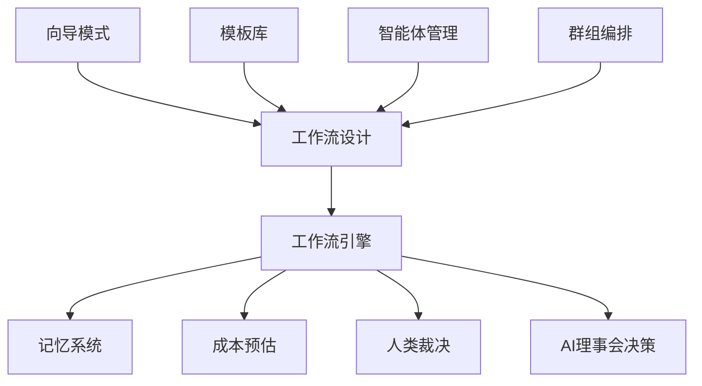

# 核心功能

<cite>
**本文档中引用的文件**  
- [engine.go](file://internal/core/workflow/engine.go)
- [factory.go](file://internal/core/workflow/nodes/factory.go)
- [types.go](file://internal/core/workflow/types.go)
- [agent.go](file://internal/core/agent/entity.go)
- [group.go](file://internal/core/group/entity.go)
- [template.go](file://internal/core/workflow/template.go)
- [cost.go](file://internal/core/workflow/cost.go)
- [service.go](file://internal/core/memory/service.go)
- [WizardMode.tsx](file://frontend/src/features/editor/components/Wizard/WizardMode.tsx)
</cite>

## 目录
1. [简介](#简介)
2. [功能全景图](#功能全景图)
3. [智能体管理](#智能体管理)
4. [群组编排](#群组编排)
5. [工作流设计](#工作流设计)
6. [模板库](#模板库)
7. [向导模式](#向导模式)
8. [人类裁决](#人类裁决)
9. [成本预估](#成本预估)
10. [记忆系统](#记忆系统)
11. [功能协同与AI理事会决策流程](#功能协同与ai理事会决策流程)

## 简介
本文件旨在全面介绍AI理事会系统的核心功能模块，包括智能体管理、群组编排、工作流设计、模板库、向导模式、人类裁决、成本预估和记忆系统。这些功能共同构建了一个支持复杂AI协作决策的框架，通过可编程的工作流节点和模块化组件，实现从问题提出到最终决策的自动化流程。

**Section sources**
- [engine.go](file://internal/core/workflow/engine.go#L1-L246)
- [types.go](file://internal/core/workflow/types.go#L1-L67)

## 功能全景图
AI理事会系统的核心是一个基于工作流引擎的决策框架，该引擎通过定义好的节点类型（如Start、Agent、Vote、Loop等）来构建复杂的逻辑流程。用户可以通过模板库快速启动，或使用向导模式由AI自动生成工作流。整个流程中，智能体在群组上下文中协作，通过记忆系统获取历史信息，成本预估提供执行前的预算分析，必要时引入人类裁决以确保决策质量。

**Diagram sources**
- [engine.go](file://internal/core/workflow/engine.go#L1-L246)
- [types.go](file://internal/core/workflow/types.go#L1-L67)
- [WizardMode.tsx](file://frontend/src/features/editor/components/Wizard/WizardMode.tsx#L1-L180)

## 智能体管理
智能体是AI理事会中的基本决策单元，代表具有特定角色和能力的AI实体。每个智能体拥有唯一的身份标识、名称、头像、描述和人格提示（Persona Prompt），并配置了具体的LLM模型参数（如提供者、模型名称、温度、TopP、最大令牌数等）。此外，智能体还定义了其能力集，包括是否支持网络搜索、代码执行等高级功能。

**Section sources**
- [agent.go](file://internal/core/agent/entity.go#L1-L37)

## 群组编排
群组是协作的上下文容器，用于组织相关的智能体和工作流。每个群组有名称、图标和系统提示，可以定义默认参与的智能体列表。群组为工作流提供了共享的上下文环境，使得智能体之间的协作更加有序和高效。通过群组，用户可以为不同的项目或任务创建独立的决策空间。

**Section sources**
- [group.go](file://internal/core/group/entity.go#L1-L19)

## 工作流设计
工作流设计是系统的核心，通过图形化的方式定义决策流程。工作流由多种节点类型构成，包括：
- **Start节点**：流程的起点，负责解析输入（如提案、附件）并构造初始上下文。
- **Agent节点**：调用指定智能体执行任务，根据其人格提示和模型配置生成响应。
- **Vote节点**：对多个并行分支的结果进行投票表决，根据预设阈值决定是否通过。
- **Loop节点**：实现循环逻辑，支持基于最大轮次或评分阈值的退出条件。
- **FactCheck节点**：通过网络搜索和LLM验证来检查内容的准确性。
- **HumanReview节点**：暂停流程并等待人工审查和输入。
- **MemoryRetrieval节点**：从记忆系统中检索相关历史上下文并注入当前流程。

**Section sources**
- [engine.go](file://internal/core/workflow/engine.go#L1-L246)
- [types.go](file://internal/core/workflow/types.go#L1-L67)
- [factory.go](file://internal/core/workflow/nodes/factory.go#L1-L106)

## 模板库
模板库提供了预定义的工作流模式，用户可以根据不同场景快速选择和应用。模板按类别组织，如代码审查、商业计划、快速决策等，既包括系统内置模板，也支持用户自定义保存。每个模板包含完整的图定义（节点、连接、配置），可直接用于启动新的决策流程。

**Section sources**
- [template.go](file://internal/core/workflow/template.go#L1-L35)

## 向导模式
向导模式是一种AI驱动的工作流生成方式，用户只需描述意图（如“我需要一个严格的代码审查流程”），系统即可自动生成相应的工作流。该模式通过自然语言理解将用户需求转化为结构化的图定义，并推荐相似的现有模板供选择，极大地降低了工作流设计的门槛。

**Section sources**
- [WizardMode.tsx](file://frontend/src/features/editor/components/Wizard/WizardMode.tsx#L1-L180)

## 人类裁决
在关键决策点，系统可插入人类裁决节点，暂停自动化流程并等待人工干预。该节点允许设置超时时间和是否允许跳过，确保在需要时获得人类的最终判断。此机制作为AI决策的补充，增强了系统的可靠性和可控性。

**Section sources**
- [human_review.go](file://internal/core/workflow/nodes/human_review.go#L1-L47)

## 成本预估
成本预估功能在执行前对工作流进行经济性分析，基于各节点配置的LLM模型和预设的定价模型（如GPT-4、Claude等）计算总成本。估算包括输入/输出令牌费用的分解，并按智能体进行成本归集，帮助用户在资源消耗和决策质量之间做出权衡。

**Section sources**
- [cost.go](file://internal/core/workflow/cost.go#L1-L87)

## 记忆系统
记忆系统实现了多层级的上下文管理，包括：
- **隔离区（Tier 1）**：将高风险内容记录到PostgreSQL的隔离日志中。
- **热工作记忆（Tier 2）**：通过Redis存储近期上下文，支持快速检索。
- **冷长期记忆（Tier 3）**：利用PGVector进行向量化存储和语义检索，实现长期知识的沉淀和复用。

该系统通过Ingress过滤器确保内容质量，并支持在工作流中自动检索和注入历史上下文。

**Section sources**
- [service.go](file://internal/core/memory/service.go#L1-L209)

## 功能协同与AI理事会决策流程
各功能模块协同支持AI理事会的决策过程。用户首先在群组中选择或创建工作流（通过模板或向导模式），工作流引擎根据定义的节点序列执行。智能体在执行任务时可访问记忆系统获取历史信息，成本预估在执行前提供预算参考。在关键节点（如投票、循环、事实核查）后，流程可能需要人类裁决。整个过程形成了一个集自动化、智能化和人机协同于一体的决策闭环。

**Section sources**
- [engine.go](file://internal/core/workflow/engine.go#L1-L246)
- [types.go](file://internal/core/workflow/types.go#L1-L67)
- [service.go](file://internal/core/memory/service.go#L1-L209)
- [cost.go](file://internal/core/workflow/cost.go#L1-L87)