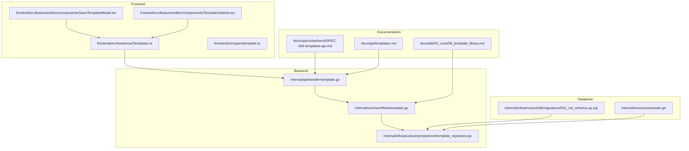
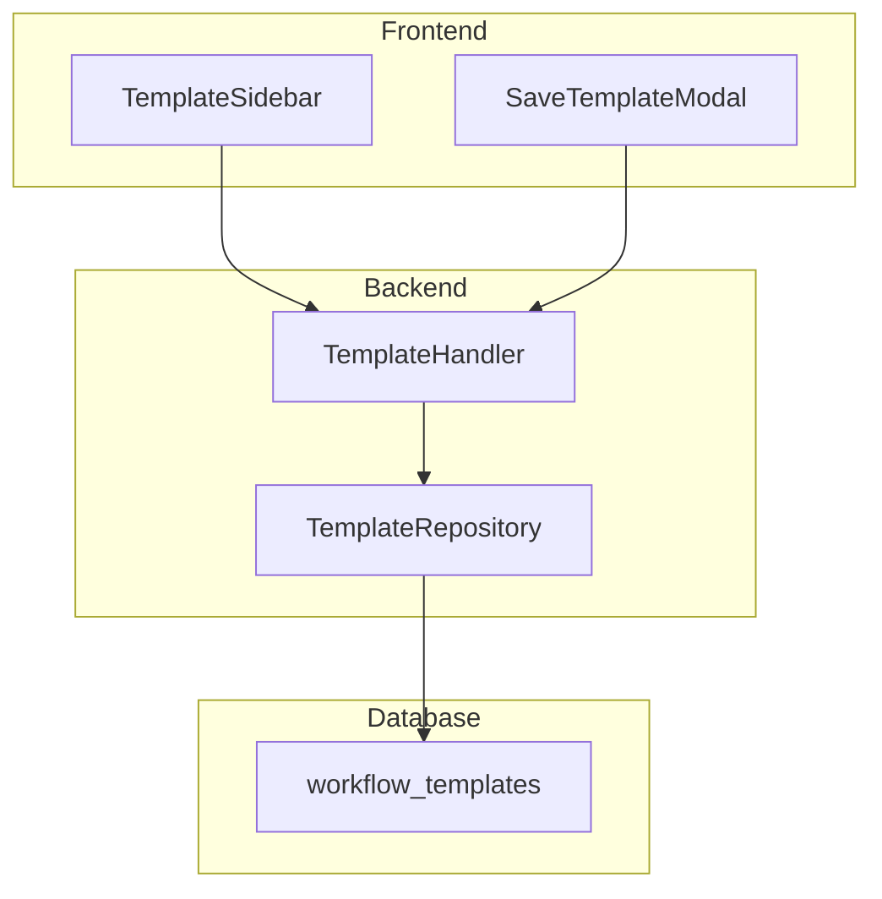
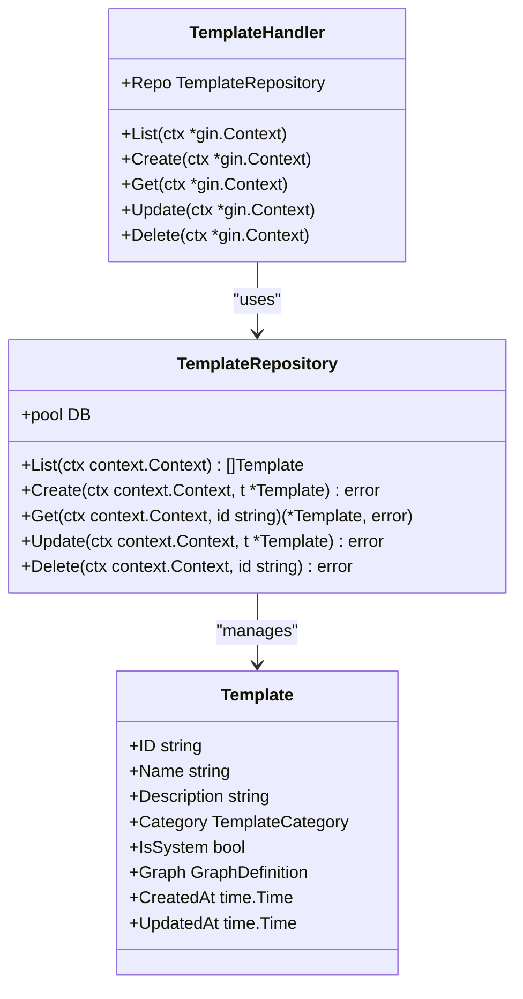
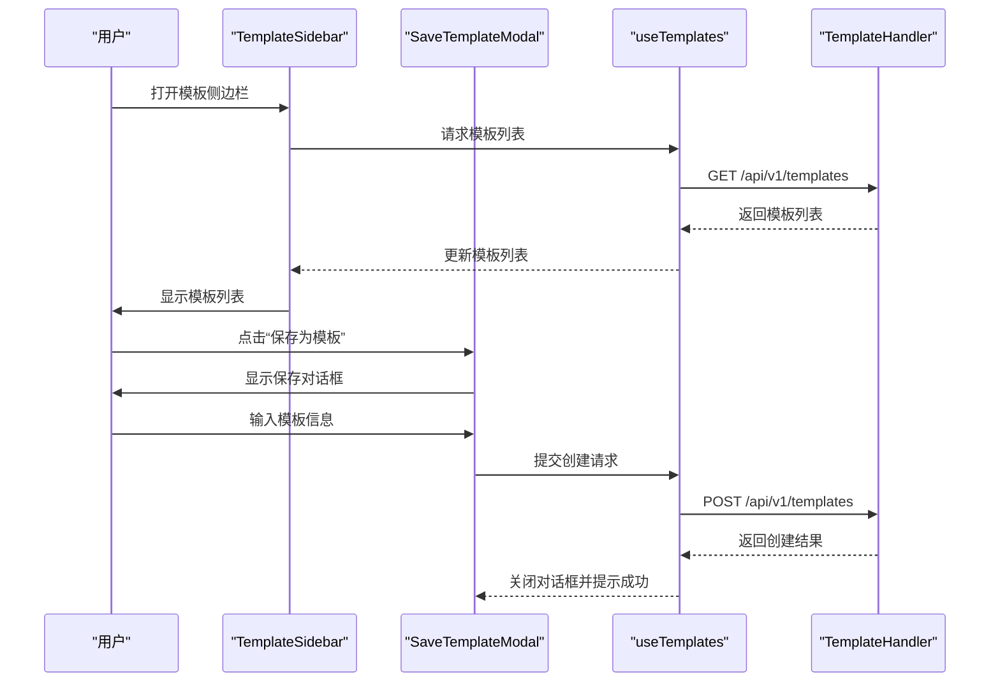
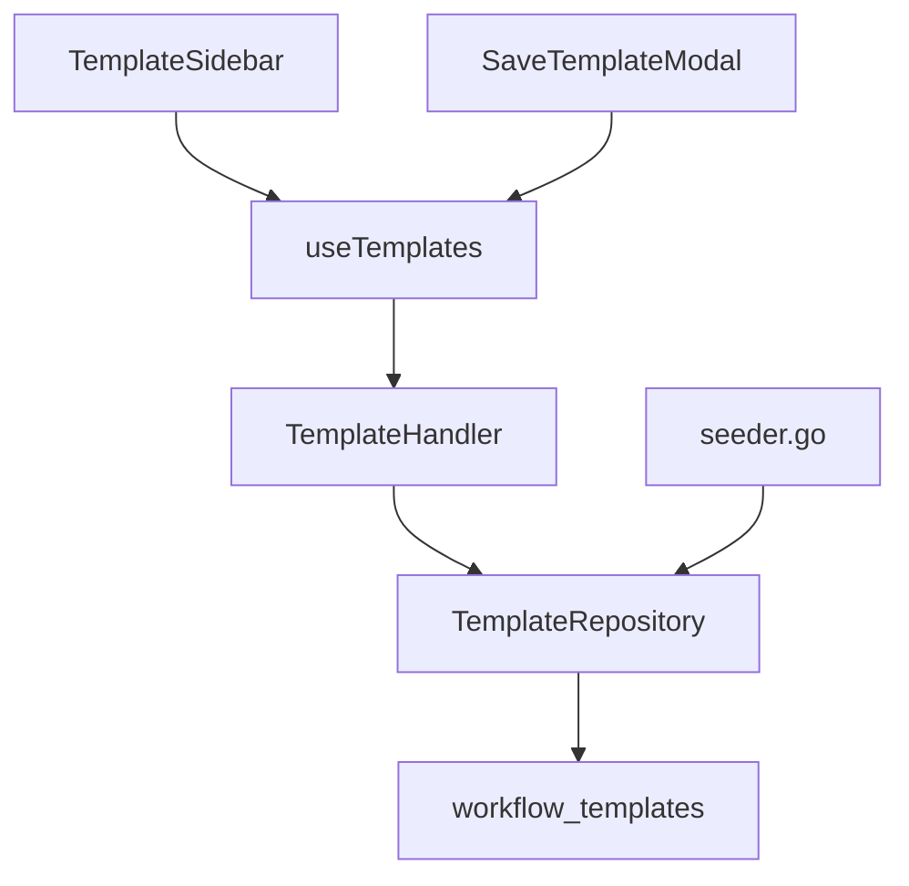

# 模板库

<cite>
**本文档引用文件**  
- [template.go](file://internal/core/workflow/template.go)
- [template_repository.go](file://internal/infrastructure/persistence/template_repository.go)
- [template.go](file://internal/api/handler/template.go)
- [SaveTemplateModal.tsx](file://frontend/src/features/editor/components/SaveTemplateModal.tsx)
- [TemplateSidebar.tsx](file://frontend/src/features/editor/components/TemplateSidebar.tsx)
- [useTemplates.ts](file://frontend/src/hooks/useTemplates.ts)
- [types.ts](file://frontend/src/types/template.ts)
- [SPEC-406-templates-api.md](file://docs/specs/backend/SPEC-406-templates-api.md)
- [08_template_library.md](file://docs/tdd/02_core/08_template_library.md)
- [templates.md](file://docs/api/templates.md)
- [seeder.go](file://internal/resources/seeder.go)
- [001_init_schema.up.sql](file://internal/infrastructure/db/migrations/001_init_schema.up.sql)
</cite>

## 目录
1. [简介](#简介)
2. [项目结构](#项目结构)
3. [核心组件](#核心组件)
4. [架构概述](#架构概述)
5. [详细组件分析](#详细组件分析)
6. [依赖分析](#依赖分析)
7. [性能考虑](#性能考虑)
8. [故障排除指南](#故障排除指南)
9. [结论](#结论)

## 简介
模板库是本系统的核心功能之一，旨在实现工作流结构的序列化与跨会话复用。它支持系统预置模板和用户自定义模板的存储、调用及版本管理机制。通过前端TemplateSidebar，用户可以浏览和快速加载模板；通过SaveTemplateModal，用户可以保存当前工作流为模板。后端提供完整的增删改查API接口，确保模板数据的持久化和安全性。本文档将全面介绍模板库的功能设计与使用方式，并提供典型模板案例和最佳实践指导。

## 项目结构
模板库功能分布在多个目录中，主要包括后端API处理、前端组件实现以及数据库迁移脚本。以下是主要文件的组织结构：

**Diagram sources**
- [template.go](file://internal/core/workflow/template.go)
- [template_repository.go](file://internal/infrastructure/persistence/template_repository.go)
- [template.go](file://internal/api/handler/template.go)
- [SaveTemplateModal.tsx](file://frontend/src/features/editor/components/SaveTemplateModal.tsx)
- [TemplateSidebar.tsx](file://frontend/src/features/editor/components/TemplateSidebar.tsx)
- [useTemplates.ts](file://frontend/src/hooks/useTemplates.ts)
- [types.ts](file://frontend/src/types/template.ts)
- [SPEC-406-templates-api.md](file://docs/specs/backend/SPEC-406-templates-api.md)
- [08_template_library.md](file://docs/tdd/02_core/08_template_library.md)
- [templates.md](file://docs/api/templates.md)
- [seeder.go](file://internal/resources/seeder.go)
- [001_init_schema.up.sql](file://internal/infrastructure/db/migrations/001_init_schema.up.sql)

**Section sources**
- [template.go](file://internal/core/workflow/template.go)
- [template_repository.go](file://internal/infrastructure/persistence/template_repository.go)
- [template.go](file://internal/api/handler/template.go)
- [SaveTemplateModal.tsx](file://frontend/src/features/editor/components/SaveTemplateModal.tsx)
- [TemplateSidebar.tsx](file://frontend/src/features/editor/components/TemplateSidebar.tsx)
- [useTemplates.ts](file://frontend/src/hooks/useTemplates.ts)
- [types.ts](file://frontend/src/types/template.ts)
- [SPEC-406-templates-api.md](file://docs/specs/backend/SPEC-406-templates-api.md)
- [08_template_library.md](file://docs/tdd/02_core/08_template_library.md)
- [templates.md](file://docs/api/templates.md)
- [seeder.go](file://internal/resources/seeder.go)
- [001_init_schema.up.sql](file://internal/infrastructure/db/migrations/001_init_schema.up.sql)

## 核心组件
模板库的核心组件包括后端的模板处理逻辑、前端的用户界面组件以及数据库的持久化机制。这些组件协同工作，实现了模板的创建、读取、更新和删除（CRUD）操作。

**Section sources**
- [template.go](file://internal/core/workflow/template.go)
- [template_repository.go](file://internal/infrastructure/persistence/template_repository.go)
- [template.go](file://internal/api/handler/template.go)
- [SaveTemplateModal.tsx](file://frontend/src/features/editor/components/SaveTemplateModal.tsx)
- [TemplateSidebar.tsx](file://frontend/src/features/editor/components/TemplateSidebar.tsx)
- [useTemplates.ts](file://frontend/src/hooks/useTemplates.ts)
- [types.ts](file://frontend/src/types/template.ts)

## 架构概述
模板库的架构分为三层：前端展示层、后端服务层和数据存储层。前端展示层负责用户交互，包括模板的浏览、选择和保存；后端服务层提供RESTful API接口，处理前端请求并调用数据存储层进行数据操作；数据存储层则负责模板数据的持久化存储。

**Diagram sources**
- [TemplateSidebar.tsx](file://frontend/src/features/editor/components/TemplateSidebar.tsx)
- [SaveTemplateModal.tsx](file://frontend/src/features/editor/components/SaveTemplateModal.tsx)
- [template.go](file://internal/api/handler/template.go)
- [template_repository.go](file://internal/infrastructure/persistence/template_repository.go)
- [001_init_schema.up.sql](file://internal/infrastructure/db/migrations/001_init_schema.up.sql)

## 详细组件分析
### 后端模板处理
后端模板处理主要由`TemplateHandler`和`TemplateRepository`两个组件完成。`TemplateHandler`负责接收HTTP请求并调用`TemplateRepository`进行数据操作。`TemplateRepository`则封装了对数据库的具体操作，如查询、插入、更新和删除。

#### 类图

**Diagram sources**
- [template.go](file://internal/api/handler/template.go)
- [template_repository.go](file://internal/infrastructure/persistence/template_repository.go)
- [template.go](file://internal/core/workflow/template.go)

### 前端模板管理
前端模板管理主要包括`TemplateSidebar`和`SaveTemplateModal`两个组件。`TemplateSidebar`用于展示可用的模板列表，用户可以通过它选择一个模板来加载到当前工作流中。`SaveTemplateModal`则允许用户将当前工作流保存为一个新的模板。

#### 序列图

**Diagram sources**
- [TemplateSidebar.tsx](file://frontend/src/features/editor/components/TemplateSidebar.tsx)
- [SaveTemplateModal.tsx](file://frontend/src/features/editor/components/SaveTemplateModal.tsx)
- [useTemplates.ts](file://frontend/src/hooks/useTemplates.ts)
- [template.go](file://internal/api/handler/template.go)

## 依赖分析
模板库的各个组件之间存在明确的依赖关系。前端组件依赖于后端API提供的服务，而后端服务又依赖于数据库的持久化能力。此外，系统预置模板通过`seeder.go`在应用启动时自动加载到数据库中。

**Diagram sources**
- [TemplateSidebar.tsx](file://frontend/src/features/editor/components/TemplateSidebar.tsx)
- [SaveTemplateModal.tsx](file://frontend/src/features/editor/components/SaveTemplateModal.tsx)
- [useTemplates.ts](file://frontend/src/hooks/useTemplates.ts)
- [template.go](file://internal/api/handler/template.go)
- [template_repository.go](file://internal/infrastructure/persistence/template_repository.go)
- [001_init_schema.up.sql](file://internal/infrastructure/db/migrations/001_init_schema.up.sql)
- [seeder.go](file://internal/resources/seeder.go)

**Section sources**
- [TemplateSidebar.tsx](file://frontend/src/features/editor/components/TemplateSidebar.tsx)
- [SaveTemplateModal.tsx](file://frontend/src/features/editor/components/SaveTemplateModal.tsx)
- [useTemplates.ts](file://frontend/src/hooks/useTemplates.ts)
- [template.go](file://internal/api/handler/template.go)
- [template_repository.go](file://internal/infrastructure/persistence/template_repository.go)
- [001_init_schema.up.sql](file://internal/infrastructure/db/migrations/001_init_schema.up.sql)
- [seeder.go](file://internal/resources/seeder.go)

## 性能考虑
为了保证模板库的高性能，系统采用了多种优化策略。首先，数据库查询使用了索引以加快检索速度；其次，前端通过React Query缓存机制减少了不必要的网络请求；最后，后端API接口设计遵循RESTful原则，确保了良好的可扩展性和维护性。

## 故障排除指南
在使用模板库时，可能会遇到一些常见问题。例如，模板无法保存或加载失败。这些问题通常与网络连接、权限设置或数据格式有关。建议检查网络状态、确认用户权限，并确保提交的数据符合API要求。

**Section sources**
- [template.go](file://internal/api/handler/template.go)
- [useTemplates.ts](file://frontend/src/hooks/useTemplates.ts)

## 结论
模板库作为系统的重要组成部分，不仅提高了工作流的复用性，还增强了用户体验。通过合理的架构设计和高效的实现方式，模板库能够满足各种复杂场景下的需求。未来，我们将继续优化其性能和功能，为用户提供更加便捷的服务。