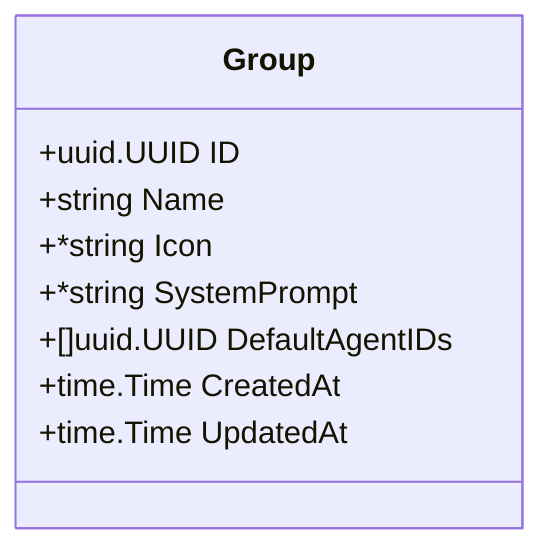
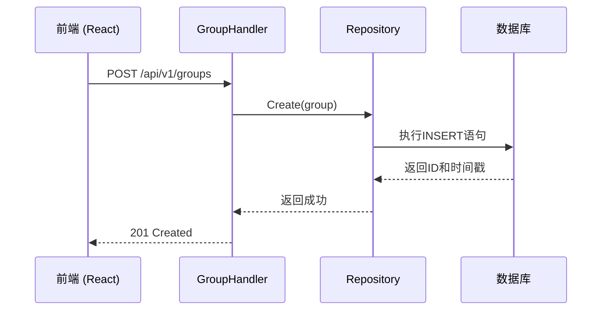
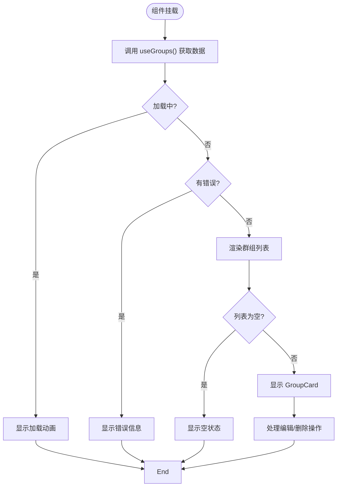
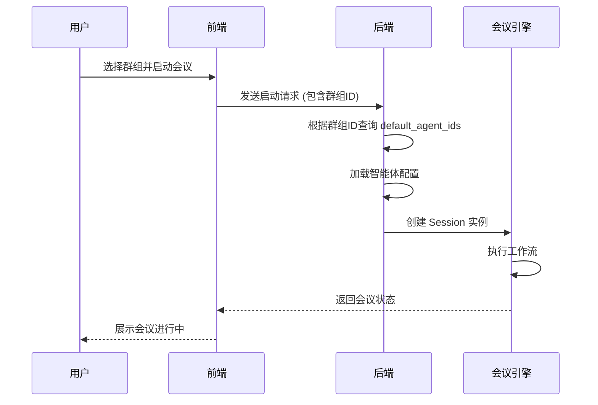
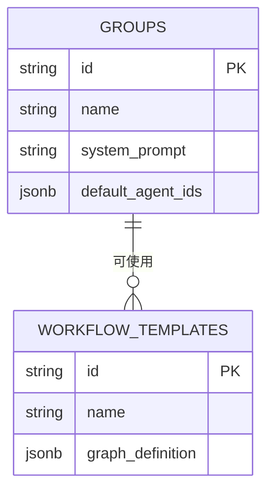

# 群组编排

<cite>
**本文档引用文件**  
- [entity.go](file://internal/core/group/entity.go)
- [repository.go](file://internal/core/group/repository.go)
- [group.go](file://internal/api/handler/group.go)
- [group_repository.go](file://internal/infrastructure/persistence/group_repository.go)
- [GroupsPage.tsx](file://frontend/src/features/groups/pages/GroupsPage.tsx)
- [GroupList.tsx](file://frontend/src/features/groups/components/GroupList.tsx)
- [CreateGroupModal.tsx](file://frontend/src/features/groups/components/CreateGroupModal.tsx)
- [useGroups.ts](file://frontend/src/hooks/useGroups.ts)
- [group.ts](file://frontend/src/types/group.ts)
- [seeder.go](file://internal/resources/seeder.go)
- [session.go](file://internal/core/workflow/session.go)
- [template.go](file://internal/core/workflow/template.go)
</cite>

## 目录
1. [引言](#引言)
2. [群组实体结构与持久化](#群组实体结构与持久化)
3. [群组管理的实现机制](#群组管理的实现机制)
4. [前端组件分析](#前端组件分析)
5. [群组在会议启动中的作用](#群组在会议启动中的作用)
6. [操作示例与权限控制](#操作示例与权限控制)
7. [与工作流模板的复用关系](#与工作流模板的复用关系)
8. [最佳实践建议](#最佳实践建议)
9. [结论](#结论)

## 引言
群组管理系统是The Council平台的核心功能之一，它为用户提供了一个组织和管理AI智能体协作的容器。通过创建不同的群组，用户可以针对特定的业务场景（如SaaS项目、家庭决策或投资分析）配置专属的智能体团队，并定义其行为准则。本文档将详细说明群组的创建、成员管理、默认班底配置以及与智能体的绑定关系，解析其后端实现和前端展示逻辑。

## 群组实体结构与持久化
群组实体（Group）是系统中的核心数据模型，它定义了群组的基本属性和结构。该实体在后端通过Go语言实现，并通过PostgreSQL数据库进行持久化存储。

### 群组实体结构
群组实体包含以下关键字段：
- **ID**: 唯一标识符，使用UUID生成。
- **Name**: 群组名称，用于标识和展示。
- **Icon**: 可选的图标，通常为Emoji，用于视觉区分。
- **SystemPrompt**: 系统提示词，定义了该群组的“宪法”或核心行为准则。
- **DefaultAgentIDs**: 一个UUID数组，存储了该群组默认绑定的智能体ID列表。
- **CreatedAt/UpdatedAt**: 时间戳，记录群组的创建和更新时间。



**图示来源**
- [entity.go](file://internal/core/group/entity.go#L9-L18)

### 持久化方式
群组数据通过PostgreSQL数据库进行持久化。数据库中的`groups`表结构与实体定义相对应，其中`default_agent_ids`字段使用JSONB类型存储，以支持灵活的数组操作。

```sql
CREATE TABLE groups (
    id UUID PRIMARY KEY DEFAULT gen_random_uuid(),
    name VARCHAR(128) NOT NULL,
    icon VARCHAR(256),
    system_prompt TEXT,
    default_agent_ids JSONB DEFAULT '[]',
    created_at TIMESTAMPTZ DEFAULT NOW(),
    updated_at TIMESTAMPTZ DEFAULT NOW()
);
```

**图示来源**
- [tdd/04_storage.md](file://docs/tdd/04_storage.md#L122-L131)

## 群组管理的实现机制
群组管理功能的实现遵循典型的分层架构，从前端界面到后端API，再到数据访问层，形成了一个完整的CRUD（创建、读取、更新、删除）流程。

### 后端服务层
后端通过`GroupHandler`处理所有与群组相关的HTTP请求。该处理器实现了标准的RESTful API，包括`Create`、`Get`、`List`、`Update`和`Delete`方法。这些方法接收HTTP请求，解析参数，并调用下层的`Repository`接口进行业务逻辑处理。



**图示来源**
- [group.go](file://internal/api/handler/group.go#L19-L32)
- [group_repository.go](file://internal/infrastructure/persistence/group_repository.go#L23-L43)

### 数据访问层
`GroupRepository`是数据访问层的具体实现，它直接与PostgreSQL数据库交互。该层负责将Go语言的`Group`结构体映射到数据库的`groups`表，并执行相应的SQL操作。所有数据库操作都通过`db.DB`接口进行，确保了代码的可测试性和可维护性。

**本节来源**
- [repository.go](file://internal/core/group/repository.go#L9-L16)
- [group_repository.go](file://internal/infrastructure/persistence/group_repository.go#L13-L114)

## 前端组件分析
前端的群组管理功能主要由`GroupsPage`和`GroupList`两个组件构成，它们共同实现了群组的可视化展示和交互操作。

### GroupsPage 组件
`GroupsPage`是群组管理的主页面，它提供了一个容器，用于展示`GroupList`组件和页面标题。该组件本身逻辑简单，主要职责是布局和导航。

```tsx
export function GroupsPage() {
    return (
        <div className="h-full overflow-y-auto bg-gray-50 dark:bg-gray-950 p-6 md:p-8">
            <div className="max-w-7xl mx-auto space-y-8">
                <div>
                    <h1 className="text-3xl font-bold text-gray-900 dark:text-gray-100 tracking-tight">
                        Groups
                    </h1>
                    <p className="text-gray-500 dark:text-gray-400 mt-2 text-lg">
                        Manage your collaboration spaces and default agent assignments.
                    </p>
                </div>
                <GroupList />
            </div>
        </div>
    );
}
```

**本节来源**
- [GroupsPage.tsx](file://frontend/src/features/groups/pages/GroupsPage.tsx#L3-L20)

### GroupList 组件
`GroupList`组件是群组管理的核心，它负责展示所有群组的列表，并提供创建、编辑和删除等操作。该组件使用`useGroups`、`useCreateGroup`、`useUpdateGroup`和`useDeleteGroup`等自定义Hook来管理数据状态和API调用。

#### 核心功能
- **数据获取**: 通过`useGroups` Hook从API获取群组列表。
- **搜索过滤**: 提供搜索框，允许用户根据群组名称或系统提示词进行过滤。
- **创建与编辑**: 通过`CreateGroupModal`模态框实现群组的创建和编辑，支持选择默认智能体。
- **删除确认**: 在删除群组前，弹出确认对话框以防止误操作。



**本节来源**
- [GroupList.tsx](file://frontend/src/features/groups/components/GroupList.tsx#L8-L131)
- [CreateGroupModal.tsx](file://frontend/src/features/groups/components/CreateGroupModal.tsx#L1-L174)

## 群组在会议启动中的作用
群组在会议（Session）启动时扮演着至关重要的角色，它不仅是智能体的集合容器，更是整个辩论流程的上下文和规则制定者。

### 作为智能体集合的容器
当用户启动一个会议时，系统会根据所选群组的`default_agent_ids`字段，加载对应的智能体。这些智能体将作为“理事会”成员，参与到后续的辩论流程中。例如，名为“The Council”的默认群组会自动加载“Affirmative”、“Negative”和“Adjudicator”三个智能体。

### 会议启动流程
1. **选择群组**: 用户在会议启动界面选择一个群组。
2. **加载智能体**: 系统根据群组的`default_agent_ids`加载智能体配置。
3. **应用系统提示词**: 群组的`system_prompt`被作为上下文注入到所有智能体的对话中，确保它们遵循统一的行为准则。
4. **初始化工作流**: 结合选定的工作流模板，系统创建一个`Session`实例，并开始执行。



**本节来源**
- [session.go](file://internal/core/workflow/session.go#L42-L165)
- [SPEC-602-default-group.md](file://docs/specs/sprint6/SPEC-602-default-group.md#L18-L26)

## 操作示例与权限控制
本节提供通过界面或API操作群组的完整示例，并讨论相关的权限控制、状态同步和错误处理机制。

### API操作示例
#### 创建群组
```bash
curl -X POST http://localhost:8080/api/v1/groups \
  -H "Content-Type: application/json" \
  -d '{
    "name": "新产品研发组",
    "icon": "🚀",
    "system_prompt": "专注于创新产品的技术可行性分析。",
    "default_agent_ids": ["system_engineer", "system_designer"]
  }'
```

#### 获取群组列表
```bash
curl http://localhost:8080/api/v1/groups
```

### 权限控制
目前的实现中，API层面的权限控制较为基础，主要依赖于HTTP状态码进行错误处理：
- **400 Bad Request**: 当请求参数格式错误（如ID不是有效的UUID）时返回。
- **404 Not Found**: 当请求的群组ID不存在时返回。
- **500 Internal Server Error**: 当数据库操作失败时返回。

更高级的权限控制（如基于角色的访问控制RBAC）需要在`GroupHandler`中集成认证中间件来实现。

### 状态同步与错误处理
前端通过React Query库实现了高效的状态同步。当创建、更新或删除群组后，相关的查询缓存（如`['groups']`）会被自动失效，从而触发UI的重新渲染。错误处理则通过`try-catch`块捕获，并将错误信息展示给用户。

**本节来源**
- [group.go](file://internal/api/handler/group.go#L20-L98)
- [useGroups.ts](file://frontend/src/hooks/useGroups.ts#L6-L107)

## 与工作流模板的复用关系
群组与工作流模板之间存在着灵活的复用关系，这种设计极大地提升了系统的可扩展性和用户体验。

### 复用机制
一个群组可以与多个工作流模板结合使用，反之亦然。例如，“The Council”群组既可以用于简单的“Debate”流程，也可以用于复杂的“Optimize”迭代优化流程。这种解耦设计允许用户自由组合，创造出多样化的协作模式。

### 默认配置
系统通过Go Seeder机制在启动时预置了默认的群组和工作流模板。`SPEC-602`和`SPEC-603`规范详细定义了这一过程，确保了新用户开箱即用的体验。默认群组“The Council”与默认工作流“council_optimize”紧密关联，共同构成了平台的核心功能演示。



**本节来源**
- [SPEC-602-default-group.md](file://docs/specs/sprint6/SPEC-602-default-group.md)
- [SPEC-603-default-workflows.md](file://docs/specs/sprint6/SPEC-603-default-workflows.md)

## 最佳实践建议
为了最大化群组管理系统的价值，建议遵循以下最佳实践：

### 预设专业领域群组
为不同的专业领域（如法律、金融、医疗）预设专门的群组。每个群组都应配置符合该领域特点的智能体和系统提示词。例如，一个“法律合规群组”可以包含“法务专家”、“合规官”和“风险分析师”等智能体，并设定严谨的法律论证规则。

### 利用模板库实现专家智慧普惠化
鼓励高级用户创建和分享高质量的工作流模板。通过建立一个模板库，普通用户可以直接复用这些“思维算法”，实现“专家设计，小白使用”的分层体验。这不仅降低了使用门槛，也促进了知识的沉淀和传播。

### 定期审查和优化
随着业务的发展，定期审查现有群组的配置，移除不再需要的智能体，更新系统提示词，以确保群组始终保持高效和相关性。

## 结论
群组管理系统是The Council平台实现复杂AI协作的核心。它通过清晰的实体设计、稳健的CRUD实现和直观的前端交互，为用户提供了强大的群组创建和管理能力。群组作为智能体的容器和上下文提供者，在会议启动时发挥着关键作用。通过与工作流模板的灵活复用，系统支持了多样化的协作场景。遵循预设专业群组和利用模板库的最佳实践，可以进一步提升系统的生产力和价值。