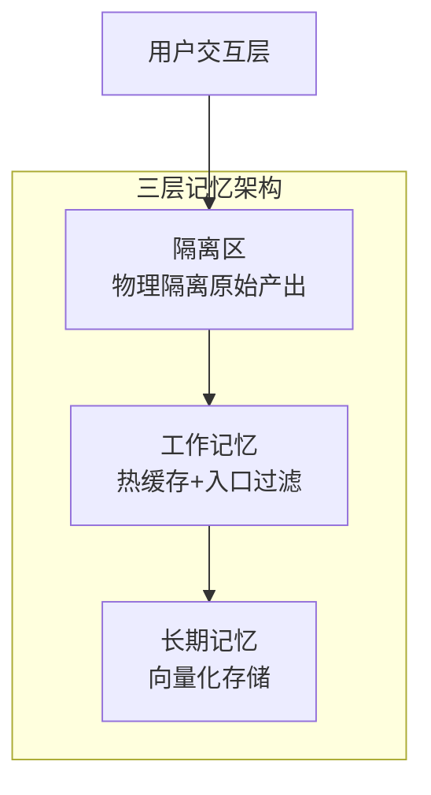
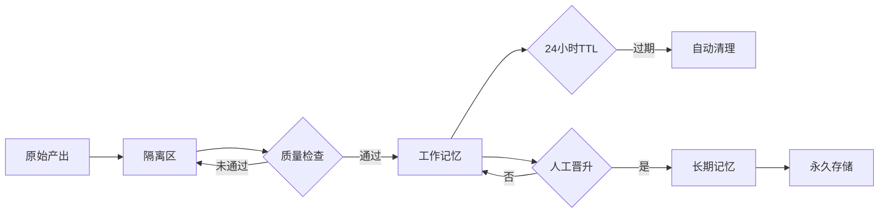

# 三层记忆协议

<cite>
**本文档引用文件**  
- [SPEC-408-memory-protocol.md](file://docs/specs/backend/SPEC-408-memory-protocol.md)
- [memory.go](file://internal/core/memory/service.go)
- [types.go](file://internal/core/memory/types.go)
- [memory_retrieval.go](file://internal/core/workflow/nodes/memory_retrieval.go)
- [memory.go](file://internal/core/middleware/memory.go)
- [001_init_schema.up.sql](file://internal/infrastructure/db/migrations/001_init_schema.up.sql)
- [002_add_quarantine_logs.up.sql](file://internal/infrastructure/db/migrations/002_add_quarantine_logs.up.sql)
- [design_draft.md](file://docs/plans/design_draft.md)
- [03_rag.md](file://docs/tdd/02_core/03_rag.md)
</cite>

## 目录
1. [架构概述](#架构概述)
2. [数据模型](#数据模型)
3. [隔离区（第一层）](#隔离区第一层)
4. [工作记忆（第二层）](#工作记忆第二层)
5. [长期记忆与晋升机制（第三层）](#长期记忆与晋升机制第三层)
6. [数据流转与生命周期](#数据流转与生命周期)
7. [安全边界与防污染机制](#安全边界与防污染机制)
8. [检索机制](#检索机制)

## 架构概述

三层记忆协议（Memory Purification Protocol）是一种分层数据管理架构，旨在确保系统知识库的纯净性与可靠性。该协议将数据流划分为三个逻辑层级，实现从原始产出到高价值知识的渐进式净化。



**图示来源**  
- [SPEC-408-memory-protocol.md](file://docs/specs/backend/SPEC-408-memory-protocol.md#L8-L36)

## 数据模型

核心数据结构 `MemoryEntry` 定义了记忆条目的统一格式，支持在不同层级间流转。

```go
type MemoryEntry struct {
    ID          string    `json:"id"`
    ProjectID   string    `json:"project_id"`
    SessionID   string    `json:"session_id"`
    Content     string    `json:"content"`
    Embedding   []float32 `json:"embedding"`
    Layer       string    `json:"layer"` // quarantine, working, longterm
    CreatedAt   time.Time `json:"created_at"`
    ExpiresAt   *time.Time `json:"expires_at"` // 仅 working 层有效
    Verified    bool      `json:"verified"`
    PromotedAt  *time.Time `json:"promoted_at"`
}
```

**字段说明**：
- **ID**: 唯一标识符
- **ProjectID**: 所属项目ID，用于作用域隔离
- **SessionID**: 会话ID，关联原始产出上下文
- **Content**: 原始文本内容
- **Embedding**: 向量嵌入，用于语义检索
- **Layer**: 所在层级（隔离区、工作记忆、长期记忆）
- **ExpiresAt**: 过期时间，仅工作记忆层有效
- **Verified**: 是否已验证
- **PromotedAt**: 晋升时间戳

**数据模型来源**  
- [SPEC-408-memory-protocol.md](file://docs/specs/backend/SPEC-408-memory-protocol.md#L42-L54)

## 隔离区（第一层）

隔离区是所有会议产出的初始存储位置，实现物理隔离以防止低质量内容污染核心知识库。

### 职责与特性
- **原始产出缓冲**：所有Agent输出默认进入此层
- **物理隔离**：存储于独立的 `quarantine_logs` 表，不参与RAG检索
- **永久存储**：无TTL，直至手动晋升或删除
- **审计支持**：保留完整上下文用于回溯与简报生成

### 实现机制
```sql
CREATE TABLE quarantine_logs (
    id UUID PRIMARY KEY DEFAULT gen_random_uuid(),
    session_id UUID,
    content TEXT,
    raw_metadata JSONB,
    created_at TIMESTAMPTZ DEFAULT NOW()
);
```

隔离区通过中间件在每次节点执行后自动记录输出内容，确保所有原始数据被完整捕获。

**隔离区来源**  
- [SPEC-408-memory-protocol.md](file://docs/specs/backend/SPEC-408-memory-protocol.md#L59-L82)
- [002_add_quarantine_logs.up.sql](file://internal/infrastructure/db/migrations/002_add_quarantine_logs.up.sql#L1-L9)
- [memory.go](file://internal/core/memory/service.go#L28-L57)

## 工作记忆（第二层）

工作记忆作为热缓存层，为短期交互提供即时上下文支持，同时通过入口过滤保障数据质量。

### 职责与特性
- **热缓存支持**：解决“归档前真空期”问题，提供即时上下文
- **入口过滤**：仅允许通过自洽性检查的内容进入
- **生命周期管理**：24小时TTL自动过期
- **作用域隔离**：严格限制在当前Project ID内，禁止跨项目访问
- **UI标识**：引用时显示“⚡️ 临时上下文”标签

### 入口过滤机制
工作记忆层实施双重过滤策略：
1. **置信度检查**：要求输出的置信度分数 > 0.8
2. **自洽性检查**：通过LLM判断内容是否自相矛盾或包含幻觉

```go
func (s *Service) UpdateWorkingMemory(ctx context.Context, groupID string, content string, metadata map[string]interface{}) error {
    // 1. 置信度检查
    confidence, ok := metadata["confidence"].(float64)
    if ok && confidence < 0.8 {
        return nil // 拒绝低置信度内容
    }
    
    // 2. 内容长度检查（MVP简化版）
    if len(content) < 50 {
        return nil // 过滤过短内容
    }
    
    // 3. 写入Redis并设置TTL
    key := fmt.Sprintf("wm:%s", groupID)
    s.cache.LPush(ctx, key, content)
    s.cache.Expire(ctx, key, 24*time.Hour)
    s.cache.LTrim(ctx, key, 0, 49) // 限制最多50条
    
    return nil
}
```

**工作记忆来源**  
- [SPEC-408-memory-protocol.md](file://docs/specs/backend/SPEC-408-memory-protocol.md#L85-L127)
- [design_draft.md](file://docs/plans/design_draft.md#L109-L115)
- [03_rag.md](file://docs/tdd/02_core/03_rag.md#L7-L11)
- [memory.go](file://internal/core/memory/service.go#L60-L97)

## 长期记忆与晋升机制（第三层）

长期记忆存储经验证的高价值知识，通过“一键晋升”机制从隔离区或工作记忆中提取优质内容。

### 职责与特性
- **高价值知识库**：存储经过验证的核心洞察
- **向量化存储**：使用pgvector进行语义检索
- **永久存储**：无TTL，作为系统核心智库
- **RAG检索**：参与向量搜索，为后续推理提供上下文

### 晋升流程
1. **智能简报生成**：系统按周聚类隔离区中的碎片信息，生成5-10条核心洞察
2. **人工审核**：用户基于简报进行质量评估
3. **一键晋升**：将选定内容写入长期记忆库
4. **向量化处理**：对晋升内容进行分块与嵌入生成

```go
func (s *Service) Promote(ctx context.Context, groupID string, content string) error {
    // 1. 文本分块
    splitter := NewRecursiveCharacterSplitter(500, 50)
    chunks := splitter.SplitText(content)
    
    // 2. 生成嵌入并存储
    for _, chunk := range chunks {
        embedding, err := s.Embedder.Embed(ctx, "default", chunk)
        if err != nil {
            return err
        }
        
        // 存入pgvector表
        query := `INSERT INTO memories (group_id, content, embedding, metadata) VALUES ($1, $2, $3, $4)`
        _, err = s.pool.Exec(ctx, query, groupID, chunk, vecStr, metaJSON)
        if err != nil {
            return err
        }
    }
    
    return nil
}
```

**晋升机制来源**  
- [SPEC-408-memory-protocol.md](file://docs/specs/backend/SPEC-408-memory-protocol.md#L129-L157)
- [memory.go](file://internal/core/memory/service.go#L115-L157)
- [splitter.go](file://internal/core/memory/splitter.go#L1-L100)

## 数据流转与生命周期

三层记忆协议定义了清晰的数据流转路径与生命周期管理策略。



**数据流转来源**  
- [SPEC-408-memory-protocol.md](file://docs/specs/backend/SPEC-408-memory-protocol.md#L10-L36)
- [design_draft.md](file://docs/plans/design_draft.md#L102-L122)

## 安全边界与防污染机制

协议通过多重机制防止低质量内容污染核心知识库。

### 安全边界
| 层级 | 存储介质 | 可见性 | 访问控制 |
| :--- | :--- | :--- | :--- |
| 隔离区 | PostgreSQL | 不可见 | 仅后台审计/简报 |
| 工作记忆 | Redis | 可见（标记为临时） | Project ID 隔离 |
| 长期记忆 | pgvector | 可见（标记为已验证） | Project ID 隔离 |

### 防污染策略
1. **物理隔离**：隔离区与长期记忆使用独立存储表
2. **双重过滤**：工作记忆层实施置信度与自洽性检查
3. **人工审核**：晋升操作需用户确认
4. **作用域隔离**：各层均按Project ID进行数据隔离

**安全边界来源**  
- [03_rag.md](file://docs/tdd/02_core/03_rag.md#L7-L11)
- [SPEC-408-memory-protocol.md](file://docs/specs/backend/SPEC-408-memory-protocol.md#L79-L81)

## 检索机制

系统采用混合检索策略，同时查询工作记忆与长期记忆。

```go
func (s *Service) Retrieve(ctx context.Context, query string, groupID string) ([]ContextItem, error) {
    var items []ContextItem
    
    // 1. 查询工作记忆（热数据）
    if s.cache != nil {
        vals, err := s.cache.LRange(ctx, fmt.Sprintf("wm:%s", groupID), 0, 10).Result()
        if err == nil {
            for _, v := range vals {
                items = append(items, ContextItem{Content: v, Source: "hot", Score: 1.0})
            }
        }
    }
    
    // 2. 查询长期记忆（冷数据）
    if s.pool != nil && s.Embedder != nil {
        embedding, err := s.Embedder.Embed(ctx, "text-embedding-ada-002", query)
        if err == nil {
            rows, err := s.pool.Query(ctx, q, vecStr, groupID)
            if err == nil {
                for rows.Next() {
                    items = append(items, ContextItem{Content: content, Source: "cold", Score: score})
                }
            }
        }
    }
    
    return items, nil
}
```

检索结果中，工作记忆内容标记为"hot"，长期记忆内容标记为"cold"，便于前端区分处理。

**检索机制来源**  
- [memory.go](file://internal/core/memory/service.go#L159-L208)
- [memory_retrieval.go](file://internal/core/workflow/nodes/memory_retrieval.go#L51-L64)