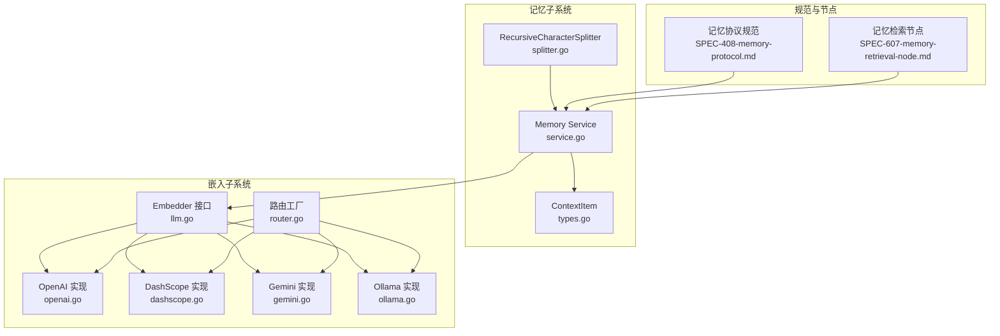
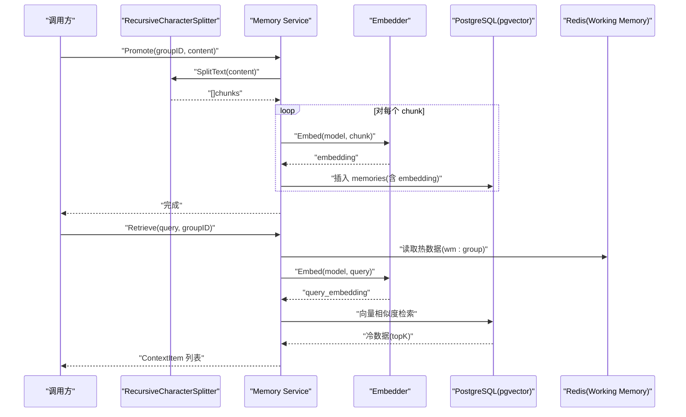
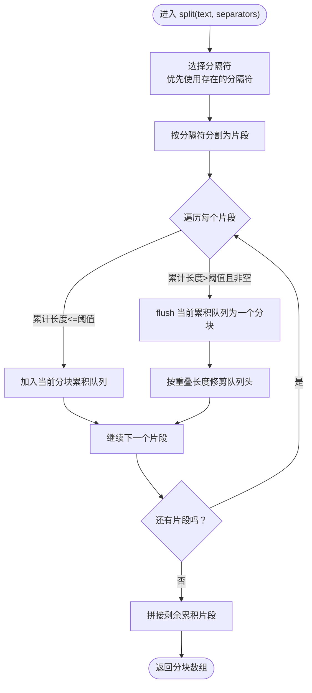
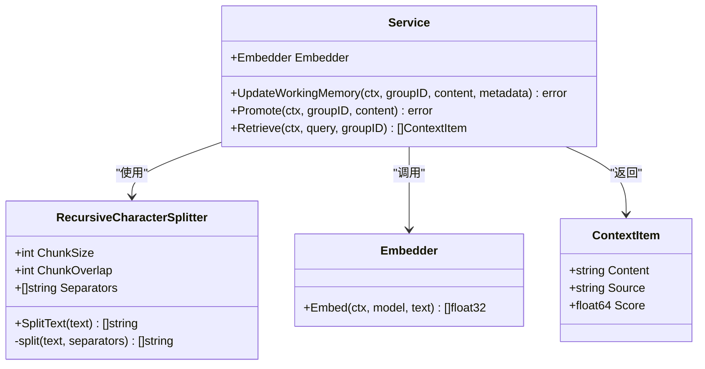
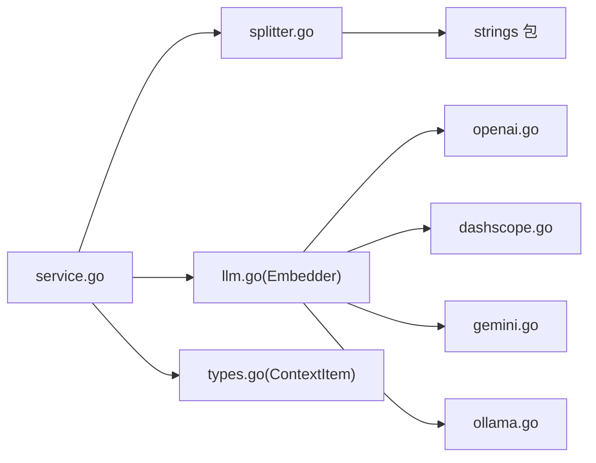

# 内容分块处理

<cite>
**本文引用的文件列表**
- [splitter.go](file://internal/core/memory/splitter.go)
- [types.go](file://internal/core/memory/types.go)
- [service.go](file://internal/core/memory/service.go)
- [splitter_test.go](file://internal/core/memory/splitter_test.go)
- [llm.go](file://internal/infrastructure/llm/llm.go)
- [openai.go](file://internal/infrastructure/llm/openai.go)
- [dashscope.go](file://internal/infrastructure/llm/dashscope.go)
- [gemini.go](file://internal/infrastructure/llm/gemini.go)
- [ollama.go](file://internal/infrastructure/llm/ollama.go)
- [router.go](file://internal/infrastructure/llm/router.go)
- [SPEC-408-memory-protocol.md](file://docs/specs/backend/SPEC-408-memory-protocol.md)
- [SPEC-607-memory-retrieval-node.md](file://docs/specs/sprint6/SPEC-607-memory-retrieval-node.md)
</cite>

## 目录
1. [引言](#引言)
2. [项目结构](#项目结构)
3. [核心组件](#核心组件)
4. [架构总览](#架构总览)
5. [详细组件分析](#详细组件分析)
6. [依赖关系分析](#依赖关系分析)
7. [性能考量](#性能考量)
8. [故障排查指南](#故障排查指南)
9. [结论](#结论)
10. [附录](#附录)

## 引言
本文件聚焦记忆系统中的“内容分块处理”机制，围绕 internal/core/memory/splitter.go 中的 RecursiveCharacterSplitter 实现进行深入解析。我们将阐明其如何依据预设分隔符（如空段落、换行、空格及无分隔符）对大文本进行递归分割，确保向量化存储的有效性与检索精度；同时解释 ChunkSize 与 ChunkOverlap 参数的作用及其对分块效果的影响；结合 types.go 的数据结构说明分块后文本如何被封装并传递至嵌入服务进行向量化处理；最后通过代码示例路径与 splitter_test.go 的测试用例，验证分块逻辑的正确性与鲁棒性。

## 项目结构
与内容分块处理直接相关的模块分布如下：
- 分块器：internal/core/memory/splitter.go
- 内存服务：internal/core/memory/service.go
- 嵌入接口与实现：internal/infrastructure/llm/llm.go、openai.go、dashscope.go、gemini.go、ollama.go、router.go
- 类型定义：internal/core/memory/types.go
- 规范与协议：docs/specs/backend/SPEC-408-memory-protocol.md
- 工作流节点（检索）：docs/specs/sprint6/SPEC-607-memory-retrieval-node.md
- 单元测试：internal/core/memory/splitter_test.go

图表来源
- [splitter.go](file://internal/core/memory/splitter.go#L1-L101)
- [service.go](file://internal/core/memory/service.go#L1-L209)
- [llm.go](file://internal/infrastructure/llm/llm.go#L1-L64)
- [openai.go](file://internal/infrastructure/llm/openai.go#L1-L153)
- [dashscope.go](file://internal/infrastructure/llm/dashscope.go#L1-L51)
- [gemini.go](file://internal/infrastructure/llm/gemini.go#L1-L205)
- [ollama.go](file://internal/infrastructure/llm/ollama.go#L1-L57)
- [router.go](file://internal/infrastructure/llm/router.go#L152-L176)
- [SPEC-408-memory-protocol.md](file://docs/specs/backend/SPEC-408-memory-protocol.md#L10-L58)
- [SPEC-607-memory-retrieval-node.md](file://docs/specs/sprint6/SPEC-607-memory-retrieval-node.md#L1-L212)

章节来源
- [splitter.go](file://internal/core/memory/splitter.go#L1-L101)
- [service.go](file://internal/core/memory/service.go#L1-L209)
- [llm.go](file://internal/infrastructure/llm/llm.go#L1-L64)
- [SPEC-408-memory-protocol.md](file://docs/specs/backend/SPEC-408-memory-protocol.md#L10-L58)

## 核心组件
- RecursiveCharacterSplitter：基于分隔符的递归文本切分器，支持按优先级选择分隔符，并在达到 ChunkSize 时合并片段，同时应用 ChunkOverlap 保持上下文连续性。
- Memory Service：负责将分块后的文本通过嵌入服务生成向量并持久化到长期记忆数据库，同时提供检索能力。
- Embedder 接口与实现：统一的嵌入生成接口，具体由 OpenAI、DashScope、Gemini、Ollama 等提供商实现。
- ContextItem：检索返回的上下文项结构，包含内容、来源与相关度分数。

章节来源
- [splitter.go](file://internal/core/memory/splitter.go#L1-L101)
- [service.go](file://internal/core/memory/service.go#L115-L157)
- [llm.go](file://internal/infrastructure/llm/llm.go#L43-L47)
- [types.go](file://internal/core/memory/types.go#L22-L27)

## 架构总览
下图展示了从输入文本到向量化存储与检索的整体流程，以及分块器在其中的关键位置。

图表来源
- [service.go](file://internal/core/memory/service.go#L115-L208)
- [splitter.go](file://internal/core/memory/splitter.go#L22-L100)
- [llm.go](file://internal/infrastructure/llm/llm.go#L43-L47)

## 详细组件分析

### RecursiveCharacterSplitter 实现原理
- 结构体字段
  - ChunkSize：单个分块的最大长度阈值（字符数）
  - ChunkOverlap：重叠长度（字符数），用于保证跨分块的上下文连续性
  - Separators：分隔符优先级列表，从高到低依次为：空段落、换行、空格、无分隔符（逐字拆分）
- SplitText 入口
  - 调用 split(text, Separators)，得到初始分块序列
- split 递归策略
  - 选择当前可用分隔符：若文本包含某分隔符，则优先使用该分隔符；否则回退到下一个更低优先级的分隔符，直至使用空字符串（逐字拆分）
  - 使用选定分隔符对文本进行分割，得到若干片段
  - 顺序遍历片段，累计当前分块长度（含分隔符），当超过 ChunkSize 时触发 flush，将当前累积的片段拼接为一个分块，并开始新的分块
  - 当出现过长片段（len(split) > ChunkSize）且存在更高优先级分隔符时，对该片段递归调用 split，否则直接保留该片段
  - 处理重叠：当 flush 后剩余长度超过 ChunkOverlap 时，从当前累积片段队列头部移除元素，直到满足重叠约束
  - 最后一次未 flush 的累积片段也会被拼接并加入结果
- 分隔符优先级的意义
  - 优先使用更“语义化”的分隔符（如空段落、换行）有助于保持语义完整性
  - 若找不到合适分隔符，最终退化为逐字拆分，确保不会无限循环
- 重叠策略
  - 采用“长度重叠”，即在 flush 后从队列前端移除片段，直到当前累积长度不超过 ChunkOverlap，从而保证相邻分块间有足够上下文衔接

图表来源
- [splitter.go](file://internal/core/memory/splitter.go#L29-L100)

章节来源
- [splitter.go](file://internal/core/memory/splitter.go#L1-L101)

### 参数作用与影响：ChunkSize 与 ChunkOverlap
- ChunkSize
  - 控制单个分块的最大长度，直接影响向量维度与检索召回粒度
  - 过小会导致过度切分，破坏语义连贯性；过大则增加检索开销与噪声
- ChunkOverlap
  - 保证相邻分块之间有重叠区域，提升跨分块检索的连续性
  - 重叠越大，检索召回越完整但存储与计算成本越高；重叠越小，效率越高但可能丢失跨边界上下文

章节来源
- [splitter.go](file://internal/core/memory/splitter.go#L29-L100)

### 分块后的文本封装与嵌入流程
- 分块结果类型
  - SplitText 返回字符串切片，每个元素为一个分块
- 封装与传递
  - Memory Service 在 Promote 阶段调用 SplitText 获取分块数组
  - 对每个分块调用 Embedder.Embed 生成向量
  - 将分块内容与向量写入数据库（memories 表），并可附加元数据（如来源、时间戳等）
- 检索阶段
  - 先从 Redis 读取热数据（Working Memory）
  - 再对查询词生成向量，使用 pgvector 进行相似度检索，返回冷数据
  - 将热/冷数据组合为 ContextItem 列表返回给上层

图表来源
- [splitter.go](file://internal/core/memory/splitter.go#L1-L101)
- [service.go](file://internal/core/memory/service.go#L1-L209)
- [llm.go](file://internal/infrastructure/llm/llm.go#L43-L47)
- [types.go](file://internal/core/memory/types.go#L22-L27)

章节来源
- [service.go](file://internal/core/memory/service.go#L115-L157)
- [types.go](file://internal/core/memory/types.go#L22-L27)

### 嵌入服务与提供商适配
- Embedder 接口统一了嵌入生成能力
- 具体实现包括 OpenAI、DashScope、Gemini、Ollama 等，均实现 Embed 方法
- 路由工厂根据配置创建对应 Embedder 实例

章节来源
- [llm.go](file://internal/infrastructure/llm/llm.go#L43-L47)
- [openai.go](file://internal/infrastructure/llm/openai.go#L132-L153)
- [dashscope.go](file://internal/infrastructure/llm/dashscope.go#L30-L51)
- [gemini.go](file://internal/infrastructure/llm/gemini.go#L180-L205)
- [ollama.go](file://internal/infrastructure/llm/ollama.go#L31-L57)
- [router.go](file://internal/infrastructure/llm/router.go#L152-L176)

### 测试用例与正确性验证
- 短文本：直接返回原字符串
- 空格分隔：按空格切分为多个片段
- 换行分隔：按换行切分
- 重叠设置：当整体长度刚好满足阈值时，仍按规则处理
- 长文本与重叠：覆盖跨分块重叠场景，验证 flush 与修剪逻辑

章节来源
- [splitter_test.go](file://internal/core/memory/splitter_test.go#L1-L64)

## 依赖关系分析
- 分块器依赖 strings 包进行分割与连接
- Memory Service 依赖 Embedder 接口，具体实现由 llm 子系统提供
- 检索链路同时依赖 Redis（Working Memory）与 PostgreSQL（pgvector）

图表来源
- [splitter.go](file://internal/core/memory/splitter.go#L1-L101)
- [service.go](file://internal/core/memory/service.go#L1-L209)
- [llm.go](file://internal/infrastructure/llm/llm.go#L1-L64)
- [openai.go](file://internal/infrastructure/llm/openai.go#L1-L153)
- [dashscope.go](file://internal/infrastructure/llm/dashscope.go#L1-L51)
- [gemini.go](file://internal/infrastructure/llm/gemini.go#L1-L205)
- [ollama.go](file://internal/infrastructure/llm/ollama.go#L1-L57)
- [types.go](file://internal/core/memory/types.go#L22-L27)

章节来源
- [splitter.go](file://internal/core/memory/splitter.go#L1-L101)
- [service.go](file://internal/core/memory/service.go#L1-L209)
- [llm.go](file://internal/infrastructure/llm/llm.go#L1-L64)

## 性能考量
- 分隔符优先级与递归深度
  - 更高的优先级分隔符能减少递归层级，提高分割效率
  - 无分隔符回退会带来线性复杂度，应谨慎设置 ChunkSize
- 重叠策略
  - 增大 ChunkOverlap 会增加分块数量与存储/计算成本
  - 建议根据检索召回需求与资源预算权衡
- 嵌入与存储
  - 嵌入调用次数与分块数量成正比，建议在批量场景考虑批处理优化
  - 数据库存储需配合索引与分组策略，避免全表扫描

[本节为通用指导，无需列出具体文件来源]

## 故障排查指南
- 嵌入提供商不支持 Embed
  - 某些提供商（如 DeepSeek）不支持嵌入，将返回错误
  - 解决：更换支持嵌入的提供商或在路由中进行适配
- 分块结果异常
  - 检查 ChunkSize 与 ChunkOverlap 设置是否合理
  - 确认输入文本是否包含预期分隔符，必要时调整 Separators 优先级
- 检索结果为空
  - 确认 Working Memory 是否有数据（Redis 键是否存在）
  - 确认数据库中是否已写入向量数据
  - 检查查询向量生成是否成功

章节来源
- [ollama.go](file://internal/infrastructure/llm/ollama.go#L31-L57)
- [SPEC-408-memory-protocol.md](file://docs/specs/backend/SPEC-408-memory-protocol.md#L10-L58)

## 结论
RecursiveCharacterSplitter 通过“优先级分隔符 + 长度重叠”的策略，在保证语义完整性的同时兼顾检索效率。结合 Memory Service 的三层记忆协议与嵌入服务，实现了从文本到向量的可靠流水线。合理设置 ChunkSize 与 ChunkOverlap 是获得高质量检索结果的关键；在实际部署中，应根据业务场景与资源约束进行参数调优，并关注嵌入与存储的性能瓶颈。

[本节为总结性内容，无需列出具体文件来源]

## 附录
- 相关规范与节点设计
  - 记忆协议规范：SPEC-408-memory-protocol.md
  - 记忆检索节点：SPEC-607-memory-retrieval-node.md

章节来源
- [SPEC-408-memory-protocol.md](file://docs/specs/backend/SPEC-408-memory-protocol.md#L10-L58)
- [SPEC-607-memory-retrieval-node.md](file://docs/specs/sprint6/SPEC-607-memory-retrieval-node.md#L1-L212)