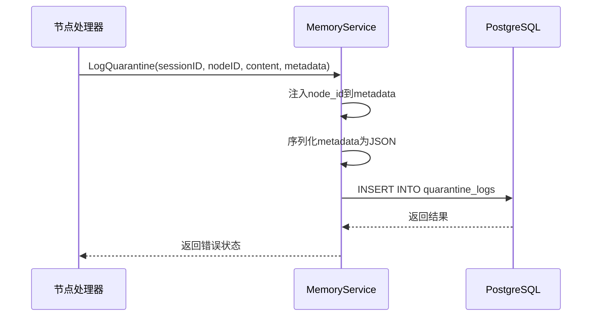
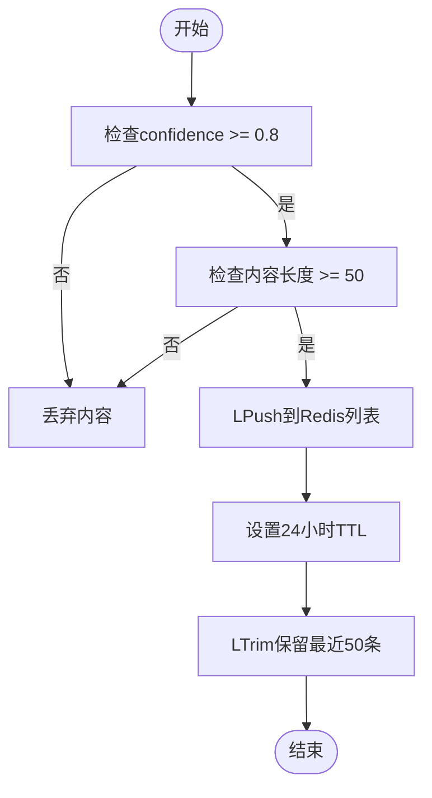
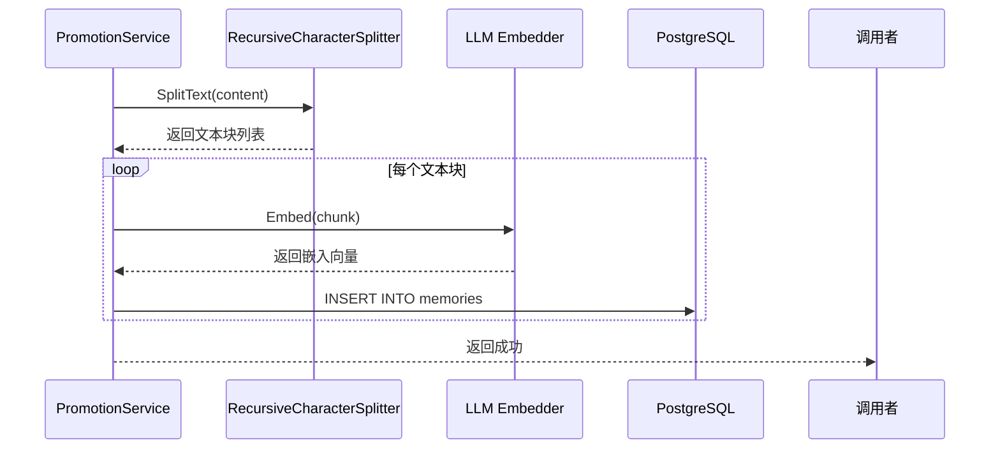
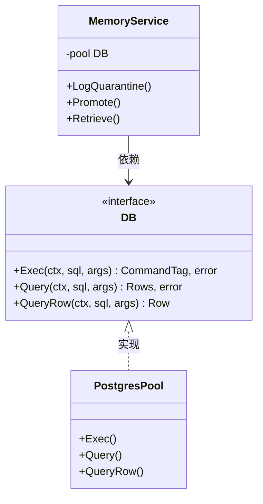
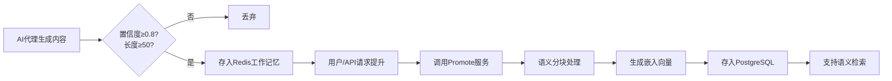

# 存储实现

<cite>
**本文档中引用的文件**  
- [service.go](file://internal/core/memory/service.go)
- [splitter.go](file://internal/core/memory/splitter.go)
- [types.go](file://internal/core/memory/types.go)
- [001_init_schema.up.sql](file://internal/infrastructure/db/migrations/001_init_schema.up.sql)
- [002_add_quarantine_logs.up.sql](file://internal/infrastructure/db/migrations/002_add_quarantine_logs.up.sql)
- [postgres.go](file://internal/infrastructure/db/postgres.go)
- [interface.go](file://internal/infrastructure/db/interface.go)
- [interface.go](file://internal/infrastructure/cache/interface.go)
- [llm.go](file://internal/infrastructure/llm/llm.go)
- [service_test.go](file://internal/core/memory/service_test.go)
- [splitter_test.go](file://internal/core/memory/splitter_test.go)
- [memory.go](file://internal/api/handler/memory.go)
</cite>

## 目录
1. [引言](#引言)
2. [记忆服务核心组件](#记忆服务核心组件)
3. [三层次记忆协议实现](#三层次记忆协议实现)
   - [QuarantineService：隔离日志记录](#quarantineservice隔离日志记录)
   - [WorkingMemoryService：工作记忆管理](#workingmemoryservice工作记忆管理)
   - [PromotionService：长期记忆提升](#promotionservice长期记忆提升)
4. [MemoryStore接口与PostgreSQL交互机制](#memorystore接口与postgresql交互机制)
5. [语义分块处理：splitter.go实现](#语义分块处理splittergo实现)
6. [数据库表结构设计分析](#数据库表结构设计分析)
7. [记忆条目完整生命周期流程](#记忆条目完整生命周期流程)
8. [测试用例覆盖分析](#测试用例覆盖分析)
9. [结论](#结论)

## 引言
本项目实现了一个基于三层次架构的记忆存储系统，旨在支持AI代理在会议决策过程中的上下文感知与知识持久化。系统通过`QuarantineService`、`WorkingMemoryService`和`PromotionService`三个核心服务分别处理不同阶段的记忆数据，并结合Redis和PostgreSQL（含pgvector扩展）实现高性能的短期与长期记忆存储。该系统支持对大文本内容进行语义分块、向量化嵌入、多级检索及自动过期清理，确保记忆数据的有效性与检索精度。

## 记忆服务核心组件

系统的核心记忆管理由`internal/core/memory`包中的`Service`结构体实现，其依赖于`Embedder`（用于生成文本嵌入）、`db.DB`（PostgreSQL连接池）和`cache.Cache`（Redis缓存客户端）。该服务实现了`MemoryManager`接口，定义了从隔离到长期存储的完整记忆生命周期管理能力。

**Section sources**
- [service.go](file://internal/core/memory/service.go#L14-L25)
- [types.go](file://internal/core/memory/types.go#L8-L20)

## 三层次记忆协议实现

### QuarantineService：隔离日志记录
`LogQuarantine`方法实现了第一层记忆协议——隔离机制。当系统检测到潜在有害或低质量内容时，会将其记录至PostgreSQL的`quarantine_logs`表中，避免污染主记忆库。

该方法接收会话ID、节点ID、内容及元数据，将元数据序列化为JSON后插入数据库。此机制可用于后续审计、模型训练或安全审查。



**Diagram sources**
- [service.go](file://internal/core/memory/service.go#L28-L57)
- [002_add_quarantine_logs.up.sql](file://internal/infrastructure/db/migrations/002_add_quarantine_logs.up.sql#L1-L10)

### WorkingMemoryService：工作记忆管理
`UpdateWorkingMemory`方法实现了第二层记忆协议——工作记忆。该服务将高置信度的内容写入Redis列表，作为短期上下文供AI代理快速访问。

关键特性包括：
- **入口过滤器**：检查元数据中的`confidence`字段，低于0.8的置信度内容将被拒绝
- **内容长度过滤**：小于50字符的内容被视为噪声而被忽略
- **Redis存储**：使用`LPush`将内容推入以`wm:{groupID}`为键的列表
- **TTL管理**：设置24小时自动过期
- **容量限制**：通过`LTrim`保留最近50条记录



**Diagram sources**
- [service.go](file://internal/core/memory/service.go#L60-L96)
- [interface.go](file://internal/infrastructure/cache/interface.go#L12-L15)

### PromotionService：长期记忆提升
`Promote`方法实现了第三层记忆协议——长期记忆提升。该服务将重要内容持久化到PostgreSQL的向量表中，支持语义检索。

处理流程如下：
1. 使用`RecursiveCharacterSplitter`对输入内容进行语义分块
2. 对每个文本块调用`Embedder`生成1536维向量（兼容text-embedding-ada-002）
3. 将每个块的内容、嵌入向量和元数据批量插入`memories`表

此机制确保大文本被合理切分，避免单个向量丢失语义细节，同时支持基于余弦相似度的高效语义搜索。



**Diagram sources**
- [service.go](file://internal/core/memory/service.go#L115-L156)
- [splitter.go](file://internal/core/memory/splitter.go#L22-L100)
- [llm.go](file://internal/infrastructure/llm/llm.go#L44-L47)

## MemoryStore接口与PostgreSQL交互机制

系统通过`db.DB`接口抽象与PostgreSQL的交互，该接口定义了`Exec`、`Query`和`QueryRow`三个核心方法，封装了底层`pgx/v5`驱动的操作。

`postgres.go`文件中的`Init`函数负责初始化数据库连接池并自动执行迁移脚本，确保数据库模式与代码逻辑同步。`GetPool`函数返回单例连接池，供`MemoryService`等组件使用。

所有对`memories`和`quarantine_logs`表的增删改查操作均通过`db.DB`接口完成，实现了数据访问层的解耦。



**Diagram sources**
- [interface.go](file://internal/infrastructure/db/interface.go#L11-L15)
- [postgres.go](file://internal/infrastructure/db/postgres.go#L17-L52)
- [service.go](file://internal/core/memory/service.go#L16)

## 语义分块处理：splitter.go实现

`splitter.go`实现了`RecursiveCharacterSplitter`结构体，采用递归字符分割策略对大文本进行语义分块。其设计灵感来源于LangChain的文本分割器。

关键参数：
- **ChunkSize**：目标块大小（默认500字符）
- **ChunkOverlap**：块间重叠字符数（默认50字符），确保语义连贯
- **Separators**：分割符优先级列表，按`\n\n` > `\n` > ` ` > `""`顺序尝试

分割逻辑：
1. 从高优先级到低优先级选择首个在文本中存在的分割符
2. 按该分割符拆分文本
3. 逐段合并至当前块，直到超过`ChunkSize`
4. 触发切分时，保留最后`ChunkOverlap`长度的内容用于下一块的上下文衔接
5. 对超长段落递归应用更低优先级的分割符

这种分层递归策略能有效保持段落、句子等语义单元的完整性。

**Section sources**
- [splitter.go](file://internal/core/memory/splitter.go#L7-L100)
- [splitter_test.go](file://internal/core/memory/splitter_test.go#L8-L63)

## 数据库表结构设计分析

### memories表结构
```sql
CREATE TABLE memories (
    id UUID PRIMARY KEY DEFAULT gen_random_uuid(),
    group_id UUID REFERENCES groups(id) ON DELETE CASCADE,
    agent_id UUID REFERENCES agents(id),
    session_id UUID REFERENCES sessions(id),
    content TEXT NOT NULL,
    embedding VECTOR(1536),
    metadata JSONB DEFAULT '{}',
    created_at TIMESTAMPTZ DEFAULT NOW()
);
```

设计要点：
- **主键**：`id`为UUID，保证全局唯一
- **外键约束**：`group_id`、`agent_id`、`session_id`均关联主表，启用级联删除
- **索引**：
  - `idx_memories_group`：加速按群组检索
  - `idx_memories_embedding`：使用IVFFlat索引支持向量相似度搜索（`vector_cosine_ops`）
- **pgvector扩展**：`embedding VECTOR(1536)`字段支持高效的向量运算和余弦相似度计算

### quarantine_logs表结构
```sql
CREATE TABLE quarantine_logs (
    id UUID PRIMARY KEY DEFAULT gen_random_uuid(),
    session_id UUID,
    content TEXT,
    raw_metadata JSONB,
    created_at TIMESTAMPTZ DEFAULT NOW()
);
```

设计要点：
- 专用于存储被隔离的内容，便于后续分析
- `raw_metadata`存储原始元数据，支持灵活查询
- 简单的时间索引`idx_quarantine_logs_session`支持按会话检索

**Section sources**
- [001_init_schema.up.sql](file://internal/infrastructure/db/migrations/001_init_schema.up.sql#L80-L96)
- [002_add_quarantine_logs.up.sql](file://internal/infrastructure/db/migrations/002_add_quarantine_logs.up.sql#L1-L10)

## 记忆条目完整生命周期流程

一个记忆条目从创建到存储的完整流程如下：

1. **内容生成**：AI代理在节点执行过程中生成内容
2. **置信度过滤**：若置信度≥0.8且长度≥50，则存入Redis工作记忆
3. **提升请求**：通过API调用`/memory/ingest`触发提升
4. **语义分块**：`PromotionService`调用`RecursiveCharacterSplitter`分割文本
5. **向量化**：对每个块调用LLM嵌入接口生成向量
6. **持久化**：将块内容与向量存入PostgreSQL的`memories`表
7. **检索**：查询时同时检索Redis（最近10条）和PostgreSQL（最相似5条），合并结果



**Diagram sources**
- [service.go](file://internal/core/memory/service.go#L60-L156)
- [memory.go](file://internal/api/handler/memory.go#L25-L42)
- [splitter.go](file://internal/core/memory/splitter.go#L22-L100)

## 测试用例覆盖分析

系统提供了全面的单元测试，确保核心逻辑的正确性：

- **TestService_LogQuarantine**：验证隔离日志能否正确插入数据库，使用`pgxmock`模拟DB行为
- **TestService_UpdateWorkingMemory**：验证工作记忆的入口过滤和Redis操作，使用`MockCache`模拟缓存
- **TestService_Promote**：验证文本分块、嵌入生成和数据库插入流程
- **TestService_Retrieve**：验证混合检索逻辑，能同时从Redis和PostgreSQL获取结果并正确合并
- **TestRecursiveCharacterSplitter_SplitText**：验证不同场景下的文本分割准确性，包括短文本、换行分割、重叠分割等

这些测试覆盖了所有关键路径，包括正常流程、边界条件和错误处理，确保系统的稳定性和可靠性。

**Section sources**
- [service_test.go](file://internal/core/memory/service_test.go#L13-L122)
- [splitter_test.go](file://internal/core/memory/splitter_test.go#L8-L63)

## 结论
本系统的存储实现采用三层次记忆架构，有效平衡了性能、成本与持久性需求。通过`QuarantineService`、`WorkingMemoryService`和`PromotionService`的协同工作，实现了从内容过滤、短期缓存到长期向量化存储的完整闭环。结合PostgreSQL的pgvector扩展和精心设计的语义分块策略，系统能够高效支持大规模上下文的语义检索，为AI代理的智能决策提供了坚实的知识基础。