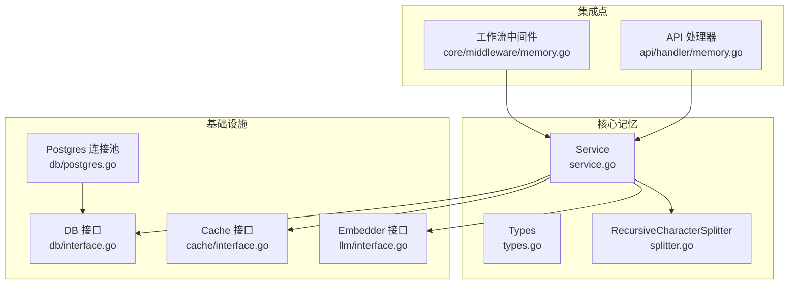
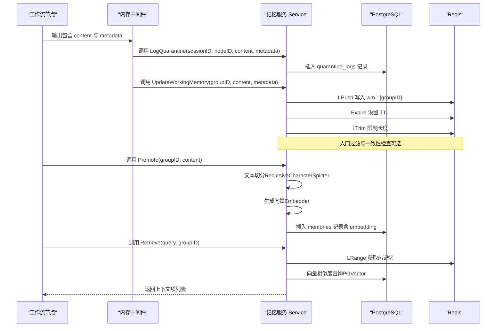
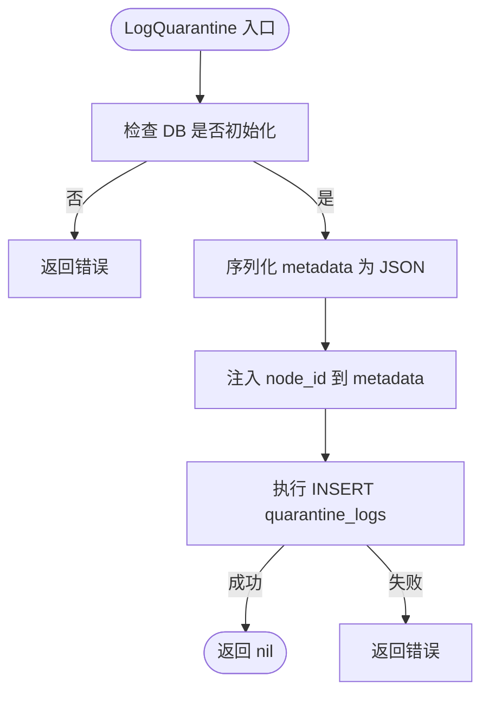
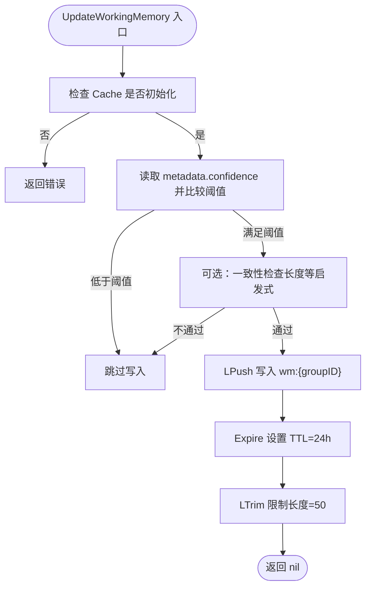
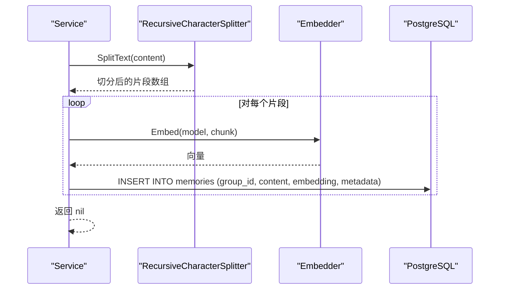
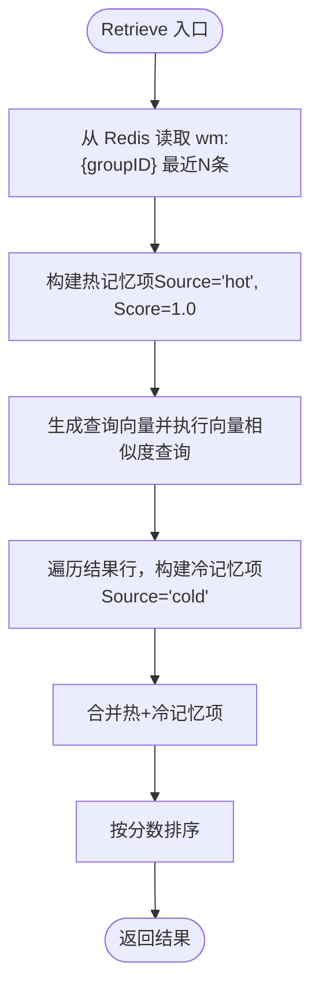
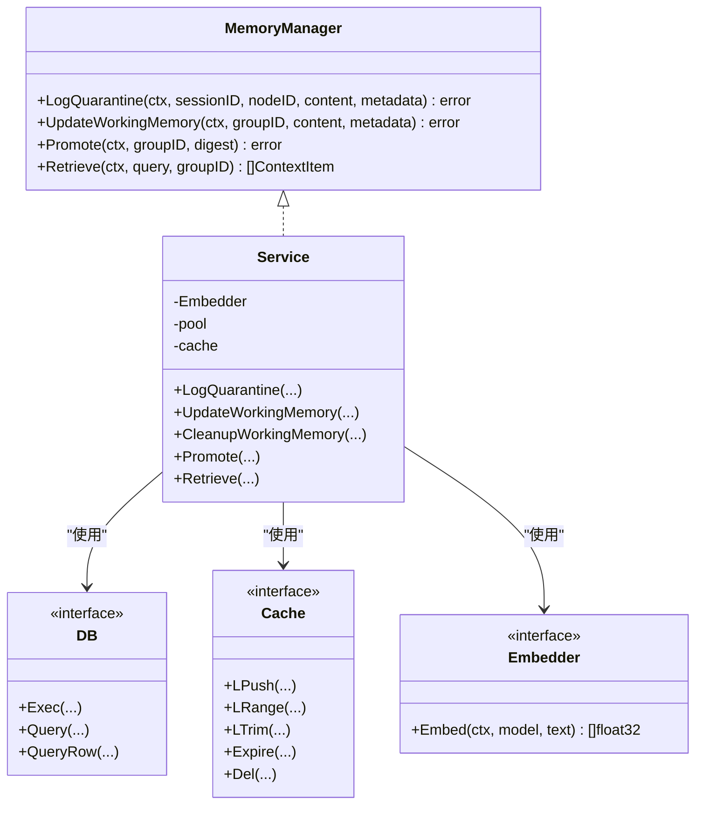

# 存储服务逻辑

<cite>
**本文引用的文件**
- [service.go](file://internal/core/memory/service.go)
- [types.go](file://internal/core/memory/types.go)
- [service_test.go](file://internal/core/memory/service_test.go)
- [001_init_schema.up.sql](file://internal/infrastructure/db/migrations/001_init_schema.up.sql)
- [postgres.go](file://internal/infrastructure/db/postgres.go)
- [interface.go](file://internal/infrastructure/db/interface.go)
- [memory.go](file://internal/core/middleware/memory.go)
- [memory.go（API 处理器）](file://internal/api/handler/memory.go)
- [splitter.go](file://internal/core/memory/splitter.go)
</cite>

## 目录
1. [简介](#简介)
2. [项目结构](#项目结构)
3. [核心组件](#核心组件)
4. [架构总览](#架构总览)
5. [详细组件分析](#详细组件分析)
6. [依赖关系分析](#依赖关系分析)
7. [性能考量](#性能考量)
8. [故障排查指南](#故障排查指南)
9. [结论](#结论)
10. [附录](#附录)

## 简介
本文件深入解析记忆系统的存储服务实现，围绕 internal/core/memory/service.go 中的三类核心服务职责展开：隔离区日志记录（Tier 1）、工作记忆写入与清理（Tier 2）、长期记忆提升与检索（Tier 3）。文档将阐明服务如何通过 MemoryStore 接口（在当前实现中由 PostgreSQL 与 Redis 分别承担持久化与缓存职责）完成记忆条目的增删改查与过期清理；结合数据库迁移文件 001_init_schema.up.sql 解释 memory_entries 表（memories）的结构设计与 pgvector 扩展应用；并以 service_test.go 的测试用例为依据评估关键路径的覆盖情况，确保服务的可靠性与稳定性。

## 项目结构
- 核心记忆服务位于 internal/core/memory，包含服务实现、类型定义、分词器与测试。
- 数据库连接池与迁移位于 internal/infrastructure/db，负责初始化、连接池管理与迁移执行。
- 缓存接口位于 internal/infrastructure/cache，当前实现使用 Redis。
- LLM 接口位于 internal/infrastructure/llm，用于向量化嵌入生成。
- 中间件与 API 层通过 MemoryManager 接口调用记忆服务，形成三层记忆协议的端到端链路。

图表来源
- [service.go](file://internal/core/memory/service.go#L1-L209)
- [types.go](file://internal/core/memory/types.go#L1-L27)
- [splitter.go](file://internal/core/memory/splitter.go#L1-L101)
- [interface.go](file://internal/infrastructure/db/interface.go#L1-L16)
- [postgres.go](file://internal/infrastructure/db/postgres.go#L1-L66)
- [memory.go](file://internal/core/middleware/memory.go#L1-L73)
- [memory.go（API 处理器）](file://internal/api/handler/memory.go#L1-L67)

章节来源
- [service.go](file://internal/core/memory/service.go#L1-L209)
- [types.go](file://internal/core/memory/types.go#L1-L27)
- [splitter.go](file://internal/core/memory/splitter.go#L1-L101)
- [interface.go](file://internal/infrastructure/db/interface.go#L1-L16)
- [postgres.go](file://internal/infrastructure/db/postgres.go#L1-L66)
- [memory.go](file://internal/core/middleware/memory.go#L1-L73)
- [memory.go（API 处理器）](file://internal/api/handler/memory.go#L1-L67)

## 核心组件
- MemoryManager 接口：定义三层记忆协议的统一入口，包括隔离区日志记录、工作记忆更新、长期记忆提升与混合检索。
- Service 结构体：聚合 Embedder、DB、Cache 三个依赖，实现具体业务逻辑。
- RecursiveCharacterSplitter：文本切分器，支持重叠合并，用于将长文本切分为适合向量化的片段。
- 测试用例：覆盖隔离区日志、工作记忆写入、长期记忆提升与检索的关键路径。

章节来源
- [types.go](file://internal/core/memory/types.go#L1-L27)
- [service.go](file://internal/core/memory/service.go#L1-L209)
- [splitter.go](file://internal/core/memory/splitter.go#L1-L101)
- [service_test.go](file://internal/core/memory/service_test.go#L1-L123)

## 架构总览
三层记忆协议的端到端流程如下：
- 隔离区（Tier 1）：所有节点输出均记录隔离日志，防止低质量内容污染核心库。
- 工作记忆（Tier 2）：通过入口过滤与一致性检查后，写入 Redis 列表，设置 TTL 并限制长度。
- 长期记忆（Tier 3）：将内容切分为片段，生成向量并写入 PostgreSQL 的 memories 表，支持基于向量相似度的检索。

图表来源
- [memory.go](file://internal/core/middleware/memory.go#L28-L72)
- [service.go](file://internal/core/memory/service.go#L28-L209)
- [splitter.go](file://internal/core/memory/splitter.go#L1-L101)
- [001_init_schema.up.sql](file://internal/infrastructure/db/migrations/001_init_schema.up.sql#L80-L96)

## 详细组件分析

### 隔离区日志记录（Tier 1）
- 职责：将节点输出写入 quarantine_logs 表，作为隔离区日志，不参与检索。
- 实现要点：
  - 使用 DB 接口执行插入。
  - 将 node_id 注入 metadata，再序列化为 JSON 存储。
  - 错误处理：返回包装后的错误，便于上层中间件记录但不阻断工作流。
- 关键 SQL：INSERT INTO quarantine_logs (session_id, content, raw_metadata) VALUES ($1, $2, $3)。

图表来源
- [service.go](file://internal/core/memory/service.go#L28-L58)

章节来源
- [service.go](file://internal/core/memory/service.go#L28-L58)

### 工作记忆写入与清理（Tier 2）
- 职责：将高置信度、通过一致性检查的内容写入 Redis 列表，设置 TTL 并限制长度。
- 入口过滤与一致性检查：
  - 置信度阈值过滤（例如低于阈值直接丢弃）。
  - 可选的 LLM 一致性检查（当前实现对内容长度进行启发式过滤）。
- Redis 操作：
  - LPush 写入键 wm:{groupID}。
  - Expire 设置 TTL（24 小时）。
  - LTrim 限制列表长度（保留最近 50 条）。
- 清理机制：CleanupWorkingMemory 当前为空实现，Redis 自身 TTL 负责过期删除；未来可用于归档或额外清理策略。

图表来源
- [service.go](file://internal/core/memory/service.go#L60-L113)

章节来源
- [service.go](file://internal/core/memory/service.go#L60-L113)

### 长期记忆提升与检索（Tier 3）
- 提升流程（Promote）：
  - 文本切分：使用 RecursiveCharacterSplitter 将内容切分为多个片段，支持重叠合并。
  - 向量化：调用 Embedder 生成向量。
  - 存储：将每个片段写入 memories 表，包含 group_id、content、embedding、metadata。
  - 元数据：记录 source 与 promoted_at 时间戳，便于后续统计与审计。
- 检索流程（Retrieve）：
  - 热记忆（Redis）：从 wm:{groupID} 列表取最近若干条，标记 Source="hot"。
  - 冷记忆（PostgreSQL + pgvector）：对查询生成向量，使用向量相似度函数进行检索，标记 Source="cold"。
  - 结果合并：先热后冷，按分数排序返回。

图表来源
- [service.go](file://internal/core/memory/service.go#L115-L157)
- [splitter.go](file://internal/core/memory/splitter.go#L1-L101)

章节来源
- [service.go](file://internal/core/memory/service.go#L115-L157)
- [splitter.go](file://internal/core/memory/splitter.go#L1-L101)

### 检索流程（Retrieve）
- 热记忆优先：从 Redis 列表读取最近若干条，Source="hot"，Score=1.0。
- 冷记忆回退：生成查询向量，使用向量相似度函数对 memories 表进行检索，Source="cold"。
- 结果合并：将热记忆与冷记忆合并，按分数排序返回。

图表来源
- [service.go](file://internal/core/memory/service.go#L159-L209)

章节来源
- [service.go](file://internal/core/memory/service.go#L159-L209)

## 依赖关系分析
- 组件耦合：
  - Service 依赖 DB、Cache、Embedder 三个外部接口，分别负责持久化、缓存与向量化。
  - 中间件与 API 层仅依赖 MemoryManager 接口，保持良好的抽象与可替换性。
- 外部依赖：
  - PostgreSQL：通过 pgx 连接池与迁移工具，启用 pgvector 扩展并创建 memories 表。
  - Redis：通过 go-redis 客户端提供列表操作与 TTL 管理。
  - LLM：通过 Embedder 接口生成向量，支持不同提供商适配。

图表来源
- [types.go](file://internal/core/memory/types.go#L1-L27)
- [service.go](file://internal/core/memory/service.go#L1-L209)
- [interface.go](file://internal/infrastructure/db/interface.go#L1-L16)

章节来源
- [types.go](file://internal/core/memory/types.go#L1-L27)
- [service.go](file://internal/core/memory/service.go#L1-L209)
- [interface.go](file://internal/infrastructure/db/interface.go#L1-L16)

## 性能考量
- 向量相似度检索：
  - 使用 pgvector 的向量索引（cosine 距离），在大规模数据下建议优化索引参数与硬件配置。
  - 查询时将 embedding 以字符串形式传入，避免额外转换开销。
- Redis 列表：
  - LPush + Expire + LTrim 的组合保证了工作记忆的时效性与容量控制，适合高频写入场景。
- 文本切分：
  - 切分器支持重叠合并，有助于提升检索召回率；合理设置 ChunkSize 与 Overlap 可平衡精度与性能。
- 批量嵌入：
  - 当前实现逐片段嵌入，若提供商支持批量嵌入，可显著降低网络往返与模型调用成本。

[本节为通用性能讨论，无需特定文件来源]

## 故障排查指南
- 隔离区日志失败：
  - 检查 DB 初始化状态与连接池可用性；确认 quarantine_logs 表存在且具备相应字段。
  - 查看返回的错误信息，定位插入失败原因（如参数类型不匹配、约束冲突）。
- 工作记忆写入失败：
  - 检查 Cache 初始化状态与 Redis 可用性；确认键名格式 wm:{groupID} 正确。
  - 观察入口过滤条件是否导致内容被丢弃（置信度过低或长度不足）。
- 长期记忆提升失败：
  - 检查 Embedder 是否可用；确认模型名称与提供商配置正确。
  - 确认 memories 表已创建并具备向量列与索引。
- 检索结果异常：
  - 确认 Redis 中热记忆键是否存在；检查向量维度与索引是否匹配。
  - 若冷记忆为空，检查查询向量生成与 embedding 列类型是否一致。

章节来源
- [service.go](file://internal/core/memory/service.go#L28-L209)
- [postgres.go](file://internal/infrastructure/db/postgres.go#L1-L66)
- [001_init_schema.up.sql](file://internal/infrastructure/db/migrations/001_init_schema.up.sql#L80-L96)

## 结论
该记忆系统通过三层协议实现了从“隔离记录”到“工作记忆”再到“长期记忆”的完整闭环。Service 以清晰的职责划分与接口抽象，结合 PostgreSQL 的 pgvector 与 Redis 的高性能缓存，提供了可扩展的记忆存储能力。测试用例覆盖了隔离日志、工作记忆写入、长期记忆提升与检索的关键路径，验证了核心流程的正确性与鲁棒性。后续可在批量嵌入、索引优化与清理策略等方面进一步增强性能与可维护性。

[本节为总结性内容，无需特定文件来源]

## 附录

### 数据库迁移与表结构说明
- 迁移文件启用 pgvector 扩展，并创建 memories 表：
  - 主键：id（UUID，默认生成）。
  - 外键：group_id 引用 groups.id，agent_id 引用 agents.id，session_id 引用 sessions.id。
  - 索引：对 group_id 建立普通索引；对 embedding 建立向量索引（cosine 距离）。
  - 字段：content（TEXT）、embedding（VECTOR(1536)）、metadata（JSONB）、created_at（TIMESTAMPTZ）。
- 该结构支持按组维度检索与高效向量相似度查询。

章节来源
- [001_init_schema.up.sql](file://internal/infrastructure/db/migrations/001_init_schema.up.sql#L80-L96)

### 代码示例：记忆条目从创建到存储的完整流程
- 隔离区日志记录：调用 LogQuarantine，将节点输出写入 quarantine_logs。
- 工作记忆写入：调用 UpdateWorkingMemory，通过入口过滤后写入 Redis 列表并设置 TTL。
- 长期记忆提升：调用 Promote，切分文本、生成向量并写入 memories。
- 检索：调用 Retrieve，先读取 Redis 热记忆，再回退到 PostgreSQL 的向量检索。

章节来源
- [service.go](file://internal/core/memory/service.go#L28-L209)
- [splitter.go](file://internal/core/memory/splitter.go#L1-L101)

### 测试用例覆盖情况
- 隔离区日志：使用 pgxmock 验证插入 quarantine_logs 的 SQL 与参数。
- 工作记忆写入：使用 MockCache 验证 LPush、Expire、LTrim 的调用顺序与参数。
- 长期记忆提升：使用 MockEmbedder 与 pgxmock 验证插入 memories 的 SQL 与参数。
- 检索：使用 MockCache 与 MockDB 验证热记忆与冷记忆的合并顺序与来源标记。

章节来源
- [service_test.go](file://internal/core/memory/service_test.go#L1-L123)