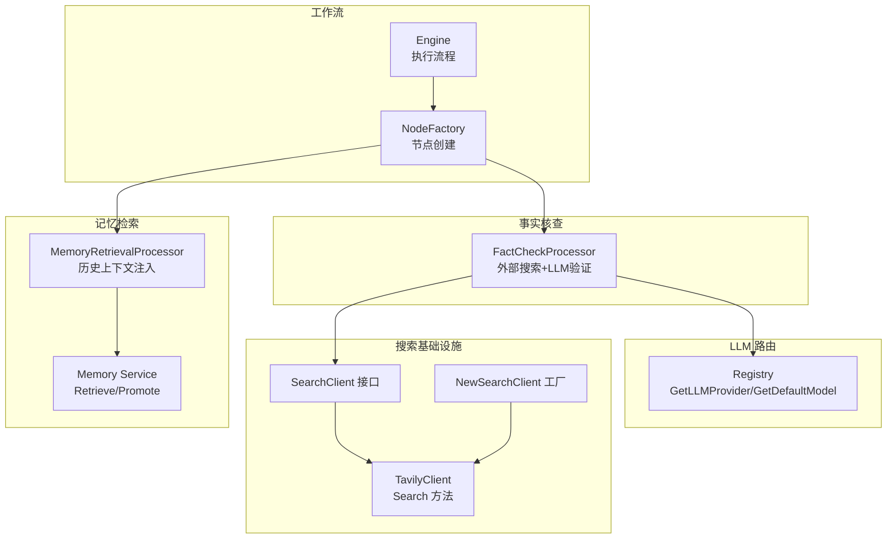
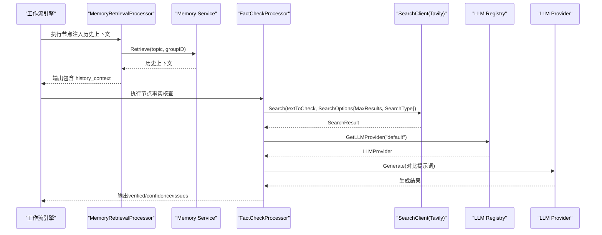
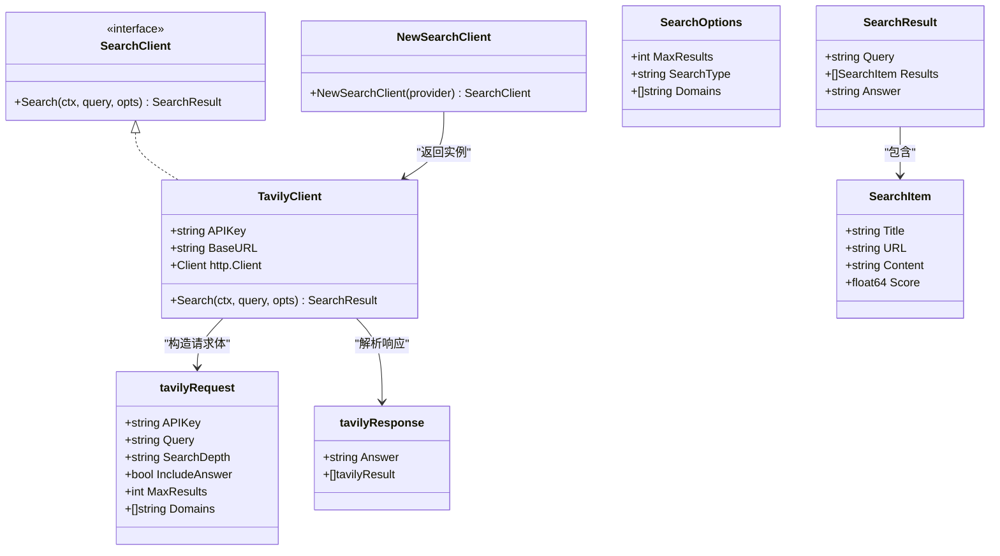
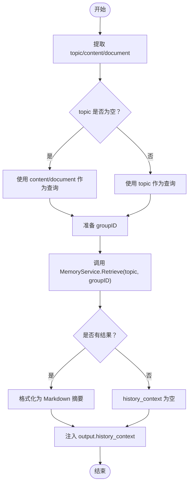
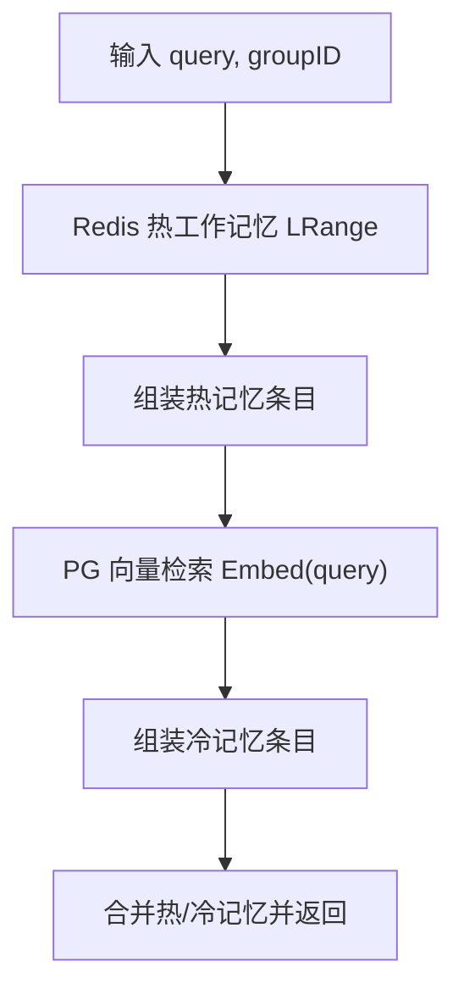
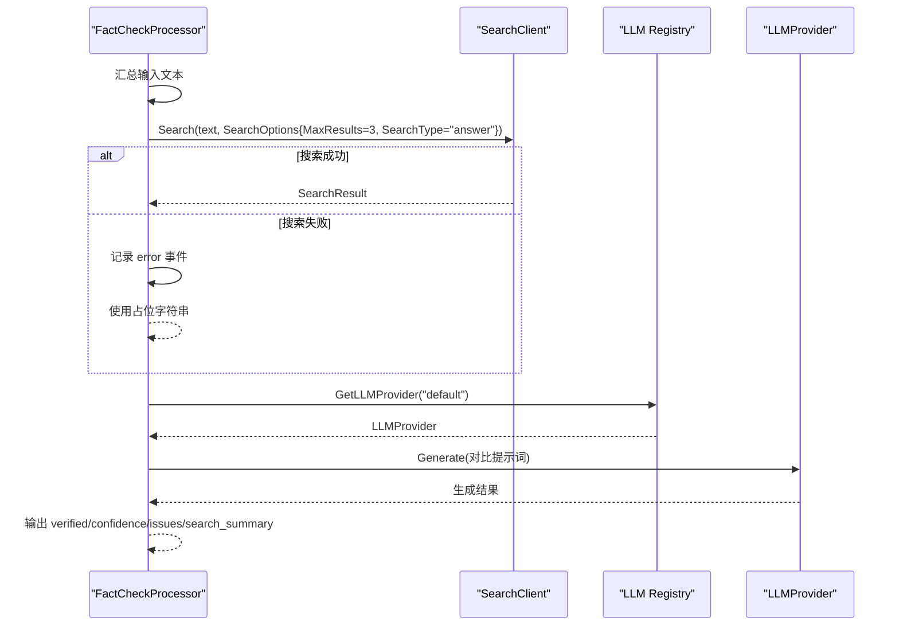
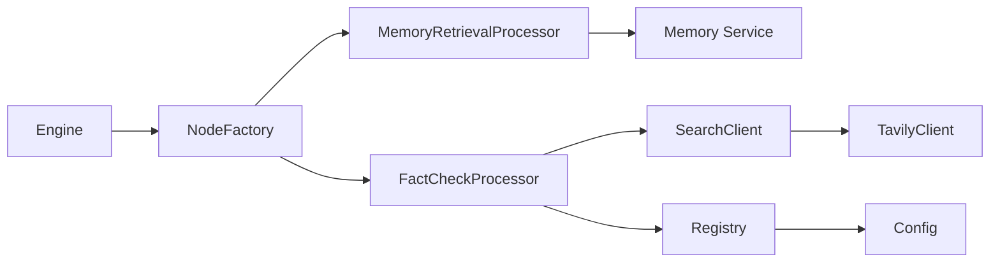

# 扩展增强能力

<cite>
**本文引用的文件列表**
- [tavily.go](file://internal/infrastructure/search/tavily.go)
- [tavily_test.go](file://internal/infrastructure/search/tavily_test.go)
- [memory_retrieval.go](file://internal/core/workflow/nodes/memory_retrieval.go)
- [service.go](file://internal/core/memory/service.go)
- [fact_check.go](file://internal/core/workflow/nodes/fact_check.go)
- [router.go](file://internal/infrastructure/llm/router.go)
- [factory.go](file://internal/core/workflow/nodes/factory.go)
- [engine.go](file://internal/core/workflow/engine.go)
- [config.go](file://internal/pkg/config/config.go)
</cite>

## 目录
1. [引言](#引言)
2. [项目结构](#项目结构)
3. [核心组件](#核心组件)
4. [架构总览](#架构总览)
5. [详细组件分析](#详细组件分析)
6. [依赖关系分析](#依赖关系分析)
7. [性能考量](#性能考量)
8. [故障排查指南](#故障排查指南)
9. [结论](#结论)

## 引言
本文件聚焦于记忆检索系统的扩展增强能力，系统性阐述如何通过 TavilyClient 集成外部实时搜索服务以弥补静态记忆的局限性；说明 NewSearchClient 工厂函数如何根据配置选择搜索提供商，并通过 Search 方法发起 HTTP 请求获取最新网络信息；解释 tavilyRequest 请求体构造过程（搜索深度、结果数量、域名限制等）；解释 tavilyResponse 解析逻辑及 SearchResult 到内部 SearchItem 的转换机制；结合 LLM 路由系统（router.go）说明在检索增强生成（RAG）场景下的模型选择策略（优先选用支持长上下文的模型处理融合了历史记忆与实时搜索结果的复杂输入）；展示在事实核查（FactCheckProcessor）节点中如何协同使用内部记忆检索与外部搜索服务进行交叉验证；最后提供错误处理策略（API 密钥缺失、请求超时、速率限制等）。

## 项目结构
围绕“扩展增强能力”的关键代码分布在以下模块：
- 搜索基础设施：TavilyClient、NewSearchClient 工厂、Search 接口与数据结构
- 记忆检索节点：MemoryRetrievalProcessor（历史上下文注入）
- 内部记忆服务：Service（工作记忆与长期记忆检索）
- 事实核查节点：FactCheckProcessor（外部搜索+LLM交叉验证）
- LLM 路由系统：Registry（按配置选择默认模型）
- 工作流引擎与节点工厂：Engine、NodeFactory（节点生命周期与依赖注入）

图表来源
- [tavily.go](file://internal/infrastructure/search/tavily.go#L1-L154)
- [memory_retrieval.go](file://internal/core/workflow/nodes/memory_retrieval.go#L1-L103)
- [service.go](file://internal/core/memory/service.go#L1-L209)
- [fact_check.go](file://internal/core/workflow/nodes/fact_check.go#L1-L114)
- [router.go](file://internal/infrastructure/llm/router.go#L1-L177)
- [factory.go](file://internal/core/workflow/nodes/factory.go#L1-L106)
- [engine.go](file://internal/core/workflow/engine.go#L1-L246)

章节来源
- [tavily.go](file://internal/infrastructure/search/tavily.go#L1-L154)
- [memory_retrieval.go](file://internal/core/workflow/nodes/memory_retrieval.go#L1-L103)
- [service.go](file://internal/core/memory/service.go#L1-L209)
- [fact_check.go](file://internal/core/workflow/nodes/fact_check.go#L1-L114)
- [router.go](file://internal/infrastructure/llm/router.go#L1-L177)
- [factory.go](file://internal/core/workflow/nodes/factory.go#L1-L106)
- [engine.go](file://internal/core/workflow/engine.go#L1-L246)

## 核心组件
- 搜索客户端接口与实现
  - SearchClient 接口定义 Search(ctx, query, opts) 返回 SearchResult
  - TavilyClient 实现 Search，负责构造请求体、发送 HTTP 请求、解析响应并转换为内部结构
  - NewSearchClient 工厂根据 provider 返回对应客户端实例
- 记忆检索节点
  - MemoryRetrievalProcessor 从 MemoryService 检索历史上下文并注入输出
- 内部记忆服务
  - Service 提供 Retrieve/Promote，支持热工作记忆（Redis）与冷长期记忆（PostgreSQL+向量）
- 事实核查节点
  - FactCheckProcessor 使用 SearchClient 获取外部搜索结果，再用 LLM 对比判断准确性
- LLM 路由系统
  - Registry 根据配置解析默认模型名，支持多种提供商
- 工作流引擎与节点工厂
  - Engine 负责节点执行与事件流；NodeFactory 将依赖注入到各节点（含 FactCheck/MemoryRetrieval）

章节来源
- [tavily.go](file://internal/infrastructure/search/tavily.go#L1-L154)
- [memory_retrieval.go](file://internal/core/workflow/nodes/memory_retrieval.go#L1-L103)
- [service.go](file://internal/core/memory/service.go#L1-L209)
- [fact_check.go](file://internal/core/workflow/nodes/fact_check.go#L1-L114)
- [router.go](file://internal/infrastructure/llm/router.go#L1-L177)
- [factory.go](file://internal/core/workflow/nodes/factory.go#L1-L106)
- [engine.go](file://internal/core/workflow/engine.go#L1-L246)

## 架构总览
下图展示了从工作流节点到外部搜索与内部记忆的交互路径，以及在事实核查场景中的数据流。

图表来源
- [memory_retrieval.go](file://internal/core/workflow/nodes/memory_retrieval.go#L1-L103)
- [service.go](file://internal/core/memory/service.go#L1-L209)
- [fact_check.go](file://internal/core/workflow/nodes/fact_check.go#L1-L114)
- [tavily.go](file://internal/infrastructure/search/tavily.go#L1-L154)
- [router.go](file://internal/infrastructure/llm/router.go#L1-L177)
- [factory.go](file://internal/core/workflow/nodes/factory.go#L1-L106)
- [engine.go](file://internal/core/workflow/engine.go#L1-L246)

## 详细组件分析

### TavilyClient 与 NewSearchClient 工厂
- 工厂函数 NewSearchClient 根据 provider 返回 TavilyClient 实例；若 provider 为空则默认返回 TavilyClient
- TavilyClient.Search 负责：
  - 参数校验（API 密钥）
  - 构造 tavilyRequest（包含查询、搜索深度、是否包含答案、最大结果数、域名限制等）
  - 发起 HTTP POST 请求至 https://api.tavily.com/search
  - 解析响应为 tavilyResponse，并映射为 SearchResult/SearchItem
  - 错误处理：请求失败、状态码非 200、解码失败、API 密钥缺失等

图表来源
- [tavily.go](file://internal/infrastructure/search/tavily.go#L1-L154)

章节来源
- [tavily.go](file://internal/infrastructure/search/tavily.go#L1-L154)
- [tavily_test.go](file://internal/infrastructure/search/tavily_test.go#L1-L74)

### 记忆检索节点（MemoryRetrievalProcessor）
- 作用：从 MemoryService 检索历史上下文，格式化为 Markdown 摘要并注入到输出的 history_context 字段
- 输入：topic/content/document/group_id
- 处理流程：
  - 提取主题/查询
  - 调用 MemoryService.Retrieve 获取上下文条目
  - 格式化为历史摘要
  - 输出包含 history_context 的上下文

图表来源
- [memory_retrieval.go](file://internal/core/workflow/nodes/memory_retrieval.go#L1-L103)
- [service.go](file://internal/core/memory/service.go#L1-L209)

章节来源
- [memory_retrieval.go](file://internal/core/workflow/nodes/memory_retrieval.go#L1-L103)
- [service.go](file://internal/core/memory/service.go#L1-L209)

### 内部记忆服务（Memory Service）
- 支持两级存储：
  - 热工作记忆（Redis）：最近若干条内容，便于快速检索
  - 冷长期记忆（PostgreSQL + 向量）：基于嵌入相似度检索
- 提供 Promote（分块嵌入并入库）、UpdateWorkingMemory（写入工作记忆）、Retrieve（组合热/冷记忆）等能力

图表来源
- [service.go](file://internal/core/memory/service.go#L1-L209)

章节来源
- [service.go](file://internal/core/memory/service.go#L1-L209)

### 事实核查节点（FactCheckProcessor）
- 协同内部记忆与外部搜索进行交叉验证：
  - 使用 SearchClient.Search 获取外部搜索摘要
  - 使用 LLM 对比文本与搜索结果，判断准确性并输出 verified/confidence/issues
- 错误处理：外部搜索失败时记录错误事件并继续执行（不中断流程）

图表来源
- [fact_check.go](file://internal/core/workflow/nodes/fact_check.go#L1-L114)
- [router.go](file://internal/infrastructure/llm/router.go#L1-L177)

章节来源
- [fact_check.go](file://internal/core/workflow/nodes/fact_check.go#L1-L114)
- [router.go](file://internal/infrastructure/llm/router.go#L1-L177)

### LLM 路由系统（Registry）与模型选择策略
- Registry.GetLLMProvider 根据 provider 名称解析 API Key/BaseURL，并创建对应 LLM 客户端
- GetDefaultModel 返回系统默认模型名（可根据 provider 回退）
- 在 RAG 场景中，建议优先选用支持长上下文的模型（如 Gemini 2.0 Flash、GPT-4 等），以承载融合历史记忆与实时搜索结果的复杂输入

章节来源
- [router.go](file://internal/infrastructure/llm/router.go#L1-L177)
- [config.go](file://internal/pkg/config/config.go#L1-L133)

### 工作流引擎与节点工厂
- Engine.Run 从起始节点开始执行，调用 NodeFactory 创建节点处理器，执行前后经过中间件钩子
- NodeFactory.NewNodeFactory 根据节点类型注入依赖（Registry、AgentRepo、MemoryService 等），并创建对应处理器（FactCheck、MemoryRetrieval 等）

章节来源
- [engine.go](file://internal/core/workflow/engine.go#L1-L246)
- [factory.go](file://internal/core/workflow/nodes/factory.go#L1-L106)

## 依赖关系分析
- 组件耦合与内聚
  - SearchClient 与 TavilyClient 解耦，通过接口隔离外部服务
  - MemoryRetrievalProcessor 仅依赖 MemoryService 接口，便于替换实现
  - FactCheckProcessor 依赖 SearchClient 与 LLM Registry，形成“搜索+推理”的验证闭环
- 直接与间接依赖
  - Engine 通过 NodeFactory 间接依赖 Registry、MemoryService
  - Registry 依赖全局配置（Config）解析提供商键值
- 外部依赖与集成点
  - Tavily API（HTTP POST /search）
  - Redis（工作记忆）
  - PostgreSQL（长期记忆 + 向量）

图表来源
- [engine.go](file://internal/core/workflow/engine.go#L1-L246)
- [factory.go](file://internal/core/workflow/nodes/factory.go#L1-L106)
- [memory_retrieval.go](file://internal/core/workflow/nodes/memory_retrieval.go#L1-L103)
- [fact_check.go](file://internal/core/workflow/nodes/fact_check.go#L1-L114)
- [tavily.go](file://internal/infrastructure/search/tavily.go#L1-L154)
- [router.go](file://internal/infrastructure/llm/router.go#L1-L177)
- [config.go](file://internal/pkg/config/config.go#L1-L133)

## 性能考量
- 搜索请求超时控制：TavilyClient.Client 设置超时，避免阻塞
- 结果数量与搜索深度：SearchOptions.MaxResults 控制外部搜索规模；SearchType 与 SearchDepth 影响响应质量与耗时
- 记忆检索缓存：Redis 热工作记忆可显著降低延迟
- LLM 生成温度：FactCheckProcessor 使用较低温度以减少不确定性
- 并发执行：Engine.handleParallel 并行推进分支，提高吞吐

章节来源
- [tavily.go](file://internal/infrastructure/search/tavily.go#L1-L154)
- [engine.go](file://internal/core/workflow/engine.go#L1-L246)

## 故障排查指南
- API 密钥缺失
  - 现象：TavilyClient.Search 返回错误
  - 处理：确保环境变量 TAVILY_API_KEY 已设置；或通过 Config 加载
- 请求超时
  - 现象：HTTP 请求失败
  - 处理：检查网络与代理；适当增大超时或重试
- 速率限制/状态码异常
  - 现象：HTTP 非 200 或被限流
  - 处理：降频重试、切换域名或升级套餐
- 外部搜索失败不影响主流程
  - 现象：FactCheckProcessor 记录 error 事件并继续执行
  - 处理：在输出中保留占位信息，保证工作流连续性
- 内部记忆不可用
  - 现象：MemoryRetrievalProcessor 记录错误事件但不中断
  - 处理：检查 Redis/数据库连接与权限

章节来源
- [tavily.go](file://internal/infrastructure/search/tavily.go#L1-L154)
- [tavily_test.go](file://internal/infrastructure/search/tavily_test.go#L1-L74)
- [fact_check.go](file://internal/core/workflow/nodes/fact_check.go#L1-L114)
- [memory_retrieval.go](file://internal/core/workflow/nodes/memory_retrieval.go#L1-L103)
- [config.go](file://internal/pkg/config/config.go#L1-L133)

## 结论
通过 TavilyClient 与 NewSearchClient 工厂，系统实现了对外部实时搜索的无缝集成，有效弥补静态记忆的时效性不足。MemoryRetrievalProcessor 将历史上下文注入工作流，FactCheckProcessor 则将内部记忆与外部搜索进行交叉验证，形成“检索—推理—验证”的闭环。结合 LLM 路由系统，可在 RAG 场景中优先选用支持长上下文的模型，以承载融合历史与实时信息的复杂输入。完善的错误处理策略确保了在外部服务不稳定时仍能维持工作流的连续性与鲁棒性。