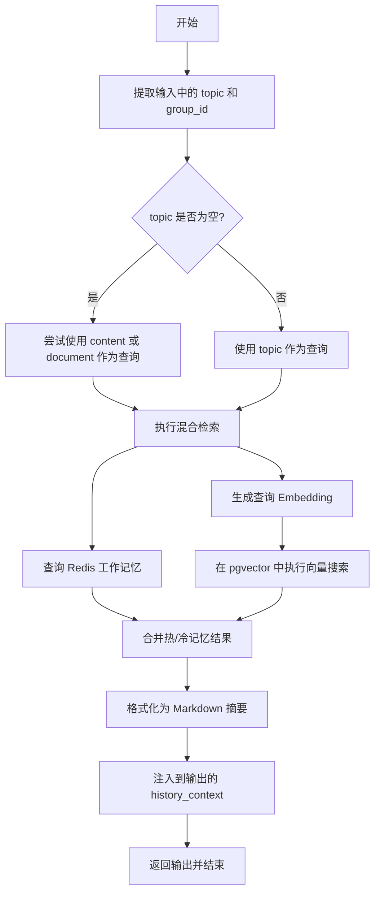
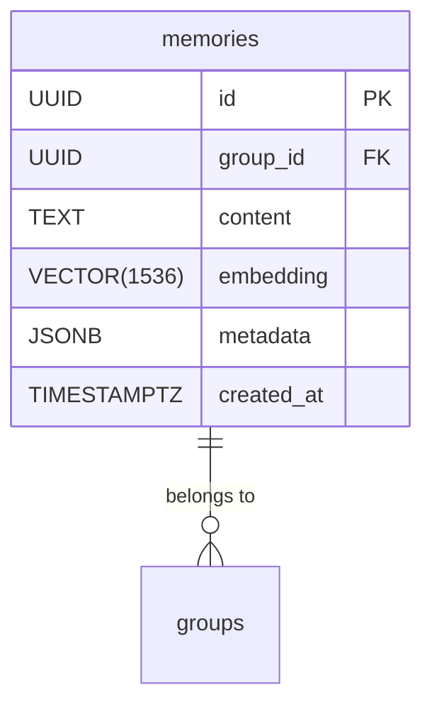
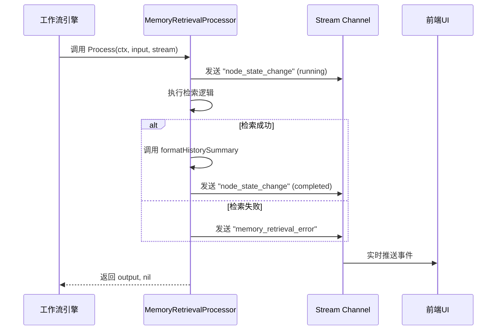

# 核心检索机制

<cite>
**本文档引用的文件**  
- [memory_retrieval.go](file://internal/core/workflow/nodes/memory_retrieval.go)
- [service.go](file://internal/core/memory/service.go)
- [types.go](file://internal/core/memory/types.go)
- [splitter.go](file://internal/core/memory/splitter.go)
- [postgres.go](file://internal/infrastructure/db/postgres.go)
- [redis.go](file://internal/infrastructure/cache/redis.go)
- [llm.go](file://internal/infrastructure/llm/llm.go)
- [001_init_schema.up.sql](file://internal/infrastructure/db/migrations/001_init_schema.up.sql)
- [SPEC-607-memory-retrieval-node.md](file://docs/specs/sprint6/SPEC-607-memory-retrieval-node.md)
- [SPEC-408-memory-protocol.md](file://docs/specs/backend/SPEC-408-memory-protocol.md)
</cite>

## 目录
1. [引言](#引言)
2. [核心检索流程](#核心检索流程)
3. [嵌入生成与向量数据库](#嵌入生成与向量数据库)
4. [检索结果处理](#检索结果处理)
5. [节点执行与事件流](#节点执行与事件流)
6. [性能调优建议](#性能调优建议)
7. [结论](#结论)

## 引言
本文件深入解析记忆检索的核心机制，重点阐述`MemoryRetrievalProcessor`如何通过`Process`方法从输入中提取查询主题（topic），并调用`MemoryService.Retrieve`接口在长期记忆层执行向量相似度搜索。详细说明检索过程中使用的Embedding生成策略、向量数据库（pgvector）的索引结构与查询优化技术。解释检索结果的排序逻辑（基于相关度得分）、内容截断规则及安全过滤机制。描述`formatHistorySummary`函数如何将多个`ContextItem`结构体格式化为Markdown格式的历史上下文摘要，并注入到工作流输出中供后续智能体使用。结合`NodeProcessor`接口说明该节点在工作流引擎中的执行生命周期管理，包括状态事件流（StreamEvent）的发布机制。

**Section sources**
- [memory_retrieval.go](file://internal/core/workflow/nodes/memory_retrieval.go#L1-L103)
- [service.go](file://internal/core/memory/service.go#L1-L209)

## 核心检索流程

`MemoryRetrievalProcessor`是工作流引擎中的一个关键节点处理器，负责从系统的记忆层检索与当前任务相关的上下文信息。其核心流程如下：

1.  **输入解析与主题提取**：`Process`方法首先从输入的`map[string]interface{}`中提取`topic`字段作为查询主题。如果`topic`为空，则尝试使用`content`或`document`字段作为备选查询。
2.  **分组标识提取**：同时从输入中提取`group_id`，用于限定检索范围，确保检索结果与当前项目或会话相关。
3.  **混合检索执行**：调用`MemoryService.Retrieve`方法执行混合检索。该方法会同时查询两个层级的记忆：
    *   **热记忆层 (Hot Working Memory)**：从Redis中获取与`group_id`关联的最近10条工作记忆，这些记忆具有1.0的固定相关度得分，代表最新的、高优先级的上下文。
    *   **冷记忆层 (Cold LTM)**：在PostgreSQL的`memories`表中执行向量相似度搜索，检索与查询主题最相关的5条长期记忆。
4.  **结果聚合与注入**：将从两个层级检索到的结果合并，并通过`formatHistorySummary`函数格式化为Markdown摘要，最终注入到输出`map`的`history_context`字段中。

**Diagram sources**
- [memory_retrieval.go](file://internal/core/workflow/nodes/memory_retrieval.go#L36-L72)
- [service.go](file://internal/core/memory/service.go#L162-L207)

**Section sources**
- [memory_retrieval.go](file://internal/core/workflow/nodes/memory_retrieval.go#L23-L84)
- [service.go](file://internal/core/memory/service.go#L159-L208)

## 嵌入生成与向量数据库

### 嵌入生成策略
系统使用`Embedder`接口（如OpenAI的`text-embedding-ada-002`）将文本查询转换为高维向量。在`MemoryService.Retrieve`方法中，查询字符串`query`被传递给`Embedder.Embed`方法，生成一个1536维的浮点数向量。该向量随后被序列化为JSON字符串格式（如`"[0.1,0.2,...]"`），以便在SQL查询中使用。

### 向量数据库与索引结构
系统采用PostgreSQL的`pgvector`扩展作为向量数据库，其核心表为`memories`。

- **表结构**：`memories`表包含`embedding`字段，其数据类型为`VECTOR(1536)`，与`text-embedding-ada-002`模型的输出维度匹配。
- **索引结构**：为了优化向量相似度搜索的性能，系统在`embedding`字段上创建了`ivfflat`索引（`idx_memories_embedding`）。该索引使用余弦距离操作符`vector_cosine_ops`，并配置了100个列表（`lists = 100`），以在搜索速度和召回率之间取得平衡。
- **查询优化**：检索查询使用`<=>`操作符计算查询向量与数据库中所有向量的余弦距离，并通过`ORDER BY`进行排序。最终，通过`1 - (embedding <=> $1)`将距离转换为0到1之间的相关度得分（相似度），并使用`LIMIT 5`限制返回结果数量，确保查询效率。

**Diagram sources**
- [001_init_schema.up.sql](file://internal/infrastructure/db/migrations/001_init_schema.up.sql#L80-L95)
- [service.go](file://internal/core/memory/service.go#L178-L191)

**Section sources**
- [service.go](file://internal/core/memory/service.go#L176-L195)
- [001_init_schema.up.sql](file://internal/infrastructure/db/migrations/001_init_schema.up.sql#L80-L95)
- [llm.go](file://internal/infrastructure/llm/llm.go#L43-L47)

## 检索结果处理

### 排序逻辑
检索结果的排序基于相关度得分（Score）进行。热记忆层（Redis）的条目被赋予最高的固定得分1.0，确保它们始终排在最前面。冷记忆层（pgvector）的条目则根据向量相似度计算得出的得分进行排序，得分越高表示与查询主题越相关。

### 内容截断与安全过滤
- **内容截断**：在写入长期记忆时，`RecursiveCharacterSplitter`会将大块文本分割成约500字符的片段，并保留50字符的重叠部分，以保证上下文的连贯性。
- **安全过滤**：在写入工作记忆（Redis）时，系统会执行入口过滤（Ingress Filter）：
    1.  **置信度过滤**：检查元数据中的`confidence`字段，若低于0.8则拒绝写入。
    2.  **长度过滤**：对于非常短的内容（少于50字符），系统会直接忽略，以防止噪声数据污染。

### 历史摘要格式化
`formatHistorySummary`函数负责将`[]ContextItem`切片格式化为结构化的Markdown文本。其处理逻辑如下：
1.  如果结果为空，则返回空字符串。
2.  添加`## 历史上下文`作为主标题。
3.  遍历每个`ContextItem`，为每条记录添加`### 记录 X (相关度: Y.YY)`的子标题，并附上原始内容。
4.  使用`strings.Builder`高效地构建最终字符串，避免频繁的内存分配。

**Section sources**
- [service.go](file://internal/core/memory/service.go#L66-L95)
- [memory_retrieval.go](file://internal/core/workflow/nodes/memory_retrieval.go#L86-L102)
- [splitter.go](file://internal/core/memory/splitter.go#L14-L22)

## 节点执行与事件流

`MemoryRetrievalProcessor`实现了`NodeProcessor`接口，使其能够无缝集成到工作流引擎中。

- **执行生命周期**：`Process`方法是其核心，接收上下文`ctx`、输入`input`和用于实时通信的`stream`通道。方法执行时，会通过`stream`通道发送`node_state_change`事件，通知前端节点状态从`running`变为`completed`。
- **事件流机制**：除了状态变更事件，该节点还会在发生错误时发送`memory_retrieval_error`事件。这些事件通过WebSocket实时推送到前端，实现了工作流执行过程的可视化和实时监控。
- **接口契约**：`NodeProcessor`接口定义了统一的`Process`方法签名，确保了所有节点类型（如`StartProcessor`、`LoopProcessor`等）在引擎中的可插拔性和一致性。

**Diagram sources**
- [memory_retrieval.go](file://internal/core/workflow/nodes/memory_retrieval.go#L29-L83)
- [processor.go](file://internal/core/workflow/processor.go#L7-L14)

**Section sources**
- [memory_retrieval.go](file://internal/core/workflow/nodes/memory_retrieval.go#L23-L84)
- [processor.go](file://internal/core/workflow/processor.go#L7-L14)

## 性能调优建议

1.  **高频查询缓存**：对于重复出现的查询主题，可以在`MemoryRetrievalProcessor`或`MemoryService`层面引入缓存（如Redis），直接返回缓存的检索结果，避免重复的向量计算和数据库查询。
2.  **调整向量维度**：评估是否可以使用维度更低的嵌入模型（如`text-embedding-3-small`，384维），以减少向量存储空间和计算开销，同时可能提升检索速度。
3.  **优化HNSW索引参数**：虽然当前使用`ivfflat`索引，但`pgvector`也支持更先进的HNSW（Hierarchical Navigable Small World）索引。可以考虑迁移到HNSW，并调整`m`（每个节点的连接数）和`ef_construction`（构建时的候选列表大小）等参数，以获得更好的查询性能。
4.  **批量嵌入**：在`Promote`方法中，对文本块进行逐个嵌入。如果嵌入服务支持，可以实现批量嵌入（batch embedding），显著减少网络往返次数，提高晋升效率。

**Section sources**
- [service.go](file://internal/core/memory/service.go#L130-L134)
- [memory_retrieval.go](file://internal/core/workflow/nodes/memory_retrieval.go#L53-L63)

## 结论
`MemoryRetrievalProcessor`及其依赖的`MemoryService`构成了系统智能记忆的核心。通过结合热记忆（Redis）的低延迟和冷记忆（pgvector）的高精度，系统实现了高效、准确的上下文检索。三层记忆协议（隔离区、工作记忆、长期记忆）的设计，有效保障了知识库的纯净度和安全性。该机制为后续的智能体决策提供了坚实、可靠的历史上下文支持。