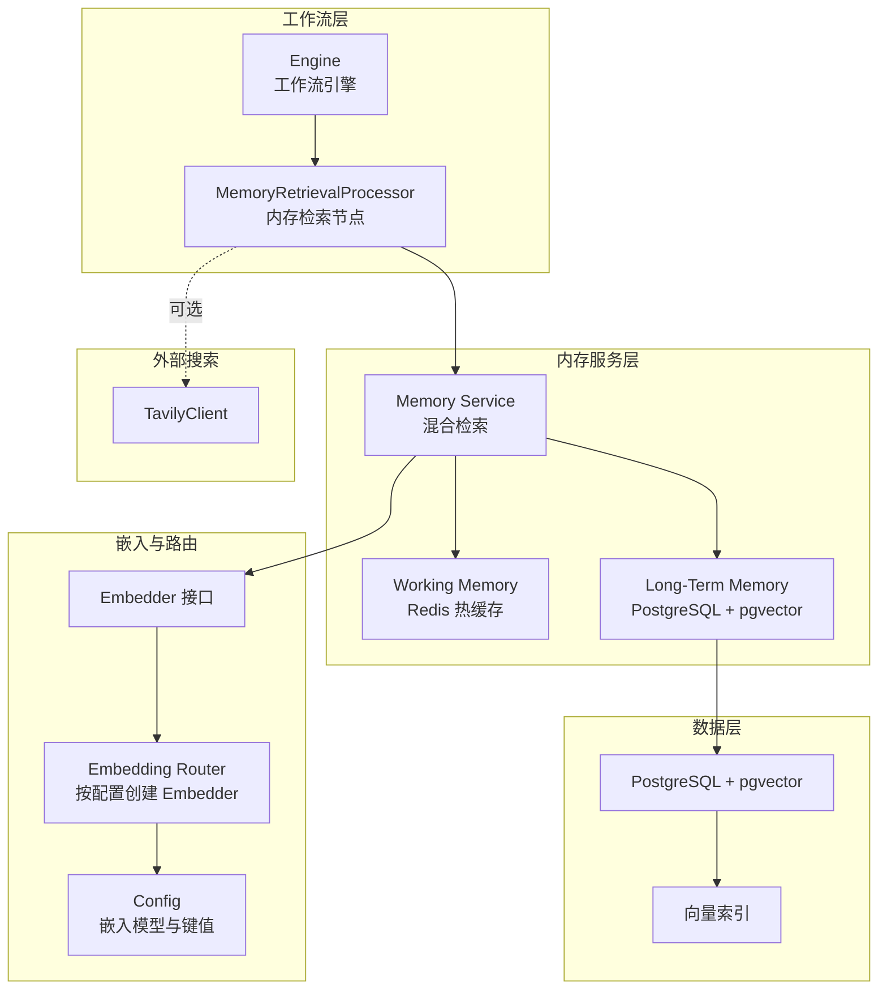
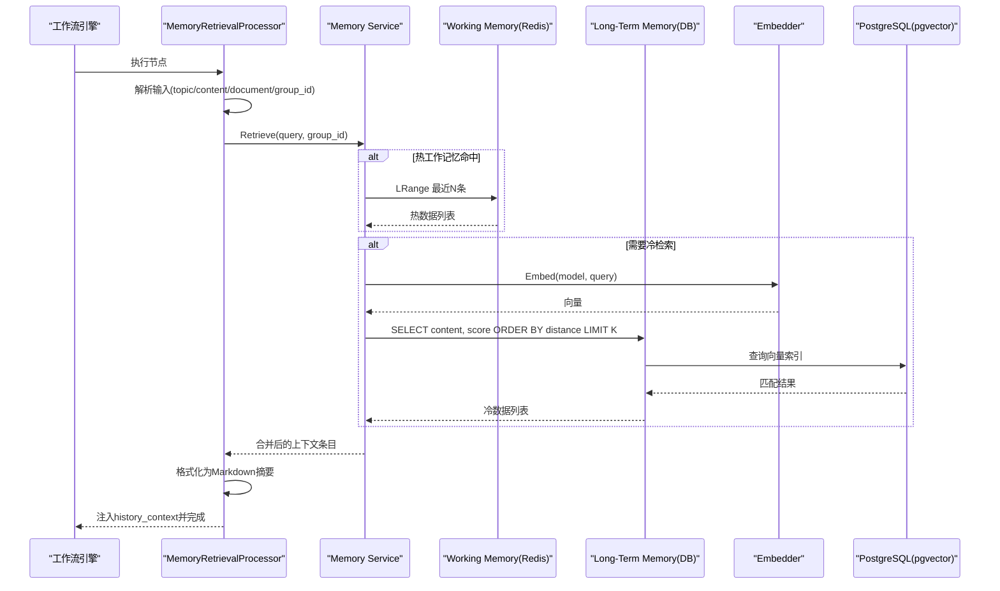
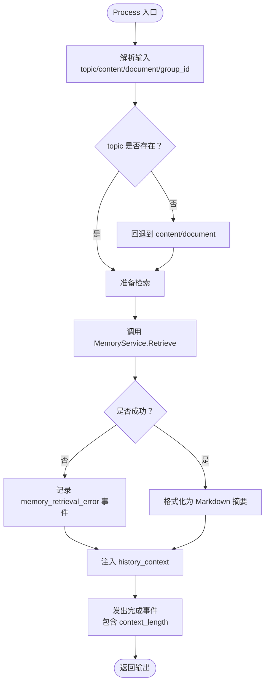
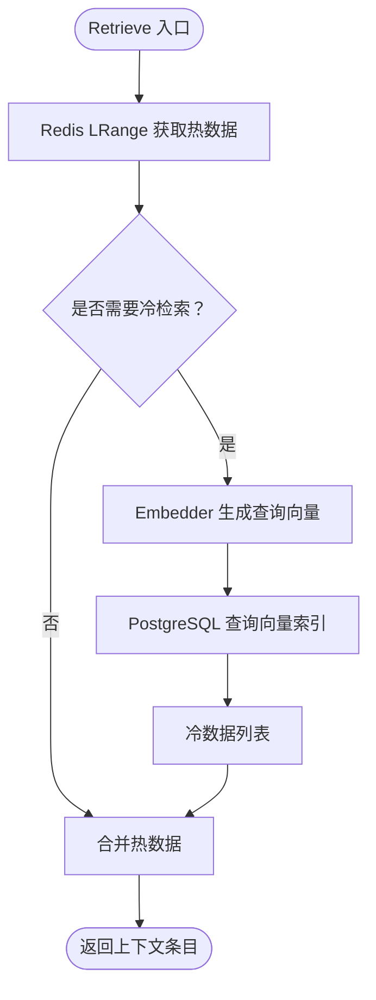
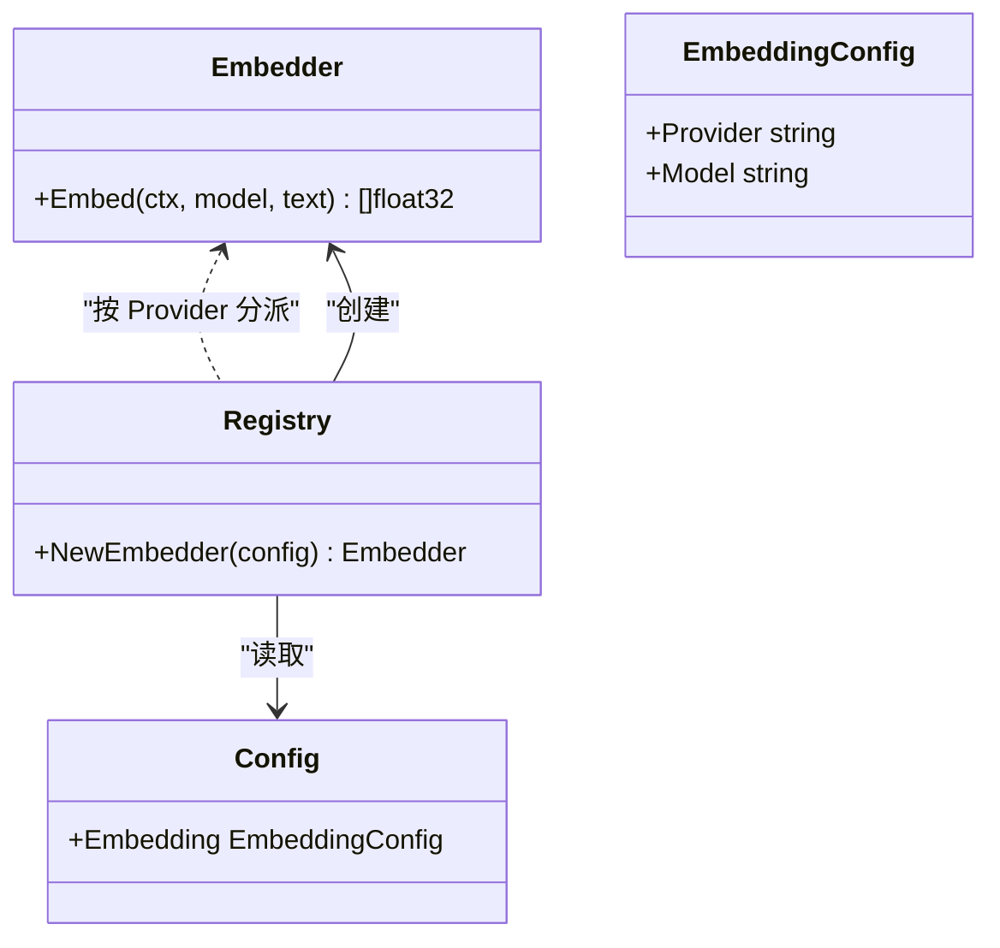
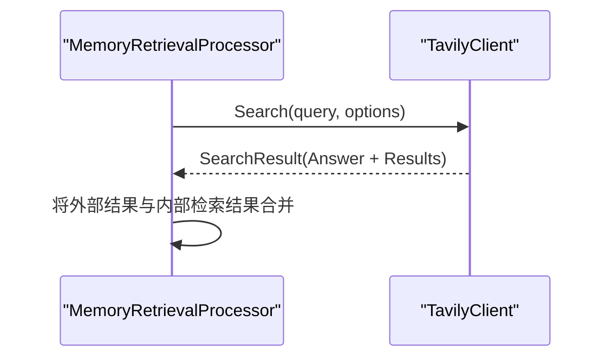
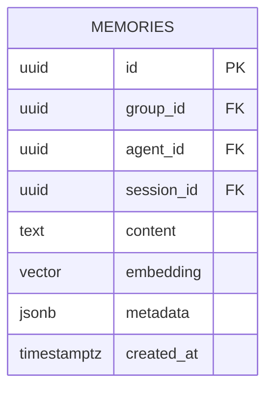
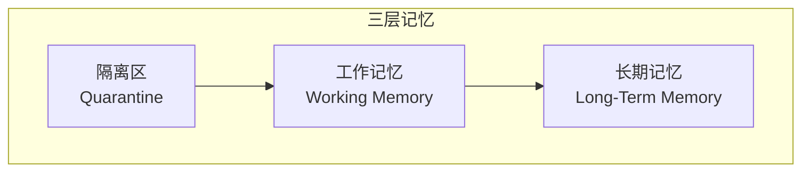
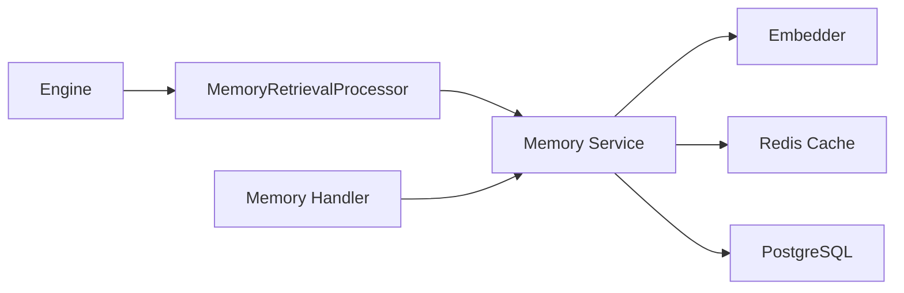

# 检索机制

<cite>
**本文引用的文件**
- [internal/core/workflow/nodes/memory_retrieval.go](file://internal/core/workflow/nodes/memory_retrieval.go)
- [internal/core/memory/service.go](file://internal/core/memory/service.go)
- [internal/core/memory/types.go](file://internal/core/memory/types.go)
- [internal/infrastructure/llm/llm.go](file://internal/infrastructure/llm/llm.go)
- [internal/infrastructure/llm/router.go](file://internal/infrastructure/llm/router.go)
- [internal/infrastructure/search/tavily.go](file://internal/infrastructure/search/tavily.go)
- [internal/pkg/config/config.go](file://internal/pkg/config/config.go)
- [internal/infrastructure/db/migrations/001_init_schema.up.sql](file://internal/infrastructure/db/migrations/001_init_schema.up.sql)
- [internal/core/workflow/engine.go](file://internal/core/workflow/engine.go)
- [internal/core/workflow/context.go](file://internal/core/workflow/context.go)
- [internal/api/handler/memory.go](file://internal/api/handler/memory.go)
- [docs/specs/sprint6/SPEC-607-memory-retrieval-node.md](file://docs/specs/sprint6/SPEC-607-memory-retrieval-node.md)
- [docs/specs/backend/SPEC-408-memory-protocol.md](file://docs/specs/backend/SPEC-408-memory-protocol.md)
- [docs/guide/model-selection-strategy.md](file://docs/guide/model-selection-strategy.md)
- [docs/tdd/02_core/09_context_builder.md](file://docs/tdd/02_core/09_context_builder.md)
- [docs/tdd/02_core/10_search_tool.md](file://docs/tdd/02_core/10_search_tool.md)
- [docs/specs/backend/SPEC-411-search-integration.md](file://docs/specs/backend/SPEC-411-search-integration.md)
- [internal/core/middleware/memory.go](file://internal/core/middleware/memory.go)
</cite>

## 目录
1. [简介](#简介)
2. [项目结构](#项目结构)
3. [核心组件](#核心组件)
4. [架构总览](#架构总览)
5. [详细组件分析](#详细组件分析)
6. [依赖关系分析](#依赖关系分析)
7. [性能考量](#性能考量)
8. [故障排查指南](#故障排查指南)
9. [结论](#结论)
10. [附录](#附录)

## 简介
本文件围绕记忆系统的检索机制展开，重点解析 memory_retrieval 节点在工作流执行过程中如何实现向量检索与上下文注入。文档覆盖以下关键点：
- memory_retrieval 节点如何提取查询主题、调用 MemoryService 生成查询向量并在 longterm 层执行相似度搜索；
- 检索结果的来源与合并顺序（热工作记忆优先、冷长期记忆次之）、排序与截断策略；
- 如何将高相关性记忆条目注入后续智能体决策流程；
- 结合 LLM 路由机制解释检索过程中的模型选择策略；
- 如何利用 Tavily 等外部搜索服务增强知识召回能力；
- 实际应用场景示例与性能优化建议（缓存策略、索引调优）。

## 项目结构
检索机制涉及多个层次的协作：
- 工作流层：节点处理器负责在执行前注入历史上下文；
- 内存服务层：统一管理三层记忆（隔离、工作、长期），并提供混合检索；
- 嵌入与路由层：通过 Embedder 生成向量，按配置选择合适的嵌入模型；
- 外部搜索层：Tavily 等 Web 搜索客户端；
- 数据层：PostgreSQL + pgvector 存储长期记忆向量；
- 配置层：系统级嵌入模型与 API Key 等配置。

图表来源
- [internal/core/workflow/nodes/memory_retrieval.go](file://internal/core/workflow/nodes/memory_retrieval.go#L1-L103)
- [internal/core/memory/service.go](file://internal/core/memory/service.go#L1-L209)
- [internal/infrastructure/llm/llm.go](file://internal/infrastructure/llm/llm.go#L1-L64)
- [internal/infrastructure/llm/router.go](file://internal/infrastructure/llm/router.go#L152-L176)
- [internal/pkg/config/config.go](file://internal/pkg/config/config.go#L1-L91)
- [internal/infrastructure/db/migrations/001_init_schema.up.sql](file://internal/infrastructure/db/migrations/001_init_schema.up.sql#L80-L95)
- [internal/infrastructure/search/tavily.go](file://internal/infrastructure/search/tavily.go#L1-L154)

章节来源
- [internal/core/workflow/nodes/memory_retrieval.go](file://internal/core/workflow/nodes/memory_retrieval.go#L1-L103)
- [internal/core/memory/service.go](file://internal/core/memory/service.go#L1-L209)
- [internal/infrastructure/llm/llm.go](file://internal/infrastructure/llm/llm.go#L1-L64)
- [internal/infrastructure/llm/router.go](file://internal/infrastructure/llm/router.go#L152-L176)
- [internal/pkg/config/config.go](file://internal/pkg/config/config.go#L1-L91)
- [internal/infrastructure/db/migrations/001_init_schema.up.sql](file://internal/infrastructure/db/migrations/001_init_schema.up.sql#L80-L95)
- [internal/infrastructure/search/tavily.go](file://internal/infrastructure/search/tavily.go#L1-L154)

## 核心组件
- MemoryRetrievalProcessor：工作流节点处理器，负责从输入提取查询主题/文档，调用 MemoryService 检索历史，并将摘要注入输出上下文。
- Memory Service：统一的三层记忆协议实现，包含热工作记忆（Redis）与冷长期记忆（PostgreSQL + pgvector）；支持向量检索与混合返回。
- Embedder 接口与路由：通过配置创建嵌入客户端，确保向量维度与数据库一致。
- TavilyClient：外部 Web 搜索客户端，用于增强召回。
- 数据库与索引：memories 表存储向量，pgvector 提供向量相似度检索索引。

章节来源
- [internal/core/workflow/nodes/memory_retrieval.go](file://internal/core/workflow/nodes/memory_retrieval.go#L1-L103)
- [internal/core/memory/service.go](file://internal/core/memory/service.go#L1-L209)
- [internal/core/memory/types.go](file://internal/core/memory/types.go#L1-L27)
- [internal/infrastructure/llm/llm.go](file://internal/infrastructure/llm/llm.go#L1-L64)
- [internal/infrastructure/llm/router.go](file://internal/infrastructure/llm/router.go#L152-L176)
- [internal/infrastructure/search/tavily.go](file://internal/infrastructure/search/tavily.go#L1-L154)
- [internal/infrastructure/db/migrations/001_init_schema.up.sql](file://internal/infrastructure/db/migrations/001_init_schema.up.sql#L80-L95)

## 架构总览
检索流程在工作流执行期间自动发生：节点在进入下游处理前，先注入历史上下文，再交由后续节点继续执行。检索路径遵循“热工作记忆优先、冷长期记忆次之”的混合策略，向量检索基于 cosine 相似度排序并限制返回数量。

图表来源
- [internal/core/workflow/nodes/memory_retrieval.go](file://internal/core/workflow/nodes/memory_retrieval.go#L23-L84)
- [internal/core/memory/service.go](file://internal/core/memory/service.go#L159-L208)
- [internal/infrastructure/llm/llm.go](file://internal/infrastructure/llm/llm.go#L43-L64)
- [internal/infrastructure/db/migrations/001_init_schema.up.sql](file://internal/infrastructure/db/migrations/001_init_schema.up.sql#L80-L95)

## 详细组件分析

### MemoryRetrievalProcessor（工作流节点）
- 输入解析：优先使用 topic，若为空则回退到 content 或 document；同时提取 group_id。
- 调用 MemoryService.Retrieve 获取上下文条目。
- 错误处理：检索失败仅记录事件，不影响整体流程。
- 输出注入：将格式化的历史摘要注入到输出上下文的 history_context 字段。
- 事件上报：开始/完成状态事件携带上下文长度等元信息。

图表来源
- [internal/core/workflow/nodes/memory_retrieval.go](file://internal/core/workflow/nodes/memory_retrieval.go#L23-L84)

章节来源
- [internal/core/workflow/nodes/memory_retrieval.go](file://internal/core/workflow/nodes/memory_retrieval.go#L1-L103)

### Memory Service（混合检索）
- 热工作记忆（Redis）：按 group_id 命名的列表，最近 10 条作为高置信来源，Score 固定为 1.0。
- 冷长期记忆（PostgreSQL + pgvector）：生成查询向量，使用 cosine 相似度（1 - 向量距离）排序，LIMIT 5 返回。
- 混合返回：先热后冷，形成最终上下文条目列表。

图表来源
- [internal/core/memory/service.go](file://internal/core/memory/service.go#L159-L208)
- [internal/infrastructure/db/migrations/001_init_schema.up.sql](file://internal/infrastructure/db/migrations/001_init_schema.up.sql#L80-L95)

章节来源
- [internal/core/memory/service.go](file://internal/core/memory/service.go#L159-L208)
- [internal/core/memory/types.go](file://internal/core/memory/types.go#L1-L27)

### 嵌入与模型选择（Embedder 与路由）
- Embedder 接口：统一的 Embed 方法，输入模型名与文本，输出向量。
- 路由器：根据配置创建具体 Embedder（OpenAI、Gemini、Ollama、DeepSeek、DashScope、SiliconFlow）。
- 配置：嵌入模型名称与维度需与数据库一致（迁移脚本指定 1536 维）。

图表来源
- [internal/infrastructure/llm/llm.go](file://internal/infrastructure/llm/llm.go#L43-L64)
- [internal/infrastructure/llm/router.go](file://internal/infrastructure/llm/router.go#L152-L176)
- [internal/pkg/config/config.go](file://internal/pkg/config/config.go#L1-L91)

章节来源
- [internal/infrastructure/llm/llm.go](file://internal/infrastructure/llm/llm.go#L1-L64)
- [internal/infrastructure/llm/router.go](file://internal/infrastructure/llm/router.go#L152-L176)
- [internal/pkg/config/config.go](file://internal/pkg/config/config.go#L1-L91)

### 外部搜索增强（Tavily）
- TavilyClient：封装 Tavily API，支持最大结果数、域名过滤、直接答案等选项。
- 工厂函数：按 provider 创建客户端，默认使用 tavily。
- 与检索的结合：可在检索前后调用，以增强召回覆盖面。

图表来源
- [internal/infrastructure/search/tavily.go](file://internal/infrastructure/search/tavily.go#L1-L154)
- [docs/specs/backend/SPEC-411-search-integration.md](file://docs/specs/backend/SPEC-411-search-integration.md#L1-L77)
- [docs/tdd/02_core/10_search_tool.md](file://docs/tdd/02_core/10_search_tool.md#L1-L77)

章节来源
- [internal/infrastructure/search/tavily.go](file://internal/infrastructure/search/tavily.go#L1-L154)
- [docs/specs/backend/SPEC-411-search-integration.md](file://docs/specs/backend/SPEC-411-search-integration.md#L1-L77)
- [docs/tdd/02_core/10_search_tool.md](file://docs/tdd/02_core/10_search_tool.md#L1-L77)

### 数据模型与索引
- memories 表：group_id、agent_id、session_id、content、embedding（VECTOR）、metadata、created_at。
- 索引：按 group_id 建立普通索引；embedding 建立 ivfflat 向量索引（cosine 距离）。
- 迁移脚本明确 1536 维度，与常见嵌入模型一致。

图表来源
- [internal/infrastructure/db/migrations/001_init_schema.up.sql](file://internal/infrastructure/db/migrations/001_init_schema.up.sql#L80-L95)

章节来源
- [internal/infrastructure/db/migrations/001_init_schema.up.sql](file://internal/infrastructure/db/migrations/001_init_schema.up.sql#L80-L95)

### 三层记忆协议与工作流集成
- 协议：隔离区（Tier 1）、工作记忆（Tier 2）、长期记忆（Tier 3）。
- 工作流中间件：在节点输出后写入隔离与工作记忆，便于检索节点复用。
- 节点规格：memory_retrieval 节点支持 max_results、time_range、relevance_threshold 等属性（规范文档）。

图表来源
- [docs/specs/backend/SPEC-408-memory-protocol.md](file://docs/specs/backend/SPEC-408-memory-protocol.md#L10-L58)
- [internal/core/middleware/memory.go](file://internal/core/middleware/memory.go#L40-L72)
- [docs/specs/sprint6/SPEC-607-memory-retrieval-node.md](file://docs/specs/sprint6/SPEC-607-memory-retrieval-node.md#L1-L212)

章节来源
- [docs/specs/backend/SPEC-408-memory-protocol.md](file://docs/specs/backend/SPEC-408-memory-protocol.md#L10-L58)
- [internal/core/middleware/memory.go](file://internal/core/middleware/memory.go#L40-L72)
- [docs/specs/sprint6/SPEC-607-memory-retrieval-node.md](file://docs/specs/sprint6/SPEC-607-memory-retrieval-node.md#L1-L212)

## 依赖关系分析
- 节点依赖 Memory Service；Memory Service 依赖 Embedder、Redis Cache、PostgreSQL；
- 工作流引擎通过 NodeFactory 创建节点处理器并驱动执行；
- Handler 层提供检索 API，便于独立验证检索功能。

图表来源
- [internal/core/workflow/nodes/memory_retrieval.go](file://internal/core/workflow/nodes/memory_retrieval.go#L1-L103)
- [internal/core/memory/service.go](file://internal/core/memory/service.go#L1-L209)
- [internal/api/handler/memory.go](file://internal/api/handler/memory.go#L1-L67)
- [internal/core/workflow/engine.go](file://internal/core/workflow/engine.go#L1-L246)

章节来源
- [internal/core/workflow/nodes/memory_retrieval.go](file://internal/core/workflow/nodes/memory_retrieval.go#L1-L103)
- [internal/core/memory/service.go](file://internal/core/memory/service.go#L1-L209)
- [internal/api/handler/memory.go](file://internal/api/handler/memory.go#L1-L67)
- [internal/core/workflow/engine.go](file://internal/core/workflow/engine.go#L1-L246)

## 性能考量
- 热工作记忆（Redis）：
  - 优点：极低延迟、高命中率；适合近期上下文。
  - 建议：控制列表长度（默认 50），设置合理 TTL（默认 24h）。
- 冷长期记忆（PostgreSQL + pgvector）：
  - 优点：持久化、可扩展、支持大规模检索。
  - 建议：使用 HNSW 或 ivfflat 索引；批量插入与分页查询；限制返回数量（默认 5）。
- 嵌入模型与维度：
  - 建议：确保嵌入模型维度与数据库一致（迁移脚本为 1536）；避免跨模型向量混用。
- 外部搜索：
  - 建议：在检索前后分别调用，以平衡时效性与准确性；控制最大结果数与超时时间。
- 工作流执行：
  - 建议：在节点前注入上下文，减少下游重复检索；必要时在中间件中写入工作记忆，提高复用率。

[本节为通用指导，无需列出具体文件来源]

## 故障排查指南
- 检索节点报错：
  - 现象：节点发出 memory_retrieval_error 事件。
  - 排查：确认 group_id 是否传入、topic/content/document 是否有效；检查 Memory Service 初始化与依赖（Redis、DB、Embedder）。
- 嵌入失败：
  - 现象：向量生成失败。
  - 排查：检查嵌入模型配置与 API Key；确认路由创建 Embedder 成功。
- 数据库检索异常：
  - 现象：向量查询失败或无结果。
  - 排查：确认向量维度匹配、索引是否存在；检查查询 SQL 与参数绑定。
- 外部搜索异常：
  - 现象：Tavily 请求失败或未设置 API Key。
  - 排查：检查环境变量 TAVILY_API_KEY；确认网络可达与响应码。

章节来源
- [internal/core/workflow/nodes/memory_retrieval.go](file://internal/core/workflow/nodes/memory_retrieval.go#L51-L64)
- [internal/core/memory/service.go](file://internal/core/memory/service.go#L174-L205)
- [internal/infrastructure/search/tavily.go](file://internal/infrastructure/search/tavily.go#L80-L120)
- [internal/pkg/config/config.go](file://internal/pkg/config/config.go#L1-L91)

## 结论
memory_retrieval 节点通过“热工作记忆优先、冷长期记忆次之”的混合检索策略，结合向量相似度排序与有限截断，高效地将高相关性历史注入后续智能体决策流程。配合嵌入路由与外部搜索增强，系统在准确性和时效性之间取得平衡。通过合理的缓存与索引策略，可进一步提升检索性能与用户体验。

[本节为总结，无需列出具体文件来源]

## 附录

### 应用场景示例
- 争议点追溯：在辩论节点前注入历史裁决与讨论要点，帮助正反双方快速定位分歧点。
- 历史决策参考：在新提案评估时，引入过往类似案例的结论与理由，辅助生成更稳健的判断。
- 跨会话记忆复用：通过 group_id 限定作用域，使不同会话间的历史经验得以复用。

[本节为概念性说明，无需列出具体文件来源]

### 检索节点配置与扩展
- 节点属性（来自规范文档）：max_results、time_range_days、relevance_threshold、include_verdicts 等。
- 与上下文构建的关系：ContextBuilder 在更高层也使用嵌入进行 RAG，与节点检索形成互补。

章节来源
- [docs/specs/sprint6/SPEC-607-memory-retrieval-node.md](file://docs/specs/sprint6/SPEC-607-memory-retrieval-node.md#L1-L212)
- [docs/tdd/02_core/09_context_builder.md](file://docs/tdd/02_core/09_context_builder.md#L5-L102)