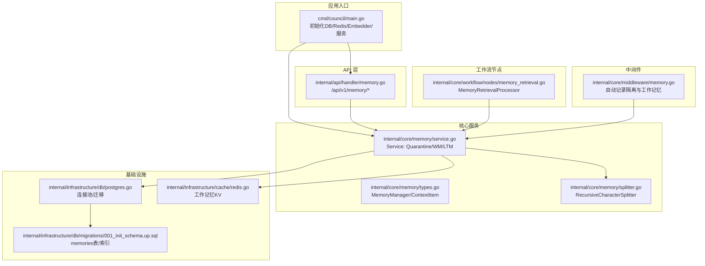
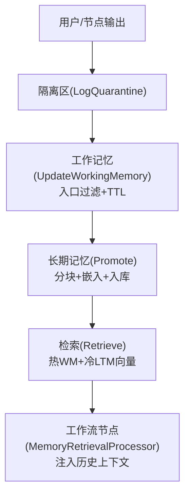
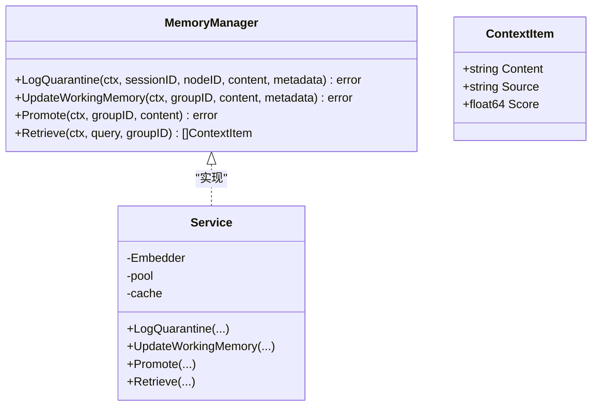
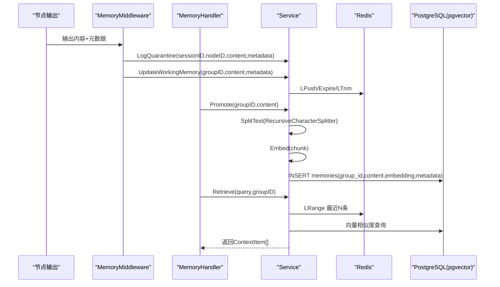
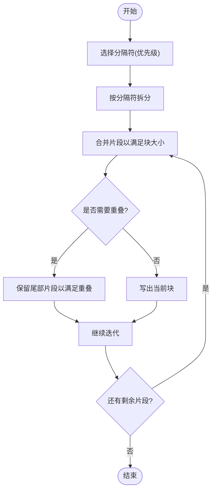
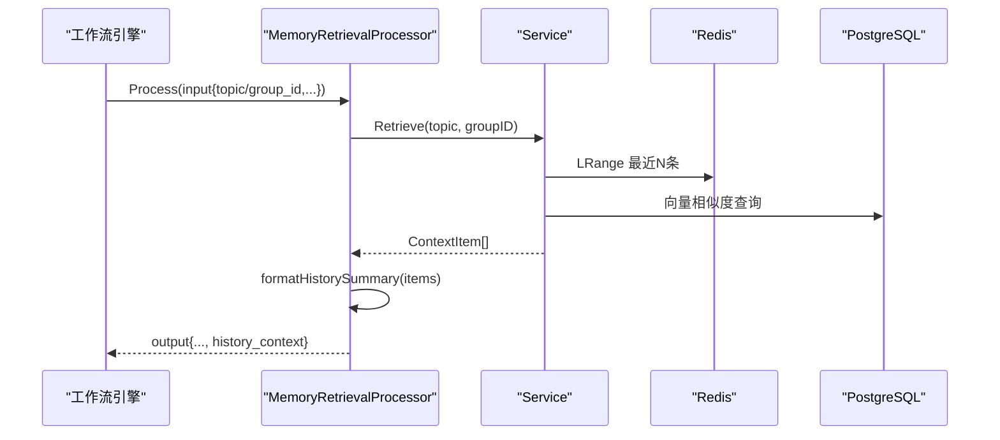
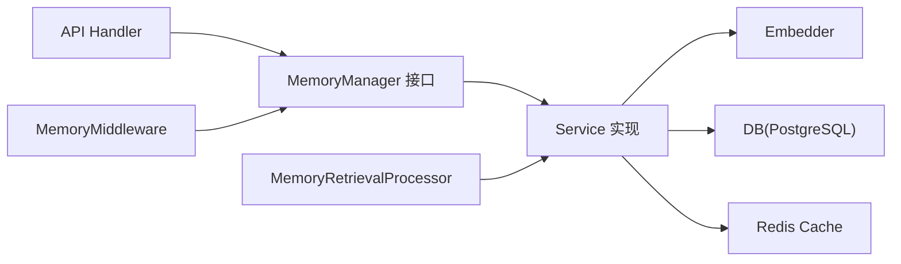

# 记忆系统

<cite>
**本文引用的文件**
- [internal/core/memory/service.go](file://internal/core/memory/service.go)
- [internal/core/memory/splitter.go](file://internal/core/memory/splitter.go)
- [internal/core/memory/types.go](file://internal/core/memory/types.go)
- [internal/api/handler/memory.go](file://internal/api/handler/memory.go)
- [internal/core/workflow/nodes/memory_retrieval.go](file://internal/core/workflow/nodes/memory_retrieval.go)
- [internal/core/middleware/memory.go](file://internal/core/middleware/memory.go)
- [internal/infrastructure/db/postgres.go](file://internal/infrastructure/db/postgres.go)
- [internal/infrastructure/db/migrations/001_init_schema.up.sql](file://internal/infrastructure/db/migrations/001_init_schema.up.sql)
- [internal/infrastructure/cache/redis.go](file://internal/infrastructure/cache/redis.go)
- [cmd/council/main.go](file://cmd/council/main.go)
- [docs/specs/backend/SPEC-408-memory-protocol.md](file://docs/specs/backend/SPEC-408-memory-protocol.md)
- [docs/specs/sprint6/SPEC-607-memory-retrieval-node.md](file://docs/specs/sprint6/SPEC-607-memory-retrieval-node.md)
</cite>

## 目录
1. [简介](#简介)
2. [项目结构](#项目结构)
3. [核心组件](#核心组件)
4. [架构总览](#架构总览)
5. [详细组件分析](#详细组件分析)
6. [依赖关系分析](#依赖关系分析)
7. [性能考虑](#性能考虑)
8. [故障排查指南](#故障排查指南)
9. [结论](#结论)
10. [附录](#附录)

## 简介
本文件围绕三层记忆系统（隔离区、工作记忆、长期记忆）的设计与实现展开，系统性阐述其如何支撑上下文延续与知识沉淀，并结合 SPEC-408 协议文档说明读写权限与隐私保护机制。同时，文档覆盖 memory.go 服务的记忆生命周期管理、splitter.go 内容分块策略、memory_retrieval.go 节点的向量检索流程，给出跨会话记忆复用、争议点追溯与历史决策参考等典型场景，并提供索引策略、缓存机制与 pgvector 配置优化建议。

## 项目结构
记忆系统相关代码主要分布在以下模块：
- 核心服务与接口：internal/core/memory
- API 处理器：internal/api/handler
- 工作流节点：internal/core/workflow/nodes
- 中间件：internal/core/middleware
- 基础设施：internal/infrastructure/db、internal/infrastructure/cache
- 启动入口：cmd/council/main.go
- 规范文档：docs/specs/backend/SPEC-408-memory-protocol.md、docs/specs/sprint6/SPEC-607-memory-retrieval-node.md

图表来源
- [cmd/council/main.go](file://cmd/council/main.go#L1-L150)
- [internal/api/handler/memory.go](file://internal/api/handler/memory.go#L1-L68)
- [internal/core/memory/service.go](file://internal/core/memory/service.go#L1-L209)
- [internal/core/memory/splitter.go](file://internal/core/memory/splitter.go#L1-L101)
- [internal/core/workflow/nodes/memory_retrieval.go](file://internal/core/workflow/nodes/memory_retrieval.go#L1-L103)
- [internal/core/middleware/memory.go](file://internal/core/middleware/memory.go#L1-L73)
- [internal/infrastructure/db/postgres.go](file://internal/infrastructure/db/postgres.go#L1-L66)
- [internal/infrastructure/db/migrations/001_init_schema.up.sql](file://internal/infrastructure/db/migrations/001_init_schema.up.sql#L1-L96)
- [internal/infrastructure/cache/redis.go](file://internal/infrastructure/cache/redis.go#L1-L51)

章节来源
- [cmd/council/main.go](file://cmd/council/main.go#L1-L150)
- [internal/core/memory/service.go](file://internal/core/memory/service.go#L1-L209)
- [internal/api/handler/memory.go](file://internal/api/handler/memory.go#L1-L68)
- [internal/core/workflow/nodes/memory_retrieval.go](file://internal/core/workflow/nodes/memory_retrieval.go#L1-L103)
- [internal/core/middleware/memory.go](file://internal/core/middleware/memory.go#L1-L73)
- [internal/infrastructure/db/postgres.go](file://internal/infrastructure/db/postgres.go#L1-L66)
- [internal/infrastructure/db/migrations/001_init_schema.up.sql](file://internal/infrastructure/db/migrations/001_init_schema.up.sql#L1-L96)
- [internal/infrastructure/cache/redis.go](file://internal/infrastructure/cache/redis.go#L1-L51)

## 核心组件
- MemoryManager 接口与 ContextItem 结构体定义了三层记忆协议的统一抽象与检索结果项格式。
- Service 实现了隔离区记录、工作记忆写入与淘汰、长期记忆晋升与检索的核心逻辑。
- RecursiveCharacterSplitter 提供递归字符分块策略，支持重叠合并以保持语义连贯。
- MemoryRetrievalProcessor 在工作流中自动检索历史上下文并注入输出。
- MemoryMiddleware 在节点执行后自动记录隔离区与工作记忆，确保上下文延续。
- API Handler 对外暴露记忆摄取与查询接口，驱动 Service 执行。
- 基础设施层通过 PostgreSQL（含 pgvector 扩展）与 Redis 分别承载长期记忆与工作记忆。

章节来源
- [internal/core/memory/types.go](file://internal/core/memory/types.go#L1-L27)
- [internal/core/memory/service.go](file://internal/core/memory/service.go#L1-L209)
- [internal/core/memory/splitter.go](file://internal/core/memory/splitter.go#L1-L101)
- [internal/core/workflow/nodes/memory_retrieval.go](file://internal/core/workflow/nodes/memory_retrieval.go#L1-L103)
- [internal/core/middleware/memory.go](file://internal/core/middleware/memory.go#L1-L73)
- [internal/api/handler/memory.go](file://internal/api/handler/memory.go#L1-L68)

## 架构总览
三层记忆体系遵循“隔离—过滤—沉淀”的路径：
- 隔离区（Quarantine）：所有会议产出默认进入，物理隔离，不参与检索，防止低质量内容污染核心库。
- 工作记忆（Working Memory）：热缓存，入口过滤（一致性与长度阈值），TTL 24 小时，按组隔离。
- 长期记忆（Long-Term Memory）：经验证的高价值知识，向量化存储，支持基于嵌入的相似度检索。

图表来源
- [internal/core/memory/service.go](file://internal/core/memory/service.go#L1-L209)
- [internal/core/middleware/memory.go](file://internal/core/middleware/memory.go#L1-L73)
- [internal/core/workflow/nodes/memory_retrieval.go](file://internal/core/workflow/nodes/memory_retrieval.go#L1-L103)
- [docs/specs/backend/SPEC-408-memory-protocol.md](file://docs/specs/backend/SPEC-408-memory-protocol.md#L1-L207)

## 详细组件分析

### MemoryManager 接口与 ContextItem
- MemoryManager 定义三层记忆协议的统一能力：隔离区记录、工作记忆更新、长期记忆晋升、混合检索。
- ContextItem 表示检索返回的单条上下文，包含内容、来源（热/冷）与相关度分数。

图表来源
- [internal/core/memory/types.go](file://internal/core/memory/types.go#L1-L27)
- [internal/core/memory/service.go](file://internal/core/memory/service.go#L1-L209)

章节来源
- [internal/core/memory/types.go](file://internal/core/memory/types.go#L1-L27)
- [internal/core/memory/service.go](file://internal/core/memory/service.go#L1-L209)

### memory.go 服务：记忆生命周期管理
- 隔离区记录（LogQuarantine）
  - 将原始内容与元数据持久化至 PostgreSQL 的 quarantine_logs 表，保留节点标识以便溯源。
- 工作记忆写入（UpdateWorkingMemory）
  - 入口过滤：基于置信度阈值与内容长度进行简单一致性判定；通过后写入 Redis 列表，设置 24 小时 TTL 并限制列表长度。
- 长期记忆晋升（Promote）
  - 使用分块器将内容切分为若干片段；对每个片段生成嵌入并写入 memories 表，元数据记录来源与时间戳。
- 检索（Retrieve）
  - 先从 Redis 获取最近若干条热上下文；再对查询生成嵌入，使用 pgvector 的余弦距离检索相似片段，合并返回。

图表来源
- [internal/core/middleware/memory.go](file://internal/core/middleware/memory.go#L1-L73)
- [internal/api/handler/memory.go](file://internal/api/handler/memory.go#L1-L68)
- [internal/core/memory/service.go](file://internal/core/memory/service.go#L1-L209)
- [internal/core/memory/splitter.go](file://internal/core/memory/splitter.go#L1-L101)

章节来源
- [internal/core/memory/service.go](file://internal/core/memory/service.go#L1-L209)
- [internal/core/middleware/memory.go](file://internal/core/middleware/memory.go#L1-L73)
- [internal/api/handler/memory.go](file://internal/api/handler/memory.go#L1-L68)

### splitter.go：内容分块策略
- 递归字符分块器按优先级分隔符（段落、换行、空格、字符）拆分文本，超过块大小则回退到更细粒度的分隔符继续拆分。
- 合并阶段处理重叠：当累积长度超过块大小时，先写出当前块，再保留尾部若干片段以满足重叠要求，保证语义连续性。

图表来源
- [internal/core/memory/splitter.go](file://internal/core/memory/splitter.go#L1-L101)

章节来源
- [internal/core/memory/splitter.go](file://internal/core/memory/splitter.go#L1-L101)

### memory_retrieval.go 节点：向量检索与上下文注入
- 节点从输入提取主题/文档与组标识，调用 Service.Retrieve 获取历史上下文，格式化为 Markdown 摘要并注入到输出上下文中。
- 节点在执行期间发送状态事件，便于前端与可观测性追踪。

图表来源
- [internal/core/workflow/nodes/memory_retrieval.go](file://internal/core/workflow/nodes/memory_retrieval.go#L1-L103)
- [internal/core/memory/service.go](file://internal/core/memory/service.go#L1-L209)

章节来源
- [internal/core/workflow/nodes/memory_retrieval.go](file://internal/core/workflow/nodes/memory_retrieval.go#L1-L103)
- [internal/core/memory/service.go](file://internal/core/memory/service.go#L1-L209)

### 权限控制与隐私保护（结合 SPEC-408）
- 隔离区（Quarantine）：所有产出默认进入隔离区，不参与检索，避免低质量内容污染核心库，起到隐私与质量的第一道防线。
- 工作记忆（Working Memory）：按组隔离，TTL 24 小时，减少长期暴露风险；入口过滤降低噪声与潜在敏感信息进入长期库。
- 长期记忆（Long-Term Memory）：仅存储经验证的高价值知识，晋升前需经过一致性与长度阈值等过滤；检索时返回片段与相关度，不直接暴露原始内容。
- API 层面：对外接口仅提供摄取与查询，未暴露直接写入长期库的开放写接口，避免越权操作。

章节来源
- [docs/specs/backend/SPEC-408-memory-protocol.md](file://docs/specs/backend/SPEC-408-memory-protocol.md#L1-L207)
- [internal/core/memory/service.go](file://internal/core/memory/service.go#L1-L209)
- [internal/api/handler/memory.go](file://internal/api/handler/memory.go#L1-L68)

## 依赖关系分析
- Service 依赖 Embedder（LLM）、DB（PostgreSQL）、Cache（Redis）三类外部组件。
- API Handler 依赖 MemoryManager 接口，便于替换实现与测试。
- 工作流节点依赖 Service 的检索能力。
- 中间件在节点执行后自动记录隔离与工作记忆，形成闭环。

图表来源
- [internal/api/handler/memory.go](file://internal/api/handler/memory.go#L1-L68)
- [internal/core/memory/service.go](file://internal/core/memory/service.go#L1-L209)
- [internal/core/workflow/nodes/memory_retrieval.go](file://internal/core/workflow/nodes/memory_retrieval.go#L1-L103)
- [internal/core/middleware/memory.go](file://internal/core/middleware/memory.go#L1-L73)

章节来源
- [internal/api/handler/memory.go](file://internal/api/handler/memory.go#L1-L68)
- [internal/core/memory/service.go](file://internal/core/memory/service.go#L1-L209)
- [internal/core/workflow/nodes/memory_retrieval.go](file://internal/core/workflow/nodes/memory_retrieval.go#L1-L103)
- [internal/core/middleware/memory.go](file://internal/core/middleware/memory.go#L1-L73)

## 性能考虑
- 索引策略
  - memories 表已创建基于向量的 ivfflat 索引（余弦距离），建议在数据量增长后评估 HNSW 索引以提升召回与吞吐。
  - 为 group_id 创建普通索引，加速按组检索。
- 缓存机制
  - 工作记忆采用 Redis 列表，TTL 24 小时，列表长度上限 50，兼顾时效性与内存占用。
  - 可引入热点命中率监控与预热策略，对高频组的最近上下文进行预加载。
- pgvector 配置优化
  - 向量维度与模型一致（如 text-embedding-ada-002 1536 维）。
  - 合理设置 ivfflat 的 lists 参数，平衡内存与查询延迟。
  - 查询时使用合适的 LIMIT，避免一次性返回过多结果导致上下文膨胀。
- 嵌入与分块
  - 分块大小与重叠应结合业务语义长度调整；重叠有助于跨边界语义衔接。
  - 对超短内容进行过滤，减少无效向量入库与查询开销。
- 并发与超时
  - API 请求设置合理超时（摄取与查询分别设置不同超时），避免阻塞。
  - 检索阶段可考虑并发生成查询向量与并行拼接结果。

章节来源
- [internal/infrastructure/db/migrations/001_init_schema.up.sql](file://internal/infrastructure/db/migrations/001_init_schema.up.sql#L1-L96)
- [internal/core/memory/service.go](file://internal/core/memory/service.go#L1-L209)
- [internal/api/handler/memory.go](file://internal/api/handler/memory.go#L1-L68)

## 故障排查指南
- 隔离区记录失败
  - 检查数据库连接池初始化与迁移是否成功；确认 quarantine_logs 表存在且字段匹配。
- 工作记忆写入失败
  - 检查 Redis 连接与客户端初始化；确认键命名规范（wm:groupID）与 TTL 设置。
- 长期记忆晋升失败
  - 检查嵌入模型可用性与请求配额；确认分块后每段长度与内容质量满足过滤条件。
- 检索无结果或相关度低
  - 检查查询向量生成是否成功；核对 pgvector 索引是否存在；适当提高检索 LIMIT 或放宽阈值。
- API 调用异常
  - 检查路由与请求体绑定；确认超时设置与错误响应格式。

章节来源
- [internal/core/memory/service.go](file://internal/core/memory/service.go#L1-L209)
- [internal/infrastructure/db/postgres.go](file://internal/infrastructure/db/postgres.go#L1-L66)
- [internal/infrastructure/cache/redis.go](file://internal/infrastructure/cache/redis.go#L1-L51)
- [internal/api/handler/memory.go](file://internal/api/handler/memory.go#L1-L68)

## 结论
三层记忆系统通过隔离区、工作记忆与长期记忆的协同，实现了高质量上下文的持续积累与高效复用。memory.go 服务承担了隔离、过滤与沉淀的关键职责；splitter.go 提供稳健的分块策略；memory_retrieval.go 节点将历史上下文无缝注入工作流，显著提升决策质量与一致性。结合 SPEC-408 的权限与隐私设计，系统在保障安全的同时最大化知识价值。

## 附录
- 实际应用场景
  - 跨会话记忆复用：工作记忆提供近期上下文，长期记忆提供历史经验，二者结合提升连续对话质量。
  - 争议点追溯：通过隔离区与长期记忆的溯源能力，快速定位历史讨论与决策依据。
  - 历史决策参考：检索相关片段作为提示，辅助生成更一致、可追溯的回复。
- API 路由参考
  - POST /api/v1/memory/ingest：触发长期记忆晋升
  - POST /api/v1/memory/query：执行检索并返回上下文项

章节来源
- [docs/specs/backend/SPEC-408-memory-protocol.md](file://docs/specs/backend/SPEC-408-memory-protocol.md#L1-L207)
- [docs/specs/sprint6/SPEC-607-memory-retrieval-node.md](file://docs/specs/sprint6/SPEC-607-memory-retrieval-node.md#L1-L301)
- [internal/api/handler/memory.go](file://internal/api/handler/memory.go#L1-L68)