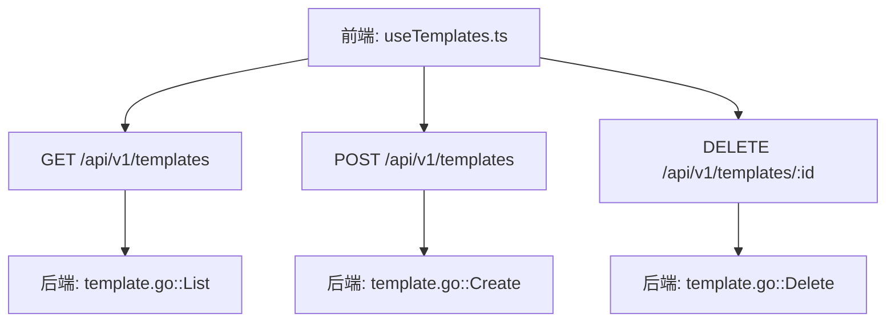
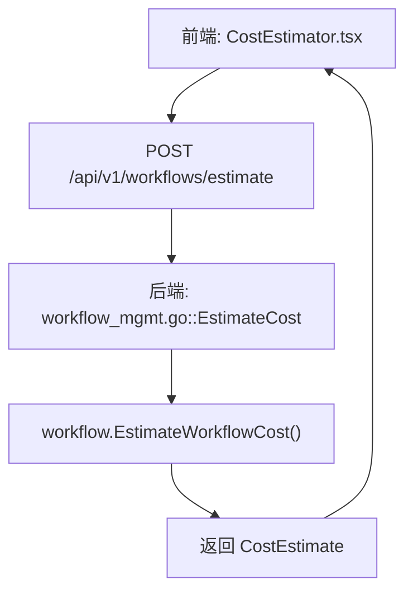
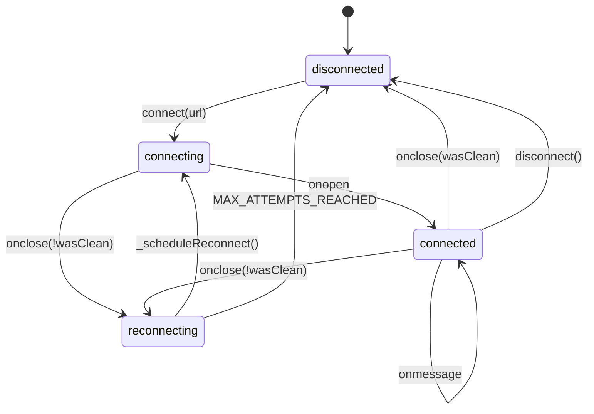
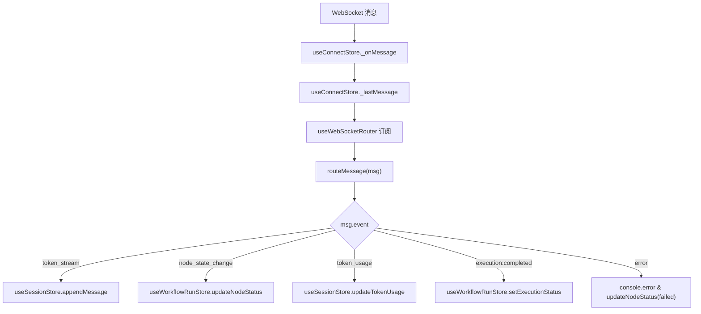

# API集成

<cite>
**本文档中引用的文件**  
- [useWebSocketRouter.ts](file://frontend/src/hooks/useWebSocketRouter.ts)
- [websocket.ts](file://frontend/src/types/websocket.ts)
- [useConnectStore.ts](file://frontend/src/stores/useConnectStore.ts)
- [useSessionStore.ts](file://frontend/src/stores/useSessionStore.ts)
- [useWorkflowRunStore.ts](file://frontend/src/stores/useWorkflowRunStore.ts)
- [hub.go](file://internal/api/ws/hub.go)
- [workflow.go](file://internal/api/handler/workflow.go)
- [workflow_mgmt.go](file://internal/api/handler/workflow_mgmt.go)
- [template.go](file://internal/api/handler/template.go)
- [useTemplates.ts](file://frontend/src/hooks/useTemplates.ts)
- [main.go](file://cmd/council/main.go)
- [cost_estimation.md](file://docs/api/cost_estimation.md)
- [SPEC-005-websocket-optimization.md](file://docs/specs/sprint1/SPEC-005-websocket-optimization.md)
- [SPEC-407-cost-estimation-api.md](file://docs/specs/backend/SPEC-407-cost-estimation-api.md)
</cite>

## 目录
1. [引言](#引言)
2. [REST API 集成](#rest-api-集成)
3. [WebSocket 实时通信](#websocket-实时通信)
4. [API 调用最佳实践](#api-调用最佳实践)
5. [总结](#总结)

## 引言

本API集成文档旨在全面阐述前端与后端之间的双通道通信机制。系统通过REST API处理资源的增删改查（CRUD）操作，并通过WebSocket实现工作流执行过程中的实时事件流通信。前端使用React、Zustand和React Query构建，后端使用Go和Gin框架。通信协议设计确保了高实时性、可靠性和可扩展性，支持智能体列表获取、工作流模板管理、成本预估以及会议执行过程中的实时状态更新。

**本文档中引用的文件**
- [main.go](file://cmd/council/main.go#L21-L150)

## REST API 集成

REST API用于处理非实时的、请求-响应式的操作，如获取智能体列表、管理工作流模板和预估成本。前端通过`fetch`或`axios`等库发起HTTP请求。

### 工作流模板管理

工作流模板的管理通过`/api/v1/templates`端点实现，支持创建、读取和删除操作。



**图源**
- [useTemplates.ts](file://frontend/src/hooks/useTemplates.ts#L6-L35)
- [template.go](file://internal/api/handler/template.go#L20-L67)

**REST API 端点**

| 端点 | 方法 | 描述 | 请求体 | 响应 |
| :--- | :--- | :--- | :--- | :--- |
| `/api/v1/templates` | GET | 获取所有模板列表 | 无 | `Template[]` |
| `/api/v1/templates` | POST | 创建新模板 | `CreateTemplateInput` | `Template` |
| `/api/v1/templates/:id` | DELETE | 删除指定ID的模板 | 无 | `{ status: "deleted" }` |

**REST API 请求示例**

```typescript
// 创建模板
const createTemplate = async (data: CreateTemplateInput) => {
  const res = await fetch('/api/v1/templates', {
    method: 'POST',
    headers: { 'Content-Type': 'application/json' },
    body: JSON.stringify(data),
  });
  return res.json();
};
```

**REST API 响应示例**

```json
{
  "id": "tpl-123",
  "name": "市场分析工作流",
  "description": "用于分析市场趋势的标准化流程",
  "category": "business",
  "graph": { "id": "wf-001", "nodes": { ... } },
  "created_at": "2025-12-21T10:00:00Z",
  "updated_at": "2025-12-21T10:00:00Z"
}
```

**REST API 错误处理**

| HTTP 状态码 | 错误类型 | 建议处理方式 |
| :--- | :--- | :--- |
| 400 Bad Request | 请求体格式错误 | 检查JSON格式和必填字段 |
| 404 Not Found | 模板ID不存在 | 确认ID正确或刷新列表 |
| 500 Internal Server Error | 服务器内部错误 | 重试或联系管理员 |

**REST API 集成要点**

- 使用React Query进行数据获取和缓存管理，通过`useQuery`和`useMutation`实现。
- 在创建或删除模板后，调用`queryClient.invalidateQueries`使缓存失效，确保UI及时更新。
- 所有API调用都应包含适当的错误处理，以提供良好的用户体验。

**REST API 集成要点**
- [useTemplates.ts](file://frontend/src/hooks/useTemplates.ts#L37-L62)

### 成本预估

成本预估功能通过`/api/v1/workflows/estimate`端点实现，允许用户在执行工作流前了解其资源消耗。



**图源**
- [workflow_mgmt.go](file://internal/api/handler/workflow_mgmt.go#L190-L218)
- [cost_estimation.md](file://docs/api/cost_estimation.md#L61-L140)

**成本预估流程**

1.  **前端请求**：用户在会议启动前，前端发送包含工作流定义（或ID）和提案内容的POST请求。
2.  **后端计算**：后端调用`EstimateWorkflowCost`函数，遍历工作流中的每个节点（特别是智能体节点），根据模型的定价表和预估的输入/输出Token数量计算总成本。
3.  **返回结果**：后端返回详细的成本预估报告，包括总费用、耗时和分项明细。

**成本预估响应数据结构**

```typescript
interface CostEstimate {
  estimated_cost: { amount: number; currency: 'USD' };
  estimated_duration: { seconds: number; formatted: string };
  breakdown: CostBreakdownItem[];
  warnings: CostWarning[];
}
```

**REST API 集成要点**
- [workflow_mgmt.go](file://internal/api/handler/workflow_mgmt.go#L190-L218)

## WebSocket 实时通信

WebSocket用于建立全双工通信通道，实现实时、低延迟的事件流传输。前端通过`useWebSocketRouter`订阅来自工作流引擎的实时事件，如消息流、状态更新和成本估算。

### 连接管理与重连机制

前端使用`useConnectStore`管理WebSocket连接的整个生命周期，包括连接、断开、重连和心跳。



**图源**
- [useConnectStore.ts](file://frontend/src/stores/useConnectStore.ts#L27-L127)
- [SPEC-005-websocket-optimization.md](file://docs/specs/sprint1/SPEC-005-websocket-optimization.md#L107-L203)

**连接管理要点**

- **自动重连**：当连接意外断开时，`_scheduleReconnect`方法会启动指数退避重连机制，最多尝试5次。
- **心跳机制**：`_startHeartbeat`方法每30秒发送一次`ping`消息，以保持连接活跃并检测连接状态。
- **状态管理**：连接状态（`disconnected`, `connecting`, `connected`, `reconnecting`）被集中管理，便于UI展示。

**连接管理要点**
- [useConnectStore.ts](file://frontend/src/stores/useConnectStore.ts#L27-L127)

### 消息路由与处理

`useWebSocketRouter`是消息处理的核心，它订阅`useConnectStore`中的`_lastMessage`，并根据消息的`event`类型将其路由到相应的状态更新函数。



**图源**
- [useWebSocketRouter.ts](file://frontend/src/hooks/useWebSocketRouter.ts#L13-L111)
- [useSessionStore.ts](file://frontend/src/stores/useSessionStore.ts#L64-L93)
- [useWorkflowRunStore.ts](file://frontend/src/stores/useWorkflowRunStore.ts#L67-L72)

**消息类型与处理逻辑**

| 消息类型 (event) | 数据类型 (data) | 处理逻辑 |
| :--- | :--- | :--- |
| `token_stream` | `TokenStreamData` | 调用`useSessionStore.appendMessage`追加流式消息块，实现逐字输出效果。 |
| `node_state_change` | `NodeStateChangeData` | 调用`useWorkflowRunStore.updateNodeStatus`更新节点状态，并在状态为`running`或`completed`/`failed`时管理活跃节点。 |
| `node:parallel_start` | `ParallelStartData` | 调用`useWorkflowRunStore.setActiveNodes`设置并行分支的活跃节点。 |
| `token_usage` | `TokenUsageData` | 调用`useSessionStore.updateTokenUsage`和`useWorkflowRunStore.updateNodeTokenUsage`更新Token使用量和成本。 |
| `execution:paused` | - | 调用`useWorkflowRunStore.setExecutionStatus`和`useSessionStore.updateSessionStatus`将执行状态设为`paused`。 |
| `execution:completed` | - | 调用`useWorkflowRunStore.setExecutionStatus`和`useSessionStore.updateSessionStatus`将执行状态设为`completed`。 |
| `error` | `{ node_id?: string; error: string }` | 记录错误日志，并调用`useWorkflowRunStore.updateNodeStatus`将对应节点状态设为`failed`。 |

**消息序列化格式**

所有WebSocket消息都遵循统一的JSON格式：
```json
{
  "event": "token_stream",
  "data": {
    "node_id": "node-001",
    "agent_id": "agent-ceo",
    "chunk": "这是一个测试消息。"
  },
  "timestamp": "2025-12-21T10:00:00Z"
}
```

**错误恢复策略**

- **消息去重**：虽然当前代码未实现，但`SPEC-005`中提到了使用`processedRef`来防止消息重复处理，这是重要的错误恢复策略。
- **状态同步**：前端状态存储（Zustand）是单一数据源，所有UI组件都从store中读取状态，确保了状态的一致性。
- **优雅降级**：当WebSocket连接失败时，UI会显示连接状态，用户可以手动重试，而不会导致应用崩溃。

**WebSocket 实时通信要点**
- [useWebSocketRouter.ts](file://frontend/src/hooks/useWebSocketRouter.ts#L13-L111)

## API 调用最佳实践

### 前端Hook使用

推荐使用封装好的React Hook来简化API调用。

```typescript
import { useTemplates, useCreateTemplate } from './hooks/useTemplates';

const TemplateManager = () => {
  const { data: templates, isLoading, error } = useTemplates();
  const { mutate: createTemplate, isPending } = useCreateTemplate();

  const handleCreate = () => {
    createTemplate({
      name: '新模板',
      description: '描述',
      category: 'default',
      graph: { /* 工作流定义 */ }
    });
  };

  if (isLoading) return <div>加载中...</div>;
  if (error) return <div>加载失败: {error.message}</div>;

  return (
    <div>
      <button onClick={handleCreate} disabled={isPending}>
        {isPending ? '创建中...' : '创建模板'}
      </button>
      {/* 渲染模板列表 */}
    </div>
  );
};
```

### 异常处理

必须对所有API调用进行异常处理。

```typescript
// REST API 异常处理
try {
  const response = await fetch('/api/v1/templates', { method: 'POST', body: data });
  if (!response.ok) {
    const errorData = await response.json();
    throw new Error(errorData.error || '创建模板失败');
  }
  const newTemplate = await response.json();
  // 处理成功
} catch (error) {
  console.error('API调用失败:', error);
  // 向用户显示错误信息
}

// WebSocket 异常处理
ws.onerror = () => {
  useConnectStore.setState({ lastError: 'WebSocket连接错误' });
};
```

## 总结

本系统通过REST API和WebSocket双通道实现了高效、可靠的前后端通信。REST API负责处理模板管理、成本预估等静态资源操作，而WebSocket则提供了工作流执行过程中的实时反馈。前端通过`useConnectStore`、`useWebSocketRouter`和Zustand状态管理库构建了一个健壮的通信层，确保了用户体验的流畅性和实时性。开发者在集成时应遵循最佳实践，合理使用Hook，并做好全面的异常处理。