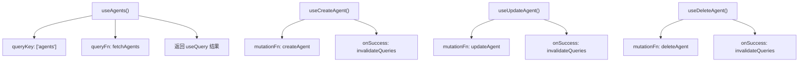
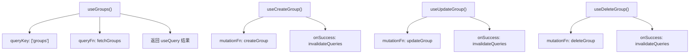
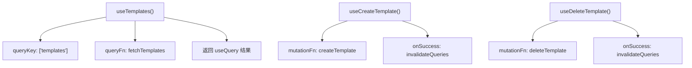

# REST API集成

<cite>
**本文档引用的文件**
- [main.go](file://cmd/council/main.go)
- [agent.go](file://internal/api/handler/agent.go)
- [group.go](file://internal/api/handler/group.go)
- [template.go](file://internal/api/handler/template.go)
- [workflow.go](file://internal/api/handler/workflow.go)
- [workflow_mgmt.go](file://internal/api/handler/workflow_mgmt.go)
- [useAgents.ts](file://frontend/src/hooks/useAgents.ts)
- [useGroups.ts](file://frontend/src/hooks/useGroups.ts)
- [useTemplates.ts](file://frontend/src/hooks/useTemplates.ts)
- [useWorkflow.ts](file://frontend/src/hooks/useWorkflow.ts)
- [agent.ts](file://frontend/src/types/agent.ts)
- [group.ts](file://frontend/src/types/group.ts)
- [template.ts](file://frontend/src/types/template.ts)
- [workflow.ts](file://frontend/src/types/workflow.ts)
- [templates.md](file://docs/api/templates.md)
- [ui_support_v1.5.md](file://docs/api/ui_support_v1.5.md)
</cite>

## 目录
1. [简介](#简介)
2. [核心资源CRUD操作](#核心资源crud操作)
3. [工作流执行与控制](#工作流执行与控制)
4. [前端自定义Hook最佳实践](#前端自定义hook最佳实践)
5. [错误处理机制](#错误处理机制)

## 简介
本文档详细说明了前端如何通过HTTP协议与后端进行同步通信，涵盖智能体管理、群组操作、工作流模板及工作流创建与启动等核心功能的REST API集成。文档提供了使用fetch或axios的实际代码示例，并结合自定义Hook阐述数据获取、缓存更新和状态同步的最佳实践。

**Section sources**
- [main.go](file://cmd/council/main.go#L1-L150)

## 核心资源CRUD操作

### 智能体管理
支持对智能体资源的完整CRUD操作，包括创建、读取、更新和删除。

**API端点**
- `GET /api/v1/agents` - 获取智能体列表
- `POST /api/v1/agents` - 创建智能体
- `GET /api/v1/agents/:id` - 获取特定智能体
- `PUT /api/v1/agents/:id` - 更新智能体
- `DELETE /api/v1/agents/:id` - 删除智能体

**请求示例（使用fetch）**
```javascript
// 创建智能体
const createAgent = async (agentData) => {
  const response = await fetch('/api/v1/agents', {
    method: 'POST',
    headers: {
      'Content-Type': 'application/json',
      'Authorization': 'Bearer <token>'
    },
    body: JSON.stringify(agentData)
  });
  
  if (!response.ok) {
    throw new Error('创建智能体失败');
  }
  
  return response.json();
};
```

**Section sources**
- [agent.go](file://internal/api/handler/agent.go#L19-L98)
- [useAgents.ts](file://frontend/src/hooks/useAgents.ts#L22-L33)
- [agent.ts](file://frontend/src/types/agent.ts#L15-L35)

### 群组操作
提供对群组资源的管理接口，支持基本的增删改查功能。

**API端点**
- `GET /api/v1/groups` - 获取群组列表
- `POST /api/v1/groups` - 创建群组
- `GET /api/v1/groups/:id` - 获取特定群组
- `PUT /api/v1/groups/:id` - 更新群组
- `DELETE /api/v1/groups/:id` - 删除群组

**请求示例（使用axios）**
```javascript
// 获取群组列表
const getGroups = async () => {
  try {
    const response = await axios.get('/api/v1/groups', {
      headers: {
        'Authorization': `Bearer ${token}`
      }
    });
    return response.data;
  } catch (error) {
    console.error('获取群组失败:', error);
    throw error;
  }
};
```

**Section sources**
- [group.go](file://internal/api/handler/group.go#L19-L98)
- [useGroups.ts](file://frontend/src/hooks/useGroups.ts#L6-L12)
- [group.ts](file://frontend/src/types/group.ts#L1-L17)

### 工作流模板管理
支持工作流模板的保存、读取和实例化操作。

**API端点**
- `GET /api/v1/templates` - 获取模板列表
- `POST /api/v1/templates` - 创建模板
- `GET /api/v1/templates/:id` - 获取模板详情
- `DELETE /api/v1/templates/:id` - 删除模板
- `POST /api/v1/templates/:id/instantiate` - 从模板创建工作流

**请求示例**
```javascript
// 保存工作流为模板
const saveAsTemplate = async (templateData) => {
  const response = await fetch('/api/v1/templates', {
    method: 'POST',
    headers: {
      'Content-Type': 'application/json',
      'Authorization': 'Bearer <token>'
    },
    body: JSON.stringify(templateData)
  });
  
  if (!response.ok) {
    throw new Error('保存模板失败');
  }
  
  return response.json();
};
```

**Section sources**
- [template.go](file://internal/api/handler/template.go#L20-L67)
- [templates.md](file://docs/api/templates.md#L42-L227)
- [useTemplates.ts](file://frontend/src/hooks/useTemplates.ts#L14-L25)
- [template.ts](file://frontend/src/types/template.ts#L5-L22)

## 工作流执行与控制

### 工作流创建与启动
支持创建工作流并启动执行。

**API端点**
- `POST /api/v1/workflows/execute` - 启动工作流执行

**请求示例**
```javascript
// 启动工作流
const startWorkflow = async (workflowId, input) => {
  const response = await fetch('/api/v1/workflows/execute', {
    method: 'POST',
    headers: {
      'Content-Type': 'application/json',
      'Authorization': 'Bearer <token>'
    },
    body: JSON.stringify({
      workflow_id: workflowId,
      input: { initial_prompt: input }
    })
  });
  
  if (!response.ok) {
    throw new Error('启动工作流失败');
  }
  
  return response.json();
};
```

### 工作流控制
提供对运行中工作流的控制功能。

**API端点**
- `POST /api/v1/sessions/:id/control` - 控制工作流（暂停/恢复/停止）

**请求示例**
```javascript
// 暂停工作流
const pauseWorkflow = async (sessionId) => {
  const response = await fetch(`/api/v1/sessions/${sessionId}/control`, {
    method: 'POST',
    headers: {
      'Content-Type': 'application/json',
      'Authorization': 'Bearer <token>'
    },
    body: JSON.stringify({ action: 'pause' })
  });
  
  if (!response.ok) {
    throw new Error('暂停工作流失败');
  }
  
  return response.json();
};
```

**Section sources**
- [workflow.go](file://internal/api/handler/workflow.go#L58-L123)
- [workflow_mgmt.go](file://internal/api/handler/workflow_mgmt.go#L69-L86)
- [useWorkflow.ts](file://frontend/src/hooks/useWorkflow.ts#L50-L69)

## 前端自定义Hook最佳实践

### useAgents Hook
封装智能体相关的数据获取和状态管理逻辑。



**Diagram sources**
- [useAgents.ts](file://frontend/src/hooks/useAgents.ts#L58-L103)

### useGroups Hook
管理群组资源的数据获取和变更。



**Diagram sources**
- [useGroups.ts](file://frontend/src/hooks/useGroups.ts#L62-L107)

### useTemplates Hook
处理模板相关的数据操作。



**Diagram sources**
- [useTemplates.ts](file://frontend/src/hooks/useTemplates.ts#L37-L63)

### 数据获取与缓存更新策略
采用React Query进行数据获取和缓存管理，确保数据的一致性和实时性。

**最佳实践**
1. 使用`queryKey`进行数据缓存标识
2. 在mutation成功后调用`invalidateQueries`刷新相关数据
3. 合理设置缓存时间和重试策略
4. 使用`enabled`选项控制查询的执行条件

**Section sources**
- [useAgents.ts](file://frontend/src/hooks/useAgents.ts#L58-L103)
- [useGroups.ts](file://frontend/src/hooks/useGroups.ts#L62-L107)
- [useTemplates.ts](file://frontend/src/hooks/useTemplates.ts#L37-L63)

## 错误处理机制

### HTTP状态码处理
对常见的HTTP错误状态码进行捕获和处理。

**常见错误码**
- `400 Bad Request` - 请求参数错误
- `401 Unauthorized` - 认证失败
- `403 Forbidden` - 权限不足
- `404 Not Found` - 资源不存在
- `500 Internal Server Error` - 服务器内部错误
- `502 Bad Gateway` - 网关错误

### 前端错误处理示例
```javascript
// 统一错误处理
const handleApiError = (error) => {
  if (error.response) {
    // 服务器返回了错误响应
    switch (error.response.status) {
      case 401:
        // 重定向到登录页
        window.location.href = '/login';
        break;
      case 403:
        showToast('权限不足，无法执行此操作');
        break;
      case 404:
        showToast('请求的资源不存在');
        break;
      case 500:
        showToast('服务器内部错误，请稍后重试');
        break;
      default:
        showToast(`请求失败: ${error.response.data.error || error.message}`);
    }
  } else if (error.request) {
    // 请求已发出但没有收到响应
    showToast('网络连接失败，请检查网络设置');
  } else {
    // 其他错误
    showToast(`请求错误: ${error.message}`);
  }
};
```

**Section sources**
- [useAgents.ts](file://frontend/src/hooks/useAgents.ts#L28-L31)
- [useGroups.ts](file://frontend/src/hooks/useGroups.ts#L30-L33)
- [useTemplates.ts](file://frontend/src/hooks/useTemplates.ts#L20-L23)
- [useWorkflow.ts](file://frontend/src/hooks/useWorkflow.ts#L65-L67)