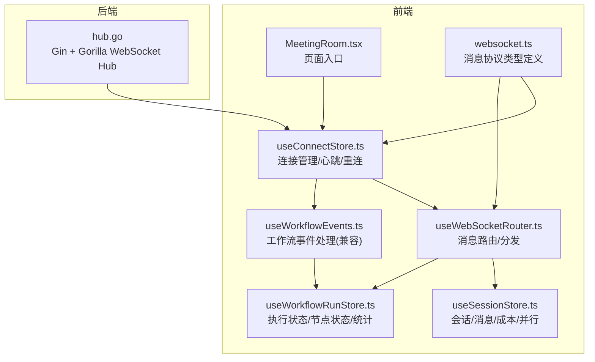
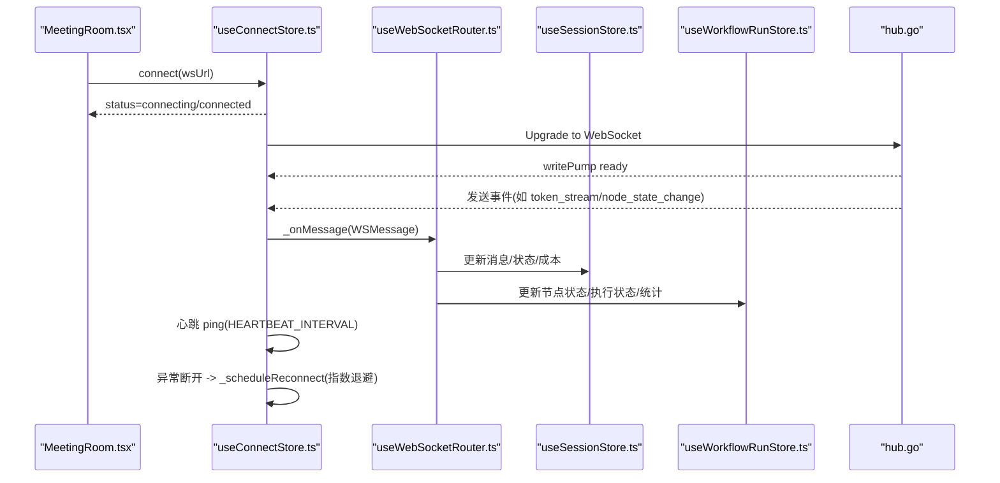
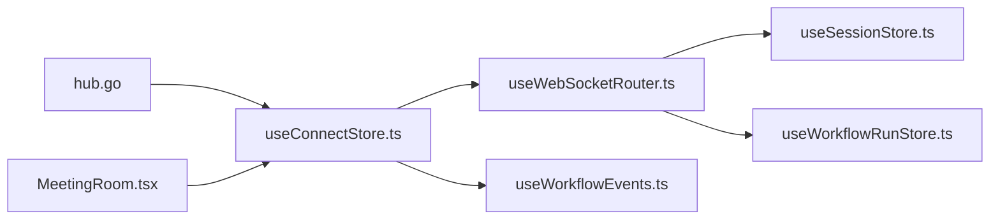
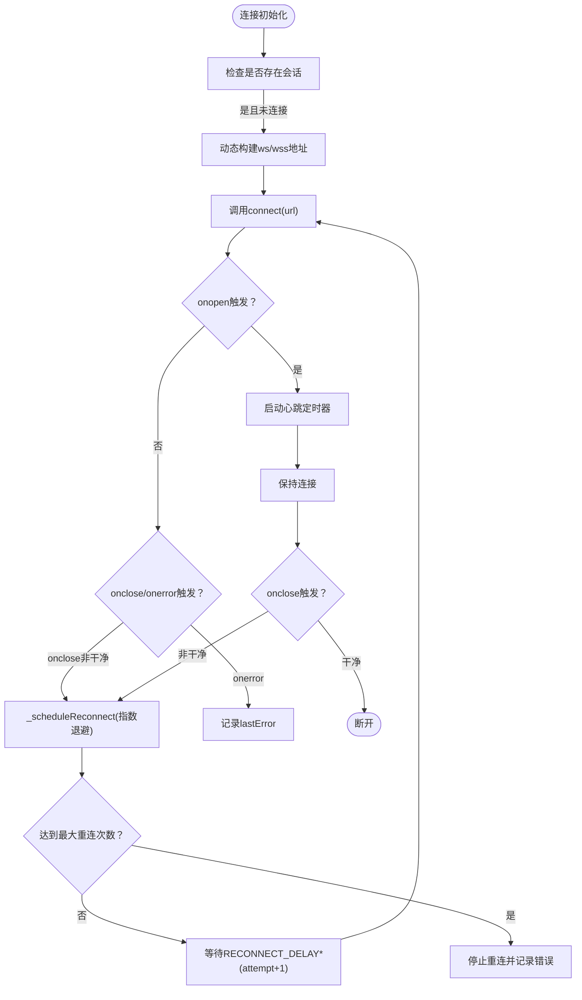

# WebSocket实时通信

<cite>
**本文引用的文件**
- [websocket.ts](file://frontend/src/types/websocket.ts)
- [useConnectStore.ts](file://frontend/src/stores/useConnectStore.ts)
- [useWebSocketRouter.ts](file://frontend/src/hooks/useWebSocketRouter.ts)
- [useWorkflowEvents.ts](file://frontend/src/hooks/useWorkflowEvents.ts)
- [useSessionStore.ts](file://frontend/src/stores/useSessionStore.ts)
- [useWorkflowRunStore.ts](file://frontend/src/stores/useWorkflowRunStore.ts)
- [MeetingRoom.tsx](file://frontend/src/features/meeting/MeetingRoom.tsx)
- [hub.go](file://internal/api/ws/hub.go)
- [SPEC-703-session-ws-connect-fix.md](file://docs/specs/sprint7/SPEC-703-session-ws-connect-fix.md)
- [SPEC-005-websocket-optimization.md](file://docs/specs/sprint1/SPEC-005-websocket-optimization.md)
- [2025-12-21-websocket-debugging-report.md](file://docs/reports/debugging/2025-12-21-websocket-debugging-report.md)
</cite>

## 目录
1. [简介](#简介)
2. [项目结构](#项目结构)
3. [核心组件](#核心组件)
4. [架构总览](#架构总览)
5. [详细组件分析](#详细组件分析)
6. [依赖关系分析](#依赖关系分析)
7. [性能考量](#性能考量)
8. [故障排查指南](#故障排查指南)
9. [结论](#结论)
10. [附录](#附录)

## 简介
本文件系统性梳理前端与后端之间的WebSocket全双工通信机制，围绕以下目标展开：
- 通过useWebSocketRouter初始化连接并订阅消息，驱动UI实时更新（聊天面板、成本估算、执行进度等）
- 解释消息协议格式与事件类型（如token_stream、node_state_change、token_usage、execution:paused、execution:completed、error、human_interaction_required、node_resumed）
- 实现自动重连与心跳保活
- 说明连接生命周期管理（打开、关闭、错误）、消息解析与序列化
- 提供异常处理与断线重连的实践路径与参考示例

## 项目结构
前端采用Zustand状态管理与自定义Hook解耦连接、路由与业务Store；后端基于Gin + Gorilla WebSocket实现Hub广播模型。

图表来源
- [MeetingRoom.tsx](file://frontend/src/features/meeting/MeetingRoom.tsx#L120-L136)
- [useConnectStore.ts](file://frontend/src/stores/useConnectStore.ts#L40-L124)
- [useWebSocketRouter.ts](file://frontend/src/hooks/useWebSocketRouter.ts#L1-L126)
- [useWorkflowEvents.ts](file://frontend/src/hooks/useWorkflowEvents.ts#L1-L83)
- [useSessionStore.ts](file://frontend/src/stores/useSessionStore.ts#L1-L200)
- [useWorkflowRunStore.ts](file://frontend/src/stores/useWorkflowRunStore.ts#L1-L200)
- [websocket.ts](file://frontend/src/types/websocket.ts#L1-L52)
- [hub.go](file://internal/api/ws/hub.go#L1-L125)

章节来源
- [MeetingRoom.tsx](file://frontend/src/features/meeting/MeetingRoom.tsx#L120-L136)
- [useConnectStore.ts](file://frontend/src/stores/useConnectStore.ts#L40-L124)
- [useWebSocketRouter.ts](file://frontend/src/hooks/useWebSocketRouter.ts#L1-L126)
- [useWorkflowEvents.ts](file://frontend/src/hooks/useWorkflowEvents.ts#L1-L83)
- [useSessionStore.ts](file://frontend/src/stores/useSessionStore.ts#L1-L200)
- [useWorkflowRunStore.ts](file://frontend/src/stores/useWorkflowRunStore.ts#L1-L200)
- [websocket.ts](file://frontend/src/types/websocket.ts#L1-L52)
- [hub.go](file://internal/api/ws/hub.go#L1-L125)

## 核心组件
- 连接管理与心跳重连：useConnectStore
- 消息路由与分发：useWebSocketRouter
- 工作流事件处理（兼容旧实现）：useWorkflowEvents
- 会话与消息流：useSessionStore
- 执行状态与统计：useWorkflowRunStore
- 消息协议类型：websocket.ts
- 后端Hub与升级：hub.go

章节来源
- [useConnectStore.ts](file://frontend/src/stores/useConnectStore.ts#L40-L124)
- [useWebSocketRouter.ts](file://frontend/src/hooks/useWebSocketRouter.ts#L1-L126)
- [useWorkflowEvents.ts](file://frontend/src/hooks/useWorkflowEvents.ts#L1-L83)
- [useSessionStore.ts](file://frontend/src/stores/useSessionStore.ts#L1-L200)
- [useWorkflowRunStore.ts](file://frontend/src/stores/useWorkflowRunStore.ts#L1-L200)
- [websocket.ts](file://frontend/src/types/websocket.ts#L1-L52)
- [hub.go](file://internal/api/ws/hub.go#L1-L125)

## 架构总览
前端通过MeetingRoom在会话存在且未连接时自动发起WebSocket连接；useConnectStore负责连接生命周期、心跳保活与指数退避重连；useWebSocketRouter统一接收并分发消息到会话与执行状态Store；后端Hub将工作流事件广播给所有客户端。

图表来源
- [MeetingRoom.tsx](file://frontend/src/features/meeting/MeetingRoom.tsx#L120-L136)
- [useConnectStore.ts](file://frontend/src/stores/useConnectStore.ts#L40-L124)
- [useWebSocketRouter.ts](file://frontend/src/hooks/useWebSocketRouter.ts#L1-L126)
- [useSessionStore.ts](file://frontend/src/stores/useSessionStore.ts#L1-L200)
- [useWorkflowRunStore.ts](file://frontend/src/stores/useWorkflowRunStore.ts#L1-L200)
- [hub.go](file://internal/api/ws/hub.go#L1-L125)

## 详细组件分析

### 连接管理与心跳重连（useConnectStore）
- 职责
  - 管理WebSocket实例与连接状态（disconnected/connecting/connected/reconnecting）
  - 心跳保活：周期性发送ping命令
  - 断线重连：指数退避，最多尝试N次
  - 消息解析：JSON.parse后通过内部_lastMessage暴露给路由层
- 关键行为
  - onopen：状态切换为connected，启动心跳
  - onclose：若非干净关闭，触发重连调度
  - onerror：记录lastError
  - onmessage：解析WSMessage并设置_lastMessage
  - send：仅在connected状态下发送命令
- 重连策略
  - 最大尝试次数与延迟系数可配置
  - 重连定时器在disconnect时清理

章节来源
- [useConnectStore.ts](file://frontend/src/stores/useConnectStore.ts#L40-L124)

### 消息路由与分发（useWebSocketRouter）
- 职责
  - 订阅useConnectStore的_lastMessage
  - 根据事件类型分发到会话与执行状态Store
  - 防重复处理（基于event+timestamp组合）
- 主要事件处理
  - token_stream：向会话追加流式消息
  - node_state_change：更新节点状态与活动节点集合，必要时结束消息流
  - node:parallel_start：标记并行节点开始
  - token_usage：更新节点与会话的成本/令牌用量统计
  - execution:paused/completed：更新执行状态
  - human_interaction_required/node_resumed：触发人工审核流程
  - error：更新节点失败状态并打印错误
- 与useWorkflowEvents的关系
  - useWorkflowEvents提供兼容的事件处理逻辑，二者共同保证消息路由的健壮性

章节来源
- [useWebSocketRouter.ts](file://frontend/src/hooks/useWebSocketRouter.ts#L1-L126)
- [useWorkflowEvents.ts](file://frontend/src/hooks/useWorkflowEvents.ts#L1-L83)

### 会话与消息流（useSessionStore）
- 职责
  - 维护当前会话、消息分组、连接状态
  - 追加/合并流式消息，支持并行节点开始
  - 更新节点状态与会话状态
  - 统计token使用与成本
- 关键动作
  - appendMessage：根据isStreaming/isChunk合并消息
  - finalizeMessage：结束某节点的流式消息
  - updateTokenUsage：累计输入/输出/成本
  - handleParallelStart：并行开始时的辅助处理

章节来源
- [useSessionStore.ts](file://frontend/src/stores/useSessionStore.ts#L1-L200)

### 执行状态与统计（useWorkflowRunStore）
- 职责
  - 维护节点状态、活动节点集合、执行状态
  - 统计节点完成数、失败数、总耗时、总成本
  - 人工审核请求与提交
- 关键动作
  - updateNodeStatus：更新节点状态并维护统计
  - updateNodeTokenUsage：累计token与成本
  - setExecutionStatus：更新整体执行状态
  - sendControl：向后端发送控制命令（如pause/resume/stop）

章节来源
- [useWorkflowRunStore.ts](file://frontend/src/stores/useWorkflowRunStore.ts#L1-L200)

### 消息协议与事件类型（websocket.ts）
- 事件类型
  - token_stream：流式输出片段
  - node_state_change：节点状态变更
  - node:parallel_start：并行节点开始
  - token_usage：节点token使用与成本
  - execution:paused/completed：执行状态
  - error：错误
  - human_interaction_required：人工介入请求
  - node_resumed：节点恢复执行
- 数据结构
  - WSMessage：包含event、data、timestamp、node_id
  - TokenStreamData：chunk、agent_id、node_id、is_thinking
  - NodeStateChangeData：node_id、status
  - TokenUsageData：input_tokens、output_tokens、estimated_cost_usd、agent_id
  - ParallelStartData：node_id、branches
  - WSCommand：cmd、data（start_session/pause_session/resume_session/user_input）

章节来源
- [websocket.ts](file://frontend/src/types/websocket.ts#L1-L52)

### 后端Hub与广播（hub.go）
- 职责
  - 维护客户端集合，注册/注销客户端
  - 广播工作流事件到所有客户端
  - 写泵：将事件以JSON编码写入WebSocket
- 关键点
  - 升级HTTP为WebSocket连接
  - 广播通道与并发安全
  - 客户端写队列容量限制与默认丢弃策略

章节来源
- [hub.go](file://internal/api/ws/hub.go#L1-L125)

### 页面入口与自动连接（MeetingRoom.tsx）
- 职责
  - 初始化useWebSocketRouter
  - 在存在会话且连接断开时，动态构建ws/wss地址并调用connect
  - 根据连接状态渲染UI布局与面板

章节来源
- [MeetingRoom.tsx](file://frontend/src/features/meeting/MeetingRoom.tsx#L120-L136)

## 依赖关系分析
- 组件耦合
  - useConnectStore是连接与消息解析的唯一入口，useWebSocketRouter与useWorkflowEvents均依赖其_lastMessage
  - useSessionStore与useWorkflowRunStore分别承担UI与执行状态的更新职责
- 外部依赖
  - 后端通过Gin路由/hub.go ServeWs暴露WebSocket端点
  - 前端通过window.location动态拼接ws/wss地址

图表来源
- [useConnectStore.ts](file://frontend/src/stores/useConnectStore.ts#L40-L124)
- [useWebSocketRouter.ts](file://frontend/src/hooks/useWebSocketRouter.ts#L1-L126)
- [useWorkflowEvents.ts](file://frontend/src/hooks/useWorkflowEvents.ts#L1-L83)
- [useSessionStore.ts](file://frontend/src/stores/useSessionStore.ts#L1-L200)
- [useWorkflowRunStore.ts](file://frontend/src/stores/useWorkflowRunStore.ts#L1-L200)
- [hub.go](file://internal/api/ws/hub.go#L1-L125)
- [MeetingRoom.tsx](file://frontend/src/features/meeting/MeetingRoom.tsx#L120-L136)

## 性能考量
- 心跳保活
  - 周期性发送ping命令，避免中间设备误判空闲断开
- 指数退避重连
  - 避免频繁重试造成服务器压力，同时提升稳定性
- 写队列与默认丢弃
  - Hub侧对写队列有限制，客户端需具备重连与幂等处理能力
- 防重复处理
  - 路由层基于event+timestamp去重，减少重复渲染与状态抖动

[本节为通用指导，无需特定文件引用]

## 故障排查指南
- 消息静默丢失
  - 根因：后端StreamEvent字段名与前端期望不一致
  - 修复：将后端JSON tag从"type"改为"event"，确保前端WSMessage.event可正确解析
- 自动连接缺失
  - 根因：SessionStarter成功后未调用connect建立WebSocket
  - 修复：在initSession后立即connect(wsUrl)，MeetingRoom中增加断线恢复逻辑
- 心跳与断线
  - 现象：偶发断开
  - 处理：确认心跳是否发送、重连阈值是否合理、onclose是否触发_scheduleReconnect

章节来源
- [2025-12-21-websocket-debugging-report.md](file://docs/reports/debugging/2025-12-21-websocket-debugging-report.md#L1-L40)
- [SPEC-703-session-ws-connect-fix.md](file://docs/specs/sprint7/SPEC-703-session-ws-connect-fix.md#L1-L196)
- [useConnectStore.ts](file://frontend/src/stores/useConnectStore.ts#L40-L124)

## 结论
该WebSocket实时通信体系通过“连接管理+消息路由+状态分发”的分层设计，实现了工作流执行过程中的全链路实时反馈。前端以useConnectStore为核心，结合useWebSocketRouter与useWorkflowEvents，将后端Hub推送的多类事件有序地驱动UI更新；后端以Hub为中心，可靠地广播事件至所有客户端。配合心跳与指数退避重连，系统在弱网与异常场景下仍具备较好的鲁棒性。

[本节为总结，无需特定文件引用]

## 附录

### 消息协议与Payload定义
- 事件类型与数据结构
  - token_stream：包含node_id、agent_id、chunk、is_thinking
  - node_state_change：包含node_id、status
  - node:parallel_start：包含node_id、branches
  - token_usage：包含node_id、agent_id、input_tokens、output_tokens、estimated_cost_usd
  - execution:paused/completed：无额外数据
  - error：包含node_id（可选）与error字符串
  - human_interaction_required：包含reason、timeout（可选），以及node_id
  - node_resumed：无额外数据
- 上行命令
  - start_session、pause_session、resume_session、user_input

章节来源
- [websocket.ts](file://frontend/src/types/websocket.ts#L1-L52)

### 连接生命周期与控制流

图表来源
- [useConnectStore.ts](file://frontend/src/stores/useConnectStore.ts#L40-L124)
- [MeetingRoom.tsx](file://frontend/src/features/meeting/MeetingRoom.tsx#L120-L136)

### 异常处理与断线重连实践路径
- 前端
  - 在MeetingRoom中检测会话存在且连接断开时自动connect
  - 使用useConnectStore的心跳与重连机制
  - 在useWebSocketRouter中对重复消息进行去重
- 后端
  - 确保事件字段名为event，避免前端解析失败
  - Hub写泵对异常进行容错，避免阻塞广播

章节来源
- [SPEC-703-session-ws-connect-fix.md](file://docs/specs/sprint7/SPEC-703-session-ws-connect-fix.md#L1-L196)
- [2025-12-21-websocket-debugging-report.md](file://docs/reports/debugging/2025-12-21-websocket-debugging-report.md#L1-L40)
- [useConnectStore.ts](file://frontend/src/stores/useConnectStore.ts#L40-L124)
- [useWebSocketRouter.ts](file://frontend/src/hooks/useWebSocketRouter.ts#L1-L126)
- [hub.go](file://internal/api/ws/hub.go#L1-L125)