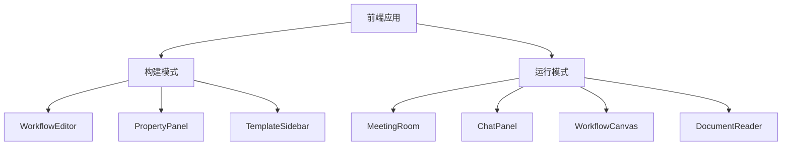
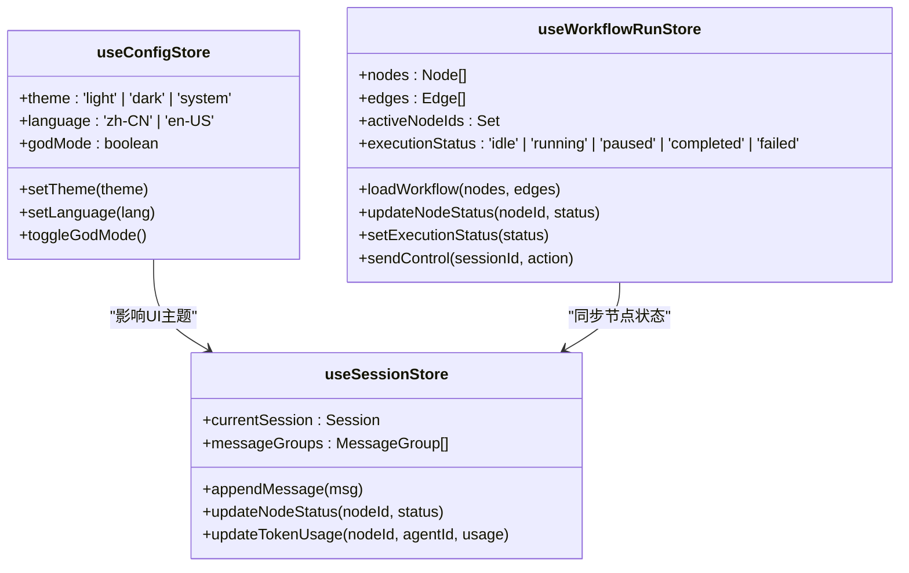
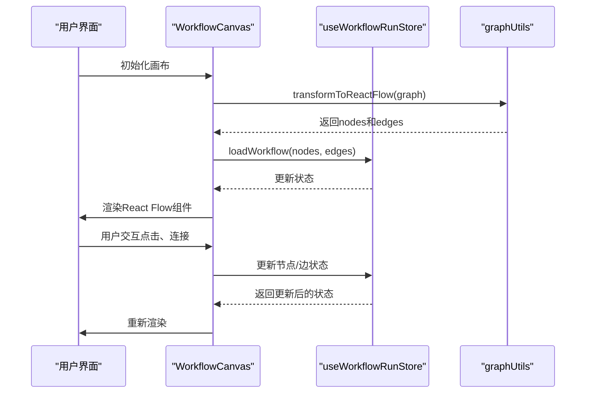
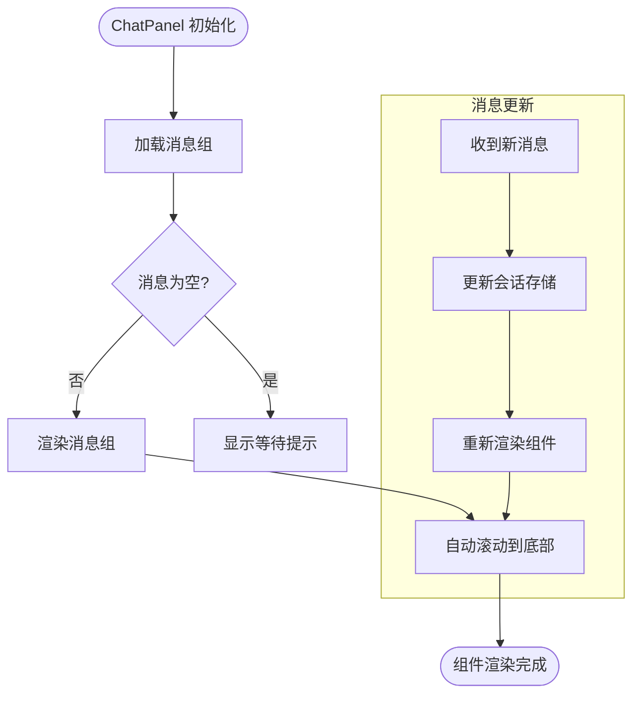
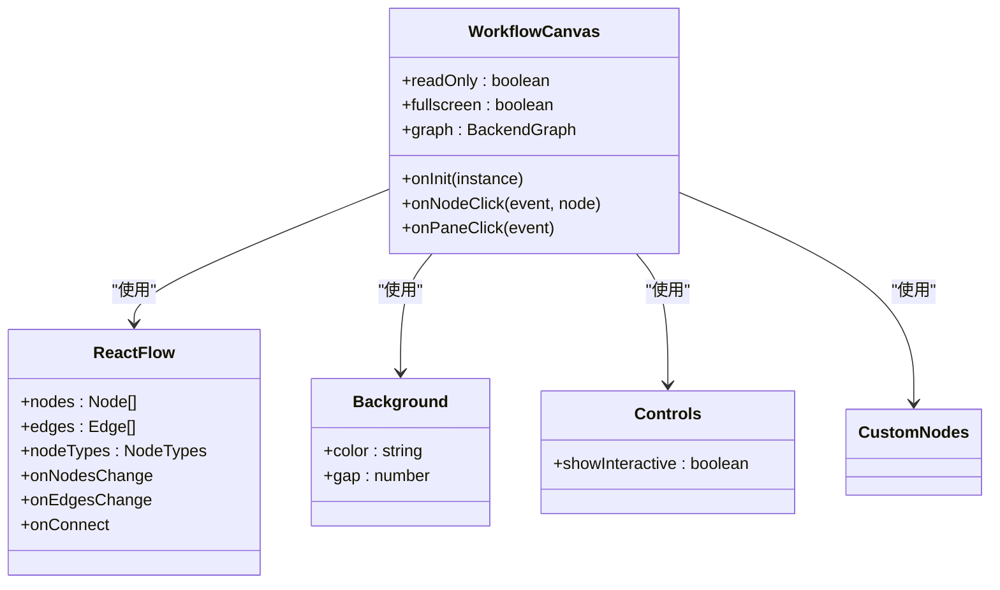
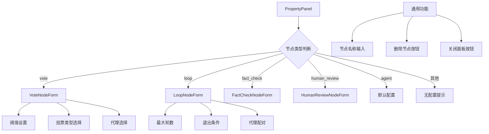
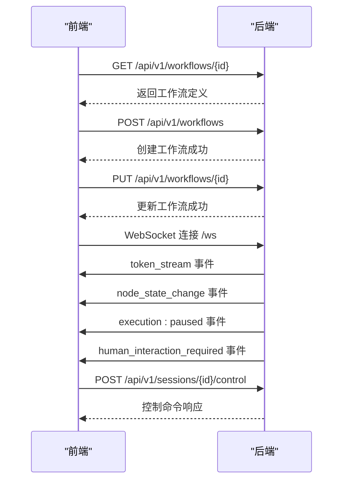
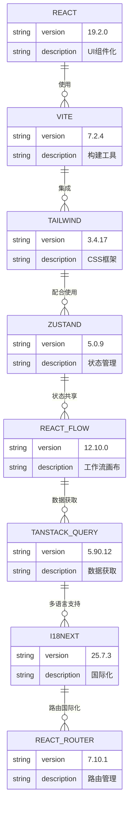
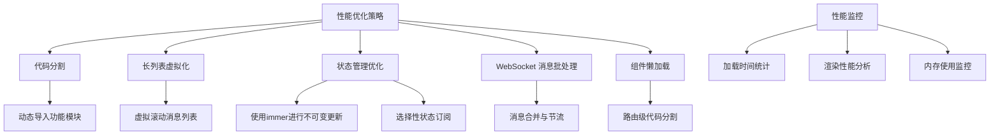

# 前端架构

<cite>
**本文档中引用的文件**  
- [main.tsx](file://frontend/src/main.tsx)
- [App.tsx](file://frontend/src/App.tsx)
- [package.json](file://frontend/package.json)
- [vite.config.ts](file://frontend/vite.config.ts)
- [tailwind.config.js](file://frontend/tailwind.config.js)
- [useConfigStore.ts](file://frontend/src/stores/useConfigStore.ts)
- [useWorkflowRunStore.ts](file://frontend/src/stores/useWorkflowRunStore.ts)
- [WorkflowEditor.tsx](file://frontend/src/features/editor/WorkflowEditor.tsx)
- [MeetingRoom.tsx](file://frontend/src/features/meeting/MeetingRoom.tsx)
- [useWebSocketRouter.ts](file://frontend/src/hooks/useWebSocketRouter.ts)
- [WorkflowCanvas.tsx](file://frontend/src/components/workflow/WorkflowCanvas.tsx)
- [ChatPanel.tsx](file://frontend/src/components/chat/ChatPanel.tsx)
- [PropertyPanel.tsx](file://frontend/src/features/editor/components/PropertyPanel/PropertyPanel.tsx)
- [graphUtils.ts](file://frontend/src/utils/graphUtils.ts)
- [workflow.ts](file://frontend/src/types/workflow.ts)
</cite>

## 目录
1. [引言](#引言)
2. [项目结构](#项目结构)
3. [双模前端设计](#双模前端设计)
4. [状态管理](#状态管理)
5. [工作流画布实现](#工作流画布实现)
6. [核心组件分析](#核心组件分析)
7. [通信机制](#通信机制)
8. [技术栈选型](#技术栈选型)
9. [性能优化策略](#性能优化策略)

## 引言
The Council 前端架构采用双模设计，支持构建模式（Builder）与运行模式（Runner）的分离。系统通过 React、Vite 和 Tailwind CSS 构建现代化用户界面，利用 Zustand 进行全局状态管理，并通过 React Flow 实现可视化工作流编辑。前端通过 REST API 进行配置管理，通过 WebSocket 接收实时执行流，实现了高效、响应式的用户体验。

## 项目结构
The Council 前端项目采用功能模块化组织方式，主要目录结构如下：
- `components/`: 通用UI组件
- `features/`: 功能模块（编辑器、会议、代理、组等）
- `stores/`: Zustand 状态管理
- `hooks/`: 自定义 React Hooks
- `types/`: TypeScript 类型定义
- `utils/`: 工具函数

**Section sources**
- [App.tsx](file://frontend/src/App.tsx#L8-L15)

## 双模前端设计
The Council 前端采用构建模式（Builder）与运行模式（Runner）分离的设计策略。构建模式用于创建工作流，运行模式用于执行和监控工作流。

**Diagram sources**
- [WorkflowEditor.tsx](file://frontend/src/features/editor/WorkflowEditor.tsx#L15-L271)
- [MeetingRoom.tsx](file://frontend/src/features/meeting/MeetingRoom.tsx#L80-L233)

**Section sources**
- [WorkflowEditor.tsx](file://frontend/src/features/editor/WorkflowEditor.tsx#L15-L271)
- [MeetingRoom.tsx](file://frontend/src/features/meeting/MeetingRoom.tsx#L80-L233)

## 状态管理
前端使用 Zustand 进行全局状态管理，实现了轻量级、高效的状态管理方案。主要状态存储包括配置状态、会话状态和工作流运行状态。

**Diagram sources**
- [useConfigStore.ts](file://frontend/src/stores/useConfigStore.ts#L5-L35)
- [useWorkflowRunStore.ts](file://frontend/src/stores/useWorkflowRunStore.ts#L14-L301)

**Section sources**
- [useConfigStore.ts](file://frontend/src/stores/useConfigStore.ts#L5-L35)
- [useWorkflowRunStore.ts](file://frontend/src/stores/useWorkflowRunStore.ts#L14-L301)

## 工作流画布实现
工作流画布基于 React Flow 实现，支持可视化编辑和运行时监控。画布组件根据模式（编辑或运行）动态调整交互行为。

**Diagram sources**
- [WorkflowCanvas.tsx](file://frontend/src/components/workflow/WorkflowCanvas.tsx#L53-L149)
- [graphUtils.ts](file://frontend/src/utils/graphUtils.ts#L20-L131)

**Section sources**
- [WorkflowCanvas.tsx](file://frontend/src/components/workflow/WorkflowCanvas.tsx#L53-L149)
- [graphUtils.ts](file://frontend/src/utils/graphUtils.ts#L20-L131)

## 核心组件分析
### ChatPanel 分析
ChatPanel 组件负责显示会议中的消息流，支持实时更新和自动滚动。

**Diagram sources**
- [ChatPanel.tsx](file://frontend/src/components/chat/ChatPanel.tsx#L10-L77)

**Section sources**
- [ChatPanel.tsx](file://frontend/src/components/chat/ChatPanel.tsx#L10-L77)

### WorkflowCanvas 分析
WorkflowCanvas 组件是工作流可视化的核心，支持编辑和只读两种模式。

**Diagram sources**
- [WorkflowCanvas.tsx](file://frontend/src/components/workflow/WorkflowCanvas.tsx#L53-L149)

**Section sources**
- [WorkflowCanvas.tsx](file://frontend/src/components/workflow/WorkflowCanvas.tsx#L53-L149)

### PropertyPanel 分析
PropertyPanel 组件提供节点属性编辑功能，支持多种节点类型的表单渲染。

**Diagram sources**
- [PropertyPanel.tsx](file://frontend/src/features/editor/components/PropertyPanel/PropertyPanel.tsx#L18-L86)

**Section sources**
- [PropertyPanel.tsx](file://frontend/src/features/editor/components/PropertyPanel/PropertyPanel.tsx#L18-L86)

## 通信机制
前端通过 REST API 进行配置管理，通过 WebSocket 接收实时执行流。

**Diagram sources**
- [useWebSocketRouter.ts](file://frontend/src/hooks/useWebSocketRouter.ts#L13-L126)
- [WorkflowEditor.tsx](file://frontend/src/features/editor/WorkflowEditor.tsx#L69-L133)

**Section sources**
- [useWebSocketRouter.ts](file://frontend/src/hooks/useWebSocketRouter.ts#L13-L126)
- [WorkflowEditor.tsx](file://frontend/src/features/editor/WorkflowEditor.tsx#L69-L133)

## 技术栈选型
### 前端技术栈
The Council 前端采用现代化技术栈，确保开发效率和运行性能。

**Diagram sources**
- [package.json](file://frontend/package.json#L15-L34)
- [vite.config.ts](file://frontend/vite.config.ts#L1-L28)
- [tailwind.config.js](file://frontend/tailwind.config.js#L1-L13)

**Section sources**
- [package.json](file://frontend/package.json#L15-L34)
- [vite.config.ts](file://frontend/vite.config.ts#L1-L28)
- [tailwind.config.js](file://frontend/tailwind.config.js#L1-L13)

## 性能优化策略
前端实现了多种性能优化策略，确保大型工作流的流畅运行。

**Diagram sources**
- [useWorkflowRunStore.ts](file://frontend/src/stores/useWorkflowRunStore.ts#L2-L301)
- [MeetingRoom.tsx](file://frontend/src/features/meeting/MeetingRoom.tsx#L1-L233)
- [ChatPanel.tsx](file://frontend/src/components/chat/ChatPanel.tsx#L1-L77)

**Section sources**
- [useWorkflowRunStore.ts](file://frontend/src/stores/useWorkflowRunStore.ts#L2-L301)
- [MeetingRoom.tsx](file://frontend/src/features/meeting/MeetingRoom.tsx#L1-L233)
- [ChatPanel.tsx](file://frontend/src/components/chat/ChatPanel.tsx#L1-L77)