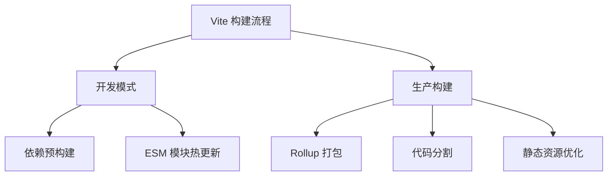
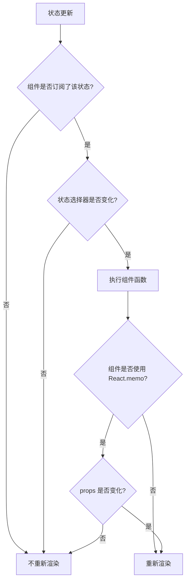
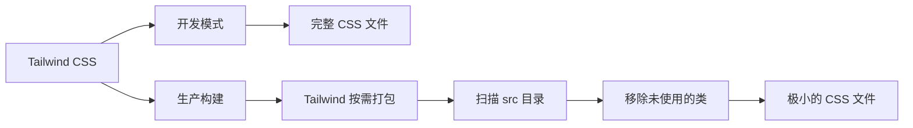

# 性能优化

<cite>
**本文档引用的文件**  
- [vite.config.ts](file://frontend/vite.config.ts)
- [tailwind.config.js](file://frontend/tailwind.config.js)
- [ChatPanel.tsx](file://frontend/src/components/chat/ChatPanel.tsx)
- [MessageBubble.tsx](file://frontend/src/components/chat/MessageBubble.tsx)
- [useWebSocketRouter.ts](file://frontend/src/hooks/useWebSocketRouter.ts)
- [useSessionStore.ts](file://frontend/src/stores/useSessionStore.ts)
- [useWorkflowRunStore.ts](file://frontend/src/stores/useWorkflowRunStore.ts)
- [MeetingRoom.tsx](file://frontend/src/features/meeting/MeetingRoom.tsx)
- [SPEC-503-performance-optimization.md](file://docs/specs/sprint5/SPEC-503-performance-optimization.md)
- [SPEC-003-chat-panel-grouped.md](file://docs/specs/sprint1/SPEC-003-chat-panel-grouped.md)
- [SPEC-803-meeting-ux-optimization.md](file://docs/specs/sprint8/SPEC-803-meeting-ux-optimization.md)
</cite>

## 目录
1. [构建优化](#构建优化)
2. [运行时优化](#运行时优化)
3. [样式优化](#样式优化)
4. [性能分析与监控](#性能分析与监控)

## 构建优化

The Council 前端项目采用 Vite 作为构建工具，通过其现代化的开发服务器和构建流程实现高效的开发体验和生产构建。当前的 `vite.config.ts` 配置文件显示了基础的代理设置和测试环境配置，但尚未显式配置代码分割和依赖预构建等高级优化选项。

尽管配置文件中未明确指定，Vite 默认会对 `node_modules` 中的依赖进行预构建，以提高开发服务器的启动速度。对于代码分割，Vite 支持基于动态导入（`import()`）的自动代码分割，这可以用于路由级别的懒加载，从而减少初始加载的 JavaScript 包体积。

**图表来源**  
- [vite.config.ts](file://frontend/vite.config.ts)

## 运行时优化

### 长消息列表的虚拟滚动

在大型工作流执行过程中，聊天面板（ChatPanel）可能会累积大量消息，导致渲染性能下降。当前的 `ChatPanel.tsx` 组件通过监听 `messageGroups` 数组的变化来触发自动滚动到底部，但未实现虚拟滚动（Virtual Scrolling）。虚拟滚动是一种仅渲染当前视口内可见消息的技术，可以显著减少 DOM 节点数量，从而提升滚动流畅度和整体性能。

### 组件的 Memoization

为避免不必要的重渲染，项目广泛使用了 Zustand 状态管理库。通过使用细粒度的状态选择器（如 `useSessionStore(state => state.messageGroups)`），组件可以仅在相关状态变化时重新渲染。此外，对于纯展示性组件，应使用 `React.memo` 进行包裹。

例如，`MessageBubble.tsx` 组件接收 `content`、`isStreaming` 和 `role` 作为 props，其渲染结果完全由这些 props 决定，因此是 `React.memo` 的理想候选者。同样，`MessageGroupCard` 和 `ParallelMessageRow` 等组件也应进行 memoization 以优化性能。

**图表来源**  
- [ChatPanel.tsx](file://frontend/src/components/chat/ChatPanel.tsx)
- [MessageBubble.tsx](file://frontend/src/components/chat/MessageBubble.tsx)
- [useSessionStore.ts](file://frontend/src/stores/useSessionStore.ts)

### WebSocket 消息的节流与防抖

前端通过 WebSocket 与后端实时通信，接收如 `token_stream`、`node_state_change` 等高频事件。`useWebSocketRouter.ts` 钩子负责路由这些消息并更新相应的状态。

为防止因消息过于频繁而导致状态更新和 UI 重渲染压力过大，应对特定事件进行节流（Throttling）或防抖（Debouncing）处理。例如，对于 `token_stream` 事件，可以设置一个 100ms 的节流周期，将连续的文本流分块合并后再更新到消息内容中，避免对每一条微小的增量都进行状态更新。

## 样式优化

项目采用 Tailwind CSS 作为 CSS 框架，并通过 PostCSS 进行处理。`tailwind.config.js` 文件配置了内容扫描路径，确保只将实际使用的 Tailwind 类打包到最终的 CSS 文件中。

这种“按需打包”（PurgeCSS）的机制是 Tailwind 的核心性能优势之一，它能有效消除未使用的 CSS 规则，显著减少最终 CSS 文件的体积。结合 Vite 的构建流程，可以确保生产环境下的 CSS 资源保持最小化。

**图表来源**  
- [tailwind.config.js](file://frontend/tailwind.config.js)
- [postcss.config.js](file://frontend/postcss.config.js)

## 性能分析与监控

### 性能分析方法

- **React DevTools Profiler**：用于分析组件的渲染性能，识别耗时过长的渲染周期和不必要的重渲染。通过 Profiler 可以验证 `React.memo` 和状态选择器的优化效果。
- **Chrome DevTools Performance Tab**：用于进行完整的性能剖析，分析主线程活动、JavaScript 执行、布局和绘制等，定位性能瓶颈。
- **Lighthouse**：用于评估整体页面性能，包括加载速度、交互性和最佳实践，提供性能评分和优化建议。

### 实际优化案例

**大型工作流渲染优化**：当加载一个包含数十个节点的复杂工作流时，`WorkflowCanvas` 组件可能会出现卡顿。优化策略包括：
1.  对画布中的每个节点组件使用 `React.memo`。
2.  使用 `useCallback` 缓存传递给子组件的事件处理函数。
3.  实现虚拟滚动，仅渲染视口内的节点。

### 性能监控指标

根据 `SPEC-503-performance-optimization.md` 中的性能预算，关键监控指标包括：
- **初始 JavaScript 体积**：目标小于 150KB，以减少加载时间。
- **首次内容绘制 (FCP)**：衡量用户看到页面内容的速度。
- **最大内容绘制 (LCP)**：衡量主要页面内容的加载速度。
- **交互延迟 (INP)**：衡量页面对用户交互的响应速度。
- **累计布局偏移 (CLS)**：衡量页面加载过程中的视觉稳定性。

**本节来源**  
- [SPEC-503-performance-optimization.md](file://docs/specs/sprint5/SPEC-503-performance-optimization.md)
- [MeetingRoom.tsx](file://frontend/src/features/meeting/MeetingRoom.tsx)
- [useWorkflowRunStore.ts](file://frontend/src/stores/useWorkflowRunStore.ts)