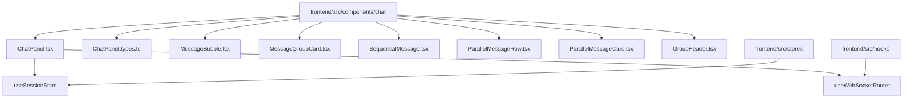
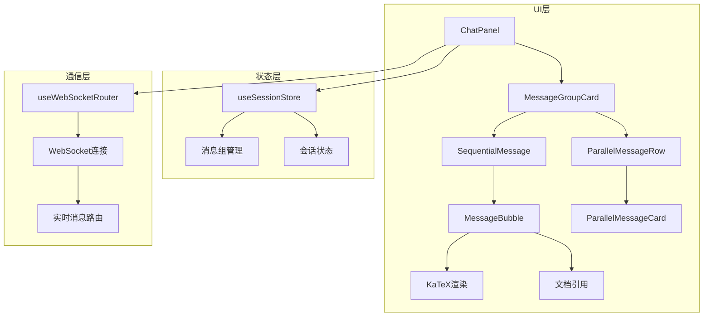
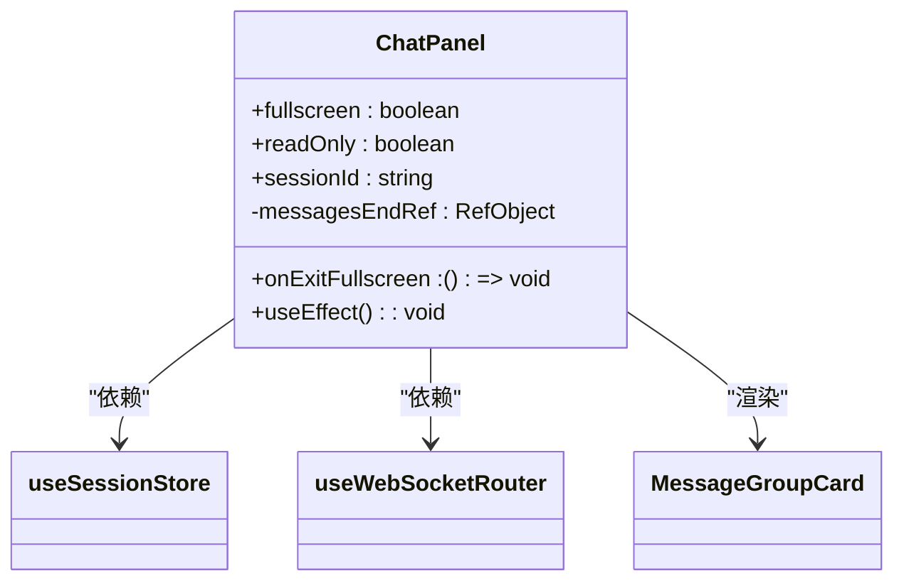
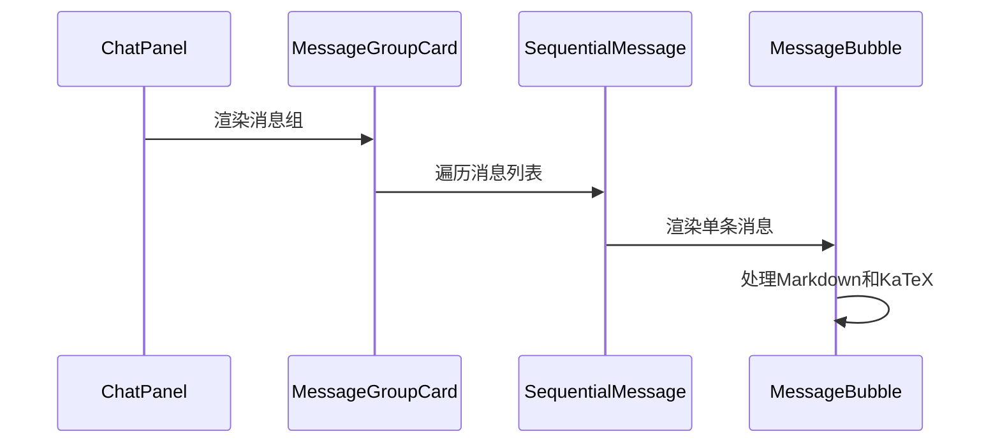
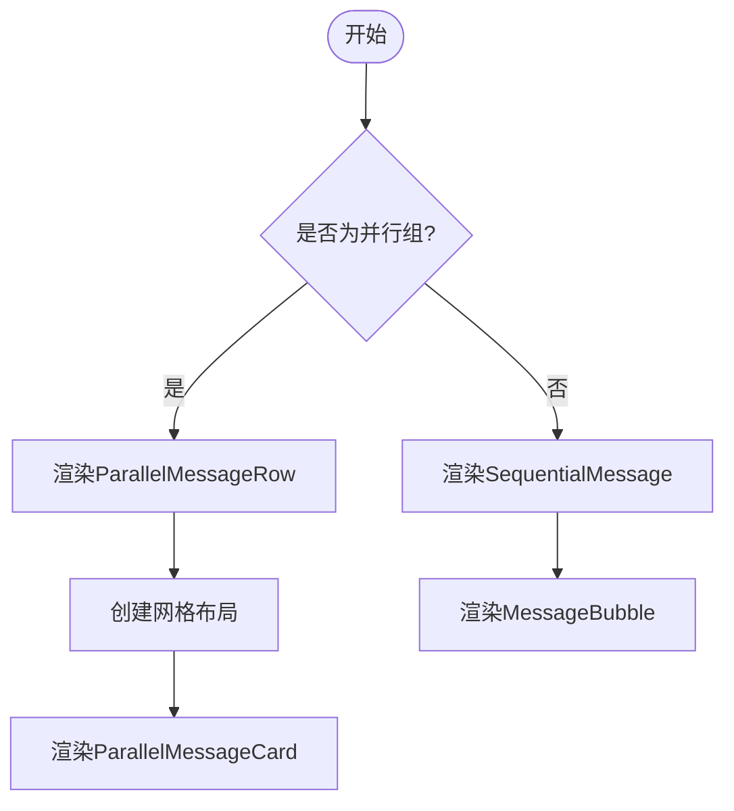
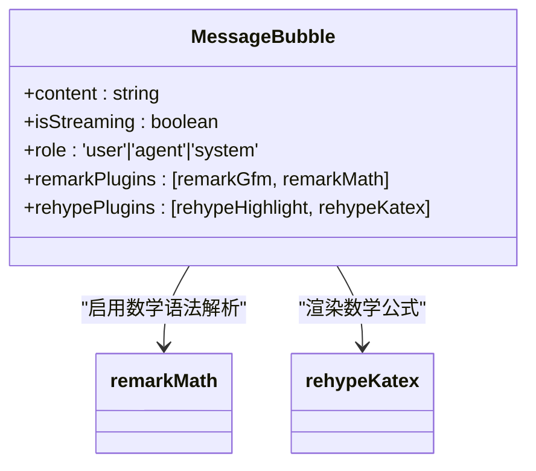
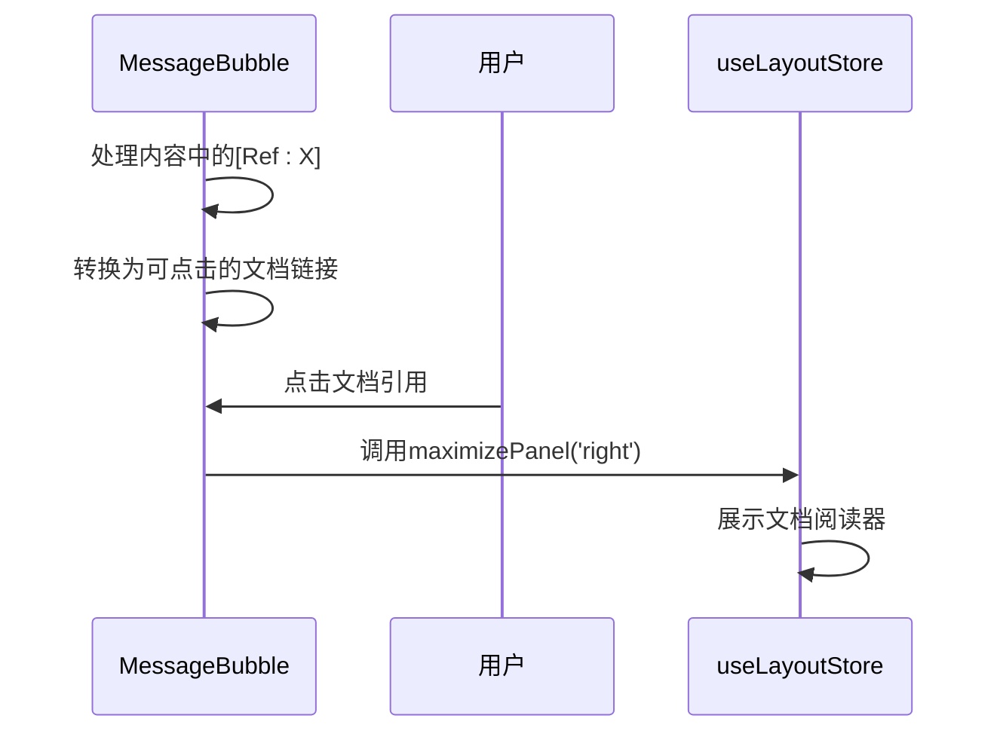
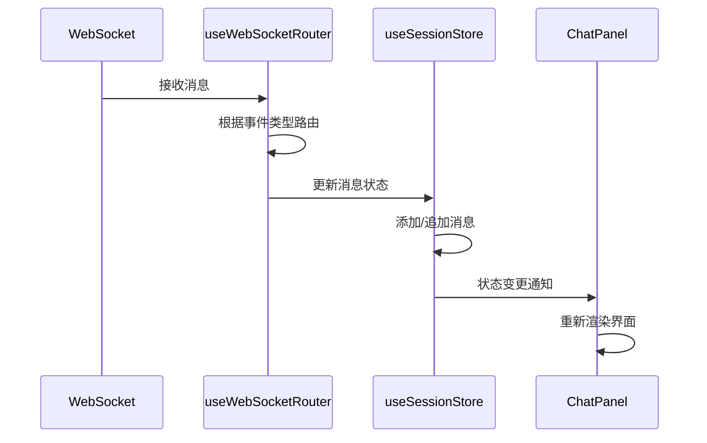
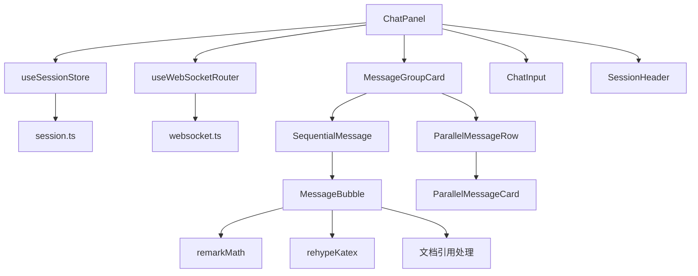

# ChatPanel组件

<cite>
**本文档引用文件**  
- [ChatPanel.tsx](file://frontend/src/components/chat/ChatPanel.tsx)
- [ChatPanel.types.ts](file://frontend/src/components/chat/ChatPanel.types.ts)
- [useWebSocketRouter.ts](file://frontend/src/hooks/useWebSocketRouter.ts)
- [MessageBubble.tsx](file://frontend/src/components/chat/MessageBubble.tsx)
- [session.ts](file://frontend/src/types/session.ts)
- [useSessionStore.ts](file://frontend/src/stores/useSessionStore.ts)
- [MeetingRoom.tsx](file://frontend/src/features/meeting/MeetingRoom.tsx)
- [SPEC-305-katex-rendering.md](file://docs/specs/sprint4/SPEC-305-katex-rendering.md)
- [SPEC-303-document-reference.md](file://docs/specs/sprint4/SPEC-303-document-reference.md)
</cite>

## 目录
1. [简介](#简介)
2. [项目结构](#项目结构)
3. [核心组件](#核心组件)
4. [架构概述](#架构概述)
5. [详细组件分析](#详细组件分析)
6. [依赖分析](#依赖分析)
7. [性能考虑](#性能考虑)
8. [故障排除指南](#故障排除指南)
9. [结论](#结论)

## 简介
ChatPanel组件是会议系统中的核心消息展示区域，负责渲染多智能体协作过程中产生的并行与串行消息流。该组件通过WebSocket实时接收消息更新，并支持KaTeX数学公式渲染和文档引用功能。作为会议房间(MeetingRoom)的重要组成部分，它实现了消息分组、自动滚动、全屏模式等关键特性，为用户提供流畅的交互体验。

## 项目结构
ChatPanel组件位于前端源码的聊天模块中，与其他UI组件和状态管理模块紧密协作。



**图示来源**  
- [ChatPanel.tsx](file://frontend/src/components/chat/ChatPanel.tsx)
- [useSessionStore.ts](file://frontend/src/stores/useSessionStore.ts)
- [useWebSocketRouter.ts](file://frontend/src/hooks/useWebSocketRouter.ts)

**本节来源**  
- [ChatPanel.tsx](file://frontend/src/components/chat/ChatPanel.tsx)
- [useSessionStore.ts](file://frontend/src/stores/useSessionStore.ts)

## 核心组件
ChatPanel作为消息展示的核心容器，通过集成useWebSocketRouter钩子实现与后端的实时通信。它从useSessionStore获取消息组数据，并根据消息流的并行或串行特性进行分组渲染。组件支持全屏模式切换和只读模式，能够适应不同的使用场景。

**本节来源**  
- [ChatPanel.tsx](file://frontend/src/components/chat/ChatPanel.tsx)
- [useWebSocketRouter.ts](file://frontend/src/hooks/useWebSocketRouter.ts)

## 架构概述
ChatPanel组件采用分层架构设计，各层级职责分明：



**图示来源**  
- [ChatPanel.tsx](file://frontend/src/components/chat/ChatPanel.tsx)
- [useSessionStore.ts](file://frontend/src/stores/useSessionStore.ts)
- [useWebSocketRouter.ts](file://frontend/src/hooks/useWebSocketRouter.ts)

## 详细组件分析
### ChatPanel组件分析
ChatPanel组件是消息展示的主容器，负责协调消息渲染、状态管理和用户交互。

#### 组件属性定义
```typescript
export interface ChatPanelProps {
    /**
     * 全屏模式
     */
    fullscreen?: boolean;

    /**
     * 退出全屏回调
     */
    onExitFullscreen?: () => void;

    /**
     * 只读模式 (禁用输入框)
     */
    readOnly?: boolean;

    /**
     * Session ID (用于发送用户消息)
     */
    sessionId?: string;
}
```

**本节来源**  
- [ChatPanel.types.ts](file://frontend/src/components/chat/ChatPanel.types.ts)

#### 内部状态管理
ChatPanel组件本身不维护复杂状态，而是通过useSessionStore从全局状态中获取消息组数据。组件使用useRef创建对消息容器的引用，以实现自动滚动到底部的功能。



**图示来源**  
- [ChatPanel.tsx](file://frontend/src/components/chat/ChatPanel.tsx)
- [useSessionStore.ts](file://frontend/src/stores/useSessionStore.ts)
- [useWebSocketRouter.ts](file://frontend/src/hooks/useWebSocketRouter.ts)

**本节来源**  
- [ChatPanel.tsx](file://frontend/src/components/chat/ChatPanel.tsx)

### 消息渲染机制
#### 串行消息流处理
对于串行执行的节点，ChatPanel通过MessageGroupCard组件渲染消息组，每个消息组包含一个或多个按时间顺序排列的消息。



**图示来源**  
- [ChatPanel.tsx](file://frontend/src/components/chat/ChatPanel.tsx)
- [MessageGroupCard.tsx](file://frontend/src/components/chat/MessageGroupCard.tsx)
- [SequentialMessage.tsx](file://frontend/src/components/chat/SequentialMessage.tsx)
- [MessageBubble.tsx](file://frontend/src/components/chat/MessageBubble.tsx)

#### 并行消息流处理
当工作流进入并行执行阶段时，ChatPanel会渲染特殊的并行消息组，将多个分支的消息并排展示。



**图示来源**  
- [MessageGroupCard.tsx](file://frontend/src/components/chat/MessageGroupCard.tsx)
- [ParallelMessageRow.tsx](file://frontend/src/components/chat/ParallelMessageRow.tsx)
- [ParallelMessageCard.tsx](file://frontend/src/components/chat/ParallelMessageCard.tsx)

**本节来源**  
- [MessageGroupCard.tsx](file://frontend/src/components/chat/MessageGroupCard.tsx)
- [ParallelMessageRow.tsx](file://frontend/src/components/chat/ParallelMessageRow.tsx)

### KaTeX数学公式渲染
ChatPanel通过MessageBubble组件支持KaTeX数学公式渲染，满足科学计算和数学表达的需求。



**图示来源**  
- [MessageBubble.tsx](file://frontend/src/components/chat/MessageBubble.tsx)
- [SPEC-305-katex-rendering.md](file://docs/specs/sprint4/SPEC-305-katex-rendering.md)

### 文档引用功能
组件支持文档引用标记的解析和交互，用户可以点击引用链接跳转到相关文档。



**图示来源**  
- [MessageBubble.tsx](file://frontend/src/components/chat/MessageBubble.tsx)
- [SPEC-303-document-reference.md](file://docs/specs/sprint4/SPEC-303-document-reference.md)

**本节来源**  
- [MessageBubble.tsx](file://frontend/src/components/chat/MessageBubble.tsx)

### WebSocket集成机制
ChatPanel通过useWebSocketRouter钩子与WebSocket通信机制集成，实现实时消息更新。



**图示来源**  
- [useWebSocketRouter.ts](file://frontend/src/hooks/useWebSocketRouter.ts)
- [useSessionStore.ts](file://frontend/src/stores/useSessionStore.ts)
- [ChatPanel.tsx](file://frontend/src/components/chat/ChatPanel.tsx)

**本节来源**  
- [useWebSocketRouter.ts](file://frontend/src/hooks/useWebSocketRouter.ts)

## 依赖分析
ChatPanel组件依赖多个核心模块，形成完整的消息展示系统。



**图示来源**  
- [ChatPanel.tsx](file://frontend/src/components/chat/ChatPanel.tsx)
- [useSessionStore.ts](file://frontend/src/stores/useSessionStore.ts)
- [useWebSocketRouter.ts](file://frontend/src/hooks/useWebSocketRouter.ts)

**本节来源**  
- [ChatPanel.tsx](file://frontend/src/components/chat/ChatPanel.tsx)
- [useSessionStore.ts](file://frontend/src/stores/useSessionStore.ts)

## 性能考虑
ChatPanel组件在设计时考虑了多项性能优化策略：
- 使用React.memo对子组件进行记忆化处理，避免不必要的重渲染
- 通过useRef保持对DOM元素的引用，减少查找开销
- 利用Zustand状态管理库的细粒度订阅，确保只有相关组件才会重新渲染
- 对长消息列表采用虚拟滚动的潜在优化方案（当前为简单滚动）

## 故障排除指南
### 消息未更新
检查WebSocket连接状态和useWebSocketRouter是否正确初始化。确保后端服务正在发送正确的事件类型。

### 数学公式未渲染
确认消息内容中的数学公式语法正确，且remarkMath和rehypeKatex插件已正确配置。

### 并行消息显示异常
检查消息组的isParallel标志是否正确设置，以及并行分支的节点ID是否准确传递。

**本节来源**  
- [useWebSocketRouter.ts](file://frontend/src/hooks/useWebSocketRouter.ts)
- [MessageBubble.tsx](file://frontend/src/components/chat/MessageBubble.tsx)
- [useSessionStore.ts](file://frontend/src/stores/useSessionStore.ts)

## 结论
ChatPanel组件作为多智能体协作系统的核心消息展示组件，成功实现了复杂的消息流处理、实时通信集成和富文本渲染功能。通过合理的架构设计和组件拆分，该组件具有良好的可维护性和扩展性，为用户提供直观、流畅的交互体验。未来可进一步优化性能，支持更多类型的富媒体内容展示。