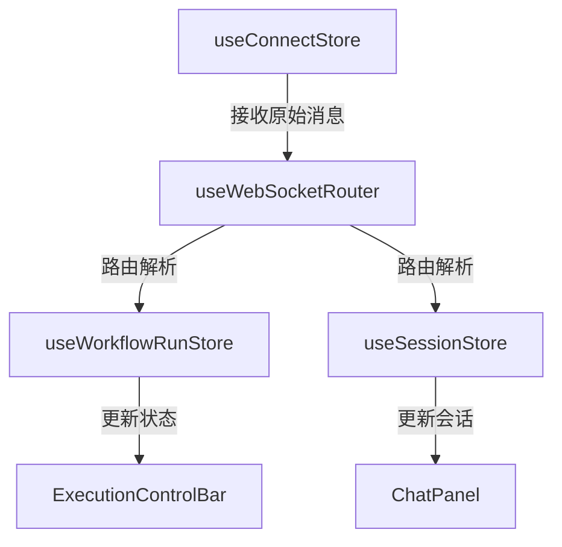
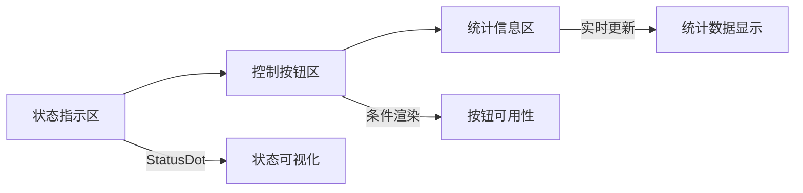

# ExecutionControlBar组件

<cite>
**本文档引用的文件**
- [ExecutionControlBar.tsx](file://frontend/src/components/meeting/ExecutionControlBar.tsx)
- [useWorkflowRunStore.ts](file://frontend/src/stores/useWorkflowRunStore.ts)
- [useWorkflowEvents.ts](file://frontend/src/hooks/useWorkflowEvents.ts)
- [MeetingRoom.tsx](file://frontend/src/features/meeting/MeetingRoom.tsx)
- [useConnectStore.ts](file://frontend/src/stores/useConnectStore.ts)
- [workflow-run.ts](file://frontend/src/types/workflow-run.ts)
- [websocket.ts](file://frontend/src/types/websocket.ts)
- [StatusDot.tsx](file://frontend/src/components/ui/StatusDot.tsx)
- [SPEC-005-websocket-optimization.md](file://docs/specs/sprint1/SPEC-005-websocket-optimization.md)
- [SPEC-703-session-ws-connect-fix.md](file://docs/specs/sprint7/SPEC-703-session-ws-connect-fix.md)
</cite>

## 目录
1. [简介](#简介)
2. [核心控制功能](#核心控制功能)
3. [状态管理机制](#状态管理机制)
4. [实时通信机制](#实时通信机制)
5. [集成与扩展](#集成与扩展)
6. [组件结构与UI设计](#组件结构与ui设计)
7. [结论](#结论)

## 简介
ExecutionControlBar执行控制栏组件是会议执行过程中的核心控制界面，提供启动、暂停、继续、停止等关键操作按钮。该组件通过状态管理器监控工作流运行状态，并通过WebSocket与后端实时通信，确保控制命令的即时响应和状态同步。本技术文档详细描述了该组件的实现逻辑、状态管理机制、实时通信流程以及在MeetingRoom中的集成方式。

## 核心控制功能
ExecutionControlBar组件提供了会议执行过程中的核心控制功能，包括暂停、继续和停止操作。这些控制按钮的显示状态基于当前工作流的执行状态动态决定：

- **暂停按钮**：当工作流处于"running"（运行中）状态时显示，点击后发送"pause"指令
- **继续按钮**：当工作流处于"paused"（已暂停）状态时显示，点击后发送"resume"指令
- **停止按钮**：当工作流处于"running"或"paused"状态时显示，点击后发送"stop"指令

每个控制按钮通过调用`sendControl`方法向后端发送相应的控制指令，实现对工作流执行过程的精确控制。

**组件来源**
- [ExecutionControlBar.tsx](file://frontend/src/components/meeting/ExecutionControlBar.tsx)

## 状态管理机制
ExecutionControlBar组件通过`useWorkflowRunStore`状态管理器监控和控制工作流的运行状态。该机制的核心实现如下：

### 状态监控
组件通过Zustand状态管理库订阅`useWorkflowRunStore`中的`executionStatus`状态，实时获取工作流的当前执行状态（idle、running、paused、completed、failed）。

### 控制状态计算
通过`getControlState`函数根据当前执行状态计算控制按钮的可用性：
```typescript
export const getControlState = (status: WorkflowRunState['executionStatus']): RunControlState => ({
    canPause: status === 'running',
    canResume: status === 'paused',
    canStop: status === 'running' || status === 'paused',
});
```

### 状态变更处理
当用户点击控制按钮时，`sendControl`方法会：
1. 发送HTTP POST请求到`/api/v1/sessions/{sessionId}/control`端点
2. 根据响应结果更新本地执行状态
3. 触发相应的状态变更（如将状态从"running"变为"paused"）

**组件来源**
- [useWorkflowRunStore.ts](file://frontend/src/stores/useWorkflowRunStore.ts)
- [workflow-run.ts](file://frontend/src/types/workflow-run.ts)

## 实时通信机制
ExecutionControlBar组件通过WebSocket与后端建立实时双向通信通道，确保控制命令的即时响应和状态同步。

### WebSocket连接管理
`useConnectStore`负责管理WebSocket连接的生命周期，包括：
- 连接建立与断开
- 自动重连机制（最多5次重试）
- 心跳检测（每30秒发送ping消息）
- 消息收发

### 消息路由机制
系统采用分层消息处理架构：


### 事件处理流程
当后端发送状态变更事件时，处理流程如下：
1. `useWebSocketRouter`接收WebSocket消息
2. 根据事件类型进行路由分发
3. `useWorkflowEvents`钩子监听`execution:paused`、`execution:completed`等事件
4. 更新`useWorkflowRunStore`中的执行状态
5. ExecutionControlBar组件自动更新UI

**组件来源**
- [useConnectStore.ts](file://frontend/src/stores/useConnectStore.ts)
- [useWebSocketRouter.ts](file://frontend/src/hooks/useWebSocketRouter.ts)
- [useWorkflowEvents.ts](file://frontend/src/hooks/useWorkflowEvents.ts)
- [websocket.ts](file://frontend/src/types/websocket.ts)

## 集成与扩展
### 在MeetingRoom中的集成
虽然ExecutionControlBar组件尚未直接集成到MeetingRoom主界面中，但其设计完全兼容会议房间的架构。集成方式如下：

1. **导入组件**：在MeetingRoom.tsx中导入ExecutionControlBar
2. **传递会话ID**：将当前会话ID作为props传递给组件
3. **布局集成**：可将控制栏放置在SessionHeader下方或作为独立面板

### 自定义控制流程扩展点
该组件提供了多个扩展点，支持自定义控制流程：

#### 状态扩展
通过修改`RunControlState`接口，可以添加新的控制状态：
```typescript
export interface RunControlState {
    canPause: boolean;
    canResume: boolean;
    canStop: boolean;
    canRestart: boolean; // 新增重启功能
}
```

#### 指令扩展
通过扩展`ControlAction`类型，可以支持更多控制指令：
```typescript
export type ControlAction = 'pause' | 'resume' | 'stop' | 'restart' | 'step';
```

#### UI扩展
组件的UI结构模块化，便于扩展：
- 可添加新的控制按钮（如"单步执行"）
- 可自定义统计信息显示
- 可集成更多状态指示器

**组件来源**
- [MeetingRoom.tsx](file://frontend/src/features/meeting/MeetingRoom.tsx)
- [ExecutionControlBar.tsx](file://frontend/src/components/meeting/ExecutionControlBar.tsx)

## 组件结构与UI设计
ExecutionControlBar组件采用清晰的三段式布局设计：

### 状态指示区
左侧显示当前执行状态，包含：
- **状态指示点**：使用StatusDot组件，不同状态显示不同颜色
  - 运行中：蓝色脉冲动画
  - 已暂停：黄色
  - 已完成：绿色
  - 失败：红色
- **状态文本**：显示大写的执行状态（如"Running"）

### 控制按钮区
中间区域包含主要控制按钮，采用条件渲染：
- 按钮样式遵循统一设计规范
- 使用Lucide React图标增强可识别性
- 包含悬停和焦点状态的视觉反馈

### 统计信息区
右侧显示实时统计信息：
- **已用时间**：格式化为"分钟:秒"显示
- **进度**：已完成节点/总节点数
- **成本**：累计花费（美元）



**组件来源**
- [ExecutionControlBar.tsx](file://frontend/src/components/meeting/ExecutionControlBar.tsx)
- [StatusDot.tsx](file://frontend/src/components/ui/StatusDot.tsx)

## 结论
ExecutionControlBar组件作为会议执行的核心控制界面，实现了对工作流执行过程的全面控制。通过与`useWorkflowRunStore`状态管理器的深度集成，组件能够实时响应工作流状态变化，并通过WebSocket与后端保持实时通信。虽然目前尚未在MeetingRoom中直接使用，但其设计充分考虑了可集成性和可扩展性，为未来的功能扩展提供了坚实的基础。该组件的实现遵循了清晰的分层架构，确保了代码的可维护性和可测试性。