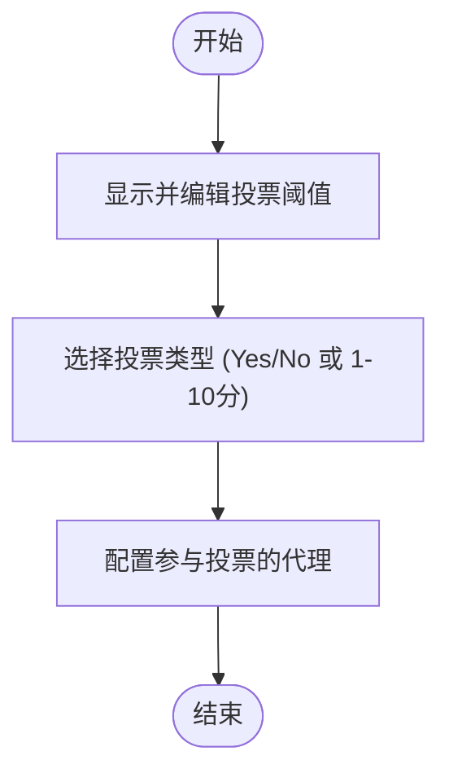

# PropertyPanel组件

<cite>
**本文档引用的文件**
- [PropertyPanel.tsx](file://frontend/src/features/editor/components/PropertyPanel/PropertyPanel.tsx)
- [VoteNodeForm.tsx](file://frontend/src/features/editor/components/PropertyPanel/NodeForms/VoteNodeForm.tsx)
- [LoopNodeForm.tsx](file://frontend/src/features/editor/components/PropertyPanel/NodeForms/LoopNodeForm.tsx)
- [FactCheckNodeForm.tsx](file://frontend/src/features/editor/components/PropertyPanel/NodeForms/FactCheckNodeForm.tsx)
- [HumanReviewNodeForm.tsx](file://frontend/src/features/editor/components/PropertyPanel/NodeForms/HumanReviewNodeForm.tsx)
- [useWorkflow.ts](file://frontend/src/hooks/useWorkflow.ts)
- [workflow.ts](file://frontend/src/types/workflow.ts)
- [WorkflowEditor.tsx](file://frontend/src/features/editor/WorkflowEditor.tsx)
</cite>

## 目录
1. [简介](#简介)
2. [项目结构](#项目结构)
3. [核心组件](#核心组件)
4. [架构概述](#架构概述)
5. [详细组件分析](#详细组件分析)
6. [依赖分析](#依赖分析)
7. [性能考虑](#性能考虑)
8. [故障排除指南](#故障排除指南)
9. [结论](#结论)
10. [附录](#附录)（如有必要）

## 简介
PropertyPanel属性面板组件是工作流编辑器中的核心配置中心，负责为用户提供当前选中节点的详细配置界面。该组件根据节点类型动态加载对应的配置表单，实现了节点属性的可视化编辑与实时更新。通过与useWorkflow钩子的深度集成，PropertyPanel确保了前端配置与后端工作流定义的双向同步，为用户提供了流畅的节点配置体验。

## 项目结构
PropertyPanel组件位于工作流编辑器的功能模块中，采用分层结构组织相关表单组件。其结构设计体现了高内聚、低耦合的原则，便于维护和扩展。

**图源**
- [PropertyPanel.tsx](file://frontend/src/features/editor/components/PropertyPanel/PropertyPanel.tsx)
- [NodeForms/](file://frontend/src/features/editor/components/PropertyPanel/NodeForms/)

**节源**
- [PropertyPanel.tsx](file://frontend/src/features/editor/components/PropertyPanel/PropertyPanel.tsx)

## 核心组件
PropertyPanel组件作为工作流节点的配置中心，实现了根据节点类型动态加载配置表单的核心功能。它通过条件渲染机制，为不同类型的节点（如投票节点、循环节点等）提供专用的配置界面，同时保持统一的用户体验。

**节源**
- [PropertyPanel.tsx](file://frontend/src/features/editor/components/PropertyPanel/PropertyPanel.tsx)
- [workflow.ts](file://frontend/src/types/workflow.ts)

## 架构概述
PropertyPanel组件采用基于React的函数式组件架构，通过TypeScript类型系统确保类型安全。其架构设计围绕动态表单加载和状态管理展开，与工作流编辑器的其他组件紧密协作。

**图源**
- [WorkflowEditor.tsx](file://frontend/src/features/editor/WorkflowEditor.tsx)
- [PropertyPanel.tsx](file://frontend/src/features/editor/components/PropertyPanel/PropertyPanel.tsx)
- [useWorkflow.ts](file://frontend/src/hooks/useWorkflow.ts)

## 详细组件分析
PropertyPanel组件的详细分析揭示了其在工作流编辑器中的关键作用和实现细节。该组件不仅提供了用户界面，还实现了复杂的状态管理和数据同步逻辑。

### PropertyPanel分析
PropertyPanel组件作为工作流节点的配置中心，实现了动态表单加载和属性双向绑定的核心功能。它通过节点类型判断，为不同类型的节点提供专用的配置表单。

#### 组件结构

**图源**
- [PropertyPanel.tsx](file://frontend/src/features/editor/components/PropertyPanel/PropertyPanel.tsx)
- [workflow.ts](file://frontend/src/types/workflow.ts)

**节源**
- [PropertyPanel.tsx](file://frontend/src/features/editor/components/PropertyPanel/PropertyPanel.tsx)

### 节点表单分析
不同类型的节点表单组件实现了特定的配置逻辑，为用户提供针对性的配置选项。

#### 投票节点表单

**图源**
- [VoteNodeForm.tsx](file://frontend/src/features/editor/components/PropertyPanel/NodeForms/VoteNodeForm.tsx)

**节源**
- [VoteNodeForm.tsx](file://frontend/src/features/editor/components/PropertyPanel/NodeForms/VoteNodeForm.tsx)

#### 循环节点表单

**图源**
- [LoopNodeForm.tsx](file://frontend/src/features/editor/components/PropertyPanel/NodeForms/LoopNodeForm.tsx)

**节源**
- [LoopNodeForm.tsx](file://frontend/src/features/editor/components/PropertyPanel/NodeForms/LoopNodeForm.tsx)

#### 事实核查节点表单

**图源**
- [FactCheckNodeForm.tsx](file://frontend/src/features/editor/components/PropertyPanel/NodeForms/FactCheckNodeForm.tsx)

**节源**
- [FactCheckNodeForm.tsx](file://frontend/src/features/editor/components/PropertyPanel/NodeForms/FactCheckNodeForm.tsx)

#### 人工审核节点表单

**图源**
- [HumanReviewNodeForm.tsx](file://frontend/src/features/editor/components/PropertyPanel/NodeForms/HumanReviewNodeForm.tsx)

**节源**
- [HumanReviewNodeForm.tsx](file://frontend/src/features/editor/components/PropertyPanel/NodeForms/HumanReviewNodeForm.tsx)

## 依赖分析
PropertyPanel组件与工作流编辑器的其他组件存在紧密的依赖关系，这些依赖关系构成了工作流配置的核心功能链。

**图源**
- [WorkflowEditor.tsx](file://frontend/src/features/editor/WorkflowEditor.tsx)
- [PropertyPanel.tsx](file://frontend/src/features/editor/components/PropertyPanel/PropertyPanel.tsx)
- [useWorkflow.ts](file://frontend/src/hooks/useWorkflow.ts)
- [workflow.ts](file://frontend/src/types/workflow.ts)

**节源**
- [WorkflowEditor.tsx](file://frontend/src/features/editor/WorkflowEditor.tsx)
- [useWorkflow.ts](file://frontend/src/hooks/useWorkflow.ts)

## 性能考虑
PropertyPanel组件的设计考虑了性能优化，通过条件渲染和事件回调机制，确保了在节点切换时的快速响应。组件的渲染逻辑避免了不必要的重渲染，通过React的函数组件和hooks机制实现了高效的更新策略。

## 故障排除指南
当PropertyPanel组件出现问题时，可以按照以下步骤进行排查：

1. 检查节点类型是否正确传递给PropertyPanel
2. 验证节点数据结构是否符合预期的类型定义
3. 确认onUpdate回调函数是否正确连接到工作流状态管理
4. 检查表单组件的导入路径是否正确

**节源**
- [PropertyPanel.tsx](file://frontend/src/features/editor/components/PropertyPanel/PropertyPanel.tsx)
- [WorkflowEditor.tsx](file://frontend/src/features/editor/WorkflowEditor.tsx)

## 结论
PropertyPanel组件成功实现了工作流节点的动态配置功能，通过与useWorkflow钩子的联动，确保了配置数据的实时同步。其模块化的设计使得新节点类型的扩展变得简单直观，为工作流编辑器的持续发展提供了坚实的基础。

## 附录
### 节点类型定义
| 节点类型 | 描述 | 配置属性 |
|---------|------|---------|
| vote | 投票节点 | 阈值、投票类型、参与者 |
| loop | 循环节点 | 最大轮数、退出条件、辩论对 |
| fact_check | 事实核查节点 | 搜索来源、最大查询数、验证阈值 |
| human_review | 人工审核节点 | 审核类型、超时时间、是否允许跳过 |

**节源**
- [workflow.ts](file://frontend/src/types/workflow.ts)