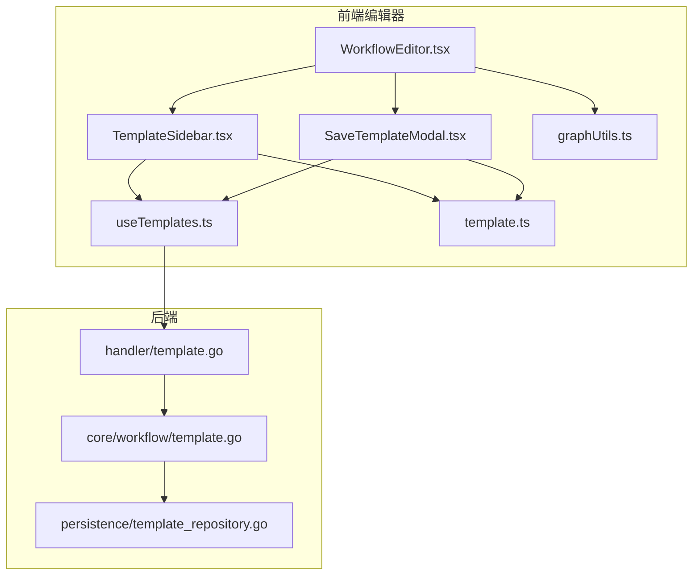
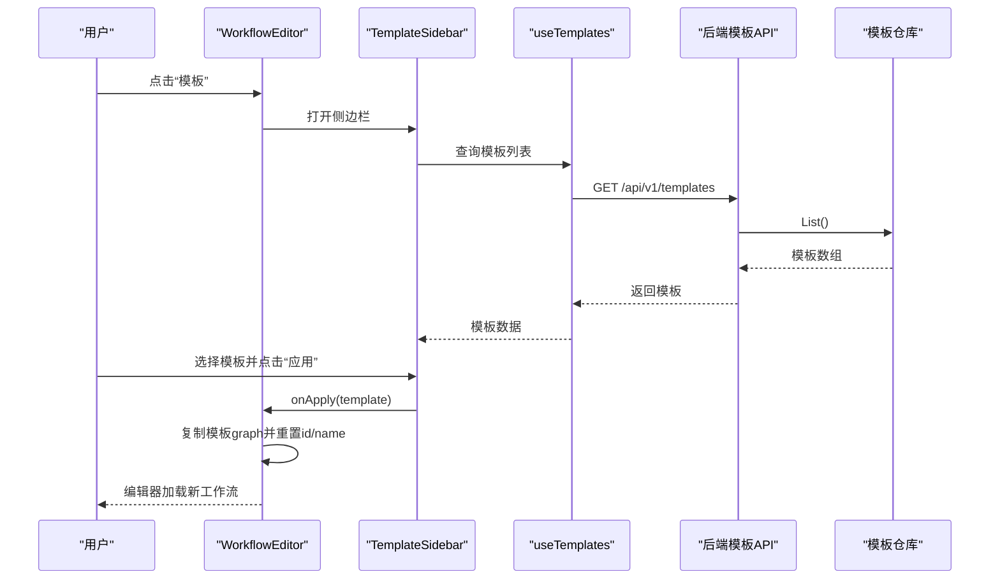
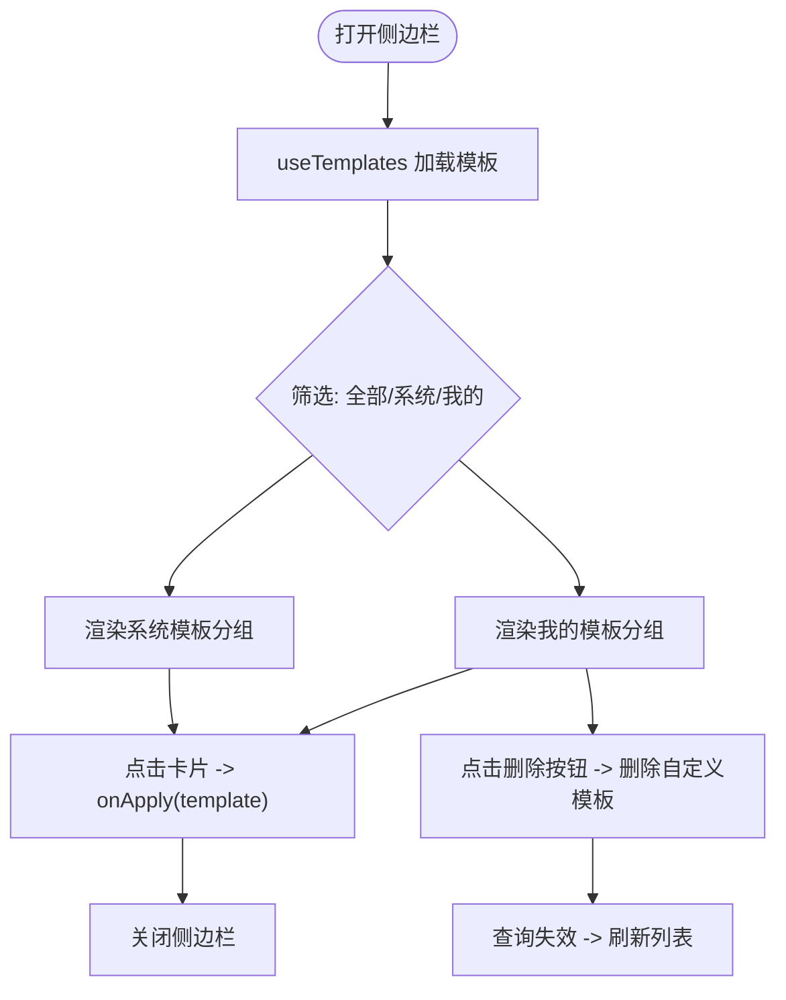
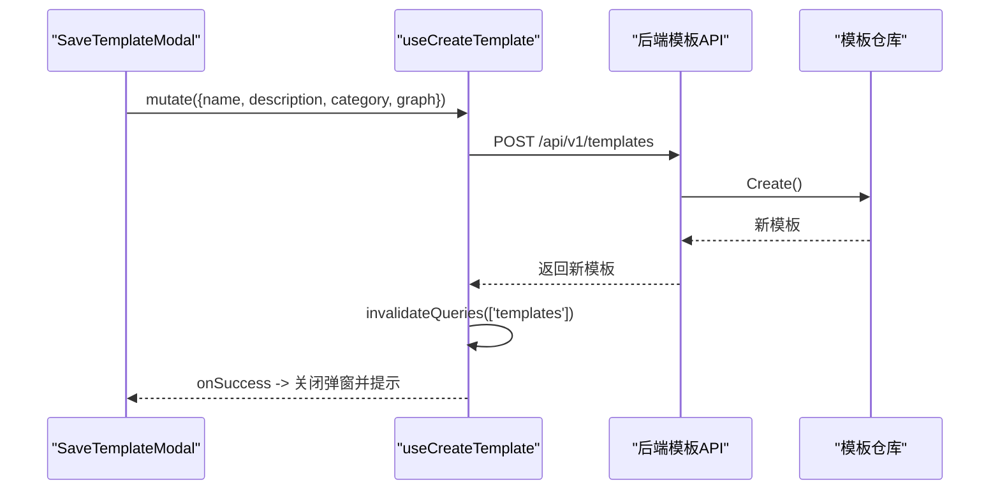
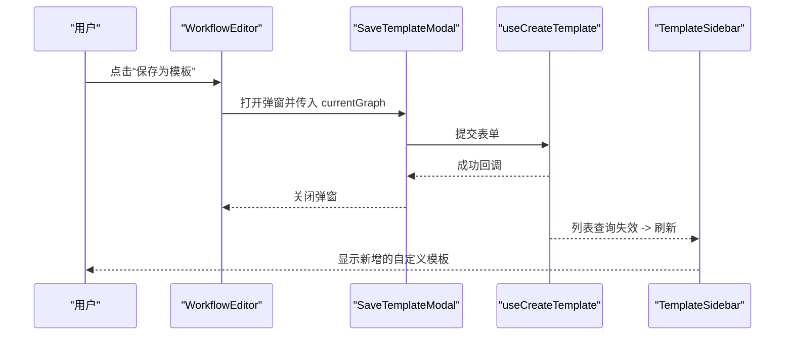
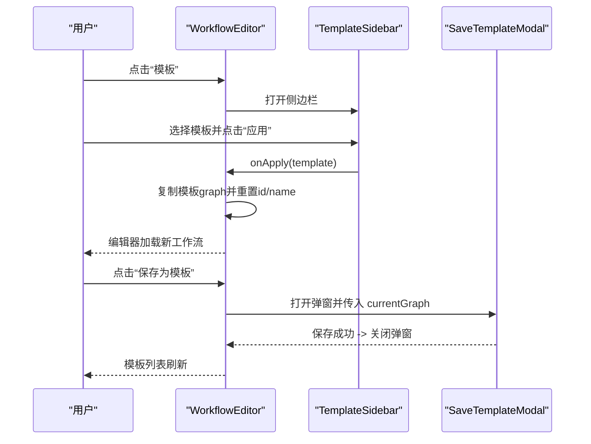
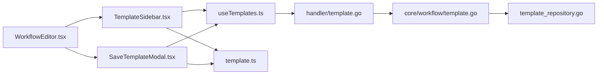

# TemplateSidebar组件

<cite>
**本文引用的文件**
- [TemplateSidebar.tsx](file://frontend/src/features/editor/components/TemplateSidebar.tsx)
- [useTemplates.ts](file://frontend/src/hooks/useTemplates.ts)
- [SaveTemplateModal.tsx](file://frontend/src/features/editor/components/SaveTemplateModal.tsx)
- [WorkflowEditor.tsx](file://frontend/src/features/editor/WorkflowEditor.tsx)
- [template.ts](file://frontend/src/types/template.ts)
- [graphUtils.ts](file://frontend/src/utils/graphUtils.ts)
- [SPEC-204-template-sidebar.md](file://docs/specs/sprint3/SPEC-204-template-sidebar.md)
- [SPEC-205-save-template.md](file://docs/specs/sprint3/SPEC-205-save-template.md)
- [template.go（前端）](file://internal/api/handler/template.go)
- [template.go（核心）](file://internal/core/workflow/template.go)
- [template_repository.go](file://internal/infrastructure/persistence/template_repository.go)
</cite>

## 目录
1. [简介](#简介)
2. [项目结构](#项目结构)
3. [核心组件](#核心组件)
4. [架构总览](#架构总览)
5. [组件详细分析](#组件详细分析)
6. [依赖关系分析](#依赖关系分析)
7. [性能考量](#性能考量)
8. [故障排查指南](#故障排查指南)
9. [结论](#结论)
10. [附录](#附录)

## 简介
TemplateSidebar 是工作流编辑器中的模板库侧边栏组件，作为“模板库访问入口”，负责：
- 展示系统预置模板与用户自定义模板
- 提供筛选（全部/系统/我的）
- 支持点击应用模板到编辑器
- 支持删除自定义模板
- 与 SaveTemplateModal 协同，完成从工作流到模板的保存流程

该组件遵循 SPEC-204 的 UI 设计原则，强调清晰的分类、直观的图标与卡片式展示，配合 useTemplates 钩子实现模板的加载、状态管理与错误处理；与 SaveTemplateModal 协作，形成“查看模板 -> 应用模板”和“编辑工作流 -> 保存为模板”的完整闭环。

## 项目结构
TemplateSidebar 所在的模块位于编辑器特性目录下，与 WorkflowEditor、SaveTemplateModal 共同构成模板生态：
- 前端编辑器特性：TemplateSidebar、SaveTemplateModal、WorkflowEditor
- 前端数据钩子：useTemplates（查询/创建/删除模板）
- 类型定义：template.ts（模板结构）
- 图形转换工具：graphUtils.ts（BackendGraph 与 React Flow 节点/边映射）
- 后端模板 API：handler/template.go、core/workflow/template.go、persistence/template_repository.go

图表来源
- [WorkflowEditor.tsx](file://frontend/src/features/editor/WorkflowEditor.tsx#L1-L271)
- [TemplateSidebar.tsx](file://frontend/src/features/editor/components/TemplateSidebar.tsx#L1-L134)
- [SaveTemplateModal.tsx](file://frontend/src/features/editor/components/SaveTemplateModal.tsx#L1-L116)
- [useTemplates.ts](file://frontend/src/hooks/useTemplates.ts#L1-L63)
- [template.ts](file://frontend/src/types/template.ts#L1-L22)
- [graphUtils.ts](file://frontend/src/utils/graphUtils.ts#L1-L131)
- [template.go（前端）](file://internal/api/handler/template.go#L1-L68)
- [template.go（核心）](file://internal/core/workflow/template.go#L1-L35)
- [template_repository.go](file://internal/infrastructure/persistence/template_repository.go#L1-L96)

章节来源
- [WorkflowEditor.tsx](file://frontend/src/features/editor/WorkflowEditor.tsx#L1-L271)
- [TemplateSidebar.tsx](file://frontend/src/features/editor/components/TemplateSidebar.tsx#L1-L134)
- [SaveTemplateModal.tsx](file://frontend/src/features/editor/components/SaveTemplateModal.tsx#L1-L116)
- [useTemplates.ts](file://frontend/src/hooks/useTemplates.ts#L1-L63)
- [template.ts](file://frontend/src/types/template.ts#L1-L22)
- [graphUtils.ts](file://frontend/src/utils/graphUtils.ts#L1-L131)
- [template.go（前端）](file://internal/api/handler/template.go#L1-L68)
- [template.go（核心）](file://internal/core/workflow/template.go#L1-L35)
- [template_repository.go](file://internal/infrastructure/persistence/template_repository.go#L1-L96)

## 核心组件
- TemplateSidebar：侧边栏容器，负责模板列表渲染、筛选、应用与删除
- useTemplates：封装模板的查询、创建、删除，使用 React Query 进行缓存与失效
- SaveTemplateModal：将当前工作流保存为模板的弹窗
- WorkflowEditor：编辑器主容器，协调模板侧边栏与保存模板弹窗的显示与数据传递
- 类型与工具：Template 接口、BackendGraph 与节点映射工具

章节来源
- [TemplateSidebar.tsx](file://frontend/src/features/editor/components/TemplateSidebar.tsx#L1-L134)
- [useTemplates.ts](file://frontend/src/hooks/useTemplates.ts#L1-L63)
- [SaveTemplateModal.tsx](file://frontend/src/features/editor/components/SaveTemplateModal.tsx#L1-L116)
- [WorkflowEditor.tsx](file://frontend/src/features/editor/WorkflowEditor.tsx#L1-L271)
- [template.ts](file://frontend/src/types/template.ts#L1-L22)
- [graphUtils.ts](file://frontend/src/utils/graphUtils.ts#L1-L131)

## 架构总览
TemplateSidebar 通过 useTemplates 钩子从后端获取模板列表，按 is_system 字段区分系统模板与自定义模板，并支持筛选。当用户点击“应用模板”时，WorkflowEditor 将模板的 BackendGraph 转换为新的工作流图并清空模板源 ID，确保保存为新工作流而非覆盖模板。

图表来源
- [WorkflowEditor.tsx](file://frontend/src/features/editor/WorkflowEditor.tsx#L135-L165)
- [TemplateSidebar.tsx](file://frontend/src/features/editor/components/TemplateSidebar.tsx#L20-L102)
- [useTemplates.ts](file://frontend/src/hooks/useTemplates.ts#L37-L42)
- [template.go（前端）](file://internal/api/handler/template.go#L20-L27)
- [template_repository.go](file://internal/infrastructure/persistence/template_repository.go#L24-L51)

## 组件详细分析

### TemplateSidebar 组件
- 功能职责
  - 以抽屉形式呈现模板库
  - 提供筛选器：全部/系统/我的
  - 渲染系统模板与自定义模板分组
  - 每个模板卡片支持“应用模板”和“删除自定义模板”
- 数据与状态
  - 使用 useTemplates 获取模板列表与加载状态
  - 使用 useDeleteTemplate 删除自定义模板
  - 内部状态维护筛选值
- UI 设计
  - 分类标题采用“系统模板/我的模板”分组
  - 模板卡片包含图标、名称、描述
  - 自定义模板卡片提供删除按钮（悬停可见）

图表来源
- [TemplateSidebar.tsx](file://frontend/src/features/editor/components/TemplateSidebar.tsx#L20-L102)
- [useTemplates.ts](file://frontend/src/hooks/useTemplates.ts#L54-L62)

章节来源
- [TemplateSidebar.tsx](file://frontend/src/features/editor/components/TemplateSidebar.tsx#L1-L134)
- [useTemplates.ts](file://frontend/src/hooks/useTemplates.ts#L1-L63)

### useTemplates 钩子与模板 API 集成
- 查询模板：GET /api/v1/templates
- 创建模板：POST /api/v1/templates（SaveTemplateModal 使用）
- 删除模板：DELETE /api/v1/templates/{id}
- 缓存与失效：使用 queryClient.invalidateQueries 使模板列表自动刷新

图表来源
- [SaveTemplateModal.tsx](file://frontend/src/features/editor/components/SaveTemplateModal.tsx#L1-L116)
- [useTemplates.ts](file://frontend/src/hooks/useTemplates.ts#L14-L36)
- [template.go（前端）](file://internal/api/handler/template.go#L29-L58)
- [template_repository.go](file://internal/infrastructure/persistence/template_repository.go#L53-L66)

章节来源
- [SaveTemplateModal.tsx](file://frontend/src/features/editor/components/SaveTemplateModal.tsx#L1-L116)
- [useTemplates.ts](file://frontend/src/hooks/useTemplates.ts#L1-L63)
- [template.go（前端）](file://internal/api/handler/template.go#L1-L68)
- [template_repository.go](file://internal/infrastructure/persistence/template_repository.go#L1-L96)

### SaveTemplateModal 与 TemplateSidebar 协同
- SaveTemplateModal 将当前工作流图（BackendGraph）保存为模板，支持设置名称、描述、分类
- 保存成功后，通过查询失效触发模板列表更新，TemplateSidebar 即刻显示新增的自定义模板
- TemplateSidebar 对自定义模板提供删除能力，删除后同样触发列表刷新

图表来源
- [WorkflowEditor.tsx](file://frontend/src/features/editor/WorkflowEditor.tsx#L198-L210)
- [SaveTemplateModal.tsx](file://frontend/src/features/editor/components/SaveTemplateModal.tsx#L1-L116)
- [useTemplates.ts](file://frontend/src/hooks/useTemplates.ts#L44-L62)
- [TemplateSidebar.tsx](file://frontend/src/features/editor/components/TemplateSidebar.tsx#L20-L102)

章节来源
- [WorkflowEditor.tsx](file://frontend/src/features/editor/WorkflowEditor.tsx#L198-L210)
- [SaveTemplateModal.tsx](file://frontend/src/features/editor/components/SaveTemplateModal.tsx#L1-L116)
- [useTemplates.ts](file://frontend/src/hooks/useTemplates.ts#L44-L62)
- [TemplateSidebar.tsx](file://frontend/src/features/editor/components/TemplateSidebar.tsx#L20-L102)

### 工作流编辑器中的集成示例
- 触发模板侧边栏：编辑器工具栏“模板”按钮切换 showTemplates
- 触发保存模板弹窗：编辑器工具栏“保存为模板”按钮切换 showSaveTemplate
- 应用模板：TemplateSidebar.onApply 回调中将模板 graph 复制并重置 id/name，然后关闭侧边栏
- 保存模板：SaveTemplateModal 提交当前 graph，成功后关闭弹窗并刷新模板列表

图表来源
- [WorkflowEditor.tsx](file://frontend/src/features/editor/WorkflowEditor.tsx#L135-L165)
- [TemplateSidebar.tsx](file://frontend/src/features/editor/components/TemplateSidebar.tsx#L20-L102)
- [SaveTemplateModal.tsx](file://frontend/src/features/editor/components/SaveTemplateModal.tsx#L1-L116)

章节来源
- [WorkflowEditor.tsx](file://frontend/src/features/editor/WorkflowEditor.tsx#L135-L165)
- [TemplateSidebar.tsx](file://frontend/src/features/editor/components/TemplateSidebar.tsx#L20-L102)
- [SaveTemplateModal.tsx](file://frontend/src/features/editor/components/SaveTemplateModal.tsx#L1-L116)

## 依赖关系分析
- 组件耦合
  - TemplateSidebar 依赖 useTemplates 与模板类型定义
  - SaveTemplateModal 依赖 useCreateTemplate 与模板类型定义
  - WorkflowEditor 作为编排者，同时依赖两者并负责数据传递
- 外部依赖
  - 后端模板 API：GET/POST/DELETE /api/v1/templates
  - 数据持久化：PostgreSQL 表 workflow_templates 存储模板
- 可能的循环依赖
  - 当前文件间无循环导入；编辑器作为上层容器聚合组件

图表来源
- [TemplateSidebar.tsx](file://frontend/src/features/editor/components/TemplateSidebar.tsx#L1-L134)
- [SaveTemplateModal.tsx](file://frontend/src/features/editor/components/SaveTemplateModal.tsx#L1-L116)
- [WorkflowEditor.tsx](file://frontend/src/features/editor/WorkflowEditor.tsx#L1-L271)
- [useTemplates.ts](file://frontend/src/hooks/useTemplates.ts#L1-L63)
- [template.ts](file://frontend/src/types/template.ts#L1-L22)
- [template.go（前端）](file://internal/api/handler/template.go#L1-L68)
- [template.go（核心）](file://internal/core/workflow/template.go#L1-L35)
- [template_repository.go](file://internal/infrastructure/persistence/template_repository.go#L1-L96)

章节来源
- [TemplateSidebar.tsx](file://frontend/src/features/editor/components/TemplateSidebar.tsx#L1-L134)
- [SaveTemplateModal.tsx](file://frontend/src/features/editor/components/SaveTemplateModal.tsx#L1-L116)
- [WorkflowEditor.tsx](file://frontend/src/features/editor/WorkflowEditor.tsx#L1-L271)
- [useTemplates.ts](file://frontend/src/hooks/useTemplates.ts#L1-L63)
- [template.go（前端）](file://internal/api/handler/template.go#L1-L68)
- [template_repository.go](file://internal/infrastructure/persistence/template_repository.go#L1-L96)

## 性能考量
- 列表渲染
  - 使用 React Query 缓存模板列表，避免重复请求
  - TemplateSidebar 在筛选时仅进行内存过滤，复杂度 O(n)
- 模板卡片
  - 每个模板卡片独立渲染，删除按钮仅在自定义模板显示，减少不必要的 DOM
- 状态同步
  - 创建/删除模板后通过查询失效触发刷新，保证 UI 与后端一致
- 图形转换
  - BackendGraph 到 React Flow 的转换在 WorkflowCanvas 中进行，TemplateSidebar 不参与图形计算

[本节为通用性能建议，不直接分析具体文件]

## 故障排查指南
- 模板列表为空或加载失败
  - 检查后端 /api/v1/templates 是否返回 200
  - 查看 useTemplates 的错误处理与网络异常
- 应用模板后编辑器未更新
  - 确认 WorkflowEditor.handleApplyTemplate 是否正确复制模板 graph 并重置 id/name
  - 确认模板 is_system 字段是否正确影响分类显示
- 保存模板失败
  - 检查 SaveTemplateModal 表单字段是否填写完整
  - 查看后端模板 API 的错误响应与数据库插入日志
- 删除模板无效
  - 确认 useDeleteTemplate 的 onSuccess 是否触发查询失效
  - 检查模板列表是否仍显示被删除项

章节来源
- [useTemplates.ts](file://frontend/src/hooks/useTemplates.ts#L1-L63)
- [WorkflowEditor.tsx](file://frontend/src/features/editor/WorkflowEditor.tsx#L142-L154)
- [SaveTemplateModal.tsx](file://frontend/src/features/editor/components/SaveTemplateModal.tsx#L1-L116)
- [template.go（前端）](file://internal/api/handler/template.go#L29-L67)
- [template_repository.go](file://internal/infrastructure/persistence/template_repository.go#L53-L96)

## 结论
TemplateSidebar 作为模板库入口，通过清晰的分类与筛选、直观的卡片展示与删除能力，有效支撑了系统模板与用户自定义模板的浏览与应用。结合 SaveTemplateModal，实现了从工作流到模板的双向流转。其与 useTemplates 钩子的集成确保了数据的一致性与良好的用户体验。遵循 SPEC-204 的 UI 设计原则，组件在可用性与可维护性之间取得平衡。

[本节为总结性内容，不直接分析具体文件]

## 附录
- UI 设计原则与体验优化
  - 分组标题明确：系统模板/我的模板
  - 图标与分类对应，提升识别效率
  - 删除按钮悬停可见，降低误操作风险
  - 空状态友好提示，引导用户创建模板
- 规范参考
  - SPEC-204-template-sidebar.md：布局、接口与实现概览
  - SPEC-205-save-template.md：保存为模板的交互与流程

章节来源
- [SPEC-204-template-sidebar.md](file://docs/specs/sprint3/SPEC-204-template-sidebar.md#L1-L131)
- [SPEC-205-save-template.md](file://docs/specs/sprint3/SPEC-205-save-template.md#L1-L100)