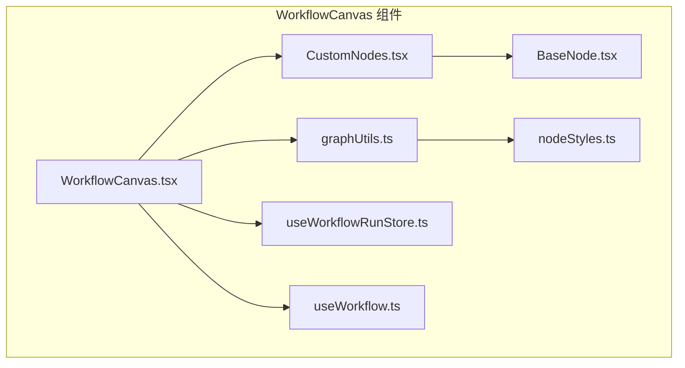
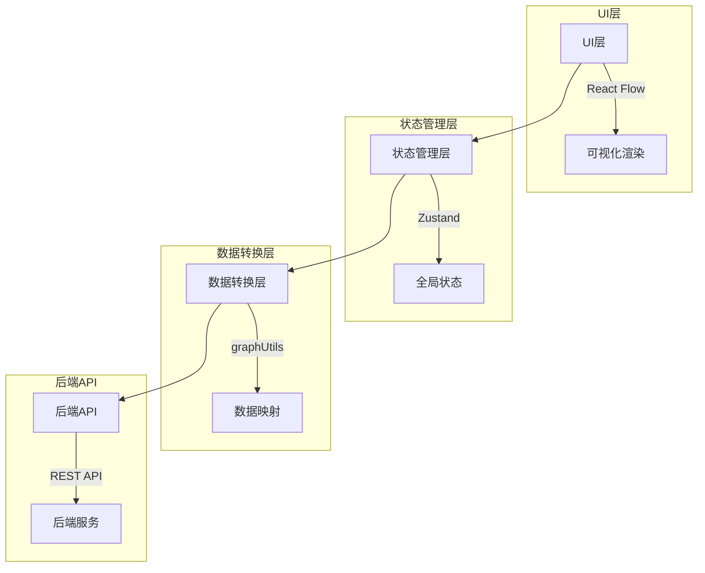
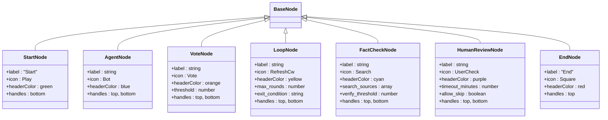
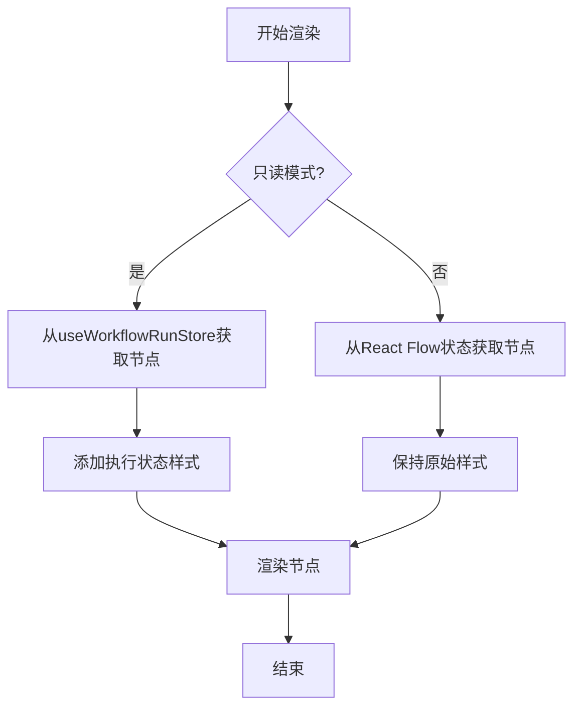
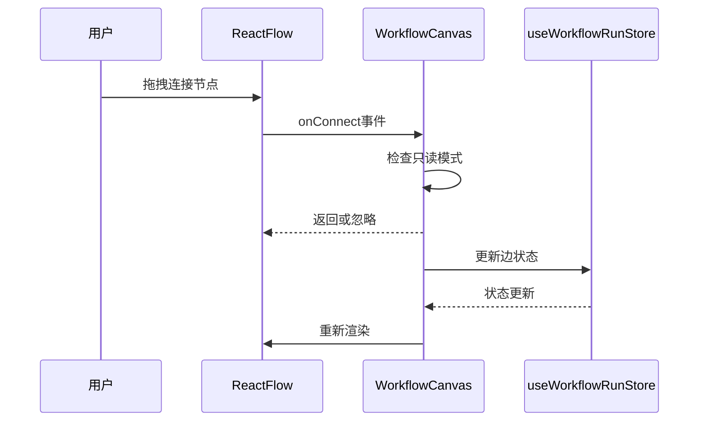
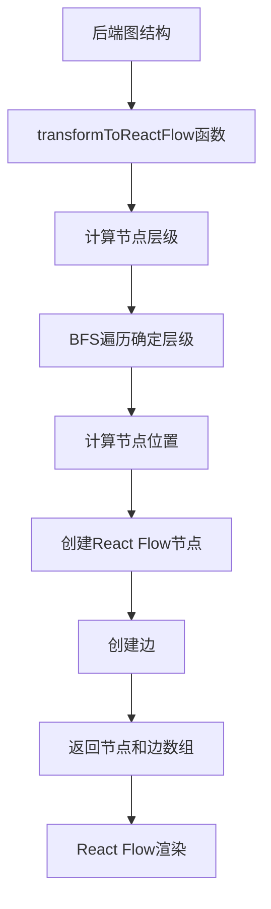
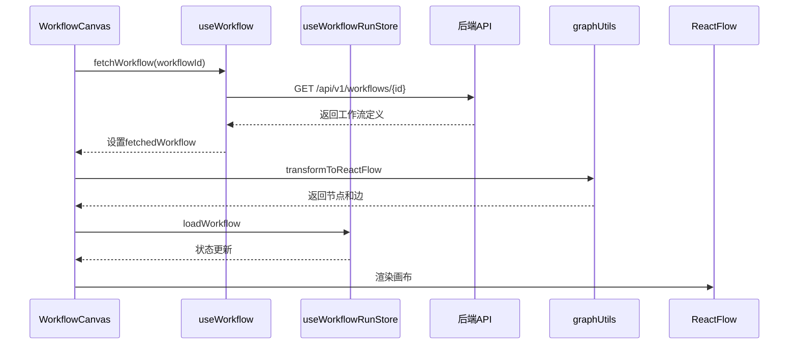
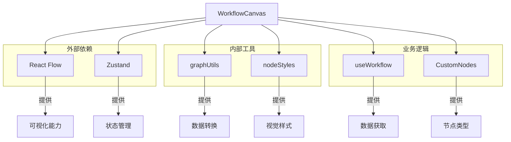

# WorkflowCanvas组件

<cite>
**本文档引用的文件**
- [WorkflowCanvas.tsx](file://frontend/src/components/workflow/WorkflowCanvas.tsx)
- [graphUtils.ts](file://frontend/src/utils/graphUtils.ts)
- [nodeStyles.ts](file://frontend/src/utils/nodeStyles.ts)
- [CustomNodes.tsx](file://frontend/src/components/workflow/nodes/CustomNodes.tsx)
- [BaseNode.tsx](file://frontend/src/components/workflow/nodes/BaseNode.tsx)
- [useWorkflowRunStore.ts](file://frontend/src/stores/useWorkflowRunStore.ts)
- [useWorkflow.ts](file://frontend/src/hooks/useWorkflow.ts)
- [workflow.ts](file://frontend/src/types/workflow.ts)
- [workflow-run.ts](file://frontend/src/types/workflow-run.ts)
</cite>

## 目录
1. [简介](#简介)
2. [项目结构](#项目结构)
3. [核心组件](#核心组件)
4. [架构概述](#架构概述)
5. [详细组件分析](#详细组件分析)
6. [依赖分析](#依赖分析)
7. [性能考虑](#性能考虑)
8. [故障排除指南](#故障排除指南)
9. [结论](#结论)

## 简介
WorkflowCanvas组件是基于React Flow库构建的可视化工作流画布，用于图形化编辑和展示AI工作流。该组件支持多种节点类型（Start、Agent、Vote、Loop、FactCheck、HumanReview、End），提供拖拽创建节点、边连接、画布缩放平移等交互功能。组件通过Zustand状态管理store（useWorkflowRunStore）同步工作流执行状态，并响应节点状态变化。

## 项目结构
WorkflowCanvas组件位于`frontend/src/components/workflow/`目录下，主要由以下几个部分组成：
- `WorkflowCanvas.tsx`：主组件文件，集成React Flow并处理状态同步
- `nodes/CustomNodes.tsx`：自定义节点定义
- `nodes/BaseNode.tsx`：基础节点组件
- `utils/graphUtils.ts`：后端图结构到React Flow节点的转换工具
- `utils/nodeStyles.ts`：节点状态样式管理
- `stores/useWorkflowRunStore.ts`：工作流运行时状态管理

**图示来源**
- [WorkflowCanvas.tsx](file://frontend/src/components/workflow/WorkflowCanvas.tsx)
- [CustomNodes.tsx](file://frontend/src/components/workflow/nodes/CustomNodes.tsx)
- [graphUtils.ts](file://frontend/src/utils/graphUtils.ts)

**本节来源**
- [WorkflowCanvas.tsx](file://frontend/src/components/workflow/WorkflowCanvas.tsx)
- [CustomNodes.tsx](file://frontend/src/components/workflow/nodes/CustomNodes.tsx)

## 核心组件
WorkflowCanvas组件的核心功能包括：
- 基于React Flow的图形化编辑能力
- 多种节点类型的渲染逻辑
- 边连接规则和交互功能
- 与Zustand状态store的同步机制
- 工作流执行状态的可视化

组件支持只读模式和编辑模式，可根据`readOnly`属性或`mode`属性切换。在运行模式下，组件会显示节点执行状态的视觉反馈。

**本节来源**
- [WorkflowCanvas.tsx](file://frontend/src/components/workflow/WorkflowCanvas.tsx#L41-L148)
- [useWorkflowRunStore.ts](file://frontend/src/stores/useWorkflowRunStore.ts#L14-L80)

## 架构概述
WorkflowCanvas组件采用分层架构设计，各层职责分明：

**图示来源**
- [WorkflowCanvas.tsx](file://frontend/src/components/workflow/WorkflowCanvas.tsx)
- [useWorkflowRunStore.ts](file://frontend/src/stores/useWorkflowRunStore.ts)
- [graphUtils.ts](file://frontend/src/utils/graphUtils.ts)

## 详细组件分析

### 节点类型与渲染逻辑
WorkflowCanvas组件支持多种节点类型，每种类型都有特定的渲染逻辑和视觉样式。

#### 节点类型定义

**图示来源**
- [CustomNodes.tsx](file://frontend/src/components/workflow/nodes/CustomNodes.tsx#L25-L139)
- [BaseNode.tsx](file://frontend/src/components/workflow/nodes/BaseNode.tsx#L1-L47)

#### 节点渲染流程

**图示来源**
- [WorkflowCanvas.tsx](file://frontend/src/components/workflow/WorkflowCanvas.tsx#L100-L106)

### 边连接与交互
组件实现了完整的边连接功能，包括：

**图示来源**
- [WorkflowCanvas.tsx](file://frontend/src/components/workflow/WorkflowCanvas.tsx#L108-L115)
- [useWorkflowRunStore.ts](file://frontend/src/stores/useWorkflowRunStore.ts#L64-L74)

### 数据转换与布局
graphUtils工具负责将后端图结构转换为React Flow兼容的格式：

**图示来源**
- [graphUtils.ts](file://frontend/src/utils/graphUtils.ts#L20-L107)

### 状态管理与同步
组件通过useWorkflowRunStore实现状态同步：

**图示来源**
- [WorkflowCanvas.tsx](file://frontend/src/components/workflow/WorkflowCanvas.tsx#L74-L87)
- [useWorkflowRunStore.ts](file://frontend/src/stores/useWorkflowRunStore.ts#L101-L117)

## 依赖分析
WorkflowCanvas组件依赖多个核心模块：

**图示来源**
- [WorkflowCanvas.tsx](file://frontend/src/components/workflow/WorkflowCanvas.tsx#L2-L18)
- [package.json](file://frontend/package.json)

## 性能考虑
WorkflowCanvas组件在性能方面有以下考虑：

1. **状态更新优化**：使用Zustand的immer中间件进行不可变状态更新
2. **选择性渲染**：通过useNodesState和useEdgesState钩子管理局部状态
3. **数据转换效率**：graphUtils中的BFS算法确保O(V+E)时间复杂度
4. **事件处理优化**：使用useCallback避免不必要的函数重建

组件还实现了只读模式下的状态分离，避免在运行时频繁更新React Flow的内部状态。

## 故障排除指南
常见问题及解决方案：

**问题1：节点无法连接**
- 检查`readOnly`属性是否为true
- 确认节点类型是否支持连接（Start和End节点有特定连接限制）
- 检查React Flow的`nodesConnectable`属性

**问题2：节点位置错乱**
- 确认后端返回的图结构是否完整
- 检查`transformToReactFlow`函数的层级计算逻辑
- 验证节点ID的唯一性

**问题3：状态不同步**
- 检查`useWorkflowRunStore`的状态更新逻辑
- 确认`loadWorkflow`方法是否正确调用
- 验证Zustand store的订阅机制

**问题4：性能问题**
- 检查节点数量是否过多
- 确认是否启用了不必要的状态更新
- 验证React Flow的`fitView`和渲染优化设置

**本节来源**
- [WorkflowCanvas.tsx](file://frontend/src/components/workflow/WorkflowCanvas.tsx)
- [useWorkflowRunStore.ts](file://frontend/src/stores/useWorkflowRunStore.ts)

## 结论
WorkflowCanvas组件是一个功能完整的可视化工作流编辑器，基于React Flow构建，提供了丰富的图形化编辑能力。组件通过合理的架构设计和状态管理，实现了高效的节点渲染、边连接和状态同步。通过graphUtils工具和nodeStyles管理，确保了数据转换和视觉样式的统一性。与Zustand状态store的深度集成，使得组件能够实时响应工作流执行状态的变化，为用户提供直观的可视化反馈。