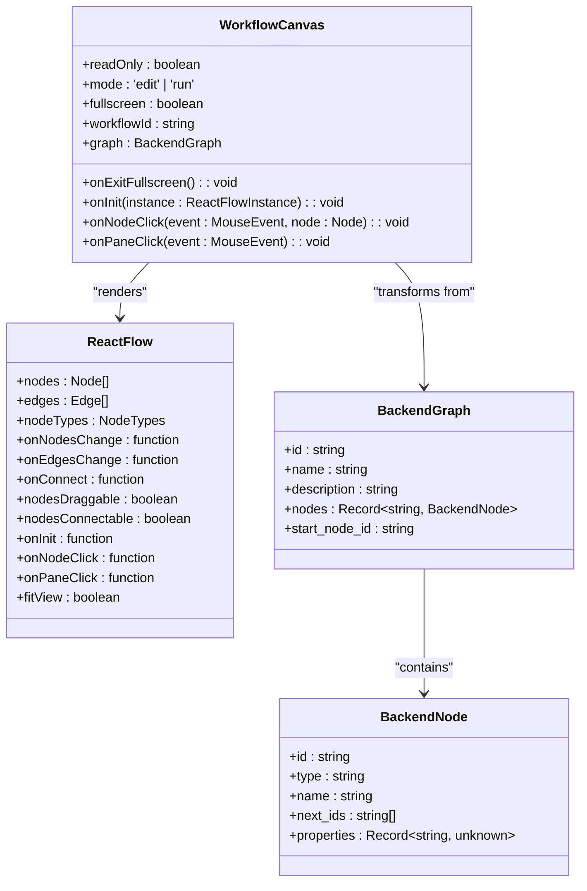
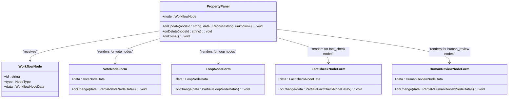
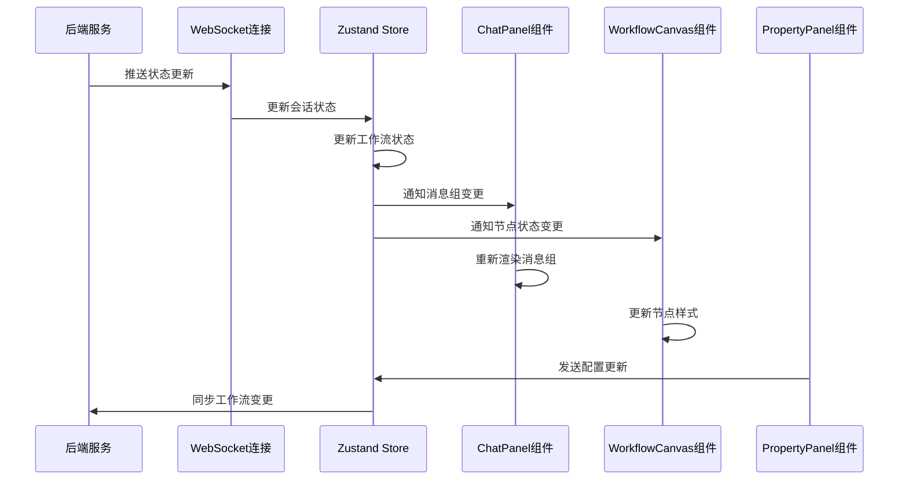

# 核心UI组件

<cite>
**本文档引用的文件**   
- [ChatPanel.tsx](file://frontend/src/components/chat/ChatPanel.tsx)
- [ChatPanel.types.ts](file://frontend/src/components/chat/ChatPanel.types.ts)
- [MessageGroupCard.tsx](file://frontend/src/components/chat/MessageGroupCard.tsx)
- [SequentialMessage.tsx](file://frontend/src/components/chat/SequentialMessage.tsx)
- [ParallelMessageRow.tsx](file://frontend/src/components/chat/ParallelMessageRow.tsx)
- [ParallelMessageCard.tsx](file://frontend/src/components/chat/ParallelMessageCard.tsx)
- [WorkflowCanvas.tsx](file://frontend/src/components/workflow/WorkflowCanvas.tsx)
- [CustomNodes.tsx](file://frontend/src/components/workflow/nodes/CustomNodes.tsx)
- [graphUtils.ts](file://frontend/src/utils/graphUtils.ts)
- [PropertyPanel.tsx](file://frontend/src/features/editor/components/PropertyPanel/PropertyPanel.tsx)
- [VoteNodeForm.tsx](file://frontend/src/features/editor/components/PropertyPanel/NodeForms/VoteNodeForm.tsx)
- [LoopNodeForm.tsx](file://frontend/src/features/editor/components/PropertyPanel/NodeForms/LoopNodeForm.tsx)
- [FactCheckNodeForm.tsx](file://frontend/src/features/editor/components/PropertyPanel/NodeForms/FactCheckNodeForm.tsx)
- [HumanReviewNodeForm.tsx](file://frontend/src/features/editor/components/PropertyPanel/NodeForms/HumanReviewNodeForm.tsx)
- [workflow.ts](file://frontend/src/types/workflow.ts)
- [session.ts](file://frontend/src/types/session.ts)
- [useSessionStore.ts](file://frontend/src/stores/useSessionStore.ts)
- [useWorkflowRunStore.ts](file://frontend/src/stores/useWorkflowRunStore.ts)
</cite>

## 目录
1. [介绍](#介绍)
2. [ChatPanel组件](#chatpanel组件)
3. [WorkflowCanvas组件](#workflowcanvas组件)
4. [PropertyPanel组件](#propertypanel组件)
5. [组件集成与状态管理](#组件集成与状态管理)
6. [可复用代码片段](#可复用代码片段)

## 介绍
本文档深入解析AI决策委员会项目中的三个核心前端UI组件：ChatPanel、WorkflowCanvas和PropertyPanel。这些组件共同构成了系统的可视化交互界面，支持复杂的多智能体协作、工作流编辑和动态配置功能。文档将详细说明各组件的功能特性、实现机制及与其他系统的集成方式。

## ChatPanel组件

ChatPanel组件负责渲染来自多个智能体的并行和串行消息流，提供实时的对话交互体验。该组件通过监听会话状态存储中的消息组变化，自动更新界面并滚动到底部，确保用户始终看到最新的消息内容。

组件支持KaTeX数学公式渲染和文档引用功能，通过集成react-markdown、remark-gfm和rehype-highlight等库，实现了对Markdown语法、表格、代码高亮以及数学公式的完整支持。消息内容在ParallelMessageCard组件中被解析和渲染，确保复杂内容的正确显示。

ChatPanel根据消息组的isParallel属性判断消息流的类型，分别使用ParallelMessageRow和SequentialMessage进行渲染。并行消息以网格布局同时展示多个智能体的输出，而串行消息则按时间顺序垂直排列。活跃的消息组会通过蓝色边框高亮显示，便于用户跟踪当前执行状态。

**组件属性接口定义**
- `fullscreen`: 布尔值，控制是否全屏显示
- `onExitFullscreen`: 函数，退出全屏模式的回调函数
- `readOnly`: 布尔值，是否禁用输入框
- `sessionId`: 字符串，会话ID，用于发送用户消息

**事件回调机制**
组件通过useSessionStore钩子订阅会话状态变化，当消息组更新时自动触发重新渲染。useEffect钩子监听messageGroups的变化，实现自动滚动到底部的功能。

**Section sources**
- [ChatPanel.tsx](file://frontend/src/components/chat/ChatPanel.tsx#L1-L77)
- [ChatPanel.types.ts](file://frontend/src/components/chat/ChatPanel.types.ts#L1-L22)

## WorkflowCanvas组件

WorkflowCanvas组件基于React Flow库实现了一个可视化的工作流编辑器，允许用户通过拖拽方式创建和编辑复杂的工作流。组件支持多种节点类型，包括Start、Agent、Vote、Loop、FactCheck、HumanReview和End节点，每种节点都有独特的视觉样式和功能特性。

画布实现了完整的拖拽交互和缩放功能，用户可以通过鼠标拖拽移动节点，使用滚轮缩放画布，或通过Controls组件进行精确控制。在编辑模式下，用户可以连接节点创建边，系统会自动验证连接的合法性。在运行模式下，画布变为只读状态，通过高亮边框显示当前正在执行的节点。

节点类型通过nodeTypes映射注册，每个自定义节点都继承自BaseNode组件，具有统一的头部样式和图标。节点的状态（如激活、完成、失败）通过边框颜色和样式动态更新，提供清晰的视觉反馈。

**组件属性接口定义**
- `readOnly`: 布尔值，是否为只读模式
- `mode`: 字符串，工作模式（'edit'或'run'）
- `fullscreen`: 布尔值，是否全屏显示
- `onExitFullscreen`: 函数，退出全屏的回调
- `workflowId`: 字符串，工作流ID
- `graph`: BackendGraph对象，外部传入的图数据
- `onInit`: 函数，画布初始化回调
- `onNodeClick`: 函数，节点点击回调
- `onPaneClick`: 函数，画布点击回调

**数据转换机制**
组件通过transformToReactFlow工具函数将后端的图定义转换为React Flow兼容的节点和边数据结构。转换过程包括BFS遍历确定节点层级、计算布局位置和创建连接边，确保工作流的逻辑结构在前端正确呈现。



**Diagram sources **
- [WorkflowCanvas.tsx](file://frontend/src/components/workflow/WorkflowCanvas.tsx#L41-L51)
- [graphUtils.ts](file://frontend/src/utils/graphUtils.ts#L12-L18)

**Section sources**
- [WorkflowCanvas.tsx](file://frontend/src/components/workflow/WorkflowCanvas.tsx#L1-L149)
- [CustomNodes.tsx](file://frontend/src/components/workflow/nodes/CustomNodes.tsx#L1-L140)
- [graphUtils.ts](file://frontend/src/utils/graphUtils.ts#L1-L131)

## PropertyPanel组件

PropertyPanel组件根据选中的工作流节点动态渲染配置表单，提供直观的节点属性编辑界面。组件通过onUpdate回调将配置变更同步到工作流状态中，实现双向数据绑定。

面板支持多种节点类型的特定配置表单，包括VoteNodeForm、LoopNodeForm、FactCheckNodeForm和HumanReviewNodeForm。每个表单都针对其节点类型的特点设计了相应的输入控件，如滑块、复选框和选择器，确保配置的直观性和易用性。

组件采用条件渲染策略，根据节点类型动态选择对应的表单组件。所有表单都包含一个通用的节点名称输入字段，允许用户修改节点的显示名称。删除按钮位于面板底部，提供便捷的节点移除功能。

**组件属性接口定义**
- `node`: WorkflowNode对象，当前选中的节点
- `onUpdate`: 函数，节点数据更新回调
- `onDelete`: 函数，节点删除回调
- `onClose`: 函数，关闭面板回调

**配置表单说明**
- **VoteNodeForm**: 配置投票节点的批准阈值（50-100%）和投票类型（是/否或1-10分制）
- **LoopNodeForm**: 设置循环节点的最大轮次（1-10）和退出条件（达到最大轮次或达成共识）
- **FactCheckNodeForm**: 配置事实核查节点的搜索源（Tavily、Serper、本地知识库）、最大查询数（1-10）和验证阈值（50-100%）
- **HumanReviewNodeForm**: 设置人工审核节点的审核类型、超时时间（5-60分钟）和是否允许跳过



**Diagram sources **
- [PropertyPanel.tsx](file://frontend/src/features/editor/components/PropertyPanel/PropertyPanel.tsx#L18-L86)
- [VoteNodeForm.tsx](file://frontend/src/features/editor/components/PropertyPanel/NodeForms/VoteNodeForm.tsx#L1-L62)
- [LoopNodeForm.tsx](file://frontend/src/features/editor/components/PropertyPanel/NodeForms/LoopNodeForm.tsx#L1-L50)
- [FactCheckNodeForm.tsx](file://frontend/src/features/editor/components/PropertyPanel/NodeForms/FactCheckNodeForm.tsx#L1-L88)
- [HumanReviewNodeForm.tsx](file://frontend/src/features/editor/components/PropertyPanel/NodeForms/HumanReviewNodeForm.tsx#L1-L65)

**Section sources**
- [PropertyPanel.tsx](file://frontend/src/features/editor/components/PropertyPanel/PropertyPanel.tsx#L1-L86)
- [workflow.ts](file://frontend/src/types/workflow.ts#L1-L45)

## 组件集成与状态管理

三个核心UI组件通过Zustand状态管理库紧密集成，共享全局应用状态。ChatPanel和WorkflowCanvas组件都依赖于会话和工作流状态，确保界面与后端执行状态保持同步。

**状态管理架构**
- `useSessionStore`: 管理会话相关的状态，包括消息组、会话状态和连接状态
- `useWorkflowRunStore`: 管理工作流执行相关的状态，包括节点、边、执行状态和统计信息
- `useConfigStore`: 管理应用配置，如主题设置

**数据流分析**
当工作流开始执行时，后端通过WebSocket推送状态更新，前端的store接收到更新后自动触发相关组件的重新渲染。例如，当某个节点开始执行时，useSessionStore更新activeNodeIds，导致ChatPanel中对应的消息组高亮显示；同时useWorkflowRunStore更新节点状态，使WorkflowCanvas中的节点边框变为蓝色。

PropertyPanel通过onUpdate回调与store交互，当用户修改节点配置时，变更通过回调函数传递给父组件，最终更新到工作流定义中。这种单向数据流设计确保了状态的一致性和可预测性。



**Diagram sources **
- [useSessionStore.ts](file://frontend/src/stores/useSessionStore.ts#L1-L332)
- [useWorkflowRunStore.ts](file://frontend/src/stores/useWorkflowRunStore.ts#L1-L301)

**Section sources**
- [useSessionStore.ts](file://frontend/src/stores/useSessionStore.ts#L1-L332)
- [useWorkflowRunStore.ts](file://frontend/src/stores/useWorkflowRunStore.ts#L1-L301)
- [session.ts](file://frontend/src/types/session.ts#L1-L93)
- [workflow.ts](file://frontend/src/types/workflow.ts#L1-L45)

## 可复用代码片段

以下代码片段展示了核心组件的关键实现模式，可作为开发类似功能的参考：

**消息组渲染模式**
```typescript
// 在ChatPanel中渲染消息组
messageGroups.map(group => (
    <MessageGroupCard
        key={group.nodeId}
        group={group}
        isActive={activeNodeIds.includes(group.nodeId)}
    />
))
```

**动态表单渲染模式**
```typescript
// 在PropertyPanel中根据节点类型渲染对应表单
switch (node.type as NodeType) {
    case 'vote':
        return <VoteNodeForm data={node.data} onChange={(d) => onUpdate(node.id, d)} />;
    case 'loop':
        return <LoopNodeForm data={node.data} onChange={(d) => onUpdate(node.id, d)} />;
    // 其他节点类型...
}
```

**React Flow集成模式**
```typescript
// 在WorkflowCanvas中集成React Flow
<ReactFlow
    nodes={displayedNodes}
    edges={displayedEdges}
    nodeTypes={nodeTypes}
    onNodesChange={readOnly ? undefined : onNodesChange}
    onEdgesChange={readOnly ? undefined : onEdgesChange}
    onConnect={readOnly ? undefined : onConnect}
    nodesDraggable={!readOnly}
    nodesConnectable={!readOnly}
    fitView
>
    <Background color={gridColor} gap={20} />
    <Controls showInteractive={!readOnly} />
</ReactFlow>
```

**状态订阅模式**
```typescript
// 订阅会话状态变化
const messageGroups = useSessionStore(state => state.messageGroups);
const currentSession = useSessionStore(state => state.currentSession);
const activeNodeIds = currentSession?.activeNodeIds ?? [];
```

**Section sources**
- [ChatPanel.tsx](file://frontend/src/components/chat/ChatPanel.tsx#L47-L63)
- [PropertyPanel.tsx](file://frontend/src/features/editor/components/PropertyPanel/PropertyPanel.tsx#L22-L42)
- [WorkflowCanvas.tsx](file://frontend/src/components/workflow/WorkflowCanvas.tsx#L129-L145)
- [useSessionStore.ts](file://frontend/src/stores/useSessionStore.ts#L17-L19)